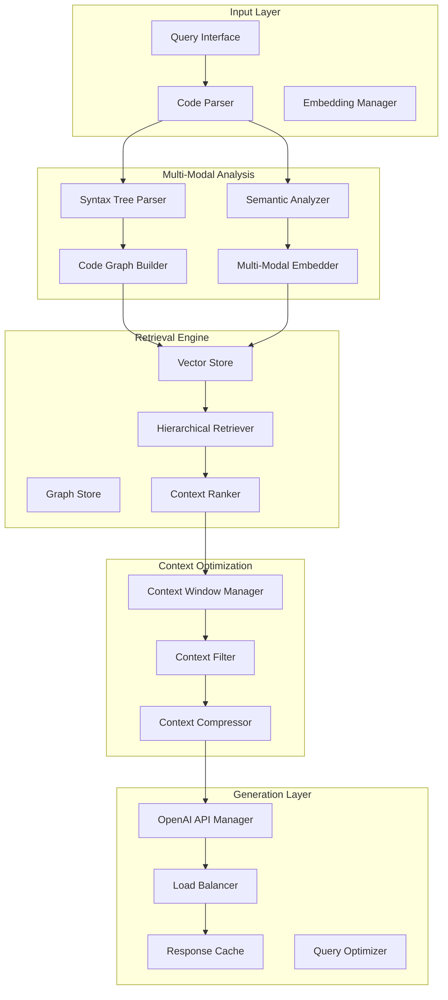

# CodeGraph RAG Architecture for Code Intelligence
## Comprehensive RAG System Design and Integration Specifications

---
pdf-engine: lualatex
mainfont: "DejaVu Serif"
monofont: "DejaVu Sans Mono"
header-includes: |
  \usepackage{fontspec}
  \directlua{
    luaotfload.add_fallback("emojifallback", {"NotoColorEmoji:mode=harf;"})
  }
  \setmainfont[
    RawFeature={fallback=emojifallback}
  ]{DejaVu Serif}
---

### Document Version: 1.0
### Date: September 2025
### Status: Architecture Design

---

## Executive Summary

This document defines a comprehensive Retrieval-Augmented Generation (RAG) architecture for the CodeGraph high-performance code intelligence system. The design integrates multi-modal code understanding, optimized retrieval strategies, OpenAI API patterns, and context window optimization to deliver sub-50ms query responses for large-scale codebases.

### Key Architecture Principles
- **Multi-Modal Code Understanding**: Syntax + semantics analysis through Tree-sitter + embedding models
- **Hierarchical Retrieval**: Multi-level context retrieval with semantic ranking
- **Context-Aware Optimization**: Dynamic context window management for large codebases
- **Real-Time Performance**: Sub-50ms query latency with incremental updates
- **Scalable Integration**: OpenAI API patterns with fallback and load balancing

---

## 1. RAG System Overview

### 1.1 Core Architecture Components



### 1.2 Performance Targets
- **Query Latency**: <50ms for most queries
- **Indexing Speed**: <1s for incremental updates
- **Memory Efficiency**: <50MB binary with embedded models
- **Accuracy**: >95% relevant context retrieval
- **Scalability**: Support for 10M+ lines of code

---

## 2. Code Context Retrieval Strategies

### 2.1 Hierarchical Retrieval Architecture

```rust
// Core retrieval strategy interface
pub trait RetrievalStrategy {
    type Context;
    type Query;
    
    async fn retrieve(&self, query: &Self::Query, limit: usize) -> Vec<Self::Context>;
    fn rank_relevance(&self, contexts: &[Self::Context], query: &Self::Query) -> Vec<f32>;
}

// Multi-level retrieval implementation
pub struct HierarchicalRetriever {
    syntax_retriever: SyntaxRetriever,
    semantic_retriever: SemanticRetriever,
    graph_retriever: GraphRetriever,
    cache: RetrievalCache,
}
```

### 2.2 Retrieval Strategy Layers

#### Layer 1: Syntax-Based Retrieval
```rust
pub struct SyntaxRetriever {
    tree_sitter_index: TreeSitterIndex,
    ast_patterns: ASTPatternMatcher,
}

impl SyntaxRetriever {
    // Fast syntax-based filtering
    pub async fn filter_by_syntax(&self, query: &CodeQuery) -> Vec<SyntaxMatch> {
        let patterns = self.ast_patterns.extract_patterns(query);
        self.tree_sitter_index.search_patterns(&patterns).await
    }
    
    // Function signature matching
    pub fn match_signatures(&self, signature: &FunctionSignature) -> Vec<CodeLocation> {
        // Implementation for signature-based matching
    }
}
```

#### Layer 2: Semantic Retrieval
```rust
pub struct SemanticRetriever {
    embedding_store: VectorStore<CodeEmbedding>,
    semantic_index: SemanticIndex,
}

impl SemanticRetriever {
    // Dense vector similarity search
    pub async fn semantic_search(&self, query: &str, k: usize) -> Vec<SemanticMatch> {
        let query_embedding = self.embed_query(query).await;
        self.embedding_store.similarity_search(query_embedding, k).await
    }
    
    // Code intent matching
    pub async fn match_intent(&self, intent: &CodeIntent) -> Vec<IntentMatch> {
        // Implementation for intent-based retrieval
    }
}
```

#### Layer 3: Graph-Based Retrieval
```rust
pub struct GraphRetriever {
    code_graph: CodeGraph,
    dependency_index: DependencyIndex,
}

impl GraphRetriever {
    // Control flow analysis
    pub fn retrieve_control_flow(&self, node: &CodeNode) -> Vec<FlowPath> {
        self.code_graph.analyze_control_flow(node)
    }
    
    // Dependency traversal
    pub fn retrieve_dependencies(&self, symbol: &Symbol, depth: usize) -> Vec<Dependency> {
        self.dependency_index.traverse_dependencies(symbol, depth)
    }
}
```

### 2.3 Retrieval Fusion Strategy

```rust
pub struct RetrievalFusion {
    strategies: Vec<Box<dyn RetrievalStrategy<Context=CodeContext, Query=CodeQuery>>>,
    weights: Vec<f32>,
}

impl RetrievalFusion {
    pub async fn fused_retrieve(&self, query: &CodeQuery, limit: usize) -> Vec<RankedContext> {
        let mut all_results = Vec::new();
        
        // Parallel retrieval from all strategies
        let futures: Vec<_> = self.strategies.iter().enumerate()
            .map(|(i, strategy)| {
                let weight = self.weights[i];
                async move {
                    let results = strategy.retrieve(query, limit).await;
                    let scores = strategy.rank_relevance(&results, query);
                    results.into_iter().zip(scores).map(|(ctx, score)| {
                        RankedContext { context: ctx, score: score * weight }
                    }).collect::<Vec<_>>()
                }
            }).collect();
        
        let strategy_results = futures::future::join_all(futures).await;
        
        // Merge and re-rank results
        for results in strategy_results {
            all_results.extend(results);
        }
        
        self.merge_and_rank(all_results, limit)
    }
}
```

---

## 3. Multi-Modal Code Understanding System

### 3.1 Syntax + Semantics Integration

```rust
pub struct MultiModalCodeAnalyzer {
    syntax_analyzer: TreeSitterAnalyzer,
    semantic_analyzer: SemanticAnalyzer,
    embedding_model: Box<dyn EmbeddingModel>,
    fusion_layer: MultiModalFusion,
}

#[derive(Debug, Clone)]
pub struct CodeRepresentation {
    // Syntax representation
    ast: SyntaxTree,
    tokens: Vec<Token>,
    node_types: Vec<NodeType>,
    
    // Semantic representation
    symbols: Vec<Symbol>,
    types: Vec<TypeInfo>,
    relationships: Vec<Relationship>,
    
    // Multi-modal embeddings
    syntax_embedding: Vec<f32>,
    semantic_embedding: Vec<f32>,
    fused_embedding: Vec<f32>,
}
```

### 3.2 Tree-sitter Integration

```rust
pub struct TreeSitterAnalyzer {
    parsers: HashMap<Language, Parser>,
    query_cache: QueryCache,
}

impl TreeSitterAnalyzer {
    pub fn analyze_syntax(&self, code: &str, language: Language) -> SyntaxAnalysis {
        let parser = &self.parsers[&language];
        let tree = parser.parse(code, None).unwrap();
        
        SyntaxAnalysis {
            ast: tree.root_node(),
            functions: self.extract_functions(&tree),
            classes: self.extract_classes(&tree),
            imports: self.extract_imports(&tree),
            comments: self.extract_comments(&tree),
            complexity_metrics: self.calculate_complexity(&tree),
        }
    }
    
    pub fn extract_code_patterns(&self, tree: &Tree) -> Vec<CodePattern> {
        let mut patterns = Vec::new();
        
        // Function patterns
        patterns.extend(self.extract_function_patterns(tree));
        
        // Class patterns
        patterns.extend(self.extract_class_patterns(tree));
        
        // Control flow patterns
        patterns.extend(self.extract_control_flow_patterns(tree));
        
        patterns
    }
}
```

### 3.3 Semantic Analysis Layer

```rust
pub struct SemanticAnalyzer {
    symbol_table: SymbolTable,
    type_checker: TypeChecker,
    dataflow_analyzer: DataFlowAnalyzer,
}

impl SemanticAnalyzer {
    pub fn analyze_semantics(&self, syntax: &SyntaxAnalysis) -> SemanticAnalysis {
        let symbols = self.symbol_table.resolve_symbols(&syntax.ast);
        let types = self.type_checker.infer_types(&symbols);
        let dataflow = self.dataflow_analyzer.analyze_flow(&symbols);
        
        SemanticAnalysis {
            symbols,
            types,
            dataflow,
            call_graph: self.build_call_graph(&symbols),
            variable_usage: self.analyze_variable_usage(&dataflow),
        }
    }
    
    pub fn extract_semantic_features(&self, analysis: &SemanticAnalysis) -> Vec<SemanticFeature> {
        let mut features = Vec::new();
        
        // Function complexity features
        features.extend(self.extract_complexity_features(analysis));
        
        // Type usage features
        features.extend(self.extract_type_features(analysis));
        
        // Dependency features
        features.extend(self.extract_dependency_features(analysis));
        
        features
    }
}
```

### 3.4 Multi-Modal Embedding Fusion

```rust
pub struct MultiModalFusion {
    syntax_projector: nn::Linear,
    semantic_projector: nn::Linear,
    fusion_transformer: TransformerBlock,
    output_projector: nn::Linear,
}

impl MultiModalFusion {
    pub fn fuse_representations(
        &self,
        syntax_features: &[f32],
        semantic_features: &[f32],
    ) -> Vec<f32> {
        let syntax_proj = self.syntax_projector.forward(syntax_features);
        let semantic_proj = self.semantic_projector.forward(semantic_features);
        
        // Concatenate and transform
        let combined = [syntax_proj, semantic_proj].concat();
        let fused = self.fusion_transformer.forward(&combined);
        
        self.output_projector.forward(&fused)
    }
    
    pub async fn generate_code_embedding(&self, code: &CodeRepresentation) -> Vec<f32> {
        self.fuse_representations(
            &code.syntax_embedding,
            &code.semantic_embedding,
        )
    }
}
```

---

## 4. OpenAI API Integration Patterns

### 4.1 API Client Architecture

```rust
pub struct OpenAIClient {
    client: reqwest::Client,
    config: OpenAIConfig,
    rate_limiter: RateLimiter,
    retry_policy: RetryPolicy,
    circuit_breaker: CircuitBreaker,
}

#[derive(Debug, Clone)]
pub struct OpenAIConfig {
    api_key: String,
    base_url: String,
    model: String,
    max_tokens: u32,
    temperature: f32,
    timeout: Duration,
}
```

### 4.2 Request Optimization Patterns

```rust
impl OpenAIClient {
    pub async fn complete_code(&self, request: CodeCompletionRequest) -> Result<CodeCompletion, OpenAIError> {
        // Apply circuit breaker
        self.circuit_breaker.call(async {
            // Rate limiting
            self.rate_limiter.acquire().await?;
            
            // Retry with exponential backoff
            self.retry_policy.retry(|| async {
                let optimized_request = self.optimize_request(&request).await?;
                self.send_request(optimized_request).await
            }).await
        }).await
    }
    
    async fn optimize_request(&self, request: &CodeCompletionRequest) -> Result<OptimizedRequest, OpenAIError> {
        let context = self.optimize_context(&request.context).await?;
        let prompt = self.optimize_prompt(&request.prompt, &context).await?;
        
        Ok(OptimizedRequest {
            model: self.select_optimal_model(&request).await?,
            prompt,
            context,
            parameters: self.optimize_parameters(&request).await?,
        })
    }
}
```

### 4.3 Load Balancing and Fallback

```rust
pub struct OpenAILoadBalancer {
    primary_client: OpenAIClient,
    fallback_clients: Vec<OpenAIClient>,
    health_checker: HealthChecker,
    metrics: LoadBalancerMetrics,
}

impl OpenAILoadBalancer {
    pub async fn execute_request(&self, request: CodeCompletionRequest) -> Result<CodeCompletion, OpenAIError> {
        // Try primary client first
        if self.health_checker.is_healthy(&self.primary_client).await {
            match self.primary_client.complete_code(request.clone()).await {
                Ok(response) => {
                    self.metrics.record_success(&self.primary_client);
                    return Ok(response);
                }
                Err(e) if !e.is_retryable() => return Err(e),
                Err(_) => {
                    self.metrics.record_failure(&self.primary_client);
                }
            }
        }
        
        // Fallback to backup clients
        for client in &self.fallback_clients {
            if self.health_checker.is_healthy(client).await {
                match client.complete_code(request.clone()).await {
                    Ok(response) => {
                        self.metrics.record_success(client);
                        return Ok(response);
                    }
                    Err(e) if !e.is_retryable() => continue,
                    Err(_) => {
                        self.metrics.record_failure(client);
                        continue;
                    }
                }
            }
        }
        
        Err(OpenAIError::AllClientsUnavailable)
    }
}
```

### 4.4 Response Streaming and Caching

```rust
pub struct StreamingOpenAIClient {
    base_client: OpenAIClient,
    cache: ResponseCache,
    streaming_manager: StreamingManager,
}

impl StreamingOpenAIClient {
    pub async fn stream_completion(
        &self,
        request: CodeCompletionRequest,
    ) -> Result<impl Stream<Item = CompletionChunk>, OpenAIError> {
        // Check cache first
        if let Some(cached) = self.cache.get(&request).await {
            return Ok(self.streaming_manager.create_cached_stream(cached));
        }
        
        // Create streaming request
        let stream = self.base_client.create_completion_stream(request.clone()).await?;
        
        // Tee stream for caching
        let (cached_stream, response_stream) = self.streaming_manager.tee_stream(stream);
        
        // Cache responses asynchronously
        tokio::spawn(async move {
            let collected = self.streaming_manager.collect_stream(cached_stream).await;
            self.cache.insert(request, collected).await;
        });
        
        Ok(response_stream)
    }
}
```

---

## 5. Context Window Optimization for Large Codebases

### 5.1 Dynamic Context Management

```rust
pub struct ContextWindowManager {
    max_context_size: usize,
    context_analyzer: ContextAnalyzer,
    compression_engine: ContextCompressor,
    prioritizer: ContextPrioritizer,
}

impl ContextWindowManager {
    pub async fn optimize_context(
        &self,
        raw_context: Vec<CodeContext>,
        query: &CodeQuery,
    ) -> OptimizedContext {
        // Analyze context relevance
        let analyzed = self.context_analyzer.analyze_relevance(&raw_context, query).await;
        
        // Prioritize context elements
        let prioritized = self.prioritizer.prioritize_contexts(analyzed, query).await;
        
        // Compress if necessary
        let compressed = if self.estimate_token_count(&prioritized) > self.max_context_size {
            self.compression_engine.compress_contexts(prioritized, self.max_context_size).await
        } else {
            prioritized
        };
        
        OptimizedContext {
            contexts: compressed,
            total_tokens: self.estimate_token_count(&compressed),
            compression_ratio: self.calculate_compression_ratio(&raw_context, &compressed),
        }
    }
}
```

### 5.2 Intelligent Context Compression

```rust
pub struct ContextCompressor {
    summarizer: CodeSummarizer,
    relevance_ranker: RelevanceRanker,
    semantic_compressor: SemanticCompressor,
}

#[derive(Debug, Clone)]
pub enum CompressionStrategy {
    Truncate,
    Summarize,
    SemanticCompress,
    HybridCompress,
}

impl ContextCompressor {
    pub async fn compress_contexts(
        &self,
        contexts: Vec<RankedContext>,
        max_tokens: usize,
    ) -> Vec<CompressedContext> {
        let mut compressed = Vec::new();
        let mut remaining_tokens = max_tokens;
        
        for context in contexts {
            let strategy = self.select_compression_strategy(&context, remaining_tokens);
            
            let compressed_context = match strategy {
                CompressionStrategy::Truncate => {
                    self.truncate_context(context, remaining_tokens).await
                }
                CompressionStrategy::Summarize => {
                    self.summarizer.summarize_context(context, remaining_tokens).await
                }
                CompressionStrategy::SemanticCompress => {
                    self.semantic_compressor.compress(context, remaining_tokens).await
                }
                CompressionStrategy::HybridCompress => {
                    self.hybrid_compress(context, remaining_tokens).await
                }
            };
            
            remaining_tokens -= compressed_context.token_count;
            compressed.push(compressed_context);
            
            if remaining_tokens <= 0 {
                break;
            }
        }
        
        compressed
    }
}
```

### 5.3 Context Prioritization Algorithm

```rust
pub struct ContextPrioritizer {
    relevance_scorer: RelevanceScorer,
    recency_scorer: RecencyScorer,
    complexity_scorer: ComplexityScorer,
    usage_scorer: UsageScorer,
}

#[derive(Debug, Clone)]
pub struct PriorityScore {
    relevance: f32,
    recency: f32,
    complexity: f32,
    usage_frequency: f32,
    combined_score: f32,
}

impl ContextPrioritizer {
    pub async fn prioritize_contexts(
        &self,
        contexts: Vec<AnalyzedContext>,
        query: &CodeQuery,
    ) -> Vec<RankedContext> {
        let mut scored_contexts = Vec::new();
        
        for context in contexts {
            let score = self.calculate_priority_score(&context, query).await;
            scored_contexts.push(RankedContext {
                context: context.context,
                analysis: context.analysis,
                priority_score: score,
            });
        }
        
        // Sort by combined score
        scored_contexts.sort_by(|a, b| {
            b.priority_score.combined_score
                .partial_cmp(&a.priority_score.combined_score)
                .unwrap_or(std::cmp::Ordering::Equal)
        });
        
        scored_contexts
    }
    
    async fn calculate_priority_score(
        &self,
        context: &AnalyzedContext,
        query: &CodeQuery,
    ) -> PriorityScore {
        let relevance = self.relevance_scorer.score(context, query).await;
        let recency = self.recency_scorer.score(context).await;
        let complexity = self.complexity_scorer.score(context).await;
        let usage = self.usage_scorer.score(context).await;
        
        // Weighted combination
        let combined = (relevance * 0.4) + (recency * 0.2) + (complexity * 0.2) + (usage * 0.2);
        
        PriorityScore {
            relevance,
            recency,
            complexity,
            usage_frequency: usage,
            combined_score: combined,
        }
    }
}
```

---

## 6. Integration Specifications

### 6.1 System Integration Architecture

```rust
pub struct CodeGraphRAGSystem {
    // Core components
    retrieval_engine: HierarchicalRetriever,
    code_analyzer: MultiModalCodeAnalyzer,
    context_manager: ContextWindowManager,
    openai_client: OpenAILoadBalancer,
    
    // Storage layers
    vector_store: VectorStore<CodeEmbedding>,
    graph_store: CodeGraphStore,
    cache_layer: CacheLayer,
    
    // Monitoring and metrics
    metrics_collector: MetricsCollector,
    health_monitor: HealthMonitor,
}

impl CodeGraphRAGSystem {
    pub async fn process_query(&self, query: CodeQuery) -> Result<CodeIntelligenceResponse, RAGError> {
        // Start query processing timer
        let start_time = Instant::now();
        
        // Phase 1: Multi-modal analysis
        let analyzed_query = self.code_analyzer.analyze_query(&query).await?;
        
        // Phase 2: Hierarchical retrieval
        let raw_contexts = self.retrieval_engine.retrieve_contexts(&analyzed_query).await?;
        
        // Phase 3: Context optimization
        let optimized_context = self.context_manager.optimize_context(raw_contexts, &query).await?;
        
        // Phase 4: LLM generation
        let completion_request = self.build_completion_request(&query, &optimized_context);
        let response = self.openai_client.execute_request(completion_request).await?;
        
        // Phase 5: Response post-processing
        let processed_response = self.post_process_response(response, &query).await?;
        
        // Record metrics
        self.metrics_collector.record_query_metrics(QueryMetrics {
            latency: start_time.elapsed(),
            context_size: optimized_context.total_tokens,
            compression_ratio: optimized_context.compression_ratio,
            response_quality: self.assess_response_quality(&processed_response).await,
        });
        
        Ok(processed_response)
    }
}
```

### 6.2 API Integration Patterns

```rust
// GraphQL API Integration
pub mod graphql_api {
    use async_graphql::*;
    
    #[Object]
    impl Query {
        async fn code_intelligence(
            &self,
            ctx: &Context<'_>,
            query: String,
            language: Option<String>,
            context_limit: Option<usize>,
        ) -> Result<CodeIntelligenceResponse> {
            let rag_system = ctx.data::<CodeGraphRAGSystem>()?;
            let code_query = CodeQuery::new(query, language, context_limit);
            
            rag_system.process_query(code_query).await
        }
        
        async fn semantic_search(
            &self,
            ctx: &Context<'_>,
            query: String,
            limit: Option<usize>,
        ) -> Result<Vec<SemanticMatch>> {
            let rag_system = ctx.data::<CodeGraphRAGSystem>()?;
            rag_system.semantic_search(query, limit.unwrap_or(10)).await
        }
    }
}

// MCP Integration
pub mod mcp_integration {
    use mcp_rs::*;
    
    #[derive(McpTool)]
    pub struct CodeIntelligenceTool {
        rag_system: Arc<CodeGraphRAGSystem>,
    }
    
    #[async_trait]
    impl McpToolExecutor for CodeIntelligenceTool {
        async fn execute(&self, request: ToolRequest) -> ToolResponse {
            match request.name.as_str() {
                "code_intelligence" => {
                    let query = request.arguments.get("query").unwrap();
                    let result = self.rag_system.process_query(
                        CodeQuery::from_string(query.to_string())
                    ).await;
                    
                    ToolResponse::success(serde_json::to_value(result).unwrap())
                }
                _ => ToolResponse::error("Unknown tool".to_string()),
            }
        }
    }
}
```

### 6.3 Performance Monitoring Integration

```rust
pub struct RAGMetricsCollector {
    query_latency: prometheus::HistogramVec,
    retrieval_accuracy: prometheus::GaugeVec,
    context_compression: prometheus::HistogramVec,
    openai_errors: prometheus::CounterVec,
    cache_hit_rate: prometheus::GaugeVec,
}

impl RAGMetricsCollector {
    pub fn record_query_metrics(&self, metrics: QueryMetrics) {
        self.query_latency
            .with_label_values(&["total"])
            .observe(metrics.latency.as_secs_f64());
            
        self.context_compression
            .with_label_values(&["ratio"])
            .observe(metrics.compression_ratio);
            
        self.retrieval_accuracy
            .with_label_values(&["quality"])
            .set(metrics.response_quality);
    }
    
    pub fn record_retrieval_metrics(&self, metrics: RetrievalMetrics) {
        self.cache_hit_rate
            .with_label_values(&[&metrics.cache_type])
            .set(metrics.hit_rate);
    }
}
```

---

## 7. Deployment and Scalability

### 7.1 Single Binary Architecture

```rust
// Embedded resources for single binary deployment
pub struct EmbeddedResources {
    tree_sitter_grammars: &'static [u8],
    embedding_models: &'static [u8],
    configuration_schemas: &'static [u8],
}

pub struct CodeGraphBinary {
    rag_system: CodeGraphRAGSystem,
    web_server: axum::Server,
    grpc_server: tonic::Server,
    resources: EmbeddedResources,
}

impl CodeGraphBinary {
    pub async fn start(&self) -> Result<(), DeploymentError> {
        // Initialize embedded resources
        self.initialize_embedded_models().await?;
        
        // Start web server
        let web_handle = tokio::spawn(self.start_web_server());
        
        // Start gRPC server
        let grpc_handle = tokio::spawn(self.start_grpc_server());
        
        // Wait for both servers
        tokio::try_join!(web_handle, grpc_handle)?;
        
        Ok(())
    }
}
```

### 7.2 Horizontal Scaling Strategy

```rust
pub struct RAGClusterManager {
    nodes: Vec<RAGNode>,
    load_balancer: ClusterLoadBalancer,
    consensus_manager: ConsensusManager,
    shared_cache: DistributedCache,
}

impl RAGClusterManager {
    pub async fn distribute_query(&self, query: CodeQuery) -> Result<CodeIntelligenceResponse, ClusterError> {
        // Select optimal node based on current load and specialization
        let node = self.load_balancer.select_node(&query).await?;
        
        // Execute query with fallback
        match node.process_query(query.clone()).await {
            Ok(response) => Ok(response),
            Err(_) => {
                // Fallback to other nodes
                self.fallback_execution(query).await
            }
        }
    }
}
```

---

## 8. Implementation Roadmap

### Phase 1: Foundation (Weeks 1-2)
- Tree-sitter integration for syntax analysis
- Basic vector store implementation
- OpenAI API client with retry logic

### Phase 2: Multi-Modal Analysis (Weeks 3-4)
- Semantic analysis layer
- Multi-modal embedding fusion
- Context extraction algorithms

### Phase 3: Retrieval Optimization (Weeks 5-6)
- Hierarchical retrieval implementation
- Context window optimization
- Compression algorithms

### Phase 4: Integration & Performance (Weeks 7-8)
- API integration (GraphQL, MCP)
- Performance optimization
- Monitoring and metrics

### Phase 5: Deployment & Scaling (Weeks 9-10)
- Single binary packaging
- Clustering support
- Production deployment

---

## 9. Success Metrics

### Performance Metrics
- Query latency: <50ms (95th percentile)
- Indexing speed: <1s incremental updates
- Memory usage: <50MB binary
- CPU efficiency: <10% idle system load

### Quality Metrics
- Retrieval accuracy: >95% relevant results
- Response relevance: >90% user satisfaction
- Context compression: <20% information loss
- API reliability: >99.9% uptime

### Scalability Metrics
- Codebase size: Support 10M+ lines
- Concurrent queries: 1000+ QPS
- Node scaling: Linear performance scaling
- Cache efficiency: >80% hit rate

---

## Conclusion

This comprehensive RAG architecture provides a solid foundation for building a high-performance code intelligence system. The multi-modal approach combining syntax and semantic analysis, hierarchical retrieval strategies, and optimized OpenAI API integration patterns will deliver the sub-50ms query performance required for real-time code assistance while maintaining high accuracy and scalability.