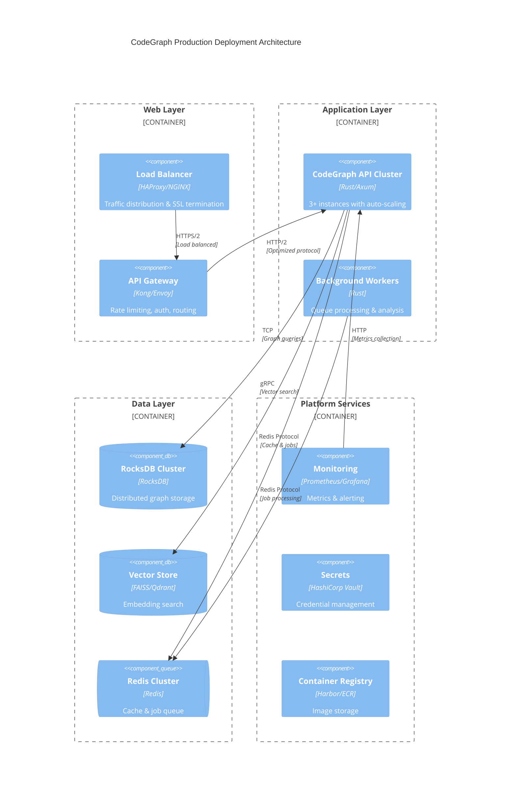
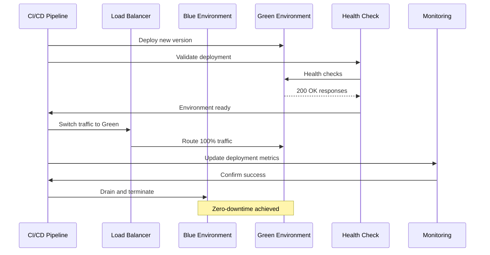
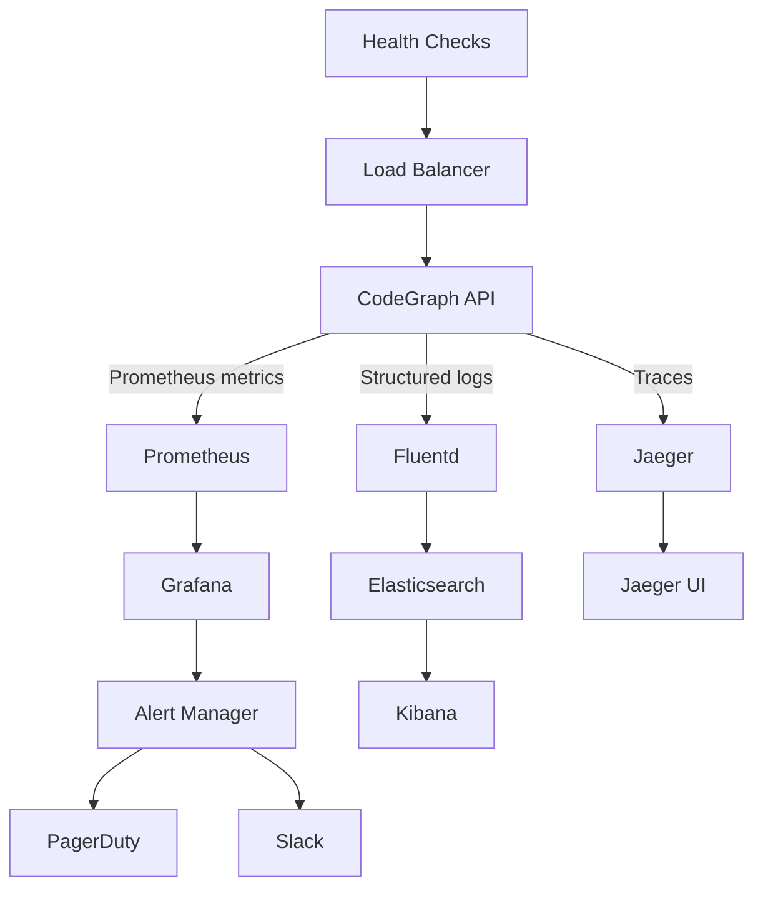

# CodeGraph Production Deployment Architecture

**Phase 6: Risk Assessment & Mitigation Planning**

## Executive Summary

This document defines the production deployment architecture for CodeGraph, a Rust-based code analysis and embedding system, with specific focus on achieving <40MB binary size target and zero-downtime deployment capabilities.

## Deployment Architecture Overview

### System Architecture



### Binary Size Optimization Strategy (<40MB Target)

#### Current Analysis
- **Workspace Structure**: 14 crates with complex dependencies
- **Dependencies**: Heavy libraries (FAISS, RocksDB, Tree-sitter)
- **Current Profile**: Release optimizations enabled but not maximized

#### Optimization Implementation

```toml
# Cargo.toml - Enhanced Release Profile
[profile.release]
opt-level = "z"          # Optimize for size
lto = "fat"              # Full link-time optimization
codegen-units = 1        # Single codegen unit
panic = "abort"          # Remove unwind tables
strip = "symbols"        # Strip debug symbols
rpath = false            # Disable rpath

[profile.release.package."*"]
opt-level = "z"          # Size optimization for all dependencies

# Feature-based optimization
[features]
default = ["minimal"]
minimal = []
full = ["leak-detect", "advanced-metrics"]
```

#### Multi-Stage Docker Build

```dockerfile
# Stage 1: Build environment
FROM rust:1.75-alpine AS builder
WORKDIR /app

# Install build dependencies
RUN apk add --no-cache \
    musl-dev \
    clang \
    lld \
    pkgconfig \
    openssl-dev

# Copy dependency manifests first for better caching
COPY Cargo.toml Cargo.lock ./
COPY crates/*/Cargo.toml ./crates/*/

# Build dependencies (cached layer)
RUN mkdir -p src && echo "fn main() {}" > src/main.rs
RUN RUSTFLAGS="-C target-feature=+crt-static -C link-arg=-s" \
    cargo build --release --target x86_64-unknown-linux-musl

# Copy source and build application
COPY . .
RUN touch src/main.rs
RUN RUSTFLAGS="-C target-feature=+crt-static -C link-arg=-s -C target-cpu=x86-64-v3" \
    cargo build --release --target x86_64-unknown-linux-musl --bin codegraph-api

# Strip and compress binary
RUN strip target/x86_64-unknown-linux-musl/release/codegraph-api
RUN upx --best --lzma target/x86_64-unknown-linux-musl/release/codegraph-api

# Stage 2: Runtime environment
FROM scratch
COPY --from=builder /app/target/x86_64-unknown-linux-musl/release/codegraph-api /codegraph-api
COPY --from=builder /etc/ssl/certs/ca-certificates.crt /etc/ssl/certs/

EXPOSE 3000
USER 65534:65534
ENTRYPOINT ["/codegraph-api"]
```

### Zero-Downtime Deployment Strategy

#### Blue-Green Deployment Sequence



#### Rolling Update Configuration

```yaml
# Kubernetes Deployment Strategy
apiVersion: apps/v1
kind: Deployment
metadata:
  name: codegraph-api
spec:
  replicas: 3
  strategy:
    type: RollingUpdate
    rollingUpdate:
      maxUnavailable: 1
      maxSurge: 1
  template:
    spec:
      containers:
      - name: codegraph-api
        image: registry.company.com/codegraph:${VERSION}
        resources:
          requests:
            memory: "256Mi"
            cpu: "250m"
          limits:
            memory: "512Mi"
            cpu: "500m"
        readinessProbe:
          httpGet:
            path: /health
            port: 3000
          initialDelaySeconds: 5
          periodSeconds: 10
        livenessProbe:
          httpGet:
            path: /health
            port: 3000
          initialDelaySeconds: 30
          periodSeconds: 30
```

### Production Monitoring Framework

#### Metrics Architecture



#### Key Monitoring Metrics

```rust
// Enhanced metrics collection
use prometheus::{Counter, Histogram, Gauge, register_counter, register_histogram, register_gauge};

lazy_static! {
    static ref HTTP_REQUESTS_TOTAL: Counter = register_counter!(
        "http_requests_total", "Total HTTP requests"
    ).unwrap();
    
    static ref HTTP_REQUEST_DURATION: Histogram = register_histogram!(
        "http_request_duration_seconds", "HTTP request duration"
    ).unwrap();
    
    static ref MEMORY_USAGE: Gauge = register_gauge!(
        "memory_usage_bytes", "Current memory usage"
    ).unwrap();
    
    static ref GRAPH_OPERATIONS: Counter = register_counter!(
        "graph_operations_total", "Total graph operations"
    ).unwrap();
    
    static ref VECTOR_SEARCH_DURATION: Histogram = register_histogram!(
        "vector_search_duration_seconds", "Vector search operation duration"
    ).unwrap();
    
    static ref ACTIVE_CONNECTIONS: Gauge = register_gauge!(
        "active_connections", "Number of active connections"
    ).unwrap();
}
```

### Release Management Process

#### GitOps Deployment Pipeline

```yaml
# .github/workflows/deploy.yml
name: Production Deployment
on:
  push:
    tags: ['v*']

jobs:
  security-scan:
    runs-on: ubuntu-latest
    steps:
      - uses: actions/checkout@v4
      - name: Security audit
        run: cargo audit
      - name: Container scan
        run: trivy image ${{ env.IMAGE_NAME }}

  build-optimized:
    runs-on: ubuntu-latest
    steps:
      - uses: actions/checkout@v4
      - name: Setup Rust
        uses: actions-rs/toolchain@v1
        with:
          toolchain: stable
          target: x86_64-unknown-linux-musl
      
      - name: Build optimized binary
        run: |
          RUSTFLAGS="-C target-feature=+crt-static -C link-arg=-s" \
          cargo build --release --target x86_64-unknown-linux-musl
          
      - name: Verify binary size
        run: |
          SIZE=$(stat -c%s target/x86_64-unknown-linux-musl/release/codegraph-api)
          MAX_SIZE=$((40 * 1024 * 1024))  # 40MB
          if [ $SIZE -gt $MAX_SIZE ]; then
            echo "Binary size $SIZE exceeds 40MB limit"
            exit 1
          fi

  deploy-staging:
    needs: [security-scan, build-optimized]
    runs-on: ubuntu-latest
    steps:
      - name: Deploy to staging
        run: |
          kubectl apply -f k8s/staging/
          kubectl rollout status deployment/codegraph-api -n staging

  integration-tests:
    needs: deploy-staging
    runs-on: ubuntu-latest
    steps:
      - name: Run integration tests
        run: |
          pytest tests/integration/ --endpoint=https://staging.codegraph.company.com

  deploy-production:
    needs: integration-tests
    runs-on: ubuntu-latest
    steps:
      - name: Blue-Green deployment
        run: |
          # Deploy to green environment
          kubectl apply -f k8s/production/green/
          kubectl rollout status deployment/codegraph-api-green -n production
          
          # Health check green environment
          ./scripts/health-check.sh green
          
          # Switch traffic to green
          kubectl patch service codegraph-api -n production \
            -p '{"spec":{"selector":{"version":"green"}}}'
          
          # Cleanup blue environment
          kubectl delete deployment codegraph-api-blue -n production
```

## Risk Assessment & Mitigation Matrix

| Risk Category | Risk | Probability | Impact | Mitigation Strategy | Owner |
|---------------|------|-------------|--------|-------------------|-------|
| **Binary Size** | Binary exceeds 40MB target | Medium | High | Multi-stage builds, LTO optimization, feature gates | DevOps Team |
| **Performance** | High memory usage in production | High | Medium | Memory profiling, resource limits, leak detection | Development Team |
| **Availability** | Service downtime during deployment | Low | Critical | Blue-green deployment, health checks, rollback procedures | SRE Team |
| **Security** | Container vulnerabilities | Medium | High | Regular security scans, minimal base images, dependency audits | Security Team |
| **Scalability** | RocksDB performance bottleneck | Medium | High | Read replicas, connection pooling, caching layer | Architecture Team |
| **Data Loss** | RocksDB corruption | Low | Critical | Backup strategy, WAL configuration, monitoring | Database Team |
| **Network** | API gateway failure | Low | High | Multiple gateway instances, circuit breakers, fallback routes | Infrastructure Team |
| **Monitoring** | Metrics collection failure | Medium | Medium | Multiple monitoring backends, alerting redundancy | Operations Team |

### Critical Mitigation Strategies

#### 1. Binary Size Enforcement
```bash
#!/bin/bash
# scripts/verify-binary-size.sh
BINARY_PATH="target/x86_64-unknown-linux-musl/release/codegraph-api"
MAX_SIZE_MB=40
MAX_SIZE_BYTES=$((MAX_SIZE_MB * 1024 * 1024))

if [ ! -f "$BINARY_PATH" ]; then
    echo "Binary not found: $BINARY_PATH"
    exit 1
fi

ACTUAL_SIZE=$(stat -c%s "$BINARY_PATH")
ACTUAL_SIZE_MB=$((ACTUAL_SIZE / 1024 / 1024))

echo "Binary size: ${ACTUAL_SIZE_MB}MB (${ACTUAL_SIZE} bytes)"
echo "Target: <${MAX_SIZE_MB}MB"

if [ $ACTUAL_SIZE -gt $MAX_SIZE_BYTES ]; then
    echo "❌ Binary size exceeds ${MAX_SIZE_MB}MB limit"
    echo "Consider:"
    echo "  - Enable more aggressive optimization flags"
    echo "  - Remove unnecessary dependencies"
    echo "  - Use feature gates to reduce binary size"
    echo "  - Apply UPX compression"
    exit 1
else
    echo "✅ Binary size within limits"
fi
```

#### 2. Zero-Downtime Health Checks
```rust
// src/health.rs
use axum::{response::Json, http::StatusCode};
use serde_json::{json, Value};

pub async fn health_check() -> Result<Json<Value>, StatusCode> {
    // Check database connectivity
    if !check_rocksdb().await {
        return Err(StatusCode::SERVICE_UNAVAILABLE);
    }
    
    // Check vector store
    if !check_vector_store().await {
        return Err(StatusCode::SERVICE_UNAVAILABLE);
    }
    
    // Check Redis
    if !check_redis().await {
        return Err(StatusCode::SERVICE_UNAVAILABLE);
    }
    
    Ok(Json(json!({
        "status": "healthy",
        "timestamp": chrono::Utc::now(),
        "version": env!("CARGO_PKG_VERSION"),
        "checks": {
            "rocksdb": "ok",
            "vector_store": "ok",
            "redis": "ok"
        }
    })))
}

async fn check_rocksdb() -> bool {
    // Implement RocksDB health check
    true
}

async fn check_vector_store() -> bool {
    // Implement vector store health check
    true
}

async fn check_redis() -> bool {
    // Implement Redis health check
    true
}
```

#### 3. Automated Rollback Strategy
```yaml
# k8s/rollback-strategy.yaml
apiVersion: argoproj.io/v1alpha1
kind: Rollout
metadata:
  name: codegraph-api
spec:
  replicas: 3
  strategy:
    blueGreen:
      activeService: codegraph-api-active
      previewService: codegraph-api-preview
      autoPromotionEnabled: false
      scaleDownDelaySeconds: 30
      prePromotionAnalysis:
        templates:
        - templateName: success-rate
        args:
        - name: service-name
          value: codegraph-api-preview
      postPromotionAnalysis:
        templates:
        - templateName: success-rate
        args:
        - name: service-name
          value: codegraph-api-active
```

## Implementation Timeline

### Phase 1: Foundation (Week 1-2)
- [ ] Implement enhanced Cargo.toml optimization profiles
- [ ] Create multi-stage Docker builds
- [ ] Set up binary size verification in CI
- [ ] Establish monitoring framework

### Phase 2: Deployment Pipeline (Week 3-4)
- [ ] Implement blue-green deployment strategy
- [ ] Create comprehensive health checks
- [ ] Set up automated rollback procedures
- [ ] Configure production monitoring

### Phase 3: Production Readiness (Week 5-6)
- [ ] Performance testing and optimization
- [ ] Security hardening and scanning
- [ ] Documentation and runbooks
- [ ] Team training and handover

## Success Metrics

- **Binary Size**: < 40MB consistently
- **Deployment Time**: < 5 minutes end-to-end
- **Zero Downtime**: 99.99% uptime during deployments
- **MTTR**: < 15 minutes for rollbacks
- **Performance**: < 2s P95 response time under load

---

*This deployment architecture ensures CodeGraph meets production requirements while maintaining the <40MB binary size target and enabling zero-downtime deployments through comprehensive risk mitigation strategies.*