# CodeGraph Implementation Plan
## Comprehensive Swarm Orchestration Strategy

---
pdf-engine: lualatex
mainfont: "DejaVu Serif"
monofont: "DejaVu Sans Mono"
header-includes: |
  \usepackage{fontspec}
  \directlua{
    luaotfload.add_fallback("emojifallback", {"NotoColorEmoji:mode=harf;"})
  }
  \setmainfont[
    RawFeature={fallback=emojifallback}
  ]{DejaVu Serif}
---

### Document Version: 1.0
### Date: September 2025
### Status: Implementation Ready

---

## Executive Summary

This document defines the comprehensive swarm orchestration strategy for implementing the CodeGraph high-performance code intelligence system. The plan leverages multi-agent coordination across 6 phases with sophisticated parallel execution, convergence points, and performance validation strategies.

### Key Orchestration Principles
- **Convergence-Driven Development**: Strategic synchronization points ensure integration quality
- **Performance-First Validation**: Sub-50ms latency and <1s update targets drive decisions
- **Zero-Dependency Parallelism**: Maximum concurrent development without blocking
- **Fault-Tolerant Coordination**: Swarm continues despite individual agent failures
- **Adaptive Resource Allocation**: Dynamic scaling based on complexity and progress

---

## Swarm Architecture Overview

### Agent Topology

```mermaid
graph TB
    subgraph "Orchestration Layer"
        COORD[Coordinator Agent]
        PERF[Performance Validator]
        ARCH[Architecture Reviewer]
    end
    
    subgraph "Phase 0: Foundation"
        F0A[Workspace Agent]
        F0B[Traits Agent]
        F0C[Models Agent]
    end
    
    subgraph "Phase 1: Infrastructure"
        F1A[Graph Engine Team]
        F1B[Parser Engine Team] 
        F1C[Vector Index Team]
    end
    
    subgraph "Phase 2: AI Integration"
        F2A[Embedding Agent]
        F2B[RAG Agent]
        F2C[ML Pipeline Agent]
    end
    
    subgraph "Phase 3: API Layer"
        F3A[GraphQL Team]
        F3B[MCP Protocol Team]
    end
    
    subgraph "Phase 4-6: Finalization"
        F4A[Sync Agent]
        F5A[Optimization Team]
        F6A[Deployment Agent]
    end
    
    COORD --> F0A
    COORD --> F1A
    COORD --> F2A
    COORD --> F3A
    COORD --> F4A
    
    PERF --> F1A
    PERF --> F2A
    PERF --> F5A
    
    ARCH --> F1A
    ARCH --> F3A
```


### Communication Channels
- **Broadcast Channel**: Global announcements and phase transitions
- **Sync Channel**: Inter-phase coordination and blocking operations
- **Review Channel**: Code review requests and architectural feedback
- **Performance Channel**: Benchmarking results and optimization requests
- **Integration Channel**: Cross-team integration testing and validation

---

## Phase 0: Foundation & Setup (Week 1)
### Duration: 5 days | Agent Count: 8 | Parallelization: 95%

#### Swarm Configuration

**Primary Agents:**
- `foundation-coordinator` - Overall phase coordination
- `workspace-architect` - Workspace setup and configuration
- `traits-designer` - Core trait definitions
- `models-engineer` - Data model implementation
- `ci-specialist` - CI/CD pipeline setup
- `docs-generator` - Documentation framework
- `perf-baseline` - Initial performance benchmarking
- `integration-validator` - Foundation integration testing

#### Agent Coordination Strategy

```yaml
phase_0_swarm:
  topology: "star"
  coordinator: "foundation-coordinator"
  execution_mode: "parallel-converge"
  
  agents:
    workspace-architect:
      role: "workspace_setup"
      dependencies: []
      deliverables:
        - "Cargo.toml workspace configuration"
        - "Project directory structure"
        - "Build optimization profiles"
      estimated_hours: 16
      
    traits-designer:
      role: "trait_definition"
      dependencies: []
      deliverables:
        - "GraphStore trait with async methods"
        - "VectorIndex trait with FAISS integration"
        - "CodeAnalyzer trait with tree-sitter support"
        - "EmbeddingProvider trait with batch operations"
      estimated_hours: 24
      
    models-engineer:
      role: "data_modeling"
      dependencies: []
      deliverables:
        - "Node/Edge structures with serialization"
        - "Entity type enums for all languages"
        - "Embedding metadata structures"
        - "Configuration models with validation"
      estimated_hours: 20
      
    ci-specialist:
      role: "pipeline_setup"
      dependencies: ["workspace-architect"]
      deliverables:
        - "GitHub Actions CI/CD pipeline"
        - "Multi-platform build configuration"
        - "Test automation and reporting"
        - "Security scanning integration"
      estimated_hours: 18

  convergence_points:
    - name: "trait_definition_complete"
      required_agents: ["traits-designer"]
      validation: "compile_check"
      
    - name: "workspace_ready"
      required_agents: ["workspace-architect", "ci-specialist"]
      validation: "build_test"
      
    - name: "foundation_complete"
      required_agents: ["all"]
      validation: "integration_test"
```

#### Success Criteria
- [ ] All traits compile successfully
- [ ] Workspace builds without warnings
- [ ] CI pipeline executes fully
- [ ] Documentation generates correctly
- [ ] Performance baseline established

#### Risk Mitigation
- **Dependency Conflicts**: Lock file coordination through workspace-architect
- **Trait Complexity**: Iterative design with architecture reviews
- **CI Failures**: Parallel validation on multiple platforms

---

## Phase 1: Core Infrastructure (Weeks 2-4)
### Duration: 15 days | Agent Count: 24 | Parallelization: 60%

#### Multi-Track Swarm Configuration

**Track A: Graph Engine (8 agents)**
```yaml
track_a_graph_engine:
  topology: "hierarchical"
  lead_agent: "graph-engine-lead"
  execution_mode: "pipeline-parallel"
  
  agents:
    rocksdb-specialist:
      role: "database_implementation"
      specialization: "RocksDB integration, transaction support"
      dependencies: ["foundation_complete"]
      deliverables:
        - "RocksGraphStore with ACID transactions"
        - "Column family optimization"
        - "Backup/restore functionality"
      estimated_hours: 40
      performance_targets:
        - "Write throughput: >10k ops/sec"
        - "Read latency: <1ms p99"
      
    graph-ops-engineer:
      role: "graph_operations"
      specialization: "Graph algorithms, traversal optimization"
      dependencies: ["rocksdb-specialist"]
      deliverables:
        - "BFS/DFS traversal with filters"
        - "Subgraph extraction algorithms"
        - "Path finding with A* optimization"
      estimated_hours: 44
      performance_targets:
        - "Traversal depth 10: <10ms"
        - "Subgraph extraction: <5ms"
        
    indexing-architect:
      role: "indexing_system"
      specialization: "Secondary indices, query optimization"
      dependencies: ["graph-ops-engineer"]
      deliverables:
        - "Property-based indexing"
        - "Full-text search integration"
        - "Composite query engine"
      estimated_hours: 48
      performance_targets:
        - "Index lookup: <0.5ms"
        - "Full-text search: <20ms"
        
    versioning-expert:
      role: "version_control"
      specialization: "Snapshots, diff computation"
      dependencies: ["rocksdb-specialist"]
      deliverables:
        - "Snapshot creation and restoration"
        - "Delta computation algorithms"
        - "Version cleanup strategies"
      estimated_hours: 42
      
    cache-optimizer:
      role: "caching_layer"
      specialization: "Result caching, invalidation"
      dependencies: ["indexing-architect"]
      deliverables:
        - "Multi-level cache hierarchy"
        - "Intelligent cache invalidation"
        - "Cache hit rate optimization"
      estimated_hours: 24
      
    graph-validator:
      role: "validation_testing"
      specialization: "Graph consistency, integration testing"
      dependencies: ["all_track_a"]
      deliverables:
        - "Comprehensive test suite"
        - "Property-based testing"
        - "Performance benchmarks"
      estimated_hours: 32
      
    graph-docs:
      role: "documentation"
      specialization: "API documentation, examples"
      dependencies: ["graph-validator"]
      deliverables:
        - "Complete API documentation"
        - "Usage examples and tutorials"
        - "Performance tuning guide"
      estimated_hours: 16
      
    graph-profiler:
      role: "performance_analysis"
      specialization: "Profiling, bottleneck identification"
      dependencies: ["graph-validator"]
      deliverables:
        - "Performance profiling setup"
        - "Bottleneck analysis reports"
        - "Optimization recommendations"
      estimated_hours: 20

  convergence_points:
    - name: "rocksdb_integration_complete"
      required_agents: ["rocksdb-specialist"]
      validation: "transaction_test"
      performance_check:
        - "write_throughput >= 10000 ops/sec"
        - "read_latency <= 1ms p99"
        
    - name: "graph_operations_complete"
      required_agents: ["graph-ops-engineer"]
      validation: "traversal_test"
      performance_check:
        - "traversal_depth_10 <= 10ms"
        - "subgraph_extraction <= 5ms"
        
    - name: "track_a_complete"
      required_agents: ["all"]
      validation: "full_integration_test"
```

**Track B: Parser Engine (8 agents)**
```yaml
track_b_parser_engine:
  topology: "mesh"
  execution_mode: "collaborative-parallel"
  
  agents:
    treesitter-integrator:
      role: "parser_foundation"
      specialization: "Tree-sitter setup, language support"
      dependencies: ["foundation_complete"]
      deliverables:
        - "Multi-language parser initialization"
        - "Error handling and recovery"
        - "Memory-optimized AST processing"
      estimated_hours: 34
      
    python-extractor:
      role: "python_analysis"
      specialization: "Python entity extraction"
      dependencies: ["treesitter-integrator"]
      deliverables:
        - "Class/function/variable extraction"
        - "Import statement resolution"
        - "Type annotation processing"
      estimated_hours: 28
      
    javascript-extractor:
      role: "javascript_analysis"
      specialization: "JavaScript/TypeScript entity extraction"
      dependencies: ["treesitter-integrator"]
      deliverables:
        - "ES6+ syntax support"
        - "Module system analysis"
        - "TypeScript type extraction"
      estimated_hours: 30
      
    rust-extractor:
      role: "rust_analysis"
      specialization: "Rust entity extraction"
      dependencies: ["treesitter-integrator"]
      deliverables:
        - "Struct/trait/impl extraction"
        - "Macro expansion handling"
        - "Lifetime and ownership analysis"
      estimated_hours: 36
      
    dependency-analyzer:
      role: "dependency_analysis"
      specialization: "Cross-language dependency tracking"
      dependencies: ["python-extractor", "javascript-extractor", "rust-extractor"]
      deliverables:
        - "Import resolution algorithms"
        - "Call graph construction"
        - "Circular dependency detection"
      estimated_hours: 48
      
    incremental-parser:
      role: "incremental_updates"
      specialization: "Delta parsing, change tracking"
      dependencies: ["dependency-analyzer"]
      deliverables:
        - "File change detection"
        - "Partial re-parsing logic"
        - "Dependency invalidation"
      estimated_hours: 38
      
    parser-validator:
      role: "validation_testing"
      specialization: "Parser testing, validation"
      dependencies: ["incremental-parser"]
      deliverables:
        - "Multi-language test corpus"
        - "Edge case handling tests"
        - "Performance benchmarks"
      estimated_hours: 28
      
    parser-optimizer:
      role: "performance_tuning"
      specialization: "Parser performance optimization"
      dependencies: ["parser-validator"]
      deliverables:
        - "Memory usage optimization"
        - "Parsing speed improvements"
        - "Parallel parsing strategies"
      estimated_hours: 24

  convergence_points:
    - name: "language_extractors_complete"
      required_agents: ["python-extractor", "javascript-extractor", "rust-extractor"]
      validation: "extraction_accuracy_test"
      
    - name: "dependency_analysis_complete"
      required_agents: ["dependency-analyzer"]
      validation: "dependency_resolution_test"
      
    - name: "track_b_complete"
      required_agents: ["all"]
      validation: "full_codebase_parse_test"
```

**Track C: Vector Index Engine (8 agents)**
```yaml
track_c_vector_index:
  topology: "pipeline"
  execution_mode: "sequential-parallel"
  
  agents:
    faiss-integrator:
      role: "faiss_foundation"
      specialization: "FAISS library integration"
      dependencies: ["foundation_complete"]
      deliverables:
        - "FAISS index initialization"
        - "Multiple index type support"
        - "GPU acceleration setup"
      estimated_hours: 34
      performance_targets:
        - "index_build_time <= 10s per 10k vectors"
        
    vector-operations:
      role: "vector_ops"
      specialization: "Vector operations, KNN search"
      dependencies: ["faiss-integrator"]
      deliverables:
        - "Efficient vector addition/update"
        - "Batch operations support"
        - "KNN search with filtering"
      estimated_hours: 30
      performance_targets:
        - "knn_search_100 <= 5ms"
        - "batch_ops_1k <= 50ms"
        
    search-optimizer:
      role: "search_optimization"
      specialization: "Search performance optimization"
      dependencies: ["vector-operations"]
      deliverables:
        - "Query optimization algorithms"
        - "Result ranking improvements"
        - "Parallel search execution"
      estimated_hours: 34
      
    index-manager:
      role: "index_management"
      specialization: "Index lifecycle management"
      dependencies: ["vector-operations"]
      deliverables:
        - "Index rebuilding strategies"
        - "Incremental updates"
        - "Health monitoring"
      estimated_hours: 30
      
    memory-mapper:
      role: "memory_optimization"
      specialization: "Memory-mapped index files"
      dependencies: ["index-manager"]
      deliverables:
        - "Memory-mapped file support"
        - "Efficient memory usage"
        - "Cache-friendly data structures"
      estimated_hours: 26
      
    simd-accelerator:
      role: "simd_optimization"
      specialization: "SIMD vector operations"
      dependencies: ["search-optimizer"]
      deliverables:
        - "AVX2/AVX512 implementations"
        - "Platform-specific optimizations"
        - "Fallback implementations"
      estimated_hours: 32
      
    index-validator:
      role: "validation_testing"
      specialization: "Index testing and validation"
      dependencies: ["simd-accelerator", "memory-mapper"]
      deliverables:
        - "Comprehensive test suite"
        - "Accuracy validation"
        - "Performance benchmarks"
      estimated_hours: 24
      
    index-profiler:
      role: "performance_analysis"
      specialization: "Index performance profiling"
      dependencies: ["index-validator"]
      deliverables:
        - "Performance profiling tools"
        - "Memory usage analysis"
        - "Optimization recommendations"
      estimated_hours: 20

  convergence_points:
    - name: "faiss_integration_complete"
      required_agents: ["faiss-integrator"]
      validation: "index_build_test"
      performance_check:
        - "index_build_10k <= 10s"
        
    - name: "vector_operations_complete"
      required_agents: ["vector-operations"]
      validation: "knn_accuracy_test"
      performance_check:
        - "knn_search_100 <= 5ms"
        
    - name: "track_c_complete"
      required_agents: ["all"]
      validation: "large_scale_search_test"
```

#### Phase 1 Integration Strategy

**Cross-Track Synchronization:**
```yaml
phase_1_integration:
  sync_points:
    - name: "week_2_checkpoint"
      tracks: ["A", "B", "C"]
      required_completions:
        - "rocksdb_integration_complete"
        - "treesitter_integration_complete"
        - "faiss_integration_complete"
      validation: "basic_integration_test"
      
    - name: "week_3_checkpoint"
      tracks: ["A", "B", "C"]
      required_completions:
        - "graph_operations_complete"
        - "language_extractors_complete"
        - "vector_operations_complete"
      validation: "cross_track_integration_test"
      
    - name: "phase_1_complete"
      tracks: ["A", "B", "C"]
      required_completions: ["track_a_complete", "track_b_complete", "track_c_complete"]
      validation: "full_infrastructure_test"
      performance_validation:
        - "graph_query_latency <= 50ms"
        - "code_parsing_throughput >= 1000 LOC/s"
        - "vector_search_latency <= 10ms"
```

---

## Phase 2: AI Integration (Weeks 4-6)
### Duration: 15 days | Agent Count: 12 | Parallelization: 65%

#### AI-Focused Swarm Configuration

```yaml
phase_2_ai_integration:
  topology: "hub-spoke"
  central_hub: "ai-coordinator"
  execution_mode: "parallel-pipeline"
  
  agents:
    ai-coordinator:
      role: "phase_coordination"
      specialization: "AI integration orchestration"
      dependencies: ["phase_1_complete"]
      responsibilities:
        - "Cross-agent task coordination"
        - "Integration point management"
        - "Performance validation"
      
    embedding-architect:
      role: "embedding_generation"
      specialization: "Local and remote embedding systems"
      dependencies: ["phase_1_complete"]
      deliverables:
        - "Candle-based local embeddings"
        - "OpenAI API integration"
        - "Hybrid embedding pipeline"
        - "Batch processing optimization"
      estimated_hours: 48
      performance_targets:
        - "local_embedding_throughput >= 100 texts/s"
        - "batch_processing_1k <= 30s"
        
    text-processor:
      role: "text_processing"
      specialization: "Code tokenization and chunking"
      dependencies: ["embedding-architect"]
      deliverables:
        - "Language-aware tokenization"
        - "Semantic text chunking"
        - "Context extraction algorithms"
        - "Deduplication strategies"
      estimated_hours: 36
      
    rag-engineer:
      role: "rag_implementation"
      specialization: "Retrieval-Augmented Generation"
      dependencies: ["text-processor"]
      deliverables:
        - "Query processing pipeline"
        - "Context retrieval algorithms"
        - "Result ranking system"
        - "Response generation logic"
      estimated_hours: 44
      
    ml-pipeline:
      role: "ml_infrastructure"
      specialization: "ML pipeline and training"
      dependencies: ["embedding-architect"]
      deliverables:
        - "Feature extraction pipeline"
        - "Model training infrastructure"
        - "Inference optimization"
        - "A/B testing framework"
      estimated_hours: 52
      
    cache-manager:
      role: "ai_caching"
      specialization: "AI result caching"
      dependencies: ["rag-engineer", "ml-pipeline"]
      deliverables:
        - "Embedding cache system"
        - "Query result caching"
        - "Cache invalidation logic"
        - "Memory usage optimization"
      estimated_hours: 28
      
    model-optimizer:
      role: "model_optimization"
      specialization: "Model performance optimization"
      dependencies: ["ml-pipeline"]
      deliverables:
        - "Model quantization"
        - "Inference acceleration"
        - "Memory usage reduction"
        - "GPU utilization optimization"
      estimated_hours: 36
      
    ai-validator:
      role: "ai_validation"
      specialization: "AI system testing"
      dependencies: ["cache-manager", "model-optimizer"]
      deliverables:
        - "Accuracy testing framework"
        - "Performance benchmarks"
        - "Quality assurance metrics"
        - "Regression testing"
      estimated_hours: 32
      
    integration-engineer:
      role: "phase_integration"
      specialization: "AI-infrastructure integration"
      dependencies: ["ai-validator"]
      deliverables:
        - "Graph-AI integration layer"
        - "Real-time processing pipeline"
        - "Error handling and recovery"
        - "Monitoring and alerting"
      estimated_hours: 40

  convergence_points:
    - name: "embedding_systems_ready"
      required_agents: ["embedding-architect", "text-processor"]
      validation: "embedding_accuracy_test"
      performance_check:
        - "embedding_generation <= 100ms per text"
        
    - name: "rag_pipeline_complete"
      required_agents: ["rag-engineer", "cache-manager"]
      validation: "rag_quality_test"
      
    - name: "phase_2_complete"
      required_agents: ["all"]
      validation: "ai_integration_test"
      performance_check:
        - "end_to_end_query <= 200ms"
        - "embedding_accuracy >= 0.85"
```

---

## Phase 3: API Layer (Weeks 5-7)
### Duration: 15 days | Agent Count: 16 | Parallelization: 75%

#### Dual-Track API Development

**Track D: GraphQL API (8 agents)**
```yaml
track_d_graphql:
  topology: "hierarchical"
  lead_agent: "graphql-architect"
  execution_mode: "feature-parallel"
  
  agents:
    graphql-architect:
      role: "api_design"
      specialization: "GraphQL schema design"
      dependencies: ["phase_1_complete", "embedding_systems_ready"]
      deliverables:
        - "Complete GraphQL schema"
        - "Query/Mutation/Subscription types"
        - "Custom scalar implementations"
        - "Schema documentation"
      estimated_hours: 32
      
    query-resolver:
      role: "query_implementation"
      specialization: "GraphQL query resolvers"
      dependencies: ["graphql-architect"]
      deliverables:
        - "Code search resolvers"
        - "Graph traversal resolvers"
        - "Subgraph extraction"
        - "Performance optimization"
      estimated_hours: 40
      performance_targets:
        - "simple_query <= 50ms"
        - "complex_query <= 200ms"
        
    mutation-resolver:
      role: "mutation_implementation"
      specialization: "GraphQL mutation resolvers"
      dependencies: ["graphql-architect"]
      deliverables:
        - "Graph modification mutations"
        - "Indexing trigger mutations"
        - "Configuration updates"
        - "Batch operations"
      estimated_hours: 32
      
    subscription-manager:
      role: "realtime_features"
      specialization: "GraphQL subscriptions"
      dependencies: ["query-resolver", "mutation-resolver"]
      deliverables:
        - "Real-time graph updates"
        - "Indexing progress subscriptions"
        - "WebSocket management"
        - "Connection lifecycle"
      estimated_hours: 36
      
    auth-middleware:
      role: "authentication"
      specialization: "Authentication and authorization"
      dependencies: ["graphql-architect"]
      deliverables:
        - "JWT authentication"
        - "Role-based access control"
        - "API key management"
        - "Rate limiting"
      estimated_hours: 28
      
    dataloader-optimizer:
      role: "query_optimization"
      specialization: "DataLoader and batching"
      dependencies: ["query-resolver"]
      deliverables:
        - "N+1 query elimination"
        - "Batch loading strategies"
        - "Cache integration"
        - "Performance monitoring"
      estimated_hours: 24
      
    graphql-validator:
      role: "api_validation"
      specialization: "GraphQL API testing"
      dependencies: ["subscription-manager", "auth-middleware"]
      deliverables:
        - "Query validation tests"
        - "Performance benchmarks"
        - "Load testing"
        - "Security testing"
      estimated_hours: 30
      
    graphql-docs:
      role: "api_documentation"
      specialization: "API documentation"
      dependencies: ["graphql-validator"]
      deliverables:
        - "Interactive API documentation"
        - "Usage examples"
        - "Integration guides"
        - "Performance guidelines"
      estimated_hours: 20
```

**Track E: MCP Protocol (8 agents)**
```yaml
track_e_mcp:
  topology: "mesh"
  execution_mode: "collaborative-parallel"
  
  agents:
    mcp-protocol:
      role: "protocol_implementation"
      specialization: "MCP protocol core"
      dependencies: ["phase_1_complete"]
      deliverables:
        - "Message serialization"
        - "Protocol validation"
        - "Connection handling"
        - "Version management"
      estimated_hours: 36
      
    agent-communicator:
      role: "agent_communication"
      specialization: "Multi-agent messaging"
      dependencies: ["mcp-protocol"]
      deliverables:
        - "Request/response handling"
        - "Publish/subscribe system"
        - "Message routing"
        - "Session management"
      estimated_hours: 40
      
    coordination-engine:
      role: "multi_agent_coordination"
      specialization: "Agent coordination strategies"
      dependencies: ["agent-communicator"]
      deliverables:
        - "Agent registry"
        - "Task distribution"
        - "Result aggregation"
        - "Conflict resolution"
      estimated_hours: 48
      
    sdk-rust:
      role: "rust_sdk"
      specialization: "Rust client SDK"
      dependencies: ["mcp-protocol"]
      deliverables:
        - "Native Rust client library"
        - "Async/await support"
        - "Type-safe message handling"
        - "Connection pooling"
      estimated_hours: 32
      
    sdk-python:
      role: "python_sdk"
      specialization: "Python client SDK"
      dependencies: ["mcp-protocol"]
      deliverables:
        - "Python asyncio client"
        - "Type hints support"
        - "Connection management"
        - "Error handling"
      estimated_hours: 32
      
    sdk-javascript:
      role: "javascript_sdk"
      specialization: "JavaScript/TypeScript SDK"
      dependencies: ["mcp-protocol"]
      deliverables:
        - "TypeScript client library"
        - "Promise-based API"
        - "Browser compatibility"
        - "Node.js support"
      estimated_hours: 32
      
    mcp-validator:
      role: "protocol_validation"
      specialization: "MCP testing and validation"
      dependencies: ["coordination-engine", "sdk-rust", "sdk-python", "sdk-javascript"]
      deliverables:
        - "Protocol compliance tests"
        - "Multi-agent testing"
        - "SDK integration tests"
        - "Performance benchmarks"
      estimated_hours: 36
      
    mcp-examples:
      role: "examples_documentation"
      specialization: "SDK examples and documentation"
      dependencies: ["mcp-validator"]
      deliverables:
        - "Comprehensive examples"
        - "Integration tutorials"
        - "Best practices guide"
        - "Troubleshooting documentation"
      estimated_hours: 24
```

#### Phase 3 Convergence Strategy

```yaml
phase_3_convergence:
  cross_track_integration:
    - name: "api_foundations_ready"
      required_completions:
        - "graphql_schema_complete"
        - "mcp_protocol_complete"
      validation: "api_foundation_test"
      
    - name: "authentication_integrated"
      required_completions:
        - "auth_middleware_complete"
        - "agent_communication_complete"
      validation: "auth_integration_test"
      
    - name: "phase_3_complete"
      required_completions:
        - "track_d_complete"
        - "track_e_complete"
      validation: "full_api_integration_test"
      performance_check:
        - "graphql_query_latency <= 100ms"
        - "mcp_message_latency <= 50ms"
        - "concurrent_connections >= 1000"
```

---

## Phase 4: Incremental Updates (Weeks 7-8)
### Duration: 10 days | Agent Count: 8 | Parallelization: 50%

#### Sync-Focused Swarm Configuration

```yaml
phase_4_incremental:
  topology: "pipeline"
  execution_mode: "sequential-collaborative"
  
  agents:
    sync-coordinator:
      role: "sync_orchestration"
      specialization: "Synchronization coordination"
      dependencies: ["phase_3_complete"]
      responsibilities:
        - "File system monitoring coordination"
        - "Update queue management"
        - "Performance monitoring"
      
    file-watcher:
      role: "filesystem_monitoring"
      specialization: "File system change detection"
      dependencies: ["sync-coordinator"]
      deliverables:
        - "Cross-platform file watching"
        - "Event filtering and batching"
        - "Recursive directory monitoring"
        - "Ignore pattern support"
      estimated_hours: 32
      performance_targets:
        - "change_detection_latency <= 100ms"
        
    git-integrator:
      role: "git_integration"
      specialization: "Git repository integration"
      dependencies: ["file-watcher"]
      deliverables:
        - "Git hook integration"
        - "Branch tracking"
        - "Merge conflict handling"
        - "History analysis"
      estimated_hours: 36
      
    update-processor:
      role: "update_processing"
      specialization: "Change processing pipeline"
      dependencies: ["git-integrator"]
      deliverables:
        - "Delta computation"
        - "Dependency invalidation"
        - "Parallel update processing"
        - "Progress tracking"
      estimated_hours: 40
      performance_targets:
        - "update_propagation <= 1s"
        
    queue-manager:
      role: "queue_management"
      specialization: "Update queue optimization"
      dependencies: ["update-processor"]
      deliverables:
        - "Priority-based queueing"
        - "Batch processing optimization"
        - "Backpressure handling"
        - "Queue health monitoring"
      estimated_hours: 28
      
    conflict-resolver:
      role: "conflict_resolution"
      specialization: "Concurrent update handling"
      dependencies: ["queue-manager"]
      deliverables:
        - "Conflict detection algorithms"
        - "Resolution strategies"
        - "Rollback mechanisms"
        - "Consistency validation"
      estimated_hours: 32
      
    sync-validator:
      role: "sync_validation"
      specialization: "Incremental update testing"
      dependencies: ["conflict-resolver"]
      deliverables:
        - "Concurrency testing"
        - "Performance validation"
        - "Consistency checks"
        - "Edge case handling"
      estimated_hours: 30
      
    sync-monitor:
      role: "monitoring_alerting"
      specialization: "Sync monitoring and alerting"
      dependencies: ["sync-validator"]
      deliverables:
        - "Real-time monitoring dashboard"
        - "Performance metrics"
        - "Alert configuration"
        - "Health check endpoints"
      estimated_hours: 24

  convergence_points:
    - name: "filesystem_monitoring_ready"
      required_agents: ["file-watcher", "git-integrator"]
      validation: "file_change_detection_test"
      
    - name: "update_processing_ready"
      required_agents: ["update-processor", "queue-manager"]
      validation: "update_throughput_test"
      performance_check:
        - "update_latency <= 1s"
        
    - name: "phase_4_complete"
      required_agents: ["all"]
      validation: "full_sync_integration_test"
```

---

## Phase 5: Optimization & Performance (Weeks 8-10)
### Duration: 15 days | Agent Count: 20 | Parallelization: 80%

#### Performance-Focused Swarm Configuration

```yaml
phase_5_optimization:
  topology: "cluster"
  execution_mode: "parallel-optimize"
  
  clusters:
    memory_optimization:
      agents:
        arena-allocator:
          role: "memory_allocation"
          specialization: "Custom memory allocators"
          deliverables:
            - "Arena allocator implementation"
            - "Memory pool management"
            - "Zero-copy operation optimization"
          estimated_hours: 48
          
        zero-copy-engineer:
          role: "zero_copy_ops"
          specialization: "Zero-copy data structures"
          deliverables:
            - "rkyv integration optimization"
            - "Memory-mapped data access"
            - "Buffer management"
          estimated_hours: 40
          
        leak-detector:
          role: "memory_safety"
          specialization: "Memory leak prevention"
          deliverables:
            - "Automated leak detection"
            - "Memory usage profiling"
            - "Safety validation tools"
          estimated_hours: 24
          
        memory-profiler:
          role: "memory_analysis"
          specialization: "Memory usage analysis"
          deliverables:
            - "Memory profiling tools"
            - "Usage pattern analysis"
            - "Optimization recommendations"
          estimated_hours: 20
          
    cpu_optimization:
      agents:
        simd-specialist:
          role: "simd_optimization"
          specialization: "SIMD instruction optimization"
          deliverables:
            - "AVX2/AVX512 implementations"
            - "Platform-specific optimizations"
            - "Benchmark validation"
          estimated_hours: 52
          
        lockfree-engineer:
          role: "lockfree_structures"
          specialization: "Lock-free data structures"
          deliverables:
            - "Lock-free graph operations"
            - "Atomic operation optimization"
            - "Memory ordering correctness"
          estimated_hours: 56
          
        cache-optimizer:
          role: "cpu_cache_optimization"
          specialization: "CPU cache efficiency"
          deliverables:
            - "Data structure layout optimization"
            - "Cache-friendly algorithms"
            - "Prefetching strategies"
          estimated_hours: 40
          
        branch-predictor:
          role: "branch_optimization"
          specialization: "Branch prediction optimization"
          deliverables:
            - "Conditional logic optimization"
            - "Jump table implementations"
            - "Prediction-friendly code patterns"
          estimated_hours: 32
          
        hotpath-optimizer:
          role: "hotpath_optimization"
          specialization: "Critical path optimization"
          deliverables:
            - "Performance bottleneck identification"
            - "Hot path micro-optimizations"
            - "Assembly-level optimizations"
          estimated_hours: 36
          
    io_optimization:
      agents:
        async-io-engineer:
          role: "async_io_optimization"
          specialization: "Asynchronous I/O optimization"
          deliverables:
            - "io_uring integration"
            - "Async operation batching"
            - "I/O scheduling optimization"
          estimated_hours: 44
          
        mmap-specialist:
          role: "memory_mapping"
          specialization: "Memory-mapped file optimization"
          deliverables:
            - "Efficient mmap strategies"
            - "Page fault minimization"
            - "Memory usage optimization"
          estimated_hours: 36
          
        io-batcher:
          role: "io_batching"
          specialization: "I/O operation batching"
          deliverables:
            - "Read/write coalescing"
            - "Batch size optimization"
            - "Latency reduction strategies"
          estimated_hours: 28
          
        readahead-optimizer:
          role: "readahead_optimization"
          specialization: "Predictive data loading"
          deliverables:
            - "Access pattern analysis"
            - "Predictive loading algorithms"
            - "Cache warming strategies"
          estimated_hours: 32
          
    network_optimization:
      agents:
        connection-pooler:
          role: "connection_pooling"
          specialization: "Network connection optimization"
          deliverables:
            - "Connection pool management"
            - "Keep-alive optimization"
            - "Connection reuse strategies"
          estimated_hours: 24
          
        response-streamer:
          role: "response_streaming"
          specialization: "Response streaming optimization"
          deliverables:
            - "Streaming response implementation"
            - "Backpressure handling"
            - "Flow control optimization"
          estimated_hours: 28
          
        compression-engineer:
          role: "compression_optimization"
          specialization: "Data compression optimization"
          deliverables:
            - "Adaptive compression algorithms"
            - "Compression ratio optimization"
            - "CPU vs bandwidth tradeoffs"
          estimated_hours: 20
          
        http2-optimizer:
          role: "http2_optimization"
          specialization: "HTTP/2 optimization"
          deliverables:
            - "Stream multiplexing optimization"
            - "Server push strategies"
            - "Header compression"
          estimated_hours: 24
          
        loadbalance-engineer:
          role: "load_balancing"
          specialization: "Load balancing optimization"
          deliverables:
            - "Intelligent load distribution"
            - "Health check optimization"
            - "Failover strategies"
          estimated_hours: 32
          
    validation_cluster:
      agents:
        perf-validator:
          role: "performance_validation"
          specialization: "Performance testing and validation"
          dependencies: ["all_optimization_clusters"]
          deliverables:
            - "Comprehensive performance test suite"
            - "Regression testing automation"
            - "Performance CI integration"
          estimated_hours: 40
          
        benchmark-engineer:
          role: "benchmarking"
          specialization: "Performance benchmarking"
          dependencies: ["perf-validator"]
          deliverables:
            - "Industry-standard benchmarks"
            - "Competitive analysis"
            - "Performance regression detection"
          estimated_hours: 32

  optimization_targets:
    latency:
      query_latency_small: "< 25ms (50% improvement)"
      query_latency_large: "< 100ms (50% improvement)" 
      update_propagation: "< 500ms (50% improvement)"
      
    throughput:
      indexing_throughput: "> 20,000 LOC in 15s (100% improvement)"
      query_throughput: "> 10,000 QPS"
      update_throughput: "> 1,000 updates/s"
      
    resource_usage:
      memory_usage: "< 250MB for 100k LOC (50% improvement)"
      cpu_usage: "< 50% during normal operations"
      binary_size: "< 40MB (20% improvement)"

  convergence_points:
    - name: "memory_optimizations_complete"
      required_agents: ["memory_optimization.*"]
      validation: "memory_usage_test"
      performance_check:
        - "memory_usage_100k_loc <= 250MB"
        
    - name: "cpu_optimizations_complete"
      required_agents: ["cpu_optimization.*"]
      validation: "cpu_performance_test"
      performance_check:
        - "query_latency_small <= 25ms"
        
    - name: "io_optimizations_complete"
      required_agents: ["io_optimization.*"]
      validation: "io_throughput_test"
      performance_check:
        - "indexing_throughput >= 20000_loc_per_15s"
        
    - name: "phase_5_complete"
      required_agents: ["all"]
      validation: "full_performance_validation"
      acceptance_criteria:
        - "All performance targets met"
        - "No performance regressions"
        - "Resource usage within limits"
```

---

## Phase 6: Deployment & Packaging (Weeks 10-11)
### Duration: 10 days | Agent Count: 12 | Parallelization: 90%

#### Deployment-Ready Swarm Configuration

```yaml
phase_6_deployment:
  topology: "star"
  coordinator: "deployment-coordinator"
  execution_mode: "parallel-finalize"
  
  agents:
    deployment-coordinator:
      role: "deployment_orchestration"
      specialization: "Deployment coordination"
      dependencies: ["phase_5_complete"]
      responsibilities:
        - "Release coordination"
        - "Quality gate validation"
        - "Deployment pipeline management"
      
    binary-optimizer:
      role: "binary_optimization"
      specialization: "Final binary optimization"
      dependencies: ["deployment-coordinator"]
      deliverables:
        - "Link-time optimization"
        - "Dead code elimination"
        - "Symbol stripping"
        - "Binary compression"
      estimated_hours: 20
      targets:
        - "binary_size <= 40MB"
        
    asset-embedder:
      role: "asset_embedding"
      specialization: "Resource embedding"
      dependencies: ["binary-optimizer"]
      deliverables:
        - "Static asset embedding"
        - "Resource compression"
        - "Asset loading optimization"
        - "Embedded web UI"
      estimated_hours: 16
      
    config-manager:
      role: "configuration_management"
      specialization: "Configuration system"
      dependencies: ["deployment-coordinator"]
      deliverables:
        - "Multi-format config parsing"
        - "Environment variable support"
        - "Configuration validation"
        - "Dynamic config reloading"
      estimated_hours: 24
      
    docker-packager:
      role: "containerization"
      specialization: "Docker packaging"
      dependencies: ["asset-embedder", "config-manager"]
      deliverables:
        - "Multi-stage Dockerfiles"
        - "Distroless base images"
        - "Multi-architecture builds"
        - "Security scanning"
      estimated_hours: 18
      
    k8s-engineer:
      role: "kubernetes_deployment"
      specialization: "Kubernetes orchestration"
      dependencies: ["docker-packager"]
      deliverables:
        - "Deployment manifests"
        - "Service configurations"
        - "ConfigMap/Secret management"
        - "Ingress configurations"
      estimated_hours: 20
      
    service-discovery:
      role: "service_discovery"
      specialization: "Service discovery integration"
      dependencies: ["k8s-engineer"]
      deliverables:
        - "Consul integration"
        - "etcd integration"
        - "DNS-based discovery"
        - "Health check integration"
      estimated_hours: 16
      
    health-monitor:
      role: "health_monitoring"
      specialization: "Health check implementation"
      dependencies: ["config-manager"]
      deliverables:
        - "Comprehensive health endpoints"
        - "Readiness/liveness probes"
        - "Dependency health checking"
        - "Circuit breaker patterns"
      estimated_hours: 14
      
    graceful-shutdown:
      role: "shutdown_handling"
      specialization: "Graceful shutdown"
      dependencies: ["health-monitor"]
      deliverables:
        - "Signal handling"
        - "Connection draining"
        - "Resource cleanup"
        - "State persistence"
      estimated_hours: 12
      
    release-automation:
      role: "release_automation"
      specialization: "Automated release pipeline"
      dependencies: ["docker-packager", "service-discovery"]
      deliverables:
        - "GitHub Actions release workflow"
        - "Automated testing pipeline"
        - "Release artifact generation"
        - "Deployment verification"
      estimated_hours: 22
      
    documentation-finalizer:
      role: "final_documentation"
      specialization: "Release documentation"
      dependencies: ["graceful-shutdown", "release-automation"]
      deliverables:
        - "Installation guides"
        - "Configuration reference"
        - "Troubleshooting guide"
        - "Migration documentation"
      estimated_hours: 18
      
    qa-validator:
      role: "final_qa"
      specialization: "Final quality assurance"
      dependencies: ["documentation-finalizer"]
      deliverables:
        - "End-to-end testing"
        - "Performance validation"
        - "Security audit"
        - "Release readiness assessment"
      estimated_hours: 24

  convergence_points:
    - name: "binary_ready"
      required_agents: ["binary-optimizer", "asset-embedder"]
      validation: "binary_size_test"
      acceptance_criteria:
        - "binary_size <= 40MB"
        - "startup_time <= 100ms"
        
    - name: "deployment_ready"
      required_agents: ["docker-packager", "k8s-engineer", "release-automation"]
      validation: "deployment_test"
      acceptance_criteria:
        - "successful_docker_build"
        - "kubernetes_deployment_success"
        
    - name: "phase_6_complete"
      required_agents: ["all"]
      validation: "production_readiness_test"
      acceptance_criteria:
        - "All quality gates passed"
        - "Performance targets met"
        - "Security requirements satisfied"
        - "Documentation complete"
```

---

## Global Convergence Strategy

### Master Convergence Timeline

```yaml
global_convergence:
  phases:
    phase_0:
      duration: "5 days"
      critical_path: "traits -> workspace -> ci"
      validation_gate: "foundation_complete"
      success_criteria:
        - "All core traits defined and compiling"
        - "Workspace configuration validated"
        - "CI pipeline operational"
      
    phase_1:
      duration: "15 days"
      critical_path: "rocksdb -> graph_ops -> indexing"
      validation_gate: "infrastructure_complete"
      success_criteria:
        - "Graph operations < 50ms latency"
        - "Code parsing > 1000 LOC/s"
        - "Vector search < 10ms latency"
      
    phase_2:
      duration: "15 days"
      critical_path: "embeddings -> rag -> integration"
      validation_gate: "ai_integration_complete"
      success_criteria:
        - "End-to-end query < 200ms"
        - "Embedding accuracy >= 0.85"
        - "AI features integrated"
      
    phase_3:
      duration: "15 days"
      critical_path: "graphql_schema -> resolvers -> subscriptions"
      validation_gate: "api_layer_complete"
      success_criteria:
        - "GraphQL queries < 100ms"
        - "MCP messages < 50ms"
        - "1000+ concurrent connections"
      
    phase_4:
      duration: "10 days"
      critical_path: "file_watcher -> git_integration -> update_processor"
      validation_gate: "sync_complete"
      success_criteria:
        - "Update propagation < 1s"
        - "Change detection < 100ms"
        - "Concurrent updates handled"
      
    phase_5:
      duration: "15 days"
      critical_path: "memory_opt -> cpu_opt -> validation"
      validation_gate: "optimization_complete"
      success_criteria:
        - "50%+ performance improvements"
        - "Resource usage targets met"
        - "No performance regressions"
      
    phase_6:
      duration: "10 days"
      critical_path: "binary_opt -> packaging -> qa"
      validation_gate: "deployment_ready"
      success_criteria:
        - "Binary < 40MB"
        - "Startup < 100ms"
        - "Production ready"

  inter_phase_dependencies:
    - source: "phase_0"
      target: "phase_1"
      dependency_type: "foundation_ready"
      
    - source: "phase_1"
      target: "phase_2"
      dependency_type: "infrastructure_ready"
      
    - source: ["phase_1", "phase_2"]
      target: "phase_3"
      dependency_type: "backend_ready"
      
    - source: "phase_3"
      target: "phase_4"
      dependency_type: "api_ready"
      
    - source: "phase_4"
      target: "phase_5"
      dependency_type: "feature_complete"
      
    - source: "phase_5"
      target: "phase_6"
      dependency_type: "optimized"
```

### Quality Gates & Validation

**Automated Validation Pipeline:**
```yaml
validation_pipeline:
  continuous_validation:
    - name: "compilation_gate"
      frequency: "every_commit"
      criteria: "clean_compile"
      
    - name: "unit_test_gate"
      frequency: "every_commit"
      criteria: "all_tests_pass"
      
    - name: "integration_gate"
      frequency: "daily"
      criteria: "integration_tests_pass"
      
    - name: "performance_gate"
      frequency: "weekly"
      criteria: "performance_targets_met"
      
  phase_gates:
    - name: "foundation_gate"
      trigger: "phase_0_complete"
      validations:
        - "trait_compilation_test"
        - "workspace_build_test"
        - "ci_pipeline_test"
      
    - name: "infrastructure_gate"
      trigger: "phase_1_complete"
      validations:
        - "graph_performance_test"
        - "parser_accuracy_test"
        - "vector_search_test"
        - "integration_test_suite"
      
    - name: "ai_integration_gate"
      trigger: "phase_2_complete"
      validations:
        - "embedding_quality_test"
        - "rag_accuracy_test"
        - "ai_performance_test"
        - "end_to_end_test"
      
    - name: "api_gate"
      trigger: "phase_3_complete"
      validations:
        - "graphql_schema_test"
        - "mcp_protocol_test"
        - "load_test_1000_connections"
        - "security_audit"
      
    - name: "sync_gate"
      trigger: "phase_4_complete"
      validations:
        - "incremental_update_test"
        - "concurrent_modification_test"
        - "file_system_integration_test"
        - "git_workflow_test"
      
    - name: "optimization_gate"
      trigger: "phase_5_complete"
      validations:
        - "performance_benchmark_suite"
        - "memory_usage_test"
        - "resource_limit_test"
        - "regression_test_suite"
      
    - name: "deployment_gate"
      trigger: "phase_6_complete"
      validations:
        - "binary_size_test"
        - "startup_time_test"
        - "deployment_test_suite"
        - "production_readiness_audit"
```

---

## Performance Monitoring & Validation

### Real-Time Performance Tracking

```yaml
performance_monitoring:
  metrics:
    latency_metrics:
      - "graph_query_latency"
      - "vector_search_latency"
      - "api_response_latency"
      - "update_propagation_latency"
      
    throughput_metrics:
      - "indexing_throughput_loc_per_second"
      - "query_throughput_qps"
      - "update_throughput_ups"
      - "concurrent_connection_count"
      
    resource_metrics:
      - "memory_usage_rss"
      - "cpu_usage_percentage"
      - "disk_io_rate"
      - "network_io_rate"
      
    quality_metrics:
      - "test_coverage_percentage"
      - "code_review_completion"
      - "bug_count"
      - "security_vulnerability_count"
  
  alerting:
    performance_degradation:
      - condition: "query_latency > 100ms"
        action: "alert_performance_team"
        
      - condition: "memory_usage > 400MB"
        action: "alert_optimization_team"
        
      - condition: "test_coverage < 90%"
        action: "alert_qa_team"
        
    quality_issues:
      - condition: "build_failure"
        action: "alert_all_teams"
        
      - condition: "security_vulnerability_detected"
        action: "alert_security_team"
        
      - condition: "performance_regression > 10%"
        action: "alert_performance_team"
  
  dashboards:
    development_dashboard:
      - "build_status_overview"
      - "test_execution_trends"
      - "code_coverage_trends"
      - "team_velocity_metrics"
      
    performance_dashboard:
      - "latency_percentiles"
      - "throughput_trends"
      - "resource_utilization"
      - "error_rate_trends"
      
    quality_dashboard:
      - "bug_tracking"
      - "code_review_metrics"
      - "security_scan_results"
      - "technical_debt_trends"
```

### Adaptive Swarm Management

```yaml
adaptive_management:
  load_balancing:
    agent_allocation:
      - condition: "phase_behind_schedule"
        action: "reallocate_agents_from_ahead_phases"
        
      - condition: "high_complexity_task"
        action: "assign_additional_specialists"
        
      - condition: "critical_path_delay"
        action: "prioritize_critical_tasks"
        
  quality_gates:
    dynamic_validation:
      - condition: "performance_target_missed"
        action: "trigger_optimization_sprint"
        
      - condition: "integration_failure"
        action: "pause_dependent_tracks"
        
      - condition: "security_issue_detected"
        action: "immediate_remediation_required"
        
  risk_mitigation:
    contingency_plans:
      - risk: "key_agent_unavailable"
        mitigation: "cross_trained_backup_agents"
        
      - risk: "technology_integration_failure"
        mitigation: "fallback_implementation_ready"
        
      - risk: "performance_targets_unachievable"
        mitigation: "scope_adjustment_protocols"
```

---

## Communication Protocols

### Inter-Agent Communication Matrix

```yaml
communication_matrix:
  broadcast_channels:
    global_announcements:
      participants: "all_agents"
      purpose: "Phase transitions, critical updates"
      frequency: "as_needed"
      
    performance_updates:
      participants: "optimization_teams"
      purpose: "Performance metrics, bottlenecks"
      frequency: "continuous"
      
    integration_status:
      participants: "track_leads"
      purpose: "Integration readiness, dependencies"
      frequency: "daily"
  
  peer_to_peer:
    code_review:
      protocol: "pull_request_based"
      reviewers: "designated_reviewers + ai_assistant"
      approval_required: "2_approvals_minimum"
      
    technical_consultation:
      protocol: "expert_request_response"
      escalation: "to_architecture_reviewer"
      response_time: "4_hours_maximum"
      
    problem_resolution:
      protocol: "collaborative_debugging"
      participants: "affected_agents + specialists"
      documentation: "solution_knowledge_base"
  
  hierarchical:
    progress_reporting:
      frequency: "daily_standups"
      format: "structured_status_updates"
      escalation: "blockers_to_coordinator"
      
    resource_requests:
      protocol: "justification_based_allocation"
      approval_authority: "phase_coordinators"
      tracking: "resource_utilization_metrics"
```

### Synchronization Protocols

```yaml
synchronization_protocols:
  convergence_points:
    validation_protocol:
      - step: "completion_signal"
        action: "agent_signals_task_complete"
        
      - step: "validation_trigger"
        action: "automated_validation_starts"
        
      - step: "integration_test"
        action: "cross_component_testing"
        
      - step: "performance_check"
        action: "benchmark_execution"
        
      - step: "approval_gate"
        action: "human_review_if_required"
        
      - step: "advancement_signal"
        action: "phase_advancement_authorized"
  
  conflict_resolution:
    merge_conflicts:
      protocol: "automated_merge_with_fallback"
      fallback: "human_review_required"
      
    design_conflicts:
      protocol: "architecture_review_board"
      resolution_time: "48_hours_maximum"
      
    resource_conflicts:
      protocol: "priority_based_allocation"
      arbitrator: "coordinator_agent"
  
  failure_recovery:
    agent_failure:
      detection: "heartbeat_monitoring"
      response: "task_reassignment"
      recovery: "state_restoration"
      
    integration_failure:
      detection: "automated_testing"
      response: "rollback_to_last_known_good"
      recovery: "iterative_fix_and_test"
      
    performance_failure:
      detection: "continuous_monitoring"
      response: "optimization_task_creation"
      recovery: "performance_validation"
```

---

## Success Metrics & KPIs

### Development Metrics

```yaml
development_kpis:
  velocity_metrics:
    story_points_per_sprint: 
      target: 80
      measurement: "completed_features_weighted_by_complexity"
      
    feature_completion_rate:
      target: 95%
      measurement: "completed_features / planned_features"
      
    code_review_cycle_time:
      target: "< 24 hours"
      measurement: "pr_creation_to_merge_time"
      
  quality_metrics:
    test_coverage:
      target: "> 90%"
      measurement: "lines_covered / total_lines"
      
    bug_escape_rate:
      target: "< 5%"
      measurement: "bugs_found_post_release / total_bugs"
      
    code_review_effectiveness:
      target: "> 80%"
      measurement: "issues_caught_in_review / total_issues"
      
  performance_metrics:
    build_time:
      target: "< 5 minutes"
      measurement: "ci_pipeline_duration"
      
    test_execution_time:
      target: "< 10 minutes"
      measurement: "full_test_suite_duration"
      
    deployment_time:
      target: "< 2 minutes"
      measurement: "deployment_pipeline_duration"
```

### Technical Performance Metrics

```yaml
technical_kpis:
  latency_targets:
    query_latency_p50:
      target: "< 25ms"
      current_baseline: "50ms"
      improvement_required: "50%"
      
    query_latency_p99:
      target: "< 50ms"
      current_baseline: "100ms"
      improvement_required: "50%"
      
    update_propagation:
      target: "< 1s"
      current_baseline: "2s"
      improvement_required: "50%"
      
  throughput_targets:
    indexing_throughput:
      target: "> 20,000 LOC in 15s"
      current_baseline: "10,000 LOC in 30s"
      improvement_required: "300%"
      
    query_throughput:
      target: "> 10,000 QPS"
      current_baseline: "1,000 QPS"
      improvement_required: "1000%"
      
    concurrent_users:
      target: "> 1,000 concurrent"
      current_baseline: "100 concurrent"
      improvement_required: "1000%"
      
  resource_efficiency:
    memory_usage:
      target: "< 250MB for 100k LOC"
      current_baseline: "500MB for 100k LOC"
      improvement_required: "50%"
      
    binary_size:
      target: "< 40MB"
      current_baseline: "50MB"
      improvement_required: "20%"
      
    startup_time:
      target: "< 100ms"
      current_baseline: "200ms"
      improvement_required: "50%"
```

---

This comprehensive implementation plan provides the strategic framework for orchestrating a high-performance swarm development approach to the CodeGraph system. The plan emphasizes performance-driven development, intelligent convergence points, and adaptive resource allocation to ensure successful delivery of all specified requirements within the target timeline and performance parameters.