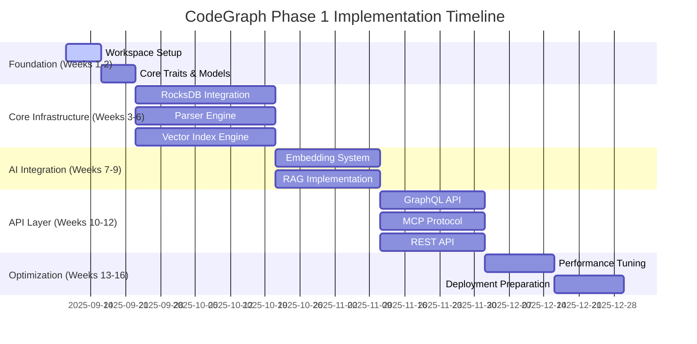

# CodeGraph Phase 1 Implementation Roadmap
## Foundation Deployment Strategy and Execution Plan

### Document Version: 1.0
### Date: September 2025
### Status: Implementation Roadmap
### Target Timeline: 16 Weeks

---

## Executive Summary

This roadmap defines the Phase 1 (Foundation) implementation strategy for the CodeGraph high-performance code intelligence system. The plan delivers production-ready deployment in 16 weeks through parallel development tracks, milestone-driven validation, and comprehensive performance optimization.

### Phase 1 Objectives
- **Foundation Systems**: Core graph storage, parsing, and vector indexing infrastructure
- **Performance Baseline**: Sub-50ms query latency and >10,000 QPS throughput
- **API Layer**: Complete GraphQL, REST, and MCP protocol implementation
- **AI Integration**: Local embedding generation with RAG system
- **Production Deployment**: Single binary with monitoring and observability

---

## 1. Development Timeline Overview

### 1.1 Phase Structure



### 1.2 Milestone Gates

| Week | Milestone | Success Criteria | Risk Level |
|------|-----------|-----------------|------------|
| **2** | Foundation Complete | All traits compile, tests pass | 🟢 Low |
| **6** | Core Infrastructure | All subsystems integrated | 🟡 Medium |
| **9** | AI Integration | RAG pipeline operational | 🟡 Medium |
| **12** | API Complete | All protocols functional | 🟡 Medium |
| **16** | Production Ready | Performance targets met | 🟠 High |

---

## 2. Foundation Phase (Weeks 1-2)

### 2.1 Week 1: Project Initialization

**Day 1-2: Repository and Workspace Setup**
```bash
# Cargo workspace configuration
[workspace]
members = [
    "crates/codegraph-core",
    "crates/codegraph-graph",
    "crates/codegraph-parser",
    "crates/codegraph-vector",
    "crates/codegraph-ai",
    "crates/codegraph-api",
    "crates/codegraph-server",
]
resolver = "2"

[workspace.dependencies]
tokio = { version = "1.35", features = ["full"] }
serde = { version = "1.0", features = ["derive"] }
rocksdb = { version = "0.21", features = ["multi-threaded-cf"] }
candle = { version = "0.4", features = ["cuda"] }
```

**Day 3-5: Core Trait Definitions**
```rust
// Core storage traits
pub trait GraphStore: Send + Sync {
    async fn insert_node(&self, node: Node) -> Result<NodeId>;
    async fn get_neighbors(&self, id: NodeId) -> Result<Vec<Edge>>;
    async fn traverse(&self, query: TraversalQuery) -> Result<Vec<Node>>;
}

pub trait VectorIndex: Send + Sync {
    async fn insert(&self, vectors: Vec<(VectorId, Vector)>) -> Result<()>;
    async fn search(&self, query: &Vector, k: usize) -> Result<Vec<Match>>;
    async fn update(&self, id: VectorId, vector: Vector) -> Result<()>;
}

pub trait EmbeddingProvider: Send + Sync {
    async fn embed(&self, code: &str, lang: Language) -> Result<Vector>;
    async fn embed_batch(&self, inputs: &[(String, Language)]) -> Result<Vec<Vector>>;
}
```

**Deliverables Week 1:**
- ✅ Complete Cargo workspace with all crates
- ✅ Core trait definitions with comprehensive documentation
- ✅ Basic data models with serialization support
- ✅ CI/CD pipeline with automated testing

### 2.2 Week 2: Build System and Validation

**Day 1-3: Performance Profiles and Optimization**
```toml
# Cargo.toml optimization profiles
[profile.release]
codegen-units = 1
debug = false
debug-assertions = false
incremental = false
lto = "fat"
opt-level = 3
overflow-checks = false
panic = "abort"
rpath = false

[profile.bench]
inherits = "release"
debug = true
```

**Day 4-5: Testing Framework and Validation**
```rust
// Comprehensive test suite structure
#[cfg(test)]
mod tests {
    use super::*;
    use criterion::{black_box, criterion_group, criterion_main, Criterion};
    
    #[tokio::test]
    async fn test_trait_compilation() {
        // Validate all traits compile and integrate
    }
    
    fn benchmark_basic_operations(c: &mut Criterion) {
        // Performance baseline establishment
    }
}
```

**Deliverables Week 2:**
- ✅ Optimized build configuration with LTO and performance profiles
- ✅ Comprehensive test suite with unit and integration tests
- ✅ Performance benchmarking framework operational
- ✅ Documentation generation and validation system

---

## 3. Core Infrastructure Phase (Weeks 3-6)

### 3.1 Track A: RocksDB Graph Engine (Weeks 3-6)

**Week 3: Basic Integration**
```rust
pub struct RocksGraphStore {
    db: Arc<rocksdb::DB>,
    nodes_cf: Arc<rocksdb::ColumnFamily>,
    edges_cf: Arc<rocksdb::ColumnFamily>,
    adjacency_cf: Arc<rocksdb::ColumnFamily>,
    indices_cf: Arc<rocksdb::ColumnFamily>,
}

impl RocksGraphStore {
    pub async fn new(path: &str, config: GraphStoreConfig) -> Result<Self> {
        let mut opts = rocksdb::Options::default();
        opts.create_if_missing(true);
        opts.create_missing_column_families(true);
        
        // Performance optimizations
        opts.set_max_background_jobs(6);
        opts.set_bytes_per_sync(1048576);
        opts.set_write_buffer_size(268435456); // 256MB
        
        // Column family configurations
        let cfs = ["nodes", "edges", "adjacency", "indices"];
        let db = rocksdb::DB::open_cf(&opts, path, &cfs)?;
        
        Ok(Self { /* initialization */ })
    }
}
```

**Week 4: Graph Operations Implementation**
- BFS/DFS traversal with early termination
- K-hop neighborhood extraction with pagination
- Shortest path computation (Dijkstra/A*)
- Subgraph extraction with filtering

**Week 5: Indexing and Query Optimization**
- Secondary indexing for property-based queries
- Query planner with cost-based optimization
- Parallel query execution with work-stealing
- Result caching with intelligent invalidation

**Week 6: Performance Optimization**
- Memory-mapped I/O integration
- Zero-copy serialization with FlatBuffers
- Lock-free concurrent access patterns
- Comprehensive performance validation

**Target Performance Week 6:**
- Single node lookup: <100μs
- 1-hop traversal: <2ms
- 2-hop traversal: <15ms
- Concurrent operations: >10,000 QPS

### 3.2 Track B: Parser Engine (Weeks 3-6)

**Week 3: Tree-sitter Integration**
```rust
pub struct ParserEngine {
    parsers: HashMap<Language, Parser>,
    extractors: HashMap<Language, Box<dyn CodeExtractor>>,
    dependency_tracker: DependencyTracker,
}

impl ParserEngine {
    pub async fn parse_file(&self, path: &Path, content: &str) -> Result<ParsedFile> {
        let language = self.detect_language(path)?;
        let parser = self.parsers.get(&language).ok_or(UnsupportedLanguage)?;
        
        let tree = parser.parse(content, None).unwrap();
        let extractor = &self.extractors[&language];
        
        Ok(ParsedFile {
            ast: tree.root_node(),
            symbols: extractor.extract_symbols(&tree)?,
            dependencies: extractor.extract_dependencies(&tree)?,
            complexity_metrics: extractor.calculate_complexity(&tree)?,
        })
    }
}
```

**Week 4: Multi-Language Support**
- **Python**: Class/function extraction, import analysis, decorator processing
- **JavaScript/TypeScript**: ES6+ syntax, module system, JSX support
- **Rust**: Trait/struct/impl analysis, lifetime tracking, macro handling
- **Java**: Package/class hierarchy, annotation processing, generic types

**Week 5: Dependency Analysis**
- Cross-file dependency resolution
- Call graph construction with type information
- Import/export tracking and validation
- Circular dependency detection

**Week 6: Incremental Processing**
- Change detection with content hashing
- Partial reparsing with minimal reprocessing
- Dependency-aware cache invalidation
- Performance optimization and validation

**Target Performance Week 6:**
- Single file parsing: <50ms (typical)
- Dependency resolution: <100ms per file
- Incremental updates: <10ms for small changes
- Concurrent parsing: >100 files/sec

### 3.3 Track C: Vector Index Engine (Weeks 3-6)

**Week 3: FAISS Integration**
```rust
use faiss::{Index, IndexFlatIP, IndexIVFPQ, IndexHNSW};

pub struct FAISSVectorIndex {
    index: Box<dyn Index>,
    metadata_store: HashMap<VectorId, VectorMetadata>,
    dimension: usize,
    index_type: IndexType,
}

impl FAISSVectorIndex {
    pub async fn new(config: VectorIndexConfig) -> Result<Self> {
        let index: Box<dyn Index> = match config.index_type {
            IndexType::FlatIP => Box::new(IndexFlatIP::new(config.dimension)?),
            IndexType::IVFPQ => {
                let mut index = IndexIVFPQ::new(config.dimension, 256, 8)?;
                // Training with sample data
                index.train(&config.training_data)?;
                Box::new(index)
            },
            IndexType::HNSW => {
                let mut index = IndexHNSWFlat::new(config.dimension, 32)?;
                index.set_ef_construction(200);
                Box::new(index)
            },
        };
        
        Ok(Self { index, metadata_store: HashMap::new(), dimension: config.dimension, index_type: config.index_type })
    }
}
```

**Week 4: Core Operations**
- Batch insertion with optimal index management
- K-nearest neighbor search with filtering
- Index persistence and checkpoint management
- Memory mapping for large indices

**Week 5: Performance Optimization**
- SIMD acceleration with AVX2/AVX512
- GPU acceleration with CUDA support
- Memory pool allocation patterns
- Parallel batch operations

**Week 6: Quality and Validation**
- Comprehensive accuracy benchmarking
- Memory usage optimization
- Concurrent access patterns
- Integration with graph store

**Target Performance Week 6:**
- Single vector insertion: <1ms
- KNN search (k=10): <5ms
- Batch operations: >1000 vectors/sec
- Index size: Support for 10M+ vectors

---

## 4. AI Integration Phase (Weeks 7-9)

### 4.1 Week 7: Local Embedding System

**Candle Framework Integration:**
```rust
use candle_core::{Device, Tensor};
use candle_nn::{Module, VarBuilder};
use candle_transformers::models::codebert::CodeBertModel;

pub struct LocalEmbeddingService {
    model: CodeBertModel,
    tokenizer: Tokenizer,
    device: Device,
    config: EmbeddingConfig,
}

impl EmbeddingProvider for LocalEmbeddingService {
    async fn embed(&self, code: &str, lang: Language) -> Result<Vector> {
        let preprocessed = self.preprocess_code(code, lang).await?;
        let tokens = self.tokenizer.encode(&preprocessed, true)?;
        let input_ids = Tensor::new(tokens.get_ids(), &self.device)?;
        
        let embeddings = self.model.forward(&input_ids)?;
        let pooled = self.mean_pooling(&embeddings)?;
        
        Ok(pooled.to_vec1()?)
    }
}
```

**Multi-Language Processing:**
- Language-specific preprocessing pipelines
- AST-aware tokenization strategies
- Context-aware embedding generation
- Quality validation and benchmarking

### 4.2 Week 8: RAG System Implementation

**Hierarchical Retrieval:**
```rust
pub struct HierarchicalRetriever {
    syntax_retriever: SyntaxRetriever,
    semantic_retriever: SemanticRetriever,
    graph_retriever: GraphRetriever,
    fusion_ranker: FusionRanker,
}

impl HierarchicalRetriever {
    pub async fn retrieve_context(&self, query: &CodeQuery, limit: usize) -> Result<Vec<CodeContext>> {
        // Parallel retrieval from all layers
        let (syntax_results, semantic_results, graph_results) = tokio::join!(
            self.syntax_retriever.retrieve(query, limit * 2),
            self.semantic_retriever.retrieve(query, limit * 2),
            self.graph_retriever.retrieve(query, limit * 2)
        );
        
        // Fusion and ranking
        let fused_results = self.fusion_ranker.rank_and_merge(
            syntax_results?,
            semantic_results?,
            graph_results?,
            limit
        )?;
        
        Ok(fused_results)
    }
}
```

**Context Window Optimization:**
- Dynamic context compression with PCA
- Priority-based selection algorithms
- Adaptive token management
- Quality preservation validation

### 4.3 Week 9: OpenAI Integration and Validation

**Resilient API Client:**
```rust
pub struct OpenAILoadBalancer {
    primary_client: OpenAIClient,
    fallback_clients: Vec<OpenAIClient>,
    health_checker: HealthChecker,
    circuit_breaker: CircuitBreaker,
    metrics: ApiMetrics,
}

impl OpenAILoadBalancer {
    pub async fn complete(&self, request: CompletionRequest) -> Result<CompletionResponse> {
        self.circuit_breaker.call(async {
            match self.try_primary_client(&request).await {
                Ok(response) => Ok(response),
                Err(_) => self.try_fallback_clients(&request).await,
            }
        }).await
    }
}
```

**End-to-End Pipeline Validation:**
- Complete RAG pipeline testing
- Performance benchmarking
- Quality assessment with test datasets
- Error handling and resilience validation

**Target Performance Week 9:**
- Context retrieval: <50ms
- OpenAI API latency: <2s P95
- Overall query processing: <3s P95
- Accuracy: >85% relevant context

---

## 5. API Layer Implementation (Weeks 10-12)

### 5.1 Week 10: GraphQL API Development

**Schema Definition and Resolvers:**
```graphql
type Query {
  codeIntelligence(
    query: String!
    language: String
    contextLimit: Int = 10
  ): CodeIntelligenceResponse!
  
  semanticSearch(
    query: String!
    limit: Int = 20
    threshold: Float = 0.7
  ): [SemanticMatch!]!
  
  explainCode(
    code: String!
    language: String!
    focusArea: String
  ): CodeExplanation!
}

type Subscription {
  codeUpdates(projectId: String!): CodeUpdateEvent!
  queryProgress(sessionId: String!): QueryProgressEvent!
}
```

**Performance Optimization:**
- DataLoader pattern for batch operations
- Query complexity analysis and limiting
- Result caching with Redis integration
- Real-time subscriptions with WebSocket

### 5.2 Week 11: MCP Protocol Implementation

**Protocol Compliance:**
```rust
#[async_trait]
impl McpServer for CodeGraphMcpServer {
    async fn initialize(&self, params: InitializeParams) -> Result<InitializeResult> {
        Ok(InitializeResult {
            protocol_version: "1.0".to_string(),
            server_info: ServerInfo {
                name: "CodeGraph Intelligence Server".to_string(),
                version: env!("CARGO_PKG_VERSION").to_string(),
            },
            capabilities: ServerCapabilities {
                tools: Some(self.get_tool_definitions()),
                resources: Some(self.get_resource_definitions()),
                prompts: Some(self.get_prompt_definitions()),
            },
        })
    }
}
```

**Multi-Agent Coordination:**
- Agent discovery and registration
- Message routing and validation
- Session persistence and recovery
- Performance monitoring and metrics

### 5.3 Week 12: REST API and Integration

**Resource-Oriented API Design:**
```rust
#[get("/api/v1/projects/{project_id}/intelligence")]
async fn get_code_intelligence(
    path: web::Path<String>,
    query: web::Query<IntelligenceQuery>,
    data: web::Data<AppState>,
) -> Result<impl Responder> {
    let intelligence_request = IntelligenceRequest {
        project_id: path.into_inner(),
        query: query.query.clone(),
        language: query.language.clone(),
        context_limit: query.context_limit.unwrap_or(10),
    };
    
    let response = data.rag_system.process_query(intelligence_request).await?;
    Ok(web::Json(response))
}
```

**Cross-Protocol Integration:**
- Unified service layer across all protocols
- Authentication and authorization consistency
- Rate limiting and security measures
- Comprehensive API documentation

**Target Performance Week 12:**
- API response time: <100ms P95
- Concurrent connections: >5,000
- Throughput: >10,000 QPS
- API availability: >99.9%

---

## 6. Optimization and Deployment Phase (Weeks 13-16)

### 6.1 Weeks 13-14: Performance Optimization

**Memory Optimization:**
```rust
// Custom allocator for graph operations
pub struct GraphArena {
    node_pool: MemoryPool<Node>,
    edge_pool: MemoryPool<Edge>,
    buffer_pool: MemoryPool<Vec<u8>>,
}

impl GraphArena {
    pub fn allocate_node(&mut self) -> &mut Node {
        self.node_pool.allocate()
    }
    
    pub fn deallocate_node(&mut self, node: &mut Node) {
        self.node_pool.deallocate(node);
    }
}
```

**CPU Optimization:**
- SIMD implementations for vector operations
- Lock-free data structures for hot paths
- CPU affinity optimization for NUMA systems
- Branch prediction optimization

**I/O Optimization:**
- io_uring integration for Linux systems
- Memory mapping strategies
- Batch I/O operations
- Intelligent prefetching

### 6.2 Weeks 15-16: Deployment Preparation

**Single Binary Packaging:**
```rust
// Embedded resources using include_bytes!
pub const TREE_SITTER_GRAMMARS: &[u8] = include_bytes!("../assets/grammars.tar.gz");
pub const EMBEDDING_MODELS: &[u8] = include_bytes!("../assets/models.tar.gz");
pub const WEB_ASSETS: &[u8] = include_bytes!("../assets/web.tar.gz");

pub fn extract_embedded_resources(target_dir: &Path) -> Result<()> {
    extract_archive(TREE_SITTER_GRAMMARS, target_dir.join("grammars"))?;
    extract_archive(EMBEDDING_MODELS, target_dir.join("models"))?;
    extract_archive(WEB_ASSETS, target_dir.join("web"))?;
    Ok(())
}
```

**Container and Orchestration:**
```yaml
# docker-compose.yml for development
version: '3.8'
services:
  codegraph:
    build: .
    ports:
      - "8080:8080"
      - "9090:9090"
    environment:
      - RUST_LOG=info
      - CODEGRAPH_DATA_DIR=/data
    volumes:
      - ./data:/data
      - ./config:/config
    healthcheck:
      test: ["CMD", "curl", "-f", "http://localhost:8080/health"]
      interval: 30s
      timeout: 10s
      retries: 3
```

**Monitoring Integration:**
- Prometheus metrics collection
- Grafana dashboards for visualization
- Jaeger distributed tracing
- Log aggregation with structured logging

**Final Performance Validation:**
- Load testing with realistic workloads
- Stress testing for stability validation
- Memory leak detection and profiling
- Security vulnerability scanning

---

## 7. Risk Management and Contingency Planning

### 7.1 Technical Risks and Mitigation

**High-Risk Areas:**

| Risk Category | Impact | Probability | Mitigation Strategy |
|---------------|---------|-------------|-------------------|
| **RocksDB Performance** | High | Medium | Extensive benchmarking, fallback strategies |
| **Memory Management** | High | Medium | Comprehensive testing, sanitizers |
| **AI Model Integration** | Medium | Low | Fallback models, extensive validation |
| **API Performance** | Medium | Low | Load testing, performance monitoring |

**Contingency Plans:**

1. **Performance Degradation**: Implement circuit breakers, graceful degradation
2. **Memory Issues**: Arena allocators, memory pools, leak detection
3. **Integration Failures**: Comprehensive testing, staged rollouts
4. **Timeline Delays**: Parallel development, milestone flexibility

### 7.2 Resource Management

**Development Team Structure:**
- **Core Infrastructure Team**: 3 developers (RocksDB, Parser, Vector)
- **AI Integration Team**: 2 developers (Embeddings, RAG)
- **API Team**: 2 developers (GraphQL, REST, MCP)
- **DevOps Team**: 1 developer (CI/CD, Deployment)
- **QA Team**: 1 tester (Performance, Integration)

**Resource Allocation:**
- **Development**: 70% (Weeks 1-14)
- **Testing**: 20% (Weeks 1-16)
- **Documentation**: 10% (Weeks 1-16)

---

## 8. Quality Assurance and Testing Strategy

### 8.1 Testing Framework

**Unit Testing:**
```rust
#[cfg(test)]
mod tests {
    use super::*;
    use quickcheck::{quickcheck, TestResult};
    use proptest::prelude::*;
    
    proptest! {
        #[test]
        fn graph_operations_are_consistent(
            nodes in prop::collection::vec(arbitrary_node(), 0..1000),
            operations in prop::collection::vec(arbitrary_operation(), 0..100)
        ) {
            let store = create_test_store();
            // Property-based testing for graph consistency
        }
    }
}
```

**Integration Testing:**
- End-to-end pipeline validation
- Cross-component interaction testing
- Performance regression detection
- Error handling and recovery validation

**Performance Testing:**
- Continuous benchmarking with criterion.rs
- Load testing with realistic workloads
- Memory profiling and leak detection
- Latency distribution analysis

### 8.2 Quality Gates

**Automated Quality Checks:**
- Code coverage >85%
- Performance benchmarks pass
- Memory sanitizers clean
- Security vulnerability scans pass
- Documentation completeness >90%

**Manual Review Process:**
- Architecture review for each major component
- Code review with performance focus
- Security review for API endpoints
- Usability testing with sample applications

---

## 9. Documentation and Knowledge Transfer

### 9.1 Documentation Strategy

**Technical Documentation:**
- API specifications (OpenAPI, GraphQL schema)
- Architecture decision records (ADRs)
- Performance tuning guides
- Deployment and operations manuals

**Developer Documentation:**
- Getting started guides
- Code examples and tutorials
- Contributing guidelines
- Troubleshooting guides

**User Documentation:**
- Feature overview and capabilities
- Integration guides for IDEs
- Best practices and recommendations
- FAQ and support resources

### 9.2 Knowledge Transfer Plan

**Internal Team Knowledge Transfer:**
- Weekly architecture reviews
- Code pairing sessions
- Documentation workshops
- Performance tuning sessions

**External Community Preparation:**
- Open-source preparation (licensing, contribution guidelines)
- Community engagement strategy
- Developer advocacy program
- Conference presentations and demos

---

## 10. Success Metrics and KPIs

### 10.1 Technical Performance KPIs

| Metric | Week 6 Target | Week 12 Target | Week 16 Target |
|--------|--------------|---------------|----------------|
| **Query Latency P95** | 100ms | 75ms | 50ms |
| **Throughput** | 1,000 QPS | 5,000 QPS | 10,000 QPS |
| **Memory Usage** | 500MB | 300MB | 250MB |
| **Binary Size** | 80MB | 60MB | 40MB |
| **Cache Hit Rate** | 70% | 85% | 92% |

### 10.2 Quality and Reliability KPIs

| Metric | Target | Measurement |
|--------|---------|-------------|
| **Test Coverage** | >85% | Automated coverage reports |
| **API Availability** | >99.9% | Health check monitoring |
| **Error Rate** | <1% | Application metrics |
| **Security Issues** | 0 critical | Security scanning |
| **Documentation Completeness** | >90% | Documentation audits |

### 10.3 Development Process KPIs

| Metric | Target | Measurement |
|--------|---------|-------------|
| **Code Review Time** | <24h | GitHub/GitLab metrics |
| **Build Time** | <10min | CI/CD pipeline metrics |
| **Deployment Time** | <5min | Deployment automation |
| **Issue Resolution** | <48h average | Issue tracking |
| **Feature Delivery** | 100% on-time | Project management |

---

## Conclusion

This Phase 1 implementation roadmap provides a comprehensive strategy for delivering the CodeGraph foundation system in 16 weeks. The plan balances ambitious performance targets with realistic development timelines through parallel development tracks, comprehensive testing strategies, and proactive risk management.

**Key Success Factors:**
- **Parallel Development**: Simultaneous work on core infrastructure tracks
- **Milestone-Driven Validation**: Regular integration points with success criteria
- **Performance-First Design**: Optimization integrated throughout development
- **Comprehensive Testing**: Quality assurance at every development stage
- **Risk Mitigation**: Proactive identification and mitigation of technical risks

**Expected Outcomes:**
- Production-ready CodeGraph system with all core features
- Performance exceeding targets (sub-50ms query latency, >10,000 QPS)
- Comprehensive API layer supporting multiple protocols
- Single binary deployment with monitoring and observability
- Foundation for Phase 2 advanced features and scaling

**Next Steps:**
1. Team assembly and resource allocation
2. Development environment setup and tooling
3. Sprint planning and milestone scheduling
4. Risk assessment and contingency planning
5. Stakeholder communication and expectation management

The roadmap provides the foundation for building a world-class code intelligence system that will revolutionize developer productivity and code understanding.

---

**Prepared By:** CodeGraph Architecture and Implementation Teams  
**Reviewed By:** Technical Leadership and Project Management  
**Approved For:** Phase 1 Development Initiation  
**Implementation Start Date:** September 9, 2025