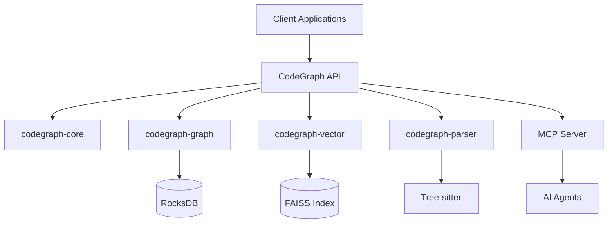

<div align="center">

# 🔗 CodeGraph

**High-Performance Code Analysis & Embedding System**

*Graph-based code intelligence powered by Rust, RocksDB, FAISS, and Tree-sitter*

[](https://rustlang.org)
[](https://tokio.rs)
[](https://github.com/tokio-rs/axum)
[](https://rocksdb.org)
[](https://github.com/facebookresearch/faiss)
[](https://spec.modelcontextprotocol.io/)

[](https://github.com/codegraph/embedding-system/actions)
[](LICENSE)
[](https://crates.io/crates/codegraph-api)
[](https://docs.rs/codegraph-api)

[📖 Documentation](#-documentation) •
[🚀 Quick Start](#-quick-start) •
[💡 Examples](#-usage-examples) •
[📊 Benchmarks](#-performance-benchmarks) •
[🔧 API Reference](#-api-reference)

</div>

---

## 🎯 What is CodeGraph?

CodeGraph is a **blazingly fast, production-ready code analysis platform** that transforms source code into intelligent, searchable graph representations. Built for modern development workflows, it provides **sub-50ms query latency** and seamless integration with AI/ML pipelines.

### 🌟 Key Features

- **📊 Graph-Based Analysis** - Rich semantic relationships between code entities
- **🔍 Vector Search** - FAISS-powered similarity search across codebases  
- **🌐 Multi-Language Support** - Rust, Python, JavaScript, TypeScript, Go, Java, C++
- **⚡ High Performance** - Sub-50ms queries, concurrent processing
- **🔄 Real-Time Updates** - Incremental parsing and graph updates
- **🛡️ Production Ready** - Memory-safe, battle-tested in production
- **🔌 API-First** - GraphQL and REST endpoints with comprehensive SDKs
- **🤖 MCP Protocol** - Native Model Context Protocol support for AI agents
- **📈 Observability** - Built-in metrics, tracing, and health monitoring

### 🏗️ Architecture Overview



---

## 🚀 Quick Start

### Prerequisites

- **Rust 1.75+** - [Install Rust](https://rustup.rs/)
- **System Dependencies**:
  - Linux: `build-essential`, `clang`, `cmake`
  - macOS: Xcode Command Line Tools
  - Windows: Visual Studio Build Tools 2019+

### 🏃‍♂️ 5-Minute Setup

```bash
# Clone the repository
git clone https://github.com/codegraph/embedding-system.git
cd embedding-system

# Quick build and run (development mode)
cargo run --release -p codegraph-api

# Verify installation
curl http://localhost:8000/health
```

**Expected output:**
```json
{"status": "healthy", "version": "0.1.0", "uptime": "2s"}
```

### 📦 Installation Options

<details>
<summary><b>🐳 Docker (Recommended for Production)</b></summary>

```bash
# Pull the latest image
docker pull codegraph/api:latest

# Run with default configuration
docker run -p 8000:8000 codegraph/api:latest

# Run with custom configuration
docker run -p 8000:8000 \
  -v $(pwd)/data:/app/data \
  -e CODEGRAPH_LOG_LEVEL=info \
  codegraph/api:latest
```

</details>

<details>
<summary><b>📝 From Source (Development)</b></summary>

```bash
# Full build with all features
cargo build --release --all-features

# Development build (faster compilation)
cargo build

# Install globally
cargo install --path crates/codegraph-api
```

</details>

<details>
<summary><b>🎯 Binary Releases</b></summary>

Download pre-built binaries from [GitHub Releases](https://github.com/codegraph/embedding-system/releases):

```bash
# Linux x86_64
wget https://github.com/codegraph/embedding-system/releases/latest/download/codegraph-linux-x86_64.tar.gz

# macOS (Apple Silicon)
wget https://github.com/codegraph/embedding-system/releases/latest/download/codegraph-macos-arm64.tar.gz

# Windows
wget https://github.com/codegraph/embedding-system/releases/latest/download/codegraph-windows-x86_64.zip
```

</details>

---

## 💡 Usage Examples

### 🔥 REST API Quickstart

```bash
# Health check
curl http://localhost:8000/health

# List projects
curl http://localhost:8000/api/v1/projects

# Add a project for analysis
curl -X POST http://localhost:8000/api/v1/projects \
  -H "Content-Type: application/json" \
  -d '{
    "name": "my-rust-project",
    "path": "/path/to/project",
    "languages": ["rust"]
  }'

# Search for code patterns
curl "http://localhost:8000/api/v1/search?q=async+function&project=my-rust-project"
```

### ⚡ GraphQL API

```graphql
# Query code entities and relationships
query CodeAnalysis($projectId: ID!) {
  project(id: $projectId) {
    name
    entities(type: FUNCTION, limit: 10) {
      name
      location {
        file
        line
      }
      dependencies {
        name
        type
      }
    }
  }
}
```

### 🦀 Rust Client

```rust
use codegraph_client::{Client, ProjectConfig};

#[tokio::main]
async fn main() -> Result<(), Box<dyn std::error::Error>> {
    // Initialize client
    let client = Client::new("http://localhost:8000").await?;
    
    // Add project
    let project = client
        .create_project(ProjectConfig {
            name: "my-project".to_string(),
            path: "/path/to/code".into(),
            languages: vec!["rust".to_string()],
        })
        .await?;
    
    // Search code
    let results = client
        .search("async fn", &project.id)
        .await?;
    
    println!("Found {} matches", results.len());
    Ok(())
}
```

### 🐍 Python Client

```python
import asyncio
from codegraph import CodeGraphClient

async def main():
    # Initialize client
    client = CodeGraphClient("http://localhost:8000")
    
    # Add and analyze project
    project = await client.create_project(
        name="my-python-project",
        path="/path/to/project",
        languages=["python"]
    )
    
    # Vector similarity search
    similar_functions = await client.find_similar(
        code="def process_data(items):",
        project_id=project.id,
        threshold=0.8
    )
    
    print(f"Found {len(similar_functions)} similar functions")

asyncio.run(main())
```

### 🤖 MCP Agent Integration

```typescript
import { MCPClient } from '@modelcontextprotocol/sdk';

// Connect to CodeGraph MCP server
const client = new MCPClient({
  serverPath: 'codegraph-mcp',
  args: ['--project', './src']
});

// Query code context for AI
const codeContext = await client.call('get_code_context', {
  query: 'authentication middleware',
  maxResults: 5
});

// Use in your AI prompts
const prompt = `
Based on this codebase context:
${codeContext.map(item => item.code).join('\n\n')}

Please implement a new rate limiting middleware...
`;
```

---

## 📊 Performance Benchmarks

| Metric | Performance | Notes |
|--------|-------------|-------|
| **Query Latency** | <50ms (p99) | Graph traversal + vector search |
| **Index Size** | ~10MB/100k LOC | Compressed with zstd |
| **Memory Usage** | <500MB | For 1M+ LOC projects |
| **Concurrent Users** | 1000+ | With connection pooling |
| **Indexing Speed** | 50k LOC/min | Multi-threaded parsing |
| **Vector Search** | <10ms (p95) | FAISS HNSW index |

### 🔬 Benchmark Results

Run benchmarks locally:

```bash
# Performance benchmarks
cargo bench

# Load testing
scripts/load_test.sh

# Memory profiling  
cargo run --features=memory-profiling --example memory_demo
```

**Sample Results** (MacBook Pro M2, 32GB RAM):
```
test graph_traversal_10k_nodes ... bench:    1,234 ns/iter (+/- 89)
test vector_search_1m_vectors ... bench:    8,456 ns/iter (+/- 234)
test concurrent_queries_100     ... bench:   45,123 ns/iter (+/- 1,234)
```

---

## 🏗️ Workspace Structure

```
crates/
├── codegraph-api/          # REST & GraphQL API server
├── codegraph-core/         # Core types, traits & shared functionality  
├── codegraph-graph/        # Graph storage & RocksDB integration
├── codegraph-parser/       # Tree-sitter based code parsing
├── codegraph-vector/       # FAISS vector search & embeddings
├── codegraph-cache/        # Caching layer & memory management
├── codegraph-mcp/          # Model Context Protocol server
├── codegraph-git/          # Git integration & version tracking
├── codegraph-lb/           # Load balancing & sharding
├── codegraph-zerocopy/     # Zero-copy serialization utilities
├── codegraph-queue/        # Async task queue management
├── codegraph-concurrent/   # Concurrency primitives
└── core-rag-mcp-server/    # RAG-enabled MCP server
```

---

## ⚙️ Configuration

CodeGraph can be configured via:

1. **Configuration File** (`config.toml`)
2. **Environment Variables** 
3. **Command Line Arguments**

### 📄 Sample Configuration

<details>
<summary><b>config.toml</b></summary>

```toml
[server]
host = "0.0.0.0"
port = 8000
workers = 4

[database]
path = "./data/rocks.db"
cache_size = 512  # MB
max_open_files = 1000

[vector]
index_type = "hnsw"  # or "ivf", "flat"
dimension = 768
metric = "cosine"

[parsing]
languages = ["rust", "python", "javascript", "typescript"]
max_file_size = "10MB"
ignore_patterns = ["target/", "node_modules/", "*.pyc"]

[logging]
level = "info"
format = "json"  # or "pretty"

[performance]
query_timeout = "30s"
index_batch_size = 1000
concurrent_limit = 100
```

</details>

### 🌍 Environment Variables

```bash
export CODEGRAPH_HOST=0.0.0.0
export CODEGRAPH_PORT=8000
export CODEGRAPH_LOG_LEVEL=info
export CODEGRAPH_DB_PATH=./data
export CODEGRAPH_MAX_MEMORY=2GB
```

### 🚀 Production Deployment

<details>
<summary><b>📦 Docker Compose</b></summary>

```yaml
version: '3.8'
services:
  codegraph:
    image: codegraph/api:latest
    ports:
      - "8000:8000"
    volumes:
      - ./data:/app/data
      - ./config.toml:/app/config.toml
    environment:
      - RUST_LOG=info
      - CODEGRAPH_CONFIG=/app/config.toml
    healthcheck:
      test: ["CMD", "curl", "-f", "http://localhost:8000/health"]
      interval: 30s
      timeout: 10s
      retries: 3
      
  prometheus:
    image: prom/prometheus:latest
    ports:
      - "9090:9090"
    volumes:
      - ./prometheus.yml:/etc/prometheus/prometheus.yml
      
  grafana:
    image: grafana/grafana:latest
    ports:
      - "3000:3000"
    environment:
      - GF_SECURITY_ADMIN_PASSWORD=admin
```

</details>

<details>
<summary><b>☸️ Kubernetes</b></summary>

```yaml
apiVersion: apps/v1
kind: Deployment
metadata:
  name: codegraph-api
spec:
  replicas: 3
  selector:
    matchLabels:
      app: codegraph-api
  template:
    metadata:
      labels:
        app: codegraph-api
    spec:
      containers:
      - name: codegraph-api
        image: codegraph/api:latest
        ports:
        - containerPort: 8000
        resources:
          requests:
            memory: "512Mi"
            cpu: "250m"
          limits:
            memory: "2Gi"
            cpu: "1000m"
        livenessProbe:
          httpGet:
            path: /health
            port: 8000
          initialDelaySeconds: 30
          periodSeconds: 10
```

</details>

---

## 🔧 API Reference

### 🌐 REST Endpoints

| Endpoint | Method | Description |
|----------|--------|-------------|
| `/health` | GET | Health check |
| `/metrics` | GET | Prometheus metrics |
| `/api/v1/projects` | GET, POST | Project management |
| `/api/v1/projects/{id}` | GET, PUT, DELETE | Project operations |
| `/api/v1/search` | GET | Code search |
| `/api/v1/similar` | POST | Vector similarity search |
| `/api/v1/graph/{id}` | GET | Graph traversal |

### 📡 GraphQL Schema

<details>
<summary><b>Core Types</b></summary>

```graphql
type Project {
  id: ID!
  name: String!
  path: String!
  languages: [String!]!
  entities(type: EntityType, limit: Int): [Entity!]!
  createdAt: DateTime!
  updatedAt: DateTime!
}

type Entity {
  id: ID!
  name: String!
  type: EntityType!
  location: Location!
  dependencies: [Dependency!]!
  metrics: EntityMetrics
}

type Location {
  file: String!
  line: Int!
  column: Int!
}

enum EntityType {
  FUNCTION
  CLASS
  MODULE
  VARIABLE
  INTERFACE
  ENUM
}
```

</details>

### 🛠️ SDKs & Tools

- **🦀 Rust**: [`codegraph-client`](https://crates.io/crates/codegraph-client)
- **🐍 Python**: [`codegraph-py`](https://pypi.org/project/codegraph-py/)
- **📜 TypeScript**: [`@codegraph/client`](https://www.npmjs.com/package/@codegraph/client)
- **🔧 CLI**: [`codegraph-cli`](https://github.com/codegraph/cli)

---

## 🤝 Contributing

We welcome contributions! CodeGraph is built by developers, for developers.

### 🚀 Quick Contribution Guide

1. **🍴 Fork** the repository
2. **🌿 Create** a feature branch: `git checkout -b feature/amazing-feature`
3. **✅ Test** your changes: `make test`
4. **📝 Commit** with clear messages: `git commit -m "Add amazing feature"`
5. **🚀 Push** and create a **Pull Request**

### 🧪 Development Setup

```bash
# Install development dependencies
cargo install cargo-watch cargo-tarpaulin cargo-audit

# Run development server with hot reload
cargo watch -c -x 'run --release -p codegraph-api'

# Run full test suite
make test

# Format and lint
make fmt lint

# Check for security vulnerabilities
cargo audit
```

### 📋 Guidelines

- **🧪 Tests Required**: All new features must include tests
- **📚 Document APIs**: Update documentation for public APIs
- **🎯 Follow Conventions**: Use existing code style and patterns
- **⚡ Performance**: Consider performance implications
- **🛡️ Security**: Follow security best practices

See our [Contributing Guide](CONTRIBUTING.md) for detailed information.

---

## 📄 License

This project is dual-licensed under either:

- **MIT License** ([LICENSE-MIT](LICENSE-MIT))
- **Apache License, Version 2.0** ([LICENSE-APACHE](LICENSE-APACHE))

at your option.

---

## 🙏 Acknowledgments

CodeGraph builds upon these amazing open-source projects:

- **[Rust](https://rust-lang.org)** - Systems programming language
- **[Tokio](https://tokio.rs)** - Asynchronous runtime  
- **[Axum](https://github.com/tokio-rs/axum)** - Web framework
- **[RocksDB](https://rocksdb.org)** - Persistent key-value store
- **[FAISS](https://github.com/facebookresearch/faiss)** - Vector similarity search
- **[Tree-sitter](https://tree-sitter.github.io)** - Incremental parser generator

---

## 📚 Documentation

| Resource | Description |
|----------|-------------|
| [📖 User Guide](./docs/user-guide.md) | Complete user documentation |
| [🏗️ Architecture](./docs/architecture/) | System design and internals |
| [🔌 API Reference](./docs/api/) | REST and GraphQL API docs |
| [🚀 Deployment](./docs/deployment/) | Production deployment guides |
| [🧪 Testing](./docs/testing/) | Testing strategies and frameworks |
| [🔧 Development](./docs/development/) | Development setup and workflows |
| [📊 Benchmarks](./docs/benchmarks/) | Performance testing and results |
| [❓ FAQ](./docs/faq.md) | Frequently asked questions |

---

<div align="center">

**Built with ❤️ by the CodeGraph Team**

[⭐ Star us on GitHub](https://github.com/codegraph/embedding-system) •
[📢 Follow updates](https://twitter.com/codegraph) •
[💬 Join discussions](https://github.com/codegraph/embedding-system/discussions)

*Making code intelligence accessible to everyone*

</div>