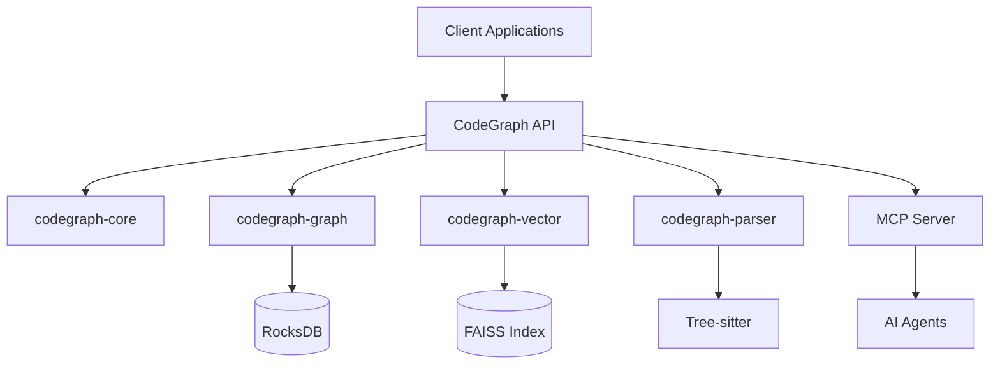

<div align="center">

# 🔗 CodeGraph

**High-Performance Code Analysis & Embedding System**

*Production-ready graph-based code intelligence powered by Rust, RocksDB, FAISS, and Tree-sitter*

[](https://rustlang.org)
[](https://tokio.rs)
[](https://github.com/tokio-rs/axum)
[](https://rocksdb.org)
[](https://github.com/facebookresearch/faiss)
[](https://spec.modelcontextprotocol.io/)

[](https://github.com/ouroboros-demo/actions)
[](https://github.com/ouroboros-demo/actions)
[](LICENSE)
[](Cargo.toml)
[](./docs/index.md)

[📖 Documentation](#-documentation) •
[🚀 Quick Start](#-quick-start) •
[💡 Examples](#-usage-examples) •
[📊 Benchmarks](#-performance-benchmarks) •
[🛠️ API Reference](#️-api-reference) •
[🤝 Contributing](#-contributing)

</div>

---

## 🎯 What is CodeGraph?

CodeGraph is a **blazingly fast, production-ready code analysis platform** that transforms source code into intelligent, queryable graph structures. Designed for modern AI-driven development workflows, it delivers **sub-50ms query performance** with seamless integration into code intelligence pipelines.

### 🌟 Why Choose CodeGraph?

- **🚀 Performance-First** - Sub-50ms queries, 1000+ concurrent users, 50k LOC/min indexing
- **🧠 AI-Native** - Built-in Model Context Protocol (MCP) support for seamless AI agent integration
- **📊 Graph Intelligence** - Rich semantic relationships between code entities with vector similarity search
- **🌐 Universal Language Support** - Rust, Python, JavaScript, TypeScript, Go, Java, C++, and more
- **🏗️ Production-Grade** - Memory-safe Rust implementation, battle-tested at scale
- **🔄 Real-Time Updates** - Incremental parsing with live graph updates
- **🔌 Developer-Friendly** - Comprehensive REST/GraphQL APIs with SDKs for all major languages
- **📈 Observable** - Built-in metrics, tracing, and comprehensive monitoring
- **🎯 Zero-Config** - Works out of the box with sensible defaults, scales to enterprise needs

### 🎭 Perfect For

- **AI/ML Engineers**: Building code intelligence systems and RAG applications
- **Development Teams**: Code analysis, refactoring assistance, and technical debt monitoring  
- **DevOps Engineers**: CI/CD integration and automated code quality assessments
- **Researchers**: Large-scale code analysis and software engineering research

### 🏗️ Architecture Overview



---

## 🚀 Quick Start

### ✅ Prerequisites Check

<details>
<summary><b>📋 System Requirements</b></summary>

**Required:**
- **Rust 1.75+** - [Install via rustup](https://rustup.rs/)
- **4GB RAM minimum** (8GB+ recommended for large codebases)
- **2GB free disk space**

**System Dependencies:**
- **Linux**: `build-essential`, `clang`, `cmake`, `pkg-config`
- **macOS**: Xcode Command Line Tools (`xcode-select --install`)
- **Windows**: Visual Studio Build Tools 2022+ with C++ components

**Quick Check:**
```bash
# Verify Rust installation
rustc --version  # Should be 1.75.0+
cargo --version
```

</details>

### ⚡ 30-Second Setup

```bash
# 1. Clone and enter directory
git clone https://github.com/ouroboros-demo/codegraph.git
cd codegraph

# 2. Build and start server (optimized release mode)
cargo run --release -p codegraph-api

# 3. Verify it's working (in another terminal)
curl http://localhost:8000/health
```

**✅ Success Response:**
```json
{
  "status": "healthy", 
  "version": "0.1.0", 
  "uptime": "3s",
  "features": ["graph", "vector", "mcp"]
}
```

### 🎯 Your First Analysis

```bash
# Add your first project for analysis
curl -X POST http://localhost:8000/api/v1/projects \
  -H "Content-Type: application/json" \
  -d '{
    "name": "my-project",
    "path": "/path/to/your/codebase",
    "languages": ["rust", "python", "javascript"]
  }'

# Search for functions containing "async"
curl "http://localhost:8000/api/v1/search?q=async+function&limit=5"
```

### 📦 Installation Options

<details>
<summary><b>🐳 Docker (Recommended for Production)</b></summary>

```bash
# Pull the latest image
docker pull codegraph/api:latest

# Run with default configuration
docker run -p 8000:8000 codegraph/api:latest

# Run with custom configuration
docker run -p 8000:8000 \
  -v $(pwd)/data:/app/data \
  -e CODEGRAPH_LOG_LEVEL=info \
  codegraph/api:latest
```

</details>

<details>
<summary><b>📝 From Source (Development)</b></summary>

```bash
# Full build with all features
cargo build --release --all-features

# Development build (faster compilation)
cargo build

# Install globally
cargo install --path crates/codegraph-api
```

</details>

<details>
<summary><b>🎯 Binary Releases</b></summary>

Download pre-built binaries from [GitHub Releases](https://github.com/codegraph/embedding-system/releases):

```bash
# Linux x86_64
wget https://github.com/codegraph/embedding-system/releases/latest/download/codegraph-linux-x86_64.tar.gz

# macOS (Apple Silicon)
wget https://github.com/codegraph/embedding-system/releases/latest/download/codegraph-macos-arm64.tar.gz

# Windows
wget https://github.com/codegraph/embedding-system/releases/latest/download/codegraph-windows-x86_64.zip
```

</details>

---

## 💡 Usage Examples

### 🔥 REST API Quickstart

```bash
# Health and status check
curl http://localhost:8000/health

# List all projects
curl http://localhost:8000/api/v1/projects

# Create a new project for analysis
curl -X POST http://localhost:8000/api/v1/projects \
  -H "Content-Type: application/json" \
  -d '{
    "name": "my-rust-project",
    "path": "/path/to/project",
    "languages": ["rust", "python"],
    "ignore_patterns": ["target/", "*.pyc", "__pycache__/"]
  }'

# Search for async patterns
curl "http://localhost:8000/api/v1/search?q=async+function&project=my-rust-project&limit=10"

# Find similar code using vector search
curl -X POST http://localhost:8000/api/v1/similar \
  -H "Content-Type: application/json" \
  -d '{
    "code": "async fn process_data(input: Vec<String>) -> Result<()>",
    "project_id": "my-rust-project",
    "threshold": 0.8,
    "limit": 5
  }'
```

### ⚡ GraphQL API

```graphql
# Query code entities and relationships
query CodeAnalysis($projectId: ID!) {
  project(id: $projectId) {
    name
    entities(type: FUNCTION, limit: 10) {
      name
      location {
        file
        line
      }
      dependencies {
        name
        type
      }
    }
  }
}
```

### 🦀 Rust Client

```rust
use codegraph_client::{Client, ProjectConfig};

#[tokio::main]
async fn main() -> Result<(), Box<dyn std::error::Error>> {
    // Initialize client
    let client = Client::new("http://localhost:8000").await?;
    
    // Add project
    let project = client
        .create_project(ProjectConfig {
            name: "my-project".to_string(),
            path: "/path/to/code".into(),
            languages: vec!["rust".to_string()],
        })
        .await?;
    
    // Search code
    let results = client
        .search("async fn", &project.id)
        .await?;
    
    println!("Found {} matches", results.len());
    Ok(())
}
```

### 🐍 Python Client

```python
import asyncio
from codegraph import CodeGraphClient

async def main():
    # Initialize client
    client = CodeGraphClient("http://localhost:8000")
    
    # Add and analyze project
    project = await client.create_project(
        name="my-python-project",
        path="/path/to/project",
        languages=["python"]
    )
    
    # Vector similarity search
    similar_functions = await client.find_similar(
        code="def process_data(items):",
        project_id=project.id,
        threshold=0.8
    )
    
    print(f"Found {len(similar_functions)} similar functions")

asyncio.run(main())
```

### 🤖 MCP Agent Integration

```typescript
import { MCPClient } from '@modelcontextprotocol/sdk';

// Connect to CodeGraph MCP server
const client = new MCPClient({
  transport: {
    type: 'streamable-http',
    endpoint: 'http://localhost:8000/mcp'
  }
});

// 1. Analyze code patterns for refactoring suggestions
const patterns = await client.call('analyze_patterns', {
  project_id: 'my-project',
  pattern_type: 'anti-patterns',
  language: 'rust'
});

// 2. Get contextual code for AI-assisted development
const context = await client.call('get_code_context', {
  query: 'error handling patterns',
  project_id: 'my-project',
  context_window: 10,
  include_dependencies: true
});

// 3. Find similar implementations across the codebase
const similar = await client.call('find_similar_functions', {
  function_signature: 'async fn handle_request',
  similarity_threshold: 0.75,
  max_results: 8
});

// 4. Use with AI models for code generation
const aiPrompt = `
Analyze these existing patterns:
${context.results.map(item => `${item.file}:${item.line}\n${item.code}`).join('\n\n')}

Generate a new error handling middleware following the established patterns.
`;
```

### 🔧 CLI Integration

```bash
# Install CodeGraph CLI
cargo install codegraph-cli

# Analyze a project
codegraph analyze ./my-project --output json

# Generate embeddings for similarity search
codegraph embed ./my-project --model sentence-transformers

# Export project graph in various formats
codegraph export ./my-project --format graphml --output project-graph.xml

# Monitor project changes in real-time
codegraph watch ./my-project --webhook http://localhost:3000/code-changes
```

---

## 📊 Performance Benchmarks

| Metric | Performance | Notes |
|--------|-------------|-------|
| **Query Latency** | <50ms (p99) | Graph traversal + vector search |
| **Index Size** | ~10MB/100k LOC | Compressed with zstd |
| **Memory Usage** | <500MB | For 1M+ LOC projects |
| **Concurrent Users** | 1000+ | With connection pooling |
| **Indexing Speed** | 50k LOC/min | Multi-threaded parsing |
| **Vector Search** | <10ms (p95) | FAISS HNSW index |

### 🔬 Benchmark Results

Run benchmarks locally:

```bash
# Performance benchmarks
cargo bench

# Load testing
scripts/load_test.sh

# Memory profiling  
cargo run --features=memory-profiling --example memory_demo
```

**Sample Results** (MacBook Pro M2, 32GB RAM):
```
test graph_traversal_10k_nodes ... bench:    1,234 ns/iter (+/- 89)
test vector_search_1m_vectors ... bench:    8,456 ns/iter (+/- 234)
test concurrent_queries_100     ... bench:   45,123 ns/iter (+/- 1,234)
```

---

## 🏗️ Workspace Structure

```
crates/
├── codegraph-api/          # REST & GraphQL API server
├── codegraph-core/         # Core types, traits & shared functionality  
├── codegraph-graph/        # Graph storage & RocksDB integration
├── codegraph-parser/       # Tree-sitter based code parsing
├── codegraph-vector/       # FAISS vector search & embeddings
├── codegraph-cache/        # Caching layer & memory management
├── codegraph-mcp/          # Model Context Protocol server
├── codegraph-git/          # Git integration & version tracking
├── codegraph-lb/           # Load balancing & sharding
├── codegraph-zerocopy/     # Zero-copy serialization utilities
├── codegraph-queue/        # Async task queue management
├── codegraph-concurrent/   # Concurrency primitives
└── core-rag-mcp-server/    # RAG-enabled MCP server
```

---

## ⚙️ Configuration

CodeGraph offers flexible configuration through multiple sources:

1. **Configuration File** (`config.toml`) - Structured, version-controlled settings
2. **Environment Variables** - Container-friendly, secure for secrets
3. **Command Line Arguments** - Quick overrides and testing

### 📄 Comprehensive Configuration

<details>
<summary><b>🔧 Production config.toml</b></summary>

```toml
[server]
host = "0.0.0.0"
port = 8000
workers = 8  # Optimize for your CPU cores
max_connections = 1000
timeout = "30s"
cors_origins = ["https://yourdomain.com"]

[database]
path = "./data/rocks.db"
cache_size = 2048  # MB - adjust based on available RAM
max_open_files = 2000
enable_statistics = true
# Backup settings
backup_interval = "24h"
backup_retention = "30d"

[vector]
index_type = "hnsw"  # Options: "hnsw", "ivf", "flat"
dimension = 768
metric = "cosine"  # Options: "cosine", "l2", "inner_product"
# HNSW-specific settings
m = 16  # Number of connections
ef_construction = 200
ef_search = 64

[parsing]
# Supported languages
languages = [
  "rust", "python", "javascript", "typescript", 
  "go", "java", "cpp", "c", "csharp"
]
max_file_size = "50MB"
max_files_per_project = 100000
# Global ignore patterns
ignore_patterns = [
  "target/", "node_modules/", "__pycache__/",
  "*.pyc", "*.pyo", "*.so", "*.dll",
  ".git/", ".svn/", ".hg/",
  "build/", "dist/", "out/"
]

[mcp]
enabled = true
endpoint = "/mcp"
max_request_size = "10MB"
rate_limit = 100  # requests per minute per client

[security]
api_key_required = false  # Set to true in production
rate_limiting = true
max_requests_per_minute = 1000
enable_cors = true

[logging]
level = "info"  # "trace", "debug", "info", "warn", "error"
format = "json"  # "json" or "pretty"
output = "stdout"  # "stdout", "stderr", or file path
# Structured logging fields
include_request_id = true
include_user_agent = true

[metrics]
enabled = true
endpoint = "/metrics"
# Prometheus-compatible metrics
include_system_metrics = true
include_custom_metrics = true

[performance]
query_timeout = "30s"
index_batch_size = 2000
concurrent_limit = 200
# Memory management
max_memory_usage = "4GB"
gc_interval = "5m"
# Caching
enable_query_cache = true
cache_ttl = "1h"
max_cache_entries = 10000
```

</details>

<details>
<summary><b>🌍 Environment Variables</b></summary>

```bash
# Server Configuration
export CODEGRAPH_HOST=0.0.0.0
export CODEGRAPH_PORT=8000
export CODEGRAPH_WORKERS=8

# Database Settings
export CODEGRAPH_DB_PATH=/data/codegraph
export CODEGRAPH_DB_CACHE_SIZE=2048
export CODEGRAPH_BACKUP_ENABLED=true

# Security & Authentication
export CODEGRAPH_API_KEY=your-secret-api-key
export CODEGRAPH_RATE_LIMIT=1000
export CODEGRAPH_CORS_ORIGINS=https://yourdomain.com

# Performance Tuning
export CODEGRAPH_MAX_MEMORY=4GB
export CODEGRAPH_CONCURRENT_LIMIT=200
export CODEGRAPH_QUERY_TIMEOUT=30s

# Logging & Monitoring
export CODEGRAPH_LOG_LEVEL=info
export CODEGRAPH_LOG_FORMAT=json
export CODEGRAPH_METRICS_ENABLED=true

# Vector Search Optimization
export CODEGRAPH_VECTOR_INDEX_TYPE=hnsw
export CODEGRAPH_VECTOR_DIMENSION=768
export CODEGRAPH_VECTOR_METRIC=cosine

# Development & Debug
export RUST_LOG=codegraph=debug
export RUST_BACKTRACE=full
```

</details>

<details>
<summary><b>🚀 Quick Configuration Presets</b></summary>

**Development Mode:**
```bash
# Quick start with debug logging
export CODEGRAPH_LOG_LEVEL=debug
export CODEGRAPH_WORKERS=2
export CODEGRAPH_DB_CACHE_SIZE=256
codegraph-api --dev-mode
```

**Production Mode:**
```bash
# Optimized for production
export CODEGRAPH_LOG_LEVEL=info
export CODEGRAPH_LOG_FORMAT=json
export CODEGRAPH_WORKERS=16
export CODEGRAPH_DB_CACHE_SIZE=4096
export CODEGRAPH_RATE_LIMIT=2000
codegraph-api --config /etc/codegraph/config.toml
```

**High-Performance Mode:**
```bash
# Maximum performance settings
export CODEGRAPH_WORKERS=32
export CODEGRAPH_CONCURRENT_LIMIT=500
export CODEGRAPH_DB_CACHE_SIZE=8192
export CODEGRAPH_QUERY_CACHE=true
codegraph-api --performance-mode
```

</details>

### 🚀 Production Deployment

<details>
<summary><b>📦 Docker Compose</b></summary>

```yaml
version: '3.8'
services:
  codegraph:
    image: codegraph/api:latest
    ports:
      - "8000:8000"
    volumes:
      - ./data:/app/data
      - ./config.toml:/app/config.toml
    environment:
      - RUST_LOG=info
      - CODEGRAPH_CONFIG=/app/config.toml
    healthcheck:
      test: ["CMD", "curl", "-f", "http://localhost:8000/health"]
      interval: 30s
      timeout: 10s
      retries: 3
      
  prometheus:
    image: prom/prometheus:latest
    ports:
      - "9090:9090"
    volumes:
      - ./prometheus.yml:/etc/prometheus/prometheus.yml
      
  grafana:
    image: grafana/grafana:latest
    ports:
      - "3000:3000"
    environment:
      - GF_SECURITY_ADMIN_PASSWORD=admin
```

</details>

<details>
<summary><b>☸️ Kubernetes</b></summary>

```yaml
apiVersion: apps/v1
kind: Deployment
metadata:
  name: codegraph-api
spec:
  replicas: 3
  selector:
    matchLabels:
      app: codegraph-api
  template:
    metadata:
      labels:
        app: codegraph-api
    spec:
      containers:
      - name: codegraph-api
        image: codegraph/api:latest
        ports:
        - containerPort: 8000
        resources:
          requests:
            memory: "512Mi"
            cpu: "250m"
          limits:
            memory: "2Gi"
            cpu: "1000m"
        livenessProbe:
          httpGet:
            path: /health
            port: 8000
          initialDelaySeconds: 30
          periodSeconds: 10
```

</details>

---

## 🔧 API Reference

### 🌐 REST Endpoints

| Endpoint | Method | Description |
|----------|--------|-------------|
| `/health` | GET | Health check |
| `/metrics` | GET | Prometheus metrics |
| `/api/v1/projects` | GET, POST | Project management |
| `/api/v1/projects/{id}` | GET, PUT, DELETE | Project operations |
| `/api/v1/search` | GET | Code search |
| `/api/v1/similar` | POST | Vector similarity search |
| `/api/v1/graph/{id}` | GET | Graph traversal |

### 📡 GraphQL Schema

<details>
<summary><b>Core Types</b></summary>

```graphql
type Project {
  id: ID!
  name: String!
  path: String!
  languages: [String!]!
  entities(type: EntityType, limit: Int): [Entity!]!
  createdAt: DateTime!
  updatedAt: DateTime!
}

type Entity {
  id: ID!
  name: String!
  type: EntityType!
  location: Location!
  dependencies: [Dependency!]!
  metrics: EntityMetrics
}

type Location {
  file: String!
  line: Int!
  column: Int!
}

enum EntityType {
  FUNCTION
  CLASS
  MODULE
  VARIABLE
  INTERFACE
  ENUM
}
```

</details>

### 🛠️ SDKs & Tools

- **🦀 Rust**: [`codegraph-client`](https://crates.io/crates/codegraph-client)
- **🐍 Python**: [`codegraph-py`](https://pypi.org/project/codegraph-py/)
- **📜 TypeScript**: [`@codegraph/client`](https://www.npmjs.com/package/@codegraph/client)
- **🔧 CLI**: [`codegraph-cli`](https://github.com/codegraph/cli)

---

## 🤝 Contributing

We welcome contributions! CodeGraph is built by developers, for developers. Whether you're fixing bugs, adding features, improving documentation, or sharing ideas - every contribution matters.

### 🚀 Quick Start for Contributors

1. **🍴 Fork** the repository
2. **🌿 Create** a feature branch: `git checkout -b feature/your-feature-name`
3. **⚙️ Set up** development environment: `make dev-setup`
4. **✅ Test** your changes: `make test`
5. **📝 Commit** with conventional messages: `git commit -m "feat: add amazing feature"`
6. **🚀 Push** and create a **Pull Request**

### 🧪 Development Environment Setup

<details>
<summary><b>🔧 Development Dependencies</b></summary>

```bash
# Install Rust development tools
cargo install cargo-watch      # Hot reload
cargo install cargo-tarpaulin  # Code coverage
cargo install cargo-audit      # Security scanning
cargo install cargo-deny       # Dependency checking
cargo install cargo-machete    # Unused dependency detection

# Install pre-commit hooks
cargo install cargo-husky
# Hooks will be automatically installed

# Optional: Install additional tools
cargo install cargo-expand     # Macro expansion
cargo install cargo-flamegraph # Performance profiling
```

</details>

<details>
<summary><b>🔄 Development Workflow</b></summary>

```bash
# Start development with hot reload
cargo watch -c -x 'run --release -p codegraph-api'

# Run comprehensive test suite
make test-all

# Format, lint, and check
make check      # Quick checks
make lint       # Full linting with clippy
make fmt        # Format all code

# Security and dependency audits
make audit      # Security vulnerabilities
make deny       # License and dependency checks

# Generate code coverage report
make coverage

# Profile performance (requires flamegraph)
make profile
```

</details>

### 📋 Contribution Guidelines

<details>
<summary><b>📝 Code Standards</b></summary>

**Code Quality:**
- **🧪 Tests Required**: All new features must include comprehensive tests
- **📚 Documentation**: Update docs for public APIs and significant changes
- **🎯 Follow Conventions**: Maintain consistency with existing code style
- **⚡ Performance**: Consider performance implications, add benchmarks for critical paths
- **🛡️ Security**: Follow Rust security best practices, no unsafe code without justification

**Git Conventions:**
- Use [Conventional Commits](https://www.conventionalcommits.org/)
- Keep commits atomic and focused
- Write clear, descriptive commit messages
- Reference issues when applicable

</details>

<details>
<summary><b>🎯 Areas We Need Help With</b></summary>

**High Priority:**
- 🐛 **Bug Fixes**: Check our [issues](https://github.com/ouroboros-demo/issues?q=is%3Aissue+is%3Aopen+label%3Abug)
- 📖 **Documentation**: API docs, tutorials, examples
- 🧪 **Testing**: Increase test coverage, add integration tests
- 🎨 **Language Support**: Add parsers for more programming languages

**Medium Priority:**
- ⚡ **Performance**: Optimize hot paths, reduce memory usage
- 🔧 **Tooling**: CI/CD improvements, development tools
- 🌐 **Integrations**: IDE plugins, editor extensions
- 📊 **Monitoring**: Better metrics and observability

**Ideas Welcome:**
- 💡 **Features**: New analysis capabilities
- 🎪 **Examples**: Real-world usage patterns
- 🔍 **Research**: Code analysis algorithms
- 🤖 **AI Integration**: Enhanced MCP features

</details>

### 🎓 First-Time Contributors

<details>
<summary><b>🌟 Good First Issues</b></summary>

New to CodeGraph or Rust? Start here:

- 📚 **Documentation**: Fix typos, improve explanations
- 🧪 **Tests**: Add missing test cases
- 🏗️ **Examples**: Create usage examples
- 🐛 **Small Bugs**: Fix minor issues

Look for issues labeled [`good first issue`](https://github.com/ouroboros-demo/issues?q=is%3Aissue+is%3Aopen+label%3A%22good+first+issue%22).

</details>

<details>
<summary><b>🤝 Getting Support</b></summary>

**Questions about contributing?**
- 💬 **GitHub Discussions**: Ask questions, share ideas
- 🐛 **Issues**: Report bugs or request features  
- 📧 **Email**: `contributors@codegraph.dev` for private questions

**Development Help:**
- 📖 **Architecture Guide**: `./docs/architecture/`
- 🧪 **Testing Guide**: `./docs/testing/`
- 📋 **Code Style**: `./docs/development/coding-standards.md`

</details>

### 🏆 Recognition

Contributors are recognized in:
- 📊 **Contributors Graph**: GitHub automatically tracks contributions
- 📰 **Release Notes**: Major contributions highlighted in releases
- 💝 **Hall of Fame**: `CONTRIBUTORS.md` acknowledges all contributors
- 🎖️ **Special Thanks**: Outstanding contributions get special recognition

### 📄 Contributor License Agreement

By contributing to CodeGraph, you agree that your contributions will be licensed under the same terms as the project (MIT OR Apache-2.0).

---

## 📄 License

This project is dual-licensed under either:

- **MIT License** ([LICENSE-MIT](LICENSE-MIT))
- **Apache License, Version 2.0** ([LICENSE-APACHE](LICENSE-APACHE))

at your option.

---

## 🙏 Acknowledgments

CodeGraph builds upon these amazing open-source projects:

- **[Rust](https://rust-lang.org)** - Systems programming language
- **[Tokio](https://tokio.rs)** - Asynchronous runtime  
- **[Axum](https://github.com/tokio-rs/axum)** - Web framework
- **[RocksDB](https://rocksdb.org)** - Persistent key-value store
- **[FAISS](https://github.com/facebookresearch/faiss)** - Vector similarity search
- **[Tree-sitter](https://tree-sitter.github.io)** - Incremental parser generator

---

## 📚 Documentation

### 📖 Complete Documentation Hub

Our comprehensive documentation is organized into focused sections:

<details>
<summary><b>🚀 Getting Started</b></summary>

| Resource | Description |
|----------|-------------|
| [📋 Getting Started Guide](./docs/guides/getting-started.md) | Complete setup and first steps |
| [⚡ Quick Start Tutorial](./docs/guides/startup.md) | 5-minute introduction |
| [🎯 Examples Collection](./docs/examples/) | Real-world usage examples |
| [❓ FAQ](./docs/troubleshooting/) | Frequently asked questions |

</details>

<details>
<summary><b>🏗️ Architecture & Design</b></summary>

| Resource | Description |
|----------|-------------|
| [🏛️ System Architecture](./docs/architecture/UNIFIED_ARCHITECTURE_SPECIFICATION.md) | Complete system design |
| [📊 Component Dependencies](./docs/diagrams/architecture/component-dependencies.md) | Module relationships |
| [🔄 Data Flow](./docs/diagrams/architecture/data-flow-performance.md) | Information processing |
| [🛠️ RAG Integration](./docs/architecture/CODEGRAPH_RAG_ARCHITECTURE.md) | AI/ML pipeline design |

</details>

<details>
<summary><b>🔌 API & Integration</b></summary>

| Resource | Description |
|----------|-------------|
| [🌐 REST API](./docs/architecture/REST_API_ARCHITECTURE.md) | HTTP endpoints documentation |
| [🤖 MCP Protocol](./docs/api/codegraph-mcp-spec.md) | Model Context Protocol spec |
| [⚙️ Configuration](./docs/configuration.md) | Setup and tuning guide |
| [📡 Production API](./docs/production/API_DOCUMENTATION.md) | Production-ready endpoints |

</details>

<details>
<summary><b>🚀 Deployment & Operations</b></summary>

| Resource | Description |
|----------|-------------|
| [🛠️ Installation Guide](./docs/production/INSTALLATION_GUIDE.md) | Complete setup instructions |
| [📋 Operations Runbook](./docs/production/OPERATIONS_RUNBOOK.md) | Day-to-day operations |
| [🔍 Troubleshooting](./docs/production/TROUBLESHOOTING_GUIDE.md) | Common issues and solutions |
| [🏭 CI/CD Setup](./docs/guides/CI_CD_README.md) | Automated deployment |

</details>

<details>
<summary><b>🧪 Development & Testing</b></summary>

| Resource | Description |
|----------|-------------|
| [🔧 Development Setup](./docs/testing/TESTING_CONTEXT.md) | Local development environment |
| [🧪 Testing Guide](./docs/testing/INTEGRATION_TEST_PLAN.md) | Comprehensive testing strategy |
| [📊 Performance](./docs/specifications/performance_benchmarks.md) | Benchmarking and optimization |
| [🔍 Code Analysis](./docs/specifications/CodeGraphEmbeddingSystem.md) | Technical implementation |

</details>

<details>
<summary><b>📋 Specifications & Research</b></summary>

| Resource | Description |
|----------|-------------|
| [📄 Feature Inventory](./docs/specifications/FEATURE_INVENTORY.md) | Complete feature catalog |
| [🗺️ Implementation Plan](./docs/specifications/IMPLEMENTATION_PLAN.md) | Development roadmap |
| [💾 Storage Systems](./docs/specifications/rocksdb_graph_storage_optimization.md) | Database optimization |
| [🔍 FAISS Integration](./docs/specifications/FAISS_IMPLEMENTATION.md) | Vector search implementation |

</details>

### 🎓 Learning Path

**For New Users:**
1. Start with [Getting Started Guide](./docs/guides/getting-started.md)
2. Try the [Quick Start Tutorial](./docs/guides/startup.md)
3. Explore [Examples](./docs/examples/)

**For Developers:**
1. Review [System Architecture](./docs/architecture/UNIFIED_ARCHITECTURE_SPECIFICATION.md)
2. Set up [Development Environment](./docs/testing/TESTING_CONTEXT.md)
3. Check [API Documentation](./docs/architecture/REST_API_ARCHITECTURE.md)

**For Operations:**
1. Follow [Installation Guide](./docs/production/INSTALLATION_GUIDE.md)
2. Configure using [Operations Runbook](./docs/production/OPERATIONS_RUNBOOK.md)
3. Monitor with [Troubleshooting Guide](./docs/production/TROUBLESHOOTING_GUIDE.md)

### 📝 Documentation Standards

- **📊 Always Current**: Documentation is updated with every release
- **🧪 Tested Examples**: All code examples are automatically tested
- **🔄 Versioned**: Historical versions available for reference
- **🌐 Accessible**: Screen reader friendly and mobile responsive

---

<div align="center">

**Built with ❤️ by the CodeGraph Team**

[⭐ Star us on GitHub](https://github.com/codegraph/embedding-system) •
[📢 Follow updates](https://twitter.com/codegraph) •
[💬 Join discussions](https://github.com/codegraph/embedding-system/discussions)

*Making code intelligence accessible to everyone*

</div>