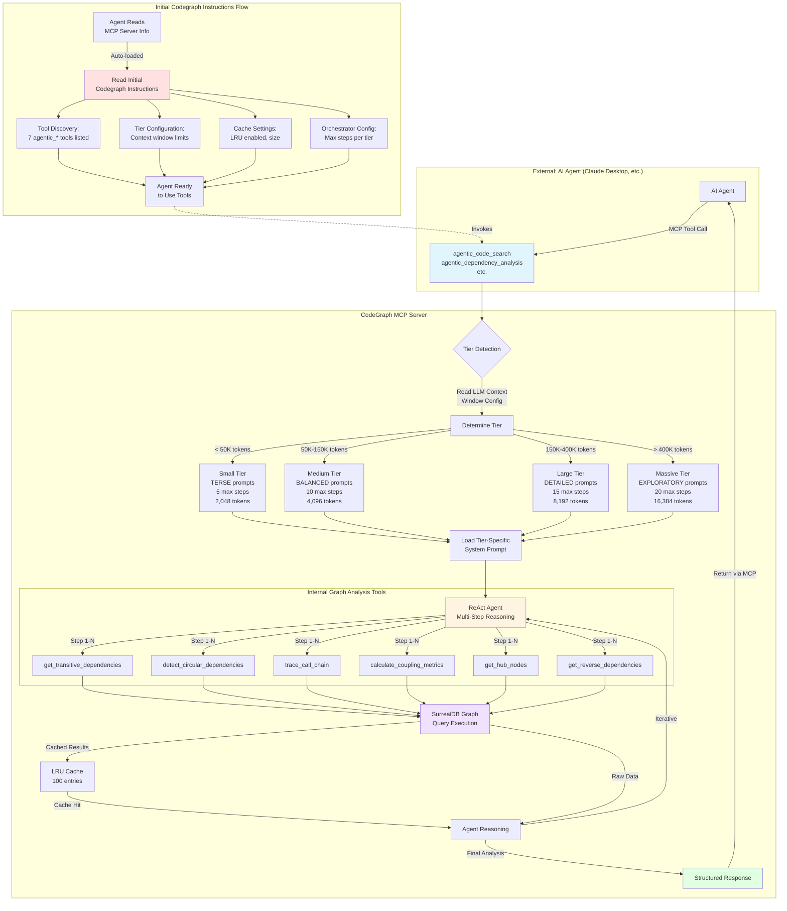

# CodeGraph

**Use your entire codebase as semantically searchable context for you coding agents, indexes your whole project to a graph intelligently with ML-enhanced Node,Edge and Symbol discovery integrated with regular AST-parsing and exposes intelligent context through mcp-server and agentic context gathering tools.**

CodeGraph follows Anthropic's MCP best practices by providing rich, pre-computed context to AI agents, eliminating the need for agents to burn tokens gathering project information. Instead of async agents like Claude Code executing searches and building dependency graphs, CodeGraph's MCP server handles these operations efficiently and exposes them through standardized tools.

## Features

**Core Capabilities:**
- Semantic code search with vector embeddings (and optional reranking of text results)
- LLM-powered code intelligence and dependency analysis
- Automatic dependency graph construction and traversal
- Agentic code-agent tools with tier-aware multi-step reasoning
- Incremental indexing with change detection (only re-index modified files)
- Daemon mode for automatic file watching and re-indexing

**LLM Providers:**
- Anthropic Claude (Sonnet, Opus, Haiku - 4.5 model family)
- OpenAI (GPT-5.1, GPT-5.1-codex)
- Ollama (local models)
- LM Studio (OpenAI-compatible)
- xAI Grok (Grok-4.1-fast-reasoning for true codebase understanding 2M ctx!)
- Any OpenAI-compatible provider

### Responses API vs Chat Completions API

CodeGraph uses the modern **Responses API** by default for LM Studio and OpenAI-compatible providers. This API provides:
- Better support for reasoning models
- Improved token management
- Clearer request/response structure

**Backward Compatibility**: If your provider doesn't support Responses API, enable the legacy Chat Completions API:
```bash
export CODEGRAPH_USE_COMPLETIONS_API=true
```

Or in `~/.codegraph/config.toml`:
```toml
[llm]
use_completions_api = true
```

**Note**: Ollama is NOT affected by this setting - it uses its native API.

**Embedding Providers:**
- **Any model** with supported dimensions: 384, 768, 1024, 1536, 2048, 2560, 3072, 4096
- Ollama (local models: qwen, jina, nomic, bge, e5, minilm, etc.)
- LM Studio (local models via OpenAI-compatible API)
- Jina AI (cloud API)
- OpenAI (cloud API)
- ONNX Runtime (local CPU/GPU inference)
- Set `CODEGRAPH_EMBEDDING_DIMENSION` to use any model
- Configure `CODEGRAPH_MAX_CHUNK_TOKENS` based on your model's context window

**Reranking Providers:**
- Jina AI (cloud API with jina-reranker-v3)
- Ollama (local chat models: Qwen3-Reranker, etc.)

**Vector Database:**
- SurrealDB HNSW index (2-5ms query latency)
- Supports 384, 768, 1024, 1536, 2048, 2560, 3072, 4096 dimensions
- Cloud-native or local deployment

**MCP Integration:**
- Stdio transport (production-ready)
- Streamable HTTP transport with SSE (experimental)
- Compatible with Claude Code, Gemini, Claude Desktop, Cursor etc. (Haven't tested with Codex due to it's extreme sandbox)

---

## Quick Start

### 1. Configure Embedding Provider

CodeGraph writes embeddings directly into SurrealDB's dimension-specific HNSW columns. Choose your provider:

**Option 1: Ollama (any model)**
```bash
export CODEGRAPH_EMBEDDING_PROVIDER=ollama
export CODEGRAPH_EMBEDDING_MODEL=qwen3-embedding:0.6b   # Use ANY Ollama embedding model
export CODEGRAPH_EMBEDDING_DIMENSION=1024               # Match your model's output: 384, 768, 1024, 1536, 2048, 2560, 3072, or 4096
export CODEGRAPH_MAX_CHUNK_TOKENS=2048                  # Match your model's context window
```

**Option 2: LM Studio (any OpenAI-compatible model)**
```bash
export CODEGRAPH_EMBEDDING_PROVIDER=lmstudio
export CODEGRAPH_LMSTUDIO_MODEL=jina-embeddings-v3      # Use ANY model loaded in LM Studio
export CODEGRAPH_EMBEDDING_DIMENSION=1024               # Match your model's output dimension
export CODEGRAPH_MAX_CHUNK_TOKENS=2048                  # Match your model's context window
export CODEGRAPH_LMSTUDIO_URL=http://localhost:1234     # Default LM Studio endpoint (the /v1 path is appended automatically)
```

We automatically route embeddings to `embedding_384`, `embedding_768`, `embedding_1024`, `embedding_2048`, `embedding_2560`, or `embedding_4096` columns based on your model's dimension.

### 2. Reranking (Optional)

CodeGraph supports **text-based reranking** to improve search result quality using cross-encoder models:

**How Reranking Works:**
1. Fast semantic search retrieves initial candidates (HNSW vector search)
2. Reranker scores query-document pairs using **text content** (not embeddings)
3. Results re-ranked by relevance score for higher precision

**Option 1: Jina AI Reranking** (Cloud API)
- Uses jina-reranker-v3 cross-encoder model
- Highest quality, purpose-built for reranking
- Requires Jina API key

```bash
export CODEGRAPH_RERANK_PROVIDER=jina
export JINA_API_KEY=jina_...
```

Or in `~/.codegraph/config.toml`:
```toml
[rerank]
provider = "jina"
top_n = 10  # Number of results after reranking

[rerank.jina]
model = "jina-reranker-v3"
api_key_env = "JINA_API_KEY"
```

**Option 2: Ollama Reranking** (Local, Free)
- Uses chat models for relevance scoring (e.g., Qwen3-Reranker)
- Runs locally via Ollama
- No API key required

```bash
# Pull the model first
ollama pull dengcao/Qwen3-Reranker-4B:Q5_K_M

# Configure CodeGraph
export CODEGRAPH_RERANK_PROVIDER=ollama
export CODEGRAPH_OLLAMA_RERANK_MODEL="dengcao/Qwen3-Reranker-4B:Q5_K_M"
```

Or in `~/.codegraph/config.toml`:
```toml
[rerank]
provider = "ollama"
top_n = 10

[rerank.ollama]
model = "dengcao/Qwen3-Reranker-4B:Q5_K_M"
api_base = "http://localhost:11434"
```

**Performance Notes:**
- Jina reranking: 80-200ms per query (cloud API)
- Ollama reranking: Varies by model (local inference)
- Both significantly improve result precision over vector search alone

---

## ⚠️ Important: MCP Server Architecture Change

**FAISS+RocksDB support in MCP server is deprecated** in favor of SurrealDB-based architecture.

### What Changed:
- ❌ **MCP server** no longer uses FAISS vector search or RocksDB graph storage
- ❌ **CLI and SDK** no longer support FAISS/RocksDB for local operations
- 🆕 **MCP code-agent tools** now require SurrealDB for graph analysis

### Required Setup for Code-Agent Tools:

The new agentic MCP tools (`agentic_code_search`, `agentic_dependency_analysis`, etc.) require SurrealDB:

**Option 1: Free Cloud Instance (Recommended)**
- Sign up at [Surreal Cloud](https://surrealdb.com/cloud)
- **Get 1GB FREE instance** - perfect for testing and small projects
- Configure connection details in environment variables

**Option 2: Local Installation**
```bash
# Install SurrealDB
curl -sSf https://install.surrealdb.com | sh

# Run locally
surreal start --bind 127.0.0.1:3004 --user root --pass root memory
```

**Free Cloud Resources:**
- 🆓 **SurrealDB Cloud**: 1GB free instance at [surrealdb.com/cloud](https://surrealdb.com/cloud)
- 🆓 **Jina AI**: 10 million free API tokens at [jina.ai](https://jina.ai) for embeddings and reranking

### Why This Change:
- **Native graph capabilities**: SurrealDB provides built-in graph database features
- **Unified storage**: Single database for both vectors and graph relationships and extendable to relational and document use-cases!
- **Cloud-native**: Better support for distributed deployments
- **Reduced complexity**: Eliminates custom RocksDB integration layer

**See [CHANGELOG.md](CHANGELOG.md) for detailed migration guide.**

---

## 🔬 Experimental: AutoAgents Framework

CodeGraph now supports the **AutoAgents framework** for agentic orchestration as an experimental feature.

### What is AutoAgents?
- Modern Rust-based agent framework with ReAct (Reasoning + Acting) pattern
- Replaces ~1,200 lines of custom orchestration code
- Maintains compatibility with all 7 existing agentic MCP tools
- Same tier-aware prompting system (Small/Medium/Large/Massive)

### Enabling AutoAgents

**Build with experimental feature:**
```bash
# Using Makefile
make build-mcp-autoagents

# Or directly with cargo
cargo build --release -p codegraph-mcp --features "ai-enhanced,autoagents-experimental,ollama"

# HTTP server with AutoAgents
cargo build --release -p codegraph-mcp --features "ai-enhanced,autoagents-experimental,embeddings-ollama,server-http"
```

**Without AutoAgents (default):**
```bash
cargo build --release -p codegraph-mcp --features "ai-enhanced,ollama"
```

### Status
- ✅ Core implementation complete
- ⏳ Testing and validation in progress
- 📝 Feedback welcome via GitHub issues
- 🔄 Legacy orchestrator remains as stable fallback

The experimental feature is opt-in via build flag and does not affect existing functionality when disabled.

---

## 📋 Table of Contents

- [Choose Your Setup](#choose-your-setup)
- [Installation](#installation)
- [Configuration](#configuration)
- [Usage](#usage)
- [Feature Flags Reference](#feature-flags-reference)
- [Performance](#performance)
- [Troubleshooting](#troubleshooting)
- [Advanced Features](#advanced-features)

---

## 🎯 Choose Your Setup

Pick the setup that matches your needs:

### Option 1: Local Setup (Free, Private) 🏠

**Best for:** Privacy-conscious users, offline work, no API costs

**Providers:**
- **Embeddings:** ONNX or Ollama
- **LLM:** Ollama (Qwen2.5-Coder, CodeLlama, etc.)

**Pros:** ✅ Free, ✅ Private, ✅ No internet required after setup
**Cons:** ❌ Slower, ❌ Requires local GPU/CPU resources

[→ Jump to Local Setup Instructions](#local-setup-onnx--ollama)

---

### Option 2: LM Studio (Best Performance on Mac) 🚀

**Best for:** Mac users (Apple Silicon), best local performance

**Providers:**
- **Embeddings:** LM Studio (Jina embeddings)
- **LLM:** LM Studio (DeepSeek Coder, etc.)

**Pros:** ✅ 120 embeddings/sec, ✅ MLX + Flash Attention 2, ✅ Free
**Cons:** ❌ Mac only, ❌ Requires LM Studio app

[→ Jump to LM Studio Setup Instructions](#lm-studio-setup)

---

### Option 3: Cloud Providers (Best Quality) ☁️

**Best for:** Production use, best quality, don't want to manage local models

**Providers:**
- **Embeddings:** Jina (You get 10 million tokens for free when you just create an account!)
- **LLM:** Anthropic Claude or OpenAI GPT-5.1-*
- **Backend**: SurrealDB graph database (You get a free cloud instance up-to 1gb! Or run it completely locally!)

**Pros:** ✅ Best quality, ✅ Fast, ✅ 1M context (sonnet[1m])
**Cons:** ❌ API costs, ❌ Requires internet, ❌ Data sent to cloud

[→ Jump to Cloud Setup Instructions](#cloud-setup-anthropic--openai)

---

### Option 4: Hybrid (Mix & Match) 🔀

**Best for:** Balancing cost and quality

**Example combinations:**
- Local embeddings (ONNX) + Cloud LLM (OpenAI, Claude, x.ai)
- LMStudio embeddings + Cloud LLM (OpenAI, Claude, x.ai)
- Jina AI embeddings + Local LLM (Ollama, LMStudio)

[→ Jump to Hybrid Setup Instructions](#hybrid-setup)

---

## 🛠️ Installation

### Prerequisites (All Setups)

```bash
# 1. Install Rust
curl --proto '=https' --tlsv1.2 -sSf https://sh.rustup.rs | sh
```

---

### Local Setup (ONNX + Ollama)

**Step 1: Install Ollama**
```bash
# macOS/Linux:
curl -fsSL https://ollama.com/install.sh | sh

# Or download from: https://ollama.com/download

brew install onnx-runtime
```

**Step 2: Pull models**
```bash
# Pull embedding model
hf (cli) download qdrant/all-minillm-onnx

# Pull LLM for code intelligence (optional)
ollama pull qwen2.5-coder:14b
```

**Step 3: Build CodeGraph**
```bash
cd codegraph-rust

# Build with ONNX embeddings and Ollama support
cargo build --release --features "onnx,ollama"
```

**Step 4: Configure**

Create `~/.codegraph/config.toml`:
```toml
[embedding]
provider = "onnx"  # or "ollama" if you prefer
model = "qdrant/all-minillm-onnx"
dimension = 384

[llm]
enabled = true
provider = "ollama"
model = "qwen2.5-coder:14b"
ollama_url = "http://localhost:11434"
```

**Step 5: Index and run**
```bash
# Index your project
./target/release/codegraph index /path/to/your/project

# Start MCP server
./target/release/codegraph start stdio
```

✅ **Done!** Your local setup is ready.

---

### LM Studio Setup

**Step 1: Install LM Studio**
- Download from [lmstudio.ai](https://lmstudio.ai/)
- Install and launch the app

**Step 2: Download models in LM Studio**
- **Embedding model:** `jinaai/jina-embeddings-v4`
- **LLM model (optional):** `lmstudio-community/DeepSeek-Coder-V2-Lite-Instruct-GGUF`

**Step 3: Start LM Studio server**
- In LM Studio, go to "Local Server" tab
- Click "Start Server" (runs on `http://localhost:1234`)

**Step 4: Build CodeGraph**
```bash
cd codegraph-rust

# Build MCP server with LM Studio support (recommended)
make build-mcp-autoagents

# Or build manually with feature flags
cargo build --release -p codegraph-mcp --features "ai-enhanced,autoagents-experimental,embeddings-lmstudio,codegraph-ai/openai-compatible"
```

**Step 5: Configure**

**Option A: Config file (recommended)**

Create `~/.codegraph/config.toml`:
```toml
[embedding]
provider = "lmstudio"
model = "jinaai/jina-embeddings-v4"
lmstudio_url = "http://localhost:1234"
dimension = 2048

[llm]
enabled = true
provider = "lmstudio"
model = "lmstudio-community/DeepSeek-Coder-V2-Lite-Instruct-GGUF"
lmstudio_url = "http://localhost:1234"
# use_completions_api = true  # Uncomment if your LM Studio version doesn't support Responses API
```

**Note**: LM Studio now uses the modern **Responses API** by default. If you're using an older version of LM Studio that doesn't support it, add `use_completions_api = true` to the `[llm]` section.

**Option B: Environment variables**
```bash
export CODEGRAPH_EMBEDDING_PROVIDER=lmstudio
export CODEGRAPH_LMSTUDIO_MODEL=jinaai/jina-embeddings-v4
export CODEGRAPH_LMSTUDIO_URL=http://localhost:1234
export CODEGRAPH_EMBEDDING_DIMENSION=2048
```

**Step 6: Index and run**
```bash
# Index your project
./target/release/codegraph index /path/to/your/project

# Start MCP server
./target/release/codegraph start stdio
```

✅ **Done!** LM Studio setup complete.

---

### Cloud Setup (Anthropic, OpenAI, xAI & Jina AI)

**Step 1: Get API keys**
- Anthropic: [console.anthropic.com](https://console.anthropic.com/)(Claude 4.5 models 1M/200k ctx)
- OpenAI: [platform.openai.com](https://platform.openai.com/)(GPT-5 models 400k/200k ctx)
- xAI: [x.ai](https://x.ai/) (grok-4-1-fast-reasoning with 2M ctx, $0.50-$1.50/M tokens)
- Jina AI: [jina.ai](https://jina.ai/) (for SOTA embeddings & reranking)
- SurrealDB [https://www.surrealdb.com] (for graph dabase backend local or cloud based setup)

**Step 2: Build CodeGraph with cloud features**
```bash
cd codegraph-rust

# Build with all cloud providers
cargo build --release --features "anthropic,openai-llm,openai"

# Or with Jina AI cloud embeddings
cargo build --release --features "cloud-jina,anthropic"

# Or with SurrealDB HNSW cloud/local vector backend
cargo build --release --features "cloud-surrealdb,openai"
```

**Step 3: Run setup wizard (easiest)**
```bash
./target/release/codegraph-setup
```

The wizard will guide you through configuration.

**Or manually configure** `~/.codegraph/config.toml`:

**For Anthropic Claude:**
```toml
[embedding]
provider = "jina" # or openai
model = "jina-embeddings-v4"
openai_api_key = "sk-..."  # or set OPENAI_API_KEY env var
dimension = 2048

[llm]
enabled = true
provider = "anthropic"
model = "claude-haiku"
anthropic_api_key = "sk-ant-..."  # or set ANTHROPIC_API_KEY env var
context_window = 200000
```

**For OpenAI (with reasoning models):**
```toml
[embedding]
provider = "jina" # or openai
model = "jina-embeddings-v4"
openai_api_key = "sk-..."
dimension = 2048

[llm]
enabled = true
provider = "openai"
model = "gpt-5-codex-mini"
context_window=200000
openai_api_key = "sk-..."
max_completion_token = 128000
reasoning_effort = "medium"  # reasoning models: "minimal", "medium", "high"
# use_completions_api = true  # Uncomment if your provider doesn't support Responses API
```

**Note**: OpenAI-compatible providers now use the modern **Responses API** by default. Most providers support this (99%+), but if you encounter errors, add `use_completions_api = true` to the `[llm]` section.

**For Jina AI (cloud embeddings + reranking):**
```toml
[embedding]
provider = "jina"
model = "jina-embeddings-v4"
jina_api_key = "jina_..."  # or set JINA_API_KEY env var
dimension = 2048 # or matryoshka 1024,512,256 adjust the schemas/*.surql file HNSW vector index to match your embedding model dimensions

[rerank]
provider = "jina"  # Optional two-stage retrieval
top_n = 10

[rerank.jina]
model = "jina-reranker-v3"
api_key_env = "JINA_API_KEY"

[llm]
enabled = true
provider = "anthropic"
model = "claude-haiku"
context_window = 200000
max_completion_tokens= 25000
anthropic_api_key = "sk-ant-..."
```

**For xAI Grok (2M context window, $0.50-$1.50/M tokens):**
```toml
[embedding]
provider = "openai"  # or "jina"
model = "text-embedding-3-small"
openai_api_key = "sk-..."
dimension = 1536

[llm]
enabled = true
provider = "xai"
model = "grok-4-1-fast-reasoning"  # or "grok-4-turbo"
xai_api_key = "xai-..."  # or set XAI_API_KEY env var
xai_base_url = "https://api.x.ai/v1"  # default, can be omitted
reasoning_effort = "medium"  # Options: "minimal", "medium", "high"
context_window = 2000000  # 2M tokens!
# use_completions_api = true  # Uncomment if your xAI version doesn't support Responses API
```

**Note**: xAI uses the modern **Responses API** by default. Current xAI versions support this API, but if you encounter compatibility issues, add `use_completions_api = true` to the `[llm]` section.

**For SurrealDB HNSW (graph database backend with advanced features):**
```toml
[embedding]
provider = "jina"  # or "openai"
model = "jina-embeddings-v4"
openai_api_key = "sk-..."
dimension = 2048

[vector_store]
backend = "surrealdb"
surrealdb_url = "ws://localhost:8000"  # or cloud instance
surrealdb_namespace = "codegraph"
surrealdb_database = "production"

[llm]
enabled = true
provider = "anthropic"
model = "claude-haiku"
```

**Step 4: Index and run**
```bash
# Index your project
./target/release/codegraph index /path/to/your/project

# Start MCP server
./target/release/codegraph start stdio
```

✅ **Done!** Cloud setup complete.

---

### Hybrid Setup

Mix local and cloud providers to balance cost and quality:

**Example: Local embeddings + Cloud LLM**
```toml
[embedding]
provider = "onnx"  # Free, local
model = "sentence-transformers/all-MiniLM-L6-v2"
dimension = 384

[llm]
enabled = true
provider = "anthropic"  # Best quality for analysis
model = "sonnet[1m]"
context_window = 1000000
anthropic_api_key = "sk-ant-..."
```

Build with required features:
```bash
cargo build --release --features "onnx,anthropic"
```

---

## ⚙️ Configuration

### Quick Configuration

**Use the interactive wizard:**
```bash
cargo build --release --bin codegraph-setup --features all-cloud-providers
./target/release/codegraph-setup
```

### Manual Configuration

**Configuration directory: `~/.codegraph/`**

All configuration files are stored in `~/.codegraph/` in TOML format.

Configuration is loaded from (in order):
1. `~/.codegraph/default.toml` (base configuration)
2. `~/.codegraph/{environment}.toml` (e.g., development.toml, production.toml)
3. `~/.codegraph/local.toml` (local overrides, machine-specific)
4. `./config/` (fallback for backward compatibility)
5. Environment variables (CODEGRAPH__* prefix)

**See [Configuration Guide](docs/CONFIGURATION_GUIDE.md) for complete documentation.**

**Full configuration example:**
```toml
[embedding]
provider = "lmstudio"  # or "onnx", "ollama", "openai"
model = "jinaai/jina-embeddings-v4"
dimension = 2048
batch_size = 64

[llm]
enabled = true
provider = "anthropic"  # or "openai", "ollama", "lmstudio" or "xai"
model = "haiku"
anthropic_api_key = "sk-ant-..."
context_window = 200000
temperature = 0.1
max_completion_token = 25000

[performance]
num_threads = 0  # 0 = auto-detect
cache_size_mb = 512
max_concurrent_requests = 4

[logging]
level = "warn"  # trace, debug, info, warn, error
format = "pretty"  # pretty, json, compact
```

**See [`.codegraph.toml.example`](.codegraph.toml.example) for all options.**

---

## 🚀 Usage

### Basic Commands

```bash
# Index a project
codegraph index -r /path/to/project

# Start MCP server (for Claude Desktop, LM Studio, etc.)
codegraph start stdio

# List available MCP tools
codegraph tools list
```

### Daemon Mode (Automatic Re-Indexing)

Keep your index up-to-date automatically by running the daemon:

```bash
# Start watching a project (runs in background)
codegraph daemon start /path/to/project

# Start in foreground for debugging
codegraph daemon start /path/to/project --foreground

# Filter by languages
codegraph daemon start /path/to/project --languages rust,typescript

# Exclude patterns
codegraph daemon start /path/to/project --exclude "**/node_modules/**" --exclude "**/target/**"

# Check daemon status
codegraph daemon status /path/to/project
codegraph daemon status /path/to/project --json  # JSON output

# Stop the daemon
codegraph daemon stop /path/to/project
```

**Features:**
- 🔄 Automatic re-indexing when files change (create, modify, delete, rename)
- ⚡ Event coalescing to batch rapid changes
- 🛡️ Circuit breaker pattern for SurrealDB resilience
- 📊 Session metrics tracking (batches processed, errors, etc.)

**Note:** Requires the `daemon` feature flag:
```bash
cargo build --release -p codegraph-mcp --features "daemon,ai-enhanced"
```

### MCP Server with Auto-Watching (`--watch`)

Start the MCP server with automatic file watching - the daemon runs in the background:

```bash
# Start MCP server with file watching
codegraph start stdio --watch

# Watch a specific directory
codegraph start stdio --watch --watch-path /path/to/project

# Disable watching even if enabled in config
codegraph start stdio --no-watch

# Via environment variable
CODEGRAPH_DAEMON_AUTO_START=true codegraph start stdio
```

**Configuration in `~/.codegraph/config.toml`:**
```toml
[daemon]
auto_start_with_mcp = true  # Auto-start daemon when MCP server starts
debounce_ms = 30
batch_timeout_ms = 200
exclude_patterns = ["**/node_modules/**", "**/target/**"]
```

**Note:** HTTP transport is not yet implemented with the official rmcp SDK. Use STDIO transport for all MCP integrations.

### Using with Claude Desktop

Add to your Claude Desktop config (`~/Library/Application Support/Claude/claude_desktop_config.json` on Mac):

```json
{
  "mcpServers": {
    "codegraph": {
      "command": "/path/to/codegraph",
      "args": ["start", "stdio"],
      "env": {
        "RUST_LOG": "warn"
      }
    }
  }
}
```

### Using with LM Studio

1. Start CodeGraph MCP server: `codegraph start stdio`
2. In LM Studio, enable MCP support in settings
3. CodeGraph tools will appear in LM Studio's tool palette

---

### HTTP Server Mode (Experimental)

For web integrations and multi-client scenarios:

```bash
# Build with HTTP support
make build-mcp-http

# Start server
./target/release/codegraph start http

# Test endpoints
curl http://127.0.0.1:3000/health
curl -X POST http://127.0.0.1:3000/mcp \
  -H "Content-Type: application/json" \
  -d '{"jsonrpc":"2.0","id":1,"method":"initialize","params":{"protocolVersion":"2025-06-18","capabilities":{},"clientInfo":{"name":"test","version":"1.0"}}}'
```

**Features:**
- ✅ Session-based stateful connections
- ✅ SSE streaming for real-time progress
- ✅ Automatic session management
- ✅ Reconnection support with Last-Event-Id

**Use Cases:**
- Web-based code analysis dashboards
- Multi-client collaborative environments
- API integrations
- Development/debugging (easier to inspect than STDIO)

**Note:** For production use with Claude Desktop, use STDIO mode.

---

## 📚 For AI Agents: Using CodeGraph MCP

CodeGraph provides powerful code intelligence tools via the Model Context Protocol (MCP).

### Available MCP Tools

After indexing your codebase, AI agents can use these agentic workflows (requires SurrealDB-backed graphs):

- 🔍 **`agentic_code_search`** - Autonomous semantic exploration for finding and understanding code
- 📊 **`agentic_dependency_analysis`** - Impact and coupling analysis across forward and reverse dependencies
- 🔗 **`agentic_call_chain_analysis`** - Execution path tracing through controllers, services, and downstream systems
- 🏗️ **`agentic_architecture_analysis`** - Architectural pattern assessment plus layer and cohesion breakdowns
- 🌐 **`agentic_api_surface_analysis`** - Public API surface analysis with consumer mapping and change risk detection
- 📦 **`agentic_context_builder`** - Comprehensive context gathering ahead of implementing or modifying features
- ❓ **`agentic_semantic_question`** - Deep semantic Q&A that synthesizes answers across multiple subsystems

These multi-step workflows typically take 30–90 seconds to complete because they traverse the code graph and build detailed reasoning summaries.

**Project scoping:** MCP tool calls and SurrealDB functions are project-isolated. The server picks `CODEGRAPH_PROJECT_ID` (falls back to your current working directory); use a distinct value per workspace when sharing one Surreal instance, or you’ll blend graph results across projects. If you update the schema, re-apply `schema/codegraph.surql` so the project-aware functions are available.

### Quick Start

```bash
# 1. Index your codebase
codegraph index /path/to/your/project

# 2. Start MCP server
codegraph start stdio

# 3. Use tools from your AI agent
agentic_code_search("how does authentication work?")
agentic_dependency_analysis("what depends on AuthService?")
```

### Agentic Workflow Architecture

The following diagram shows how CodeGraph's agentic MCP tools work internally:



**Key Components:**

1. **Tier Detection**: Automatically adapts prompt complexity based on LLM's context window
   - Small (<50K): Fast, terse responses for limited context models f.ex. local gemma3 etc.
   - Medium (50K-150K): Balanced analysis for Claude Haiku, gpt-5.1-codex-mini
   - Large (150K-400K): Detailed exploration for Sonnet, Opus, gpt-5.1, qwen3:4b
   - Massive (>400K): Comprehensive deep-dives for grok-4-1-fast-reasoning, gemini-3.0-pro, Sonnet[1m]

2. **Multi-Step Reasoning**: ReAct pattern with tier-specific limits
   - Each step can call internal graph analysis tools
   - LRU cache prevents redundant SurrealDB queries
   - Iterative refinement until analysis complete

3. **Internal Tools**: 6 graph analysis primitives
   - Zero heuristics—LLM infers from structured data only
   - Results cached transparently (100 entries default)
   - Tool call logging for debugging

4. **Initial Instructions**: Auto-loaded when MCP server connects
   - The in-built Agent discovers available tools and their capabilities
   - Learns tier configuration and limits
   - Understands caching and orchestration settings
   - Understands the context of the graphDB and it's structure. 

5. **No parameters needed**: External client using the mcp-servers agentic tools only need to pass semantic queries for minimal cognitive load
   - Server uses mcp-protocols instructions feature to broadcast the capabilities of the server automatically to clients that support it

---

## 📊 Feature Flags Reference

CodeGraph uses feature flags to enable only the components you need. Build with the features that match your deployment.

### Core Features

| Feature | Description | Use Case |
|---------|-------------|----------|
| `ai-enhanced` | Agentic MCP tools | Enables 7 agentic workflows with multi-step reasoning |
| `server-http` | HTTP/SSE transport | Experimental HTTP server (use STDIO for production) |
| `autoagents-experimental` | AutoAgents framework | ReAct orchestration (experimental, replaces custom orchestrator) |

### Embedding Providers

**Dimension-Based Model Support:**

CodeGraph supports **any embedding model** that outputs one of these dimensions:
- **384, 768, 1024, 1536, 2048, 2560, 3072, 4096**

Set the dimension explicitly to use any model:
```bash
export CODEGRAPH_EMBEDDING_DIMENSION=2048   # Match your model's output dimension
export CODEGRAPH_MAX_CHUNK_TOKENS=2048      # Match your model's context window
```

| Feature | Provider | Notes |
|---------|----------|-------|
| `embeddings-local` | ONNX Runtime | Local CPU/GPU inference. Any ONNX model with supported dimensions. |
| `embeddings-ollama` | Ollama | Any Ollama embedding model (qwen, jina, nomic, bge, e5, minilm, etc.) |
| `lmstudio` | LM Studio | Any model via OpenAI-compatible API. Auto-detects dimensions from common models. |
| `embeddings-openai` | OpenAI | Cloud API. Supports text-embedding-3-small (1536) and text-embedding-3-large (3072). |
| `embeddings-jina` | Jina AI | Cloud API. Supports jina-embeddings-v3 (1024) and jina-embeddings-v4 (2048). Use `CODEGRAPH_RERANK_PROVIDER=jina` for reranking. |

**Configuration Priority:**
1. `CODEGRAPH_EMBEDDING_DIMENSION` environment variable (recommended)
2. Model inference from name (fallback, limited to known models)

**Chunk Size Configuration:**
- `CODEGRAPH_MAX_CHUNK_TOKENS` controls how text is split before embedding
- Set this based on your embedding model's maximum context window
- Examples: 512 for small models, 2048 for medium, 8192 for large context models

### LLM Providers (for Agentic Tools)

| Feature | Provider | Models/Notes |
|---------|----------|--------------|
| `anthropic` | Anthropic Claude | Claude Sonnet 4.5, Haiku 4.5, Opus 4.5 |
| `openai-llm` | OpenAI | gpt-5.1, gpt-5.1-codex, gpt-5.1-codex-mini |
| `openai-compatible` | LM Studio, xAI, Ollama, custom | OpenAI-compatible APIs (grok-4-1-fast-reasoning xai, kimi-k2-thinking openrouter local models) |

### Convenience Bundles

| Feature | Includes | Use Case |
|---------|----------|----------|
| `cloud` | `embeddings-jina` + SurrealDB | Jina embeddings + cloud graph database |
| `all-cloud-providers` | `anthropic` + `openai-llm` + `openai-compatible` | All LLM providers for agentic tools |

### Common Build Commands

```bash
# Local only (ONNX + Ollama)
cargo build --release --features "onnx,ollama"

# LM Studio
cargo build --release --features "openai-compatible"

# Cloud only (Anthropic + OpenAI)
cargo build --release --features "anthropic,openai-llm,openai"

# Jina AI cloud embeddings + local surrealDB
cargo build --release --features "cloud-jina"

# SurrealDB cloud vector backend
cargo build --release --features "cloud-surrealdb,openai"

# Full cloud (Jina + SurrealDB + Anthropic)
cargo build --release --features "cloud,anthropic"

# Everything (local + cloud)
cargo build --release --features "all-cloud-providers,onnx,ollama,cloud"

# HTTP server with AutoAgents (experimental)
cargo build --release -p codegraph-mcp --features "ai-enhanced,autoagents-experimental,embeddings-ollama,server-http"
```

---

## ⚡ Performance

### Speed Metrics (Apple Silicon + LM Studio)

| Operation | Performance | Notes |
|-----------|------------|-------|
| **Embedding generation** | 120 embeddings/sec | LM Studio with MLX |
| **Vector search (local)** | 2-5ms latency | SurrealDB HNSW |
| **Vector search (cloud)** | 2-5ms latency | SurrealDB HNSW |
| **Jina AI embeddings** | 50-150ms per query | Cloud API call overhead |
| **Jina reranking** | 80-200ms for top-K | Two-stage retrieval |
| **Ollama embeddings** | ~1024 embeddings/30sec | all-minillm:latest (Ollama) |

### Optimizations (Enabled by Default)

| Optimization | Speedup | Memory Cost |
|-------------|---------|-------------|
| Embedding cache | 10-100× | ~90 MB |
| Query cache | 100× | ~10 MB |
| Parallel search | 2-3× | Minimal |

---

## 🔧 Troubleshooting

### Runtime Issues

**"API key not found"**
- Set environment variable: `export ANTHROPIC_API_KEY="sk-ant-..."`
- Or add to config file: `anthropic_api_key = "sk-ant-..."`

**"Model not found"**
- For Ollama: Run `ollama pull <model-name>` first
- For LM Studio: Download the model in LM Studio app
- For cloud: Check your model name matches available models

**"Connection refused"**
- LM Studio: Make sure the local server is running
- Ollama: Check Ollama is running with `ollama list`
- Cloud: Check your internet connection

### Getting Help

1. Check [docs/CLOUD_PROVIDERS.md](docs/CLOUD_PROVIDERS.md) for detailed provider setup
2. See [LMSTUDIO_SETUP.md](LMSTUDIO_SETUP.md) for LM Studio specifics
3. Open an issue on GitHub with your error message

---

## 🤝 Contributing

We welcome contributions!

```bash
# Format code
cargo fmt --all

# Run linter
cargo clippy --workspace --all-targets

# Run tests
cargo test --workspace
```

Open an issue to discuss large changes before starting.

---

## 📄 License

Dual-licensed under MIT and Apache 2.0. See `LICENSE-MIT` and `LICENSE-APACHE` for details.

---

## 📚 Learn More

- **[Cloud Providers Guide](docs/CLOUD_PROVIDERS.md)** - Detailed cloud provider setup
- **[Configuration Reference](config/.codegraph.toml.example)** - All configuration options
- **[Changelog](CHANGELOG.md)** - Version history and release notes
- **[Legacy Docs](docs/legacy/)** - Historical experiments and architecture notes
