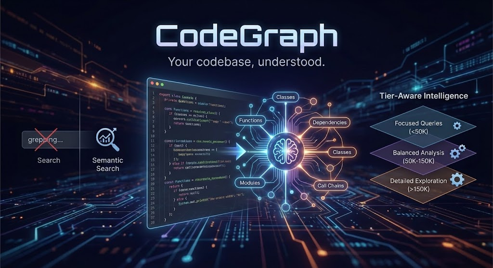
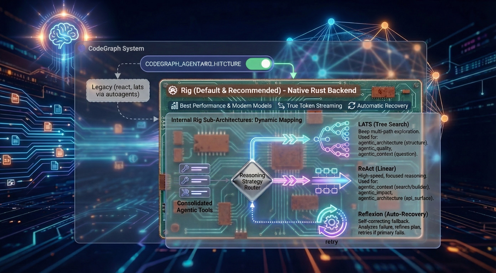
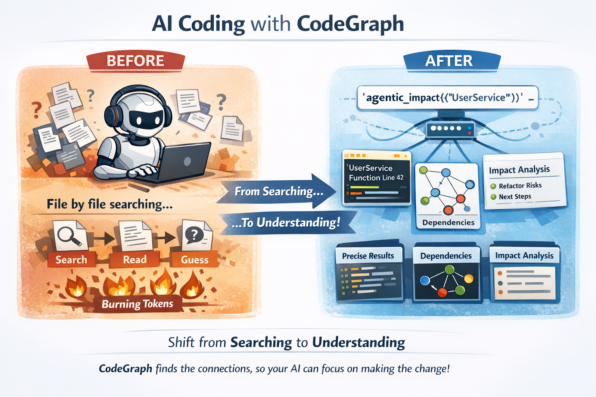
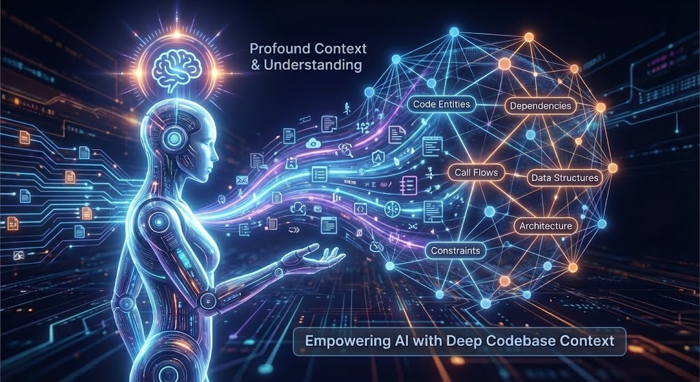

# CodeGraph

**Your codebase, understood.**

CodeGraph transforms your entire codebase into a semantically searchable knowledge graph that AI agents can actually *reason* about—not just grep through.

> **Ready to get started?** Jump to the [Installation Guide](docs/INSTALLATION_GUIDE.md) for step-by-step setup instructions.
>
> **Already set up?** See the [Usage Guide](docs/USAGE_GUIDE.md) for tips on getting the most out of CodeGraph with your AI assistant.

---

## The Problem

AI coding assistants are powerful, but they're flying blind. They see files one at a time, grep for patterns, and burn tokens trying to understand your architecture. Every conversation starts from zero.

**What if your AI assistant already knew your codebase?**

---

## What CodeGraph Does Differently

### 1. Graph + Embeddings = True Understanding

Most semantic search tools create embeddings and call it a day. CodeGraph builds a **real knowledge graph**:

```
Your Code → Build Context → AST + FastML → LSP Resolution → Enrichment → Graph + Embeddings
              ↓               ↓              ↓              ↓              ↓         ↓
          Packages        Nodes/edges    Type-aware     API surface      Graph    Semantic
          Features        Fast patterns  linking        Module graph   traversal   search
          Targets         Spans          Definitions    Dataflow/Docs             (hybrid)
```

When you search, you don't just get "similar code"—you get code with its **relationships intact**. The function that matches your query, plus what calls it, what it depends on, and where it fits in the architecture.

Indexing enrichment adds:
- Module nodes and module-level import/containment edges for cross-file navigation
- Rust-local dataflow edges (`defines`, `uses`, `flows_to`, `returns`, `mutates`) for impact analysis
- Document/spec nodes linked to backticked symbols in `README.md`, `docs/**/*.md`, and `schema/**/*.surql`
- Architecture signals (package cycles + optional boundary violations)

#### Indexing tiers (speed vs richness)

Indexing is tiered so you can choose between speed/storage and graph richness. The default is **fast**.

| Tier | What it enables | Typical use |
|------|-----------------|-------------|
| `fast` | AST nodes + core edges only (no LSP or enrichment) | Quick indexing, low storage |
| `balanced` | LSP symbols + docs/enrichment + module linking | Good agentic results without full cost |
| `full` | All analyzers + LSP definitions + dataflow + architecture | Maximum accuracy/richness |

Configure the tier:
- CLI: `codegraph index --index-tier balanced`
- Env: `CODEGRAPH_INDEX_TIER=balanced`
- Config: `[indexing] tier = "balanced"`

#### Indexing prerequisites (LSP-enabled tiers)

When the tier enables LSP (`balanced`/`full`), indexing **fails fast** if required external tools are missing.

Required tools by language:
- Rust: `rust-analyzer`
- TypeScript/JavaScript: `node` and `typescript-language-server`
- Python: `node` and `pyright-langserver`
- Go: `gopls`
- Java: `jdtls`
- C/C++: `clangd`

If indexing appears to stall during LSP resolution, you can adjust the per-request timeout:

- `CODEGRAPH_LSP_REQUEST_TIMEOUT_SECS` (default `600`, minimum `5`)

If LSP resolution fails immediately and the error includes something like `Unknown binary 'rust-analyzer' in official toolchain ...`, your `rust-analyzer` is a rustup shim without an installed binary. Install a runnable `rust-analyzer` (e.g. via `brew install rust-analyzer` or by switching to a toolchain that provides it).

#### Optional architecture boundary rules

If you want CodeGraph to flag forbidden package dependencies, add `codegraph.boundaries.toml` at the project root:

```toml
[[deny]]
from = "your_crate"
to = "forbidden_crate"
reason = "explain the boundary"
```

Indexing will emit `violates_boundary` edges when a `depends_on` relationship matches a deny rule.

### 2. Agentic Tools, Not Just Search

CodeGraph doesn't return a list of files and wish you luck. It ships **4 consolidated agentic tools** that do the thinking:

| Tool | What It Actually Does |
|------|----------------------|
| `agentic_context` | Gathers the context you need—searches code, builds comprehensive context, answers semantic questions |
| `agentic_impact` | Maps change impact—dependency chains, call flows, what breaks if you touch something |
| `agentic_architecture` | The big picture—system structure, API surfaces, architectural patterns |
| `agentic_quality` | Risk assessment—complexity hotspots, coupling metrics, refactoring priorities |

Each tool accepts an optional `focus` parameter for precision when needed:

| Tool | Focus Values | Default Behavior |
|------|-------------|-----------------|
| `agentic_context` | `"search"`, `"builder"`, `"question"` | Auto-selects based on query |
| `agentic_impact` | `"dependencies"`, `"call_chain"` | Analyzes both |
| `agentic_architecture` | `"structure"`, `"api_surface"` | Provides both |
| `agentic_quality` | `"complexity"`, `"coupling"`, `"hotspots"` | Comprehensive assessment |

Each tool runs a **reasoning agent** that plans, searches, analyzes graph relationships, and synthesizes an answer. Not a search result—an *answer*.

> **[View Agent Context Gathering Flow](docs/architecture/agent-context-gathering-flow.html)** - Interactive diagram showing how agents use graph tools to gather context.


#### Agent Architectures

CodeGraph implements agents using **Rig** the default and recommended choice (legacy `react` and `lats` implemented with autoagents still work). Selectable at runtime via `CODEGRAPH_AGENT_ARCHITECTURE=rig`:

**Why Rig is Default:**
The Rig-based backend delivers the best performance with modern thinking and reasoning models. It is a native Rust implementation that supports internal sub-architectures and provides features like **True Token Streaming** and **Automatic Recovery**.

**Internal Rig Sub-Architectures:**
When using the `rig` backend, the system automatically maps the **consolidated agentic tools** to the most effective reasoning strategy:
- **LATS (Tree Search)**: Deep multi-path exploration for complex, non-linear tasks.
  - Automatically used for: `agentic_architecture` (structure), `agentic_quality`, and `agentic_context` (question).
- **ReAct (Linear)**: High-speed, focused reasoning for direct data lookups.
  - Automatically used for: `agentic_context` (search/builder), `agentic_impact`, and `agentic_architecture` (api_surface).
- **Reflexion (Auto-Recovery)**: A self-correcting fallback that kicks in automatically if the primary strategy fails to find an answer. It analyzes the failure and retries with a refined plan.

### Agent Bootstrap Context

Agents can start with lightweight project context so their first tool calls are not blind. Enable via env:

- `CODEGRAPH_ARCH_BOOTSTRAP=true` — includes a brief directory/structure bootstrap + contents of README.md and CLAUDE.md+AGENTS.md or GEMINI.md (if present) in the agent’s initial context.
- `CODEGRAPH_ARCH_PRIMER="<primer text>"` — optional custom primer injected into startup instructions (e.g., areas to focus on).

Why? Faster, more relevant early steps, fewer wasted graph/semantic queries, and better architecture answers on large repos.

Notes:
- Bootstrap is small (top directories summary), not a replacement for graph queries.
- Uses the same project selection as indexing (`CODEGRAPH_PROJECT_ID` or current working directory).

```bash
# Use Rig for best performance with thinking and reasoning models (recommended)
CODEGRAPH_AGENT_ARCHITECTURE=rig ./codegraph start stdio

# Use default ReAct for traditional instruction models
./codegraph start stdio

# Use LATS for complex analysis
CODEGRAPH_AGENT_ARCHITECTURE=lats ./codegraph start stdio
```

All architectures use the same 4 consolidated agentic tools (backed by 6 internal graph analysis tools) and tier-aware prompting—only the reasoning strategy differs.

### 3. Tier-Aware Intelligence

Here's something clever: CodeGraph automatically adjusts its behavior based on the LLM's context window that you configured for the codegraph agent.

Running a small local model? Get focused, efficient queries.

Using GPT-5.1 or Claude with 200K context? Get comprehensive, exploratory analysis.

Using grok-4-1-fast-reasoning with 2M context? Get detailed analysis with intelligent result management.

The Agent only uses the amount of steps that it requires to produce the answer so tool execution times vary based on the query and amount of data indexed in the database.

During development the agent used 3-6 steps on average to produce answers for test scenarios.

The Agent is stateless it only has conversational memory for the span of tool execution it does not accumulate context/memory over multiple chained tool calls this is already handled by your client of choice, it accumulates that context so codegraph needs to just provide answers.

| Your Model | CodeGraph's Behavior |
|------------|---------------------|
| < 50K tokens | Terse prompts, max 3 steps |
| 50K-150K | Balanced analysis, max 5 steps |
| 150K-500K | Detailed exploration, max 6 steps |
| > 500K (Grok, etc.) | Comprehensive analysis, max 8 steps |

**Hard cap:** Maximum 8 steps regardless of tier (10 with env override). This prevents runaway costs and context overflow while still allowing thorough analysis.

**Same tool, automatically optimized for your setup.**

### 4. Context Overflow Protection

CodeGraph includes multi-layer protection against context overflow—preventing expensive failures when tool results exceed your model's limits.

**Per-Tool Result Truncation:**
- Each tool result is limited based on your configured context window
- Large results (e.g., dependency trees with 1000+ nodes) are intelligently truncated
- Truncated results include `_truncated: true` metadata so the agent knows data was cut
- Array results keep the most relevant items that fit within limits

**Context Accumulation Guard:**
- Monitors total accumulated context across multi-step reasoning
- Fails fast with clear error message if accumulated tool results exceed safe threshold
- Threshold: 80% of context window × 4 (conservative estimate for token overhead)

**Configure via environment:**
```bash
# CRITICAL: Set this to match your agent's LLM context window
CODEGRAPH_CONTEXT_WINDOW=128000  # Default: 128K

# Per-tool result limit derived automatically: context_window × 2 bytes
# Accumulation limit derived automatically: context_window × 4 × 0.8 bytes
```

**Why this matters:** Without these guards, a single `agentic_impact` query on a large codebase could return 6M+ tokens—far exceeding most models' limits and causing expensive failures.

### 5. Hybrid Search That Actually Works

We don't pick sides in the "embeddings vs keywords" debate. CodeGraph combines:

- **70% vector similarity** (semantic understanding)
- **30% lexical search** (exact matches matter)
- **Graph traversal** (relationships and context)
- **Optional reranking** (cross-encoder precision)

The result? You find `handleUserAuth` when you search for "login logic"—but also when you search for "handleUserAuth".

---


## Why This Matters for AI Coding

When you connect CodeGraph to Claude Code, Cursor, or any MCP-compatible agent:

**Before:** Your AI reads files one by one, grepping around, burning tokens on context-gathering.

**After:** Your AI calls `agentic_impact({"query": "UserService"})` and instantly knows what breaks if you refactor it.

This isn't incremental improvement. It's the difference between an AI that *searches* your code and one that *understands* it.

### Why this is powerful for code agents

CodeGraph shifts the *cognitive load* (search + relevance + dependency reasoning) into CodeGraph’s agentic tools, so your code agent can spend its context budget on *making the change*, not *discovering what to change*.

#### What an agentic tool returns (example)

`agentic_impact` returns structured output (file paths, line numbers, and bounded snippets/highlights) plus analysis:

```json
{
  "analysis_type": "dependency_analysis",
  "query": "PromptSelector",
  "structured_output": {
    "analysis": "…what depends on PromptSelector and why…",
    "highlights": [
      { "file_path": "crates/codegraph-mcp-server/src/prompt_selector.rs", "line_number": 42, "snippet": "pub struct PromptSelector { … }" }
    ],
    "next_steps": ["…"]
  },
  "steps_taken": "5",
  "tool_use_count": 5
}
```

#### What a code agent would otherwise have to do

Without CodeGraph’s agentic tools, a code agent typically needs multiple “single-purpose” calls to reach the same confidence:
- search for the symbol (often multiple strategies: text + semantic + ripgrep-style search)
- open and read multiple files (definition + usages + callers + related modules)
- reconstruct dependency/call graphs mentally from partial evidence
- repeat when a guess is wrong (more reads, more tokens)

This burns context quickly: reading “just” a handful of medium-sized files + surrounding context can easily consume tens of thousands of tokens, and larger repos can push into hundreds of thousands depending on how much code gets pulled into context.

With CodeGraph, the agent gets *pinpointed locations and relationships* (plus bounded context) and can keep far more of the context window available for planning and implementing changes.

---

## Quick Start

### 1. Install

```bash
# Clone and build with all features
git clone https://github.com/yourorg/codegraph-rust
cd codegraph-rust
./install-codegraph-full-features.sh
```

#### macOS faster builds (LLVM lld)

If you develop on macOS, you can opt into LLVM's `lld` linker for faster linking:

```bash
# Install LLVM so ld64.lld is on PATH (Homebrew)
brew install llvm

# Use the repo-provided Makefile targets
make build-llvm
make test-llvm
```

### 2. Start SurrealDB

```bash
# Local persistent storage
surreal start --bind 0.0.0.0:3004 --user root --pass root file://$HOME/.codegraph/surreal.db
```

### 3. Apply Schema

```bash
cd schema && ./apply-schema.sh
```

### 4. Index Your Code

```bash
codegraph index /path/to/project -r -l rust,typescript,python
```

> **🔒 Security Note:** Indexing automatically respects `.gitignore` and filters out common secrets patterns (`.env`, `credentials.json`, `*.pem`, API keys, etc.). Your secrets won't be embedded or exposed to the agent.

### 5. Connect to Claude Code

Add to your MCP config:
```json
{
  "mcpServers": {
    "codegraph": {
      "command": "/full/path/to/codegraph",
      "args": ["start", "stdio", "--watch"]
    }
  }
}
```

**That's it.** Your AI now understands your codebase.

---

## The Architecture

> **[View Interactive Architecture Diagram](docs/architecture/codegraph-architecture.html)** - Explore the full workspace structure with clickable components and layer filtering.

```
┌─────────────────────────────────────────────────────────────────┐
│                         Claude Code / MCP Client                │
└─────────────────────────────────┬───────────────────────────────┘
                                  │ MCP Protocol
                                  ▼
┌─────────────────────────────────────────────────────────────────┐
│                        CodeGraph MCP Server                     │
│  ┌───────────────────────────────────────────────────────────┐  │
│  │                    Agentic Tools Layer                    │  │
│  │  ┌─────────┐ ┌─────────┐ ┌─────────┐ ┌─────────────────┐  │  │
│  │  │  Rig    │ │ ReAct   │ │  LATS   │ │ Tool Execution  │  │  │
│  │  │ Agent   │ │ Agent   │ │  Agent  │ │    Pipeline     │  │  │
│  │  └────┬────┘ └────┬────┘ └────┬────┘ └────────┬────────┘  │  │
│  └───────┼───────────┼───────────┼───────────────┼───────────┘  │
│          └───────────┴───────────┴───────────────┘              │
│                              │                                  │
│  ┌───────────────────────────┼───────────────────────────────┐  │
│  │                  Inner Graph Tools                        │  │
│  │  ┌──────────────┐ ┌──────────────┐ ┌──────────────────┐   │  │
│  │  │ Transitive   │ │    Call      │ │     Coupling     │   │  │
│  │  │ Dependencies │ │   Chains     │ │     Metrics      │   │  │
│  │  └──────────────┘ └──────────────┘ └──────────────────┘   │  │
│  │  ┌──────────────┐ ┌──────────────┐ ┌──────────────────┐   │  │
│  │  │   Reverse    │ │    Cycle     │ │       Hub        │   │  │
│  │  │    Deps      │ │  Detection   │ │      Nodes       │   │  │
│  │  └──────────────┘ └──────────────┘ └──────────────────┘   │  │
│  └───────────────────────────┬───────────────────────────────┘  │
└──────────────────────────────┼──────────────────────────────────┘
                               │
┌──────────────────────────────┼──────────────────────────────────┐
│                         SurrealDB                               │
│  ┌─────────────┐  ┌─────────────┐  ┌─────────────────────────┐  │
│  │   Nodes     │  │    Edges    │  │   Chunks + Embeddings   │  │
│  │  (AST +     │  │  (calls,    │  │   (HNSW vector index)   │  │
│  │   FastML)   │  │   imports)  │  │                         │  │
│  └─────────────┘  └─────────────┘  └─────────────────────────┘  │
│                                                                 │
│  ┌────────────────────────────────────────────────────────────┐ │
│  │              SurrealQL Graph Functions                     │ │
│  │   fn::semantic_search_nodes_via_chunks                     │ │
│  │   fn::semantic_search_chunks_with_context                  │ │
│  │   fn::get_transitive_dependencies                          │ │
│  │   fn::trace_call_chain                                     │ │
│  │   fn::calculate_coupling_metrics                           │ │
│  └────────────────────────────────────────────────────────────┘ │
└─────────────────────────────────────────────────────────────────┘
```

**Key insight:** The agentic tools don't just call one function. They *reason* about which graph operations to perform, chain them together, and synthesize results. A single `agentic_impact` call might:

1. Search for the target component semantically
2. Get its direct dependencies
3. Trace transitive dependencies
4. Check for circular dependencies
5. Calculate coupling metrics
6. Identify hub nodes that might be affected
7. Synthesize all findings into an actionable answer

---

## Supported Languages

CodeGraph uses tree-sitter for initial parsing and enhances results with FastML algorithms and supports:

Rust • Python • TypeScript • JavaScript • Go • Java • C++ • C • Swift • Kotlin • C# • Ruby • PHP • Dart

---

## Provider Flexibility

### Embeddings
Use any model with dimensions 384-4096:
- **Local:** Ollama, LM Studio, ONNX Runtime
- **Cloud:** OpenAI, Jina AI

### LLM (for agentic reasoning)
- **Local:** Ollama, LM Studio
- **Cloud:** Anthropic Claude, OpenAI, xAI Grok, OpenAI Compliant

### Database
- **SurrealDB** with HNSW vector index (2-5ms queries)
- Free cloud tier available at [surrealdb.com/cloud](https://surrealdb.com/cloud)

---

## Configuration

Global config in `~/.codegraph/config.toml`:

```toml
[embedding]
provider = "ollama"
model = "qwen3-embedding:0.6b"
dimension = 1024

[llm]
provider = "anthropic"
model = "claude-sonnet-4"

[database.surrealdb]
connection = "ws://localhost:3004"
namespace = "ouroboros"
database = "codegraph"
```

See [INSTALLATION_GUIDE.md](docs/INSTALLATION_GUIDE.md) for complete configuration options.

### Experimental graph schema (optional)

CodeGraph can run against an experimental SurrealDB **graphdb-style schema** (`schema/codegraph_graph_experimental.surql`) that is interoperable with the existing CodeGraph tools and indexing pipeline.

Compared to the relational/vanilla schema (`schema/codegraph.surql`), the experimental schema is designed for faster and more efficient graph-query operations (traversals, neighborhood expansion, and tool-driven graph analytics) on large codebases.

To use it:

1) Load the schema into a dedicated database (once):

```bash
# Example (SurrealDB CLI)
surreal sql --conn ws://localhost:3004 --ns ouroboros --db codegraph_experimental < schema/codegraph_graph_experimental.surql
```

2) Point CodeGraph at that database:

```bash
CODEGRAPH_USE_GRAPH_SCHEMA=true
CODEGRAPH_GRAPH_DB_DATABASE=codegraph_experimental
```

Notes:
- The schema file defines HNSW indexes for multiple embedding dimensions (384–4096) so you can switch embedding models without reworking the DB.
- Schema loading is not currently performed automatically at runtime; you must apply the `.surql` file to the target database before indexing.
- `CODEGRAPH_GRAPH_DB_DATABASE` controls which Surreal database indexing/tools use when `CODEGRAPH_USE_GRAPH_SCHEMA=true`.

---

## Daemon Mode

Keep your index fresh automatically:

```bash
# With MCP server (recommended)
codegraph start stdio --watch

# Standalone daemon
codegraph daemon start /path/to/project --languages rust,typescript
```

Changes are detected, debounced, and re-indexed in the background.

---

## What's Next

- [ ] More language support
- [ ] Cross-repository analysis
- [ ] Custom graph schemas
- [ ] Plugin system for custom analyzers

---

## Philosophy

CodeGraph exists because we believe AI coding assistants should be *augmented*, not replaced. The best AI-human collaboration happens when the AI has deep context about what you're working with.

We're not trying to replace your IDE, your type checker, or your tests. We're giving your AI the context it needs to actually help.

**Your codebase is a graph. Let your AI see it that way.**

---

## License

MIT

---

## Links

- [Installation Guide](docs/INSTALLATION_GUIDE.md)
- [SurrealDB Cloud](https://surrealdb.com/cloud) (free tier)
- [Jina AI](https://jina.ai) (free API tokens)
- [Ollama](https://ollama.com) (local models)

---


