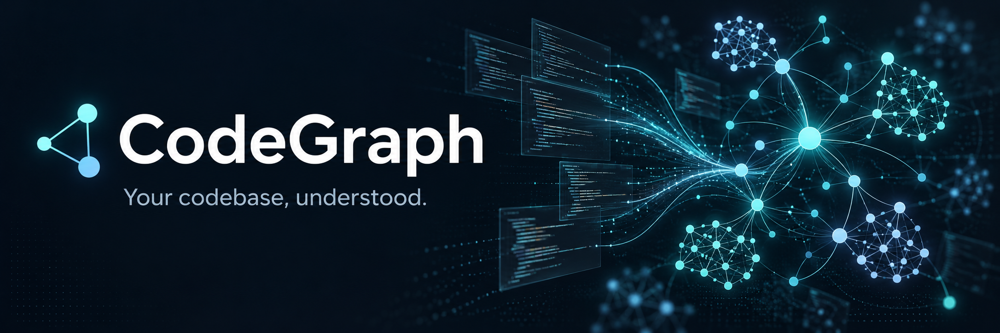
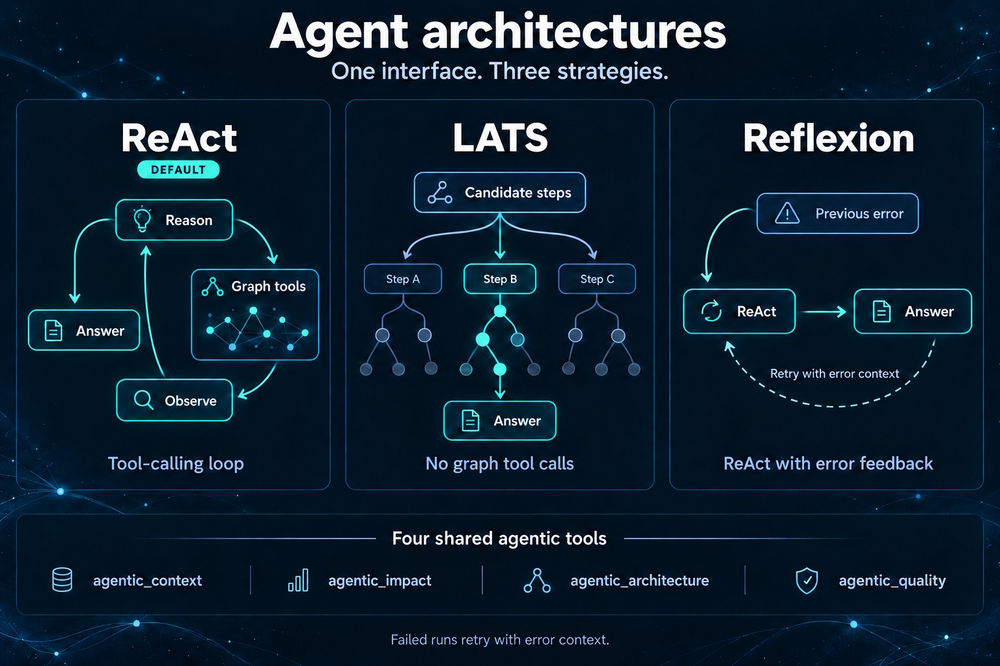
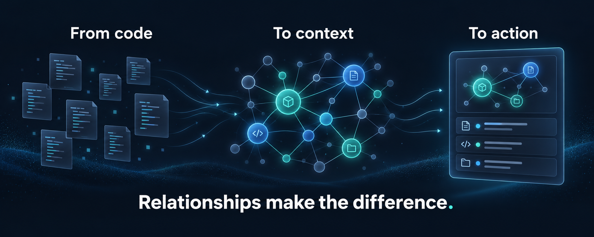

# CodeGraph (with updates)

**Your codebase, understood.**

CodeGraph transforms your entire codebase into a semantically searchable knowledge graph that AI agents can actually *reason* about—not just grep through.

> **Ready to get started?** Jump to the [Installation Guide](docs/INSTALLATION_GUIDE.md) for step-by-step setup instructions.
>
> **Already set up?** See the [Usage Guide](docs/USAGE_GUIDE.md) for tips on getting the most out of CodeGraph with your AI assistant.
>
> **Prefer shell commands?** Run `codegraph agent context "your question"`. The same four
> agentic tools are available through the [CLI, with project-local Claude Code/Codex hooks](docs/AGENTIC_CLI.md).
> `codegraph init` offers hook setup and adds agent instructions before indexing.

---

## The Problem

AI coding assistants are powerful, but they're flying blind. They see files one at a time, grep for patterns, and burn tokens trying to understand your architecture. Every conversation starts from zero.

**What if your AI assistant already knew your codebase?**

---

## What CodeGraph Does Differently

### 1. Graph + Embeddings = True Understanding

Most semantic search tools create embeddings and call it a day. CodeGraph builds a **real knowledge graph**:

```
Your Code → Build Context → AST + FastML → LSP Resolution → Enrichment → Graph + Embeddings
              ↓               ↓              ↓              ↓              ↓         ↓
          Packages        Nodes/edges    Type-aware     API surface      Graph    Semantic
          Features        Fast patterns  linking        Module graph   traversal   search
          Targets         Spans          Definitions    Dataflow/Docs             (hybrid)
```

When you search, you don't just get "similar code"—you get code with its **relationships intact**. The function that matches your query, plus what calls it, what it depends on, and where it fits in the architecture.

Indexing enrichment adds:
- Module nodes and module-level import/containment edges for cross-file navigation
- Rust-local dataflow edges (`defines`, `uses`, `flows_to`, `returns`, `mutates`) for impact analysis
- Document/spec nodes linked to backticked symbols in `README.md`, `docs/**/*.md`, and `schema/**/*.surql`
- Architecture signals (package cycles + optional boundary violations)

#### Indexing tiers (speed vs richness)

Indexing is tiered so you can choose between speed/storage and graph richness. The default is **fast**.

| Tier | What it enables | Typical use |
|------|-----------------|-------------|
| `fast` | AST nodes + core edges only (no LSP or enrichment) | Quick indexing, low storage |
| `balanced` | LSP symbols + docs/enrichment + module linking | Richer navigation and documentation with moderate analyzer cost |
| `full` | All analyzers + LSP definitions + dataflow + architecture | Maximum graph richness and analyzer coverage |

Agent answer accuracy is evaluated separately; see the [CLI accuracy results](#agent-cli-accuracy-by-indexing-tier).

Tier behavior details:
- `fast`: disables build context, LSP, enrichment, module linking, dataflow, docs/contracts, and architecture; filters out `Uses`/`References` edges.
- `balanced`: enables build context, LSP symbols, enrichment, module linking, and docs/contracts; filters out `References` edges.
- `full`: enables all analyzers and LSP definitions; no edge filtering.

Configure the tier:
- CLI: `codegraph index /path/to/project --index-tier balanced`
- Env: `CODEGRAPH_INDEX_TIER=balanced`
- Config: `[indexing] tier = "balanced"`

Directory indexing scans subdirectories by default, so
`codegraph index --languages Rust --index-tier balanced .` finds Rust sources in workspace crates. Use
`--no-recursive` for an intentional root-only scan; `-r`/`--recursive` remain accepted.
`codegraph estimate` uses the same traversal defaults.

#### Indexing prerequisites (LSP-enabled tiers)

When the tier enables LSP (`balanced`/`full`), indexing **fails fast** if required external tools are missing.
Rust indexing also runs `rust-analyzer --version` from the target project before parsing:
an existing rustup shim does not guarantee that its active toolchain has the component.
With rustup, run `rustup component add rust-analyzer` from that project directory,
then verify `rust-analyzer --version`. Language-server failures retain the final 4 KiB
of stderr so startup and runtime errors include the server's diagnostic.

Required tools by language:
- Rust: `rust-analyzer`
- TypeScript/JavaScript: `node` and `typescript-language-server`
- Python: `node` and `pyright-langserver`
- Go: `gopls`
- Java: `jdtls`
- C/C++: `clangd`

Warm language-server sessions retain versioned documents and deduplicate/pipeline
definition requests. Requests fail after 30 seconds; `CODEGRAPH_LSP_REQUESTS` bounds
outstanding requests per server (default 32). `CODEGRAPH_ANALYZERS=0` disables analyzers
independently of tier. `CODEGRAPH_SCIP_INDEX=/path/index.scip` can substitute a compiler
index for LSP; source validation and sidecar requirements are described in the
[indexing implementation guide](docs/indexing-performance-work.md).

#### Incremental indexing and inference policies

`--batch-size` sets the maximum number of embedding texts per batch for both local
and cloud providers. An explicit value wins over `CODEGRAPH_EMBEDDINGS_BATCH_SIZE`,
its legacy alias `CODEGRAPH_EMBEDDING_BATCH_SIZE`, and `[embedding] batch_size` in
TOML, in that order; the default is 64. Memory-based tuning does not change explicit
values, including `--batch-size 100`.

```bash
codegraph index --languages Rust --index-tier balanced --batch-size 512 .
```

Token/byte budgets, cache hits and provider API limits can produce smaller actual
requests. For larger requests, adjust `CODEGRAPH_EMBEDDING_BATCH_TOKENS` (local default
8192, remote 32768) and `CODEGRAPH_EMBEDDING_BATCH_BYTES` (default 1 MiB) as needed.
Logs show these inference limits separately from database write batches;
`CODEGRAPH_CHUNK_DB_BATCH_SIZE` defaults to at most 32 rows and is capped at 512.
Ollama and LM Studio have no extra fixed 256-text cap.

Full, single-file and watch indexing share complete-project reconciliation. Unchanged
sources reuse cached AST/analyzer artifacts while the full catalog retains callers
across edits, renames and deletions. Only changed graph records and file metadata are
written. Source snapshots, parsing, inference and writer queues have independent
resource bounds; completion follows durable acknowledgements and final input checks.
`--force` prepares and reconciles again without trusting the previous catalog.

Embedding and semantic-resolution work is independent of extraction tier. Each accepts
`sync` (default when its feature is compiled), `deferred` or `off`:

```bash
CODEGRAPH_EMBEDDING_POLICY=deferred CODEGRAPH_SEMANTIC_RESOLUTION=off \
  codegraph index /path/to/project --index-tier fast --stats-json indexing.json
codegraph index /path/to/project --complete-deferred --stats-json completed.json
```

Deferred runs persist a resumable job and distinguish graph readiness from pending
inference. Prepared-text embedding caches include model/task/tokenizer/runtime identity;
chunking preserves Unicode and enforces provider token budgets. Mutable model aliases
expire; `CODEGRAPH_MODEL_REVISION` declares an immutable revision.

`CODEGRAPH_VECTOR_INDEX_MODE=all|selected|deferred|off` controls HNSW construction for
fresh embedded stores. The default retains all schema dimensions; selected builds the
active dimension, deferred builds after durable ingestion, and off reports vector
readiness false. Existing shared indexes are preserved. Alternate splitters, candidate
caps and runtime/precision choices remain opt-in.

See [configuration and invariants](docs/indexing-performance-work.md) and
[reproducible speed/quality benchmarks](docs/indexing-benchmarks.md). The offline debug
fixture results verify behavior; production throughput and model quality require
representative measurements.

Semantic relationship scoring caches vector norms and scores independent unresolved
names in the existing worker-limited CPU pool, outside async runtime workers. Candidate
order, the cosine threshold and ambiguous-tie handling remain unchanged. `--stats-json`
now separates exact/lexical matching, semantic candidate selection, symbol embedding,
CPU scoring, and edge preparation/writes within relationship resolution.

If LSP resolution fails immediately and the error includes something like `Unknown binary 'rust-analyzer' in official toolchain ...`, your `rust-analyzer` is a rustup shim without an installed binary. Install a runnable `rust-analyzer` (e.g. via `brew install rust-analyzer` or by switching to a toolchain that provides it).

#### Optional architecture boundary rules

If you want CodeGraph to flag forbidden package dependencies, add `codegraph.boundaries.toml` at the project root:

```toml
[[deny]]
from = "your_crate"
to = "forbidden_crate"
reason = "explain the boundary"
```

Indexing will emit `violates_boundary` edges when a `depends_on` relationship matches a deny rule.

### 2. Agentic Tools, Not Just Search

CodeGraph doesn't return a list of files and wish you luck. It ships **4 consolidated agentic tools** that do the thinking:

| Tool | What It Actually Does |
|------|----------------------|
| `agentic_context` | Gathers the context you need—searches code, builds comprehensive context, answers semantic questions |
| `agentic_impact` | Maps change impact—dependency chains, call flows, what breaks if you touch something |
| `agentic_architecture` | The big picture—system structure, API surfaces, architectural patterns |
| `agentic_quality` | Risk assessment—complexity hotspots, coupling metrics, refactoring priorities |

Each tool accepts an optional `focus` parameter for precision when needed:

| Tool | Focus Values | Default Behavior |
|------|-------------|-----------------|
| `agentic_context` | `"search"`, `"builder"`, `"question"` | Auto-selects based on query |
| `agentic_impact` | `"dependencies"`, `"call_chain"` | Analyzes both |
| `agentic_architecture` | `"structure"`, `"api_surface"` | Provides both |
| `agentic_quality` | `"complexity"`, `"coupling"`, `"hotspots"` | Comprehensive assessment |

Each tool runs a **reasoning agent** that plans, searches, analyzes graph relationships, and synthesizes an answer. Not a search result—an *answer*.

> **[View Agent Context Gathering Flow](docs/architecture/agent-context-gathering-flow.html)** - Interactive diagram showing how agents use graph tools to gather context.


#### Agent Architectures

CodeGraph's agents are built on the **Rig** framework. The agent that runs is selected at runtime with `CODEGRAPH_AGENT_ARCHITECTURE` (in `.env` or the environment):

- **`react`** (default; `rig` is accepted as an alias): a tool-calling loop over the graph tools.
- **`lats`**: tree search over candidate reasoning steps. It does not call the graph tools, so its answers are not grounded in the index.
- **`reflexion`**: ReAct wrapped in a retry that feeds the previous error back to the agent.

Whichever agent is selected, a failed run is retried automatically with the error as context.

```bash
# Default: ReAct
./codegraph start stdio

# Tree search over reasoning steps
CODEGRAPH_AGENT_ARCHITECTURE=lats ./codegraph start stdio
```

All agents serve the same 4 consolidated agentic tools and use tier-aware prompting.

### 3. Tier-Aware Intelligence

Here's something clever: CodeGraph automatically adjusts its behavior based on the LLM's context window that you configured for the codegraph agent.

Running a small local model? Get focused, efficient queries.

Using a model with 200K context? Get comprehensive, exploratory analysis.

Using gpt-6, Opus-5.5 or Grok-4.7 with 1-2M context? Get detailed analysis with intelligent result management.

The Agent only uses the amount of steps that it requires to produce the answer so tool execution times vary based on the query and amount of data indexed in the database.

During development the agent used 3-6 steps on average to produce answers for test scenarios.

The Agent is stateless it only has conversational memory for the span of tool execution it does not accumulate context/memory over multiple chained tool calls this is already handled by your client of choice, it accumulates that context so codegraph needs to just provide answers.

| Your Model | CodeGraph's Behavior |
|------------|---------------------|
| < 50K tokens | Terse prompts, max 3 steps |
| 50K-150K | Balanced analysis, max 5 steps |
| 150K-500K | Detailed exploration, max 6 steps |
| > 500K (gpt-6, etc.) | Comprehensive analysis, max 8 steps |

**Hard cap:** Maximum 8 steps regardless of tier (10 with env override). This prevents runaway costs and context overflow while still allowing thorough analysis.

**Same tool, automatically optimized for your setup.**

### 4. Context Overflow Protection

CodeGraph includes multi-layer protection against context overflow—preventing expensive failures when tool results exceed your model's limits.

**Per-Tool Result Truncation:**
- Each tool result is limited based on your configured context window
- Large results (e.g., dependency trees with 1000+ nodes) are intelligently truncated
- Truncated results include `_truncated: true` metadata so the agent knows data was cut
- Array results keep the most relevant items that fit within limits

**Context Accumulation Guard:**
- Monitors total accumulated context across multi-step reasoning
- Fails fast with clear error message if accumulated tool results exceed safe threshold
- Threshold: 80% of context window × 4 (conservative estimate for token overhead)

**Configure via environment:**
```bash
# CRITICAL: Set this to match your agent's LLM context window
CODEGRAPH_CONTEXT_WINDOW=128000  # Default: 128K

# Per-tool result limit derived automatically: context_window × 2 bytes
# Accumulation limit derived automatically: context_window × 4 × 0.8 bytes
```

**Why this matters:** Without these guards, a single `agentic_impact` query on a large codebase could return 6M+ tokens—far exceeding most models' limits and causing expensive failures.

### 5. Hybrid Search That Actually Works

We don't pick sides in the "embeddings vs keywords" debate. CodeGraph combines:

- **70% vector similarity** (semantic understanding)
- **30% lexical search** (exact matches matter)
- **Graph traversal** (relationships and context)
- **Optional reranking** (cross-encoder precision)

The result? You find `handleUserAuth` when you search for "login logic"—but also when you search for "handleUserAuth".

---


## Why This Matters for AI Coding

When you connect CodeGraph to Claude Code, Cursor, or any MCP-compatible agent:

**Before:** Your AI reads files one by one, grepping around, burning tokens on context-gathering.

**After:** Your AI calls `agentic_impact({"query": "UserService"})` and instantly knows what breaks if you refactor it.

This isn't incremental improvement. It's the difference between an AI that *searches* your code and one that *understands* it.

### Why this is powerful for code agents

CodeGraph shifts the *cognitive load* (search + relevance + dependency reasoning) into CodeGraph’s agentic tools, so your code agent can spend its context budget on *making the change*, not *discovering what to change*.

#### What an agentic tool returns (example)

`agentic_impact` returns structured output (file paths, line numbers, and bounded snippets/highlights) plus analysis:

```json
{
  "analysis_type": "dependency_analysis",
  "query": "RigAgentBuilder",
  "structured_output": {
    "analysis": "…what depends on RigAgentBuilder and why…",
    "highlights": [
      { "file_path": "crates/codegraph-mcp-rig/src/agent/builder.rs", "line_number": 48, "snippet": "pub struct RigAgentBuilder { … }" }
    ],
    "next_steps": ["…"]
  },
  "steps_taken": "5",
  "tool_use_count": 5
}
```

#### What a code agent would otherwise have to do

Without CodeGraph’s agentic tools, a code agent typically needs multiple “single-purpose” calls to reach the same confidence:
- search for the symbol (often multiple strategies: text + semantic + ripgrep-style search)
- open and read multiple files (definition + usages + callers + related modules)
- reconstruct dependency/call graphs mentally from partial evidence
- repeat when a guess is wrong (more reads, more tokens)

This burns context quickly: reading “just” a handful of medium-sized files + surrounding context can easily consume tens of thousands of tokens, and larger repos can push into hundreds of thousands depending on how much code gets pulled into context.

With CodeGraph, the agent gets *pinpointed locations and relationships* (plus bounded context) and can keep far more of the context window available for planning and implementing changes.

---

## Quick Start

### 1. Install

```bash
# Clone and build with all features
git clone https://github.com/yourorg/codegraph-rust
cd codegraph-rust
./install-codegraph-full-features.sh
```

#### macOS faster builds (LLVM lld)

If you develop on macOS, you can opt into LLVM's `lld` linker for faster linking:

```bash
# Install LLVM so ld64.lld is on PATH (Homebrew)
brew install llvm

# Use the repo-provided Makefile targets
make build-llvm
make test-llvm
```

### 2. Database

No database setup is needed. Each project gets its own embedded SurrealKV store at
`<project>/.codegraph/db`, created with the bundled schema the first time you index.
Only one process can hold a project's store open at a time. The MCP server opens it on
its first tool call and keeps it until it exits, so stop a running `codegraph start`
before running `codegraph index` on the same project, and connect one client per project.

To use a SurrealDB server instead (for example to share one database or to use
Surreal Cloud), set `CODEGRAPH_SURREALDB_URL` and apply the schema with
`cd schema && ./apply-schema.sh`:

```bash
surreal start --bind 0.0.0.0:3004 --user root --pass root file://$HOME/.codegraph/surreal.db
```

### 3. Initialize and Index Your Project

```bash
codegraph init /path/to/project
```

Init first offers **Claude Code, Codex, both, or none** for project-local hooks.
It preserves existing settings and skips the prompt when CodeGraph hooks are already
configured. Next it adds a managed `# codegraph` section to both `AGENTS.md` and
`CLAUDE.md`, preserving other instructions, then recursively indexes the project.
The guidance directs agents to start exploration with CodeGraph's context, impact,
architecture and quality CLI tools and verify findings against current source.

For scripts, pass the hook choice explicitly; setup can also run without indexing:

```bash
codegraph init /path/to/project --hooks both --index-tier balanced
codegraph init /path/to/project --hooks none --no-index
# Existing index-only workflow, with explicit language filters:
codegraph index /path/to/project -r -l rust,typescript,python
```

`--hooks none` leaves existing hooks in place and still updates both instruction
files. Setup never modifies user-level harness configuration. Ensure `codegraph`
is on the harness's PATH and reload/review the project hooks after setup; see
[init and hook details](docs/AGENTIC_CLI.md#project-initialization).

After indexing, `python3 test_cli_agentic.py` tests all four CLI agent tools with
the same eight questions as `test_http_mcp.py`, printing full answers and saving
responses/timings under `test_output_cli/`. Replay saved answers without new queries
with `python3 test_cli_agentic.py --replay test_output_cli`. See
[CLI testing options](docs/AGENTIC_CLI.md#testing-the-cli).

> **🔒 Security Note:** Indexing automatically respects `.gitignore` and filters out common secrets patterns (`.env`, `credentials.json`, `*.pem`, API keys, etc.). Your secrets won't be embedded or exposed to the agent.

### 4. Connect to Claude Code

Add to your MCP config:
```json
{
  "mcpServers": {
    "codegraph": {
      "command": "/full/path/to/codegraph",
      "args": ["start", "stdio", "--watch"]
    }
  }
}
```

**That's it.** Your AI now understands your codebase.

---

## Agent CLI accuracy by indexing tier

The CLI evaluation uses the same eight questions as the HTTP MCP test, defined in
[agentic_test_cases.py](agentic_test_cases.py). They cover configuration loading,
prompt selection, caching, dependencies, call chains, architecture, public APIs and
complexity across all four agent tools. [test_cli_agentic.py](test_cli_agentic.py)
saves full responses for manual comparison with source.

| Indexing tier | LLM | Evaluation date | CLI response checks | Manual accuracy findings |
|---------------|-----|-----------------|---------------------|--------------------------|
| `fast` | `gpt-6-luna` | 2026-10-06 | 8/8 `OK` | Mixed: useful findings, incomplete answers and at least two source-confirmed incorrect answers; no overall accuracy score assigned |
| `balanced` | Pending | Pending | Pending | Awaiting evaluation after balanced indexing |
| `full` | Pending | Not evaluated | — | No accuracy results yet |

**`OK` measures command/response success, not factual correctness.** It means the
command returned a valid JSON answer without a reported timeout or partial-result
marker. All eight fast-tier responses passed this check despite factual mistakes.
The response field `tier: Massive` in this run describes the agent's context-window
budget, independently of the `fast` indexing tier.

Source review of the fast-tier answers found:

- **Call chain (case 5): incorrect active implementation.** The answer selected
  the `#[cfg(not(feature = "ai-enhanced"))]` error stub for `execute_agentic_workflow`
  and concluded the workflow did not reach graph tools. The
  [AI-enabled implementation](crates/codegraph-mcp-server/src/official_server.rs#L574)
  creates `GraphToolExecutor` and invokes the Rig agent executor. The answer did not
  distinguish the two conditional implementations.
- **Public API (case 7): incomplete API and incorrect usage conclusion.** The answer
  described `GraphToolExecutor` as having no direct usage and suggested changes were
  isolated and low-risk. Its [public methods](crates/codegraph-mcp-tools/src/graph_tool_executor.rs#L73)
  include constructors, `execute`, cache controls and tool metadata accessors; it is
  used by both the [server workflow](crates/codegraph-mcp-server/src/official_server.rs#L697)
  and the [Rig tool factory](crates/codegraph-mcp-rig/src/tools/factory.rs#L16).
- **LRU cache (case 3): useful but incomplete.** The answer correctly identified
  tool-result caching by function and parameters, but did not explain the cache-hit,
  miss, eviction or clearing behavior requested by the question.
- **Missing symbol (case 4): appropriately uncertain.** The answer reported that
  `PromptSelector` could not be found rather than inventing its dependencies. No
  Rust definition with that name exists in the reviewed source; this question needs
  that caveat when interpreting the results.

This is a qualitative baseline from local run `20261006_013512_392882`, with the
model and indexing tier recorded from the test session. The runner does not yet
capture those settings automatically. These observations do not isolate the effect
of indexing tier from model reasoning or establish a numerical accuracy rate.
For subsequent comparisons, keep questions, model, agent context budget and inference
settings consistent; record the source revision and index configuration, and disclose
changes between runs. Review source locations, active conditional code, completeness
and unsupported conclusions before assigning accuracy scores.

---

## The Architecture

> **[View Interactive Architecture Diagram](docs/architecture/codegraph-architecture.html)** - Explore the full workspace structure with clickable components and layer filtering.

```
┌─────────────────────────────────────────────────────────────────┐
│                         Claude Code / MCP Client                │
└─────────────────────────────────┬───────────────────────────────┘
                                  │ MCP Protocol
                                  ▼
┌─────────────────────────────────────────────────────────────────┐
│                        CodeGraph MCP Server                     │
│  ┌───────────────────────────────────────────────────────────┐  │
│  │                    Agentic Tools Layer                    │  │
│  │  ┌─────────┐ ┌─────────┐ ┌─────────┐ ┌─────────────────┐  │  │
│  │  │  ReAct  │ │  LATS   │ │Reflexion│ │ Tool Execution  │  │  │
│  │  │  (Rig)  │ │  (Rig)  │ │  (Rig)  │ │    Pipeline     │  │  │
│  │  └────┬────┘ └────┬────┘ └────┬────┘ └────────┬────────┘  │  │
│  └───────┼───────────┼───────────┼───────────────┼───────────┘  │
│          └───────────┴───────────┴───────────────┘              │
│                              │                                  │
│  ┌───────────────────────────┼───────────────────────────────┐  │
│  │                  Inner Graph Tools                        │  │
│  │  ┌──────────────┐ ┌──────────────┐ ┌──────────────────┐   │  │
│  │  │ Transitive   │ │    Call      │ │     Coupling     │   │  │
│  │  │ Dependencies │ │   Chains     │ │     Metrics      │   │  │
│  │  └──────────────┘ └──────────────┘ └──────────────────┘   │  │
│  │  ┌──────────────┐ ┌──────────────┐ ┌──────────────────┐   │  │
│  │  │   Reverse    │ │    Cycle     │ │       Hub        │   │  │
│  │  │    Deps      │ │  Detection   │ │      Nodes       │   │  │
│  │  └──────────────┘ └──────────────┘ └──────────────────┘   │  │
│  └───────────────────────────┬───────────────────────────────┘  │
└──────────────────────────────┼──────────────────────────────────┘
                               │
┌──────────────────────────────┼──────────────────────────────────┐
│                         SurrealDB                               │
│  ┌─────────────┐  ┌─────────────┐  ┌─────────────────────────┐  │
│  │   Nodes     │  │    Edges    │  │   Chunks + Embeddings   │  │
│  │  (AST +     │  │  (calls,    │  │   (HNSW vector index)   │  │
│  │   FastML)   │  │   imports)  │  │                         │  │
│  └─────────────┘  └─────────────┘  └─────────────────────────┘  │
│                                                                 │
│  ┌────────────────────────────────────────────────────────────┐ │
│  │              SurrealQL Graph Functions                     │ │
│  │   fn::semantic_search_nodes_via_chunks                     │ │
│  │   fn::semantic_search_chunks_with_context                  │ │
│  │   fn::get_transitive_dependencies                          │ │
│  │   fn::trace_call_chain                                     │ │
│  │   fn::calculate_coupling_metrics                           │ │
│  └────────────────────────────────────────────────────────────┘ │
└─────────────────────────────────────────────────────────────────┘
```

**Key insight:** The agentic tools don't just call one function. They *reason* about which graph operations to perform, chain them together, and synthesize results. A single `agentic_impact` call might:

1. Search for the target component semantically
2. Get its direct dependencies
3. Trace transitive dependencies
4. Check for circular dependencies
5. Calculate coupling metrics
6. Identify hub nodes that might be affected
7. Synthesize all findings into an actionable answer

---

## Supported Languages

CodeGraph uses tree-sitter for initial parsing and enhances results with FastML algorithms and supports:

Rust • Python • TypeScript • JavaScript • Go • Java • C++ • C • Swift • Kotlin • C# • Ruby • PHP • Dart

---

## Provider Flexibility

### Embeddings
Use any model with dimensions 384-4096:
- **Local:** Ollama, LM Studio, ONNX Runtime
- **Cloud:** OpenAI, Jina AI

### LLM (for agentic reasoning)
- **Local:** Ollama, LM Studio
- **Cloud:** Anthropic Claude, OpenAI, xAI Grok, OpenAI Compliant

### Database
- **SurrealDB 3.x** with HNSW vector index (2-5ms queries)
- Free cloud tier available at [surrealdb.com/cloud](https://surrealdb.com/cloud)

---

## Configuration

Building requires **Rust 1.95 or newer** and uses edition **2024**. Direct registry
dependencies target current stable releases; `Cargo.lock` records the resolved graph. Bincode stays on **2.0.1**, its last
functional release; 3.0.0 deliberately fails compilation. ONNX Runtime bindings use
the latest release candidate, **2.0.0-rc.13**, because no stable 2.0 release exists.

The CLI loads project or user dotenv configuration before starting worker threads.
Library callers should initialize their environment at process startup; `ConfigManager::load()`
only reads configuration and never changes the process environment.

`codegraph init` configures the selected project and loads its environment before
indexing. `codegraph config init` is the separate command for creating global
application configuration; project init does not configure model providers.

Global config in `~/.codegraph/config.toml`:

```toml
[embedding]
provider = "ollama"
model = "qwen3-embedding:0.6b"
dimension = 1024

[llm]
provider = "anthropic"
model = "claude-sonnet-4"

[database.surrealdb]
connection = "ws://localhost:3004"   # storage is selected by CODEGRAPH_SURREALDB_URL; unset = embedded per-project store
namespace = "ouroboros"
database = "codegraph"
```

See [INSTALLATION_GUIDE.md](docs/INSTALLATION_GUIDE.md) for complete configuration options.

### Experimental graph schema (optional)

CodeGraph can run against an experimental SurrealDB **graphdb-style schema** (`schema/codegraph_graph_experimental.surql`) that is interoperable with the existing CodeGraph tools and indexing pipeline.

Compared to the relational/vanilla schema (`schema/codegraph.surql`), the experimental schema is designed for faster and more efficient graph-query operations (traversals, neighborhood expansion, and tool-driven graph analytics) on large codebases.

To use it:

1) Load the schema into a dedicated database (once):

```bash
# Example (SurrealDB CLI)
surreal sql --conn ws://localhost:3004 --ns ouroboros --db codegraph_experimental < schema/codegraph_graph_experimental.surql
```

2) Point CodeGraph at that database:

```bash
CODEGRAPH_USE_GRAPH_SCHEMA=true
CODEGRAPH_GRAPH_DB_DATABASE=codegraph_experimental
```

Notes:
- The schema file defines HNSW indexes for multiple embedding dimensions (384–4096) so you can switch embedding models without reworking the DB.
- Schema loading is not currently performed automatically at runtime; you must apply the `.surql` file to the target database before indexing.
- `CODEGRAPH_GRAPH_DB_DATABASE` controls which Surreal database indexing/tools use when `CODEGRAPH_USE_GRAPH_SCHEMA=true`.

---

## Daemon Mode

Keep your index fresh automatically:

```bash
# With MCP server (recommended)
codegraph start stdio --watch

# Standalone daemon
codegraph daemon start /path/to/project --languages rust,typescript
```

Changes are detected, debounced, and re-indexed in the background.

---

## What's Next

- [ ] More language support
- [ ] Cross-repository analysis
- [ ] Custom graph schemas
- [ ] Plugin system for custom analyzers

---

## Philosophy

CodeGraph exists because we believe AI coding assistants should be *augmented*, not replaced. The best AI-human collaboration happens when the AI has deep context about what you're working with.

We're not trying to replace your IDE, your type checker, or your tests. We're giving your AI the context it needs to actually help.

**Your codebase is a graph. Let your AI see it that way.**

---

## License

MIT

---

## Links

- [Installation Guide](docs/INSTALLATION_GUIDE.md)
- [SurrealDB Cloud](https://surrealdb.com/cloud) (free tier)
- [Jina AI](https://jina.ai) (free API tokens)
- [Ollama](https://ollama.com) (local models)

---


