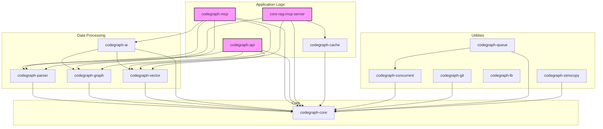

# CodeGraph System Architecture

This document provides a detailed overview of the CodeGraph system architecture, including a component-level dependency diagram.

## 1. Interactive Architecture Diagram

An interactive and animated version of the architecture diagram is available in [`architecture.html`](architecture.html).

To view it, open the HTML file in your browser. For the interactivity to work, you will first need to generate the `architecture.svg` file by rendering the Mermaid diagram below using the [Mermaid Live Editor](https://mermaid.live).

## 2. Component-Level Dependency Architecture

The following diagram illustrates the dependencies between the various crates (components) in the CodeGraph system.

