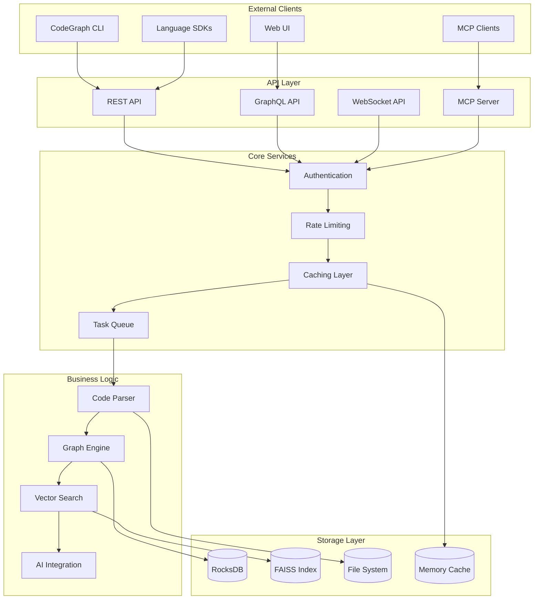
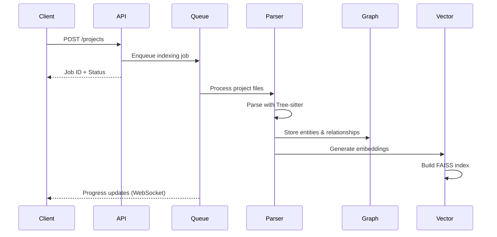
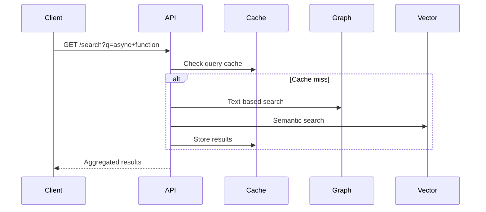
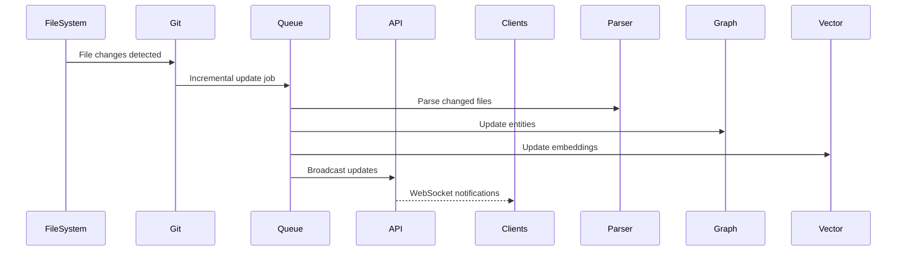

# CodeGraph Developer Guide

**Complete development environment setup and architecture overview**

## Quick Navigation

- [Quick Start](#quick-start) - Get up and running in 5 minutes
- [Architecture Overview](#architecture-overview) - System design and components
- [Development Setup](#development-environment-setup) - Local dev environment
- [Contributing Guidelines](#contributing-guidelines) - How to contribute
- [Testing Guide](#testing-guide) - Running and writing tests
- [Performance Tuning](#performance-tuning) - Optimization strategies

## Quick Start

### Prerequisites

**System Requirements**:
- **Rust**: 1.75.0 or higher
- **System Dependencies**:
  - Linux/macOS: `clang`, `cmake`, `pkg-config`
  - Windows: Visual Studio Build Tools 2022+
- **Recommended**: 8GB RAM, 4-core CPU, 20GB free space

**Quick Check**:
```bash
# Verify Rust installation
rustc --version  # Should show 1.75.0+
cargo --version

# Install required tools
cargo install cargo-watch cargo-nextest cargo-deny
```

### 30-Second Setup

```bash
# 1. Clone repository
git clone https://github.com/codegraph/embedding-system.git
cd embedding-system

# 2. Install dependencies and build
cargo build --release

# 3. Run tests to verify setup
cargo test

# 4. Start development server
cargo run --release -p codegraph-api

# 5. Verify in another terminal
curl http://localhost:8000/health
```

**Expected Output**:
```json
{
  "status": "healthy",
  "version": "0.1.0",
  "uptime": "5s", 
  "features": ["graph", "vector", "mcp"]
}
```

### Development Workflow

```bash
# Hot reload during development
cargo watch -c -x 'run --release -p codegraph-api'

# Run tests in watch mode
cargo watch -c -x test

# Format and lint
make fmt lint

# Full development check
make dev
```

## Architecture Overview

### System Architecture



### Workspace Structure

```
CodeGraph/
├── crates/                        # Rust workspace crates
│   ├── codegraph-core/            # 🏗️  Core types & traits
│   ├── codegraph-graph/           # 📊  Graph storage (RocksDB)
│   ├── codegraph-parser/          # 🔍  Tree-sitter parsing
│   ├── codegraph-vector/          # 🧠  FAISS vector search
│   ├── codegraph-api/             # 🌐  HTTP/GraphQL/WS APIs
│   ├── codegraph-mcp/             # 🤖  Model Context Protocol
│   ├── codegraph-cache/           # ⚡  Caching & memory
│   ├── codegraph-queue/           # 📋  Async task queue
│   ├── codegraph-git/             # 🔄  Git integration
│   ├── codegraph-ai/              # 🎯  AI/ML integration
│   ├── codegraph-lb/              # ⚖️   Load balancing
│   ├── codegraph-concurrent/      # 🔀  Concurrency utils
│   └── codegraph-zerocopy/        # 🚀  Zero-copy serialization
├── docs/                          # 📚  Documentation
├── scripts/                       # 🛠️  Build & deployment scripts
├── tests/                         # 🧪  Integration tests
└── benchmarks/                    # 📈  Performance benchmarks
```

### Component Responsibilities

#### Core (`codegraph-core`)
**Purpose**: Foundational types, traits, and utilities shared across all components.

**Key Components**:
- `Entity` - Represents code entities (functions, classes, etc.)
- `Project` - Project metadata and configuration
- `Error` - Unified error handling with `thiserror`
- `Config` - Configuration management
- `Metrics` - Performance and monitoring traits

**Example**:
```rust
// Core entity representation
#[derive(Debug, Clone, Serialize, Deserialize)]
pub struct Entity {
    pub id: EntityId,
    pub name: String,
    pub entity_type: EntityType,
    pub language: Language,
    pub location: Location,
    pub signature: Option<String>,
    pub documentation: Option<String>,
    pub complexity: ComplexityMetrics,
}

// Unified error handling
#[derive(Error, Debug)]
pub enum CodeGraphError {
    #[error("Parsing error: {message}")]
    ParseError { message: String },
    
    #[error("Database error: {0}")]
    DatabaseError(#[from] rocksdb::Error),
    
    #[error("Vector search error: {0}")]
    VectorError(String),
}
```

#### Graph Storage (`codegraph-graph`)
**Purpose**: RocksDB-based graph storage with high-performance queries.

**Architecture**:
- **Column Families**: Separate data types (entities, relationships, metadata)
- **Indexing**: Multi-level indices for fast lookups
- **Transactions**: ACID compliance for complex operations
- **Backup**: Incremental and full backup support

**Key Features**:
```rust
pub struct GraphStore {
    db: Arc<DB>,
    entity_cf: ColumnFamily,
    relation_cf: ColumnFamily,
    index_cf: ColumnFamily,
}

impl GraphStore {
    // High-performance entity retrieval
    pub async fn get_entity(&self, id: &EntityId) -> Result<Option<Entity>>;
    
    // Graph traversal with patterns
    pub async fn traverse(&self, pattern: &GraphPattern) -> Result<Vec<Path>>;
    
    // Bulk operations for indexing
    pub async fn batch_insert_entities(&self, entities: Vec<Entity>) -> Result<()>;
}
```

#### Code Parser (`codegraph-parser`)
**Purpose**: Multi-language parsing using Tree-sitter with language-specific extractors.

**Supported Languages**:
- **Rust** - Functions, structs, enums, traits, modules
- **Python** - Functions, classes, methods, modules
- **JavaScript/TypeScript** - Functions, classes, modules, components
- **Go** - Functions, structs, interfaces, packages
- **Java** - Classes, methods, packages, interfaces
- **C/C++** - Functions, classes, namespaces

**Parser Architecture**:
```rust
pub trait LanguageParser: Send + Sync {
    fn language(&self) -> Language;
    fn parse_file(&self, content: &str, path: &Path) -> Result<ParseResult>;
    fn extract_entities(&self, tree: &Tree, source: &str) -> Vec<Entity>;
    fn extract_dependencies(&self, tree: &Tree, source: &str) -> Vec<Dependency>;
}

// Rust-specific parser implementation
pub struct RustParser {
    parser: tree_sitter::Parser,
    query_entities: Query,
    query_dependencies: Query,
}

impl LanguageParser for RustParser {
    fn extract_entities(&self, tree: &Tree, source: &str) -> Vec<Entity> {
        let mut entities = Vec::new();
        
        // Extract functions
        for func_match in self.query_entities.captures(tree.root_node(), source.as_bytes()) {
            let entity = self.extract_function(func_match, source);
            entities.push(entity);
        }
        
        entities
    }
}
```

#### Vector Search (`codegraph-vector`)
**Purpose**: FAISS-based semantic search with multiple index types.

**Index Types**:
- **HNSW** - Hierarchical navigable small worlds (default)
- **IVF** - Inverted file index for large datasets
- **Flat** - Brute force for small datasets

**Vector Operations**:
```rust
pub struct VectorStore {
    index: Arc<Mutex<FaissIndex>>,
    embeddings: DashMap<EntityId, Vec<f32>>,
    model: EmbeddingModel,
}

impl VectorStore {
    // Add entity embeddings
    pub async fn add_entity(&self, entity: &Entity) -> Result<()> {
        let embedding = self.model.encode(&entity.signature)?;
        self.index.lock().await.add_vector(entity.id, embedding)?;
        Ok(())
    }
    
    // Semantic similarity search
    pub async fn find_similar(
        &self,
        query: &str,
        threshold: f32,
        limit: usize
    ) -> Result<Vec<SimilarityResult>> {
        let query_embedding = self.model.encode(query)?;
        let results = self.index.lock().await.search(
            &query_embedding, 
            limit,
            threshold
        )?;
        
        Ok(results)
    }
}
```

#### API Layer (`codegraph-api`)
**Purpose**: Multi-protocol API server with REST, GraphQL, and WebSocket support.

**Server Architecture**:
```rust
pub struct Server {
    addr: SocketAddr,
    router: Router,
    state: Arc<AppState>,
    config: Arc<Config>,
}

// Shared application state
pub struct AppState {
    pub graph: Arc<GraphStore>,
    pub vector: Arc<VectorStore>, 
    pub parser: Arc<ParserManager>,
    pub cache: Arc<CacheManager>,
    pub rate_limiter: Arc<RateLimiter>,
    pub metrics: Arc<MetricsCollector>,
}

// REST API routes
pub fn create_router(state: Arc<AppState>) -> Router {
    Router::new()
        // Health and status
        .route("/health", get(health_handler))
        .route("/api/v1/health", get(detailed_health_handler))
        
        // Project management
        .route("/api/v1/projects", get(list_projects).post(create_project))
        .route("/api/v1/projects/:id", get(get_project).put(update_project))
        
        // Search endpoints
        .route("/api/v1/search", get(text_search))
        .route("/api/v1/similar", post(vector_search))
        
        // GraphQL playground and endpoint
        .route("/playground", get(graphql_playground))
        .route("/api/v1/graphql", post(graphql_handler))
        
        // WebSocket subscriptions
        .route("/api/v1/ws", get(websocket_handler))
        
        // Metrics and admin
        .route("/metrics", get(prometheus_metrics))
        .layer(cors_layer())
        .layer(rate_limit_layer())
        .layer(tracing_layer())
        .with_state(state)
}
```

### Data Flow

#### 1. Project Indexing Flow


#### 2. Search Query Flow


#### 3. Real-time Updates Flow


## Development Environment Setup

### IDE Configuration

**Visual Studio Code** (Recommended):
```json
// .vscode/settings.json
{
    "rust-analyzer.cargo.features": ["all"],
    "rust-analyzer.cargo.loadOutDirsFromCheck": true,
    "rust-analyzer.procMacro.enable": true,
    "rust-analyzer.checkOnSave.command": "clippy",
    "rust-analyzer.checkOnSave.allFeatures": true,
    "editor.formatOnSave": true,
    "rust-analyzer.inlayHints.enable": true,
    "rust-analyzer.inlayHints.chainingHints": true,
    "rust-analyzer.inlayHints.parameterHints": true,
    "files.watcherExclude": {
        "**/target": true,
        "**/.git": true
    }
}

// .vscode/tasks.json
{
    "version": "2.0.0",
    "tasks": [
        {
            "label": "Build Release",
            "type": "cargo",
            "command": "build",
            "args": ["--release"],
            "group": "build",
            "presentation": {
                "echo": true,
                "reveal": "always",
                "focus": false,
                "panel": "shared"
            }
        },
        {
            "label": "Test All",
            "type": "cargo", 
            "command": "nextest",
            "args": ["run"],
            "group": "test"
        }
    ]
}
```

**Extensions**:
- `rust-lang.rust-analyzer` - Rust language support
- `vadimcn.vscode-lldb` - Debugging support
- `serayuzgur.crates` - Cargo.toml support
- `tamasfe.even-better-toml` - TOML syntax support

### Development Tools

**Essential Tools**:
```bash
# Core Rust tools
rustup component add rustfmt clippy

# Development utilities
cargo install cargo-watch          # File watching and auto-reload
cargo install cargo-nextest        # Better test runner
cargo install cargo-deny           # Dependency auditing
cargo install cargo-audit          # Security scanning
cargo install cargo-machete        # Unused dependency detection
cargo install cargo-tarpaulin      # Code coverage
cargo install cargo-flamegraph     # Performance profiling

# Database tools
cargo install rocksdb-cli          # RocksDB inspection
cargo install sqlite3              # SQLite for development
```

**Makefile Commands**:
```makefile
# Available make targets
make help          # Show all available commands
make dev           # Full development check (format + lint + test)
make quick         # Quick check (format + lint only)
make fmt           # Format all code
make lint          # Run Clippy linter
make test          # Run tests with nextest
make test-coverage # Generate coverage report
make bench         # Run benchmarks
make doc           # Generate documentation
make watch         # Watch mode for development
```

### Development Configuration

**config/dev.toml**:
```toml
[server]
host = "127.0.0.1"
port = 8000
workers = 2

[database]
path = "./dev-data/rocks.db"
cache_size = 256
enable_statistics = true

[vector]
index_type = "flat"  # Faster for development
dimension = 384      # Smaller model for speed

[logging]
level = "debug"
format = "pretty"    # Human-readable logs

[performance]
query_timeout = "10s"
max_memory_usage = "1GB"
```

**Environment Variables**:
```bash
# .env.development
RUST_LOG=debug
RUST_BACKTRACE=1
CODEGRAPH_CONFIG=config/dev.toml
CODEGRAPH_LOG_LEVEL=debug
CODEGRAPH_DATABASE_CACHE_SIZE=256
```

### Docker Development

**docker-compose.dev.yml**:
```yaml
version: '3.8'
services:
  codegraph-dev:
    build:
      context: .
      dockerfile: Dockerfile.dev
    ports:
      - "8000:8000"
      - "9229:9229"  # Debug port
    volumes:
      - .:/workspace
      - cargo-cache:/usr/local/cargo/registry
      - target-cache:/workspace/target
    environment:
      - RUST_LOG=debug
      - CODEGRAPH_CONFIG=/workspace/config/dev.toml
    command: cargo watch -x 'run --release -p codegraph-api'
    
volumes:
  cargo-cache:
  target-cache:
```

## Contributing Guidelines

### Code Standards

**Rust Style**:
- Follow `rustfmt` defaults (run `cargo fmt`)
- Address all `clippy` warnings (run `cargo clippy`)
- Use `#[derive(Debug)]` on all structs and enums
- Prefer `thiserror` for custom error types
- Use `tracing` for logging, not `println!`
- Document all public APIs with `///` comments

**Example**:
```rust
/// Processes code entities for indexing
#[derive(Debug, Clone, Serialize, Deserialize)]
pub struct EntityProcessor {
    language: Language,
    config: ProcessorConfig,
}

impl EntityProcessor {
    /// Creates a new entity processor for the given language
    /// 
    /// # Arguments
    /// 
    /// * `language` - Programming language to process
    /// * `config` - Processor configuration
    /// 
    /// # Examples
    /// 
    /// ```rust
    /// use codegraph_parser::{EntityProcessor, Language};
    /// 
    /// let processor = EntityProcessor::new(Language::Rust, Default::default());
    /// ```
    pub fn new(language: Language, config: ProcessorConfig) -> Self {
        Self { language, config }
    }
    
    /// Processes a source file and extracts entities
    /// 
    /// # Errors
    /// 
    /// Returns `ParseError` if the source cannot be parsed
    pub async fn process_file(&self, path: &Path) -> Result<Vec<Entity>, ParseError> {
        let content = tokio::fs::read_to_string(path)
            .await
            .map_err(|e| ParseError::IoError(e))?;
            
        self.process_source(&content, path).await
    }
}
```

**Error Handling**:
```rust
use thiserror::Error;

#[derive(Error, Debug)]
pub enum ProcessorError {
    #[error("Failed to parse file: {path}")]
    ParseError { path: PathBuf },
    
    #[error("Unsupported language: {language}")]
    UnsupportedLanguage { language: String },
    
    #[error("IO error: {0}")]
    IoError(#[from] std::io::Error),
}

// Usage
async fn process_project(path: &Path) -> Result<Project, ProcessorError> {
    let files = discover_files(path).await?;
    
    for file in files {
        match process_file(&file).await {
            Ok(entities) => { /* handle success */ },
            Err(ProcessorError::UnsupportedLanguage { language }) => {
                tracing::warn!("Skipping unsupported language: {}", language);
                continue;
            }
            Err(e) => return Err(e),
        }
    }
    
    Ok(project)
}
```

### Git Workflow

**Branch Naming**:
- `feature/description` - New features
- `fix/description` - Bug fixes
- `docs/description` - Documentation updates
- `perf/description` - Performance improvements
- `refactor/description` - Code refactoring

**Commit Messages**:
Follow [Conventional Commits](https://www.conventionalcommits.org/):

```
feat(parser): add TypeScript support for React components

- Add JSX parsing capabilities
- Extract React component props and state
- Support TypeScript generics in components

Closes #123
```

**Pull Request Process**:
1. Fork the repository
2. Create feature branch: `git checkout -b feature/my-feature`
3. Make changes with atomic commits
4. Add tests for new functionality
5. Update documentation if needed
6. Run full test suite: `make dev`
7. Push branch and create pull request
8. Address review feedback
9. Squash commits if requested

### Code Review Checklist

**Reviewer Checklist**:
- [ ] Code follows Rust style guidelines
- [ ] All tests pass (`cargo test`)
- [ ] No clippy warnings (`cargo clippy`)
- [ ] Documentation updated for public APIs
- [ ] Performance implications considered
- [ ] Error handling is appropriate
- [ ] Security implications reviewed
- [ ] Breaking changes are documented

**Author Checklist**:
- [ ] Feature works as intended
- [ ] Tests cover happy path and edge cases
- [ ] Documentation is clear and complete
- [ ] Performance benchmarks run (if applicable)
- [ ] Breaking changes documented in CHANGELOG
- [ ] All CI checks pass

## Testing Guide

### Test Structure

```
tests/
├── integration/                # Integration tests
│   ├── api_tests.rs           # API endpoint tests
│   ├── parser_tests.rs        # Multi-language parsing
│   └── performance_tests.rs   # Performance benchmarks
├── fixtures/                  # Test data and projects
│   ├── rust_project/          # Sample Rust project
│   ├── python_project/        # Sample Python project
│   └── mixed_project/         # Multi-language project
└── common/                    # Shared test utilities
    ├── mod.rs                 # Test helpers
    ├── fixtures.rs            # Fixture management
    └── assertions.rs          # Custom assertions
```

### Unit Tests

**Testing Traits and Implementations**:
```rust
#[cfg(test)]
mod tests {
    use super::*;
    use tempfile::TempDir;
    use tokio_test;

    #[tokio::test]
    async fn test_entity_processor_rust() {
        // Arrange
        let processor = EntityProcessor::new(Language::Rust, Default::default());
        let source = r#"
            pub fn calculate_total(items: &[Item]) -> f64 {
                items.iter().map(|item| item.price).sum()
            }
        "#;
        
        // Act
        let entities = processor.process_source(source, Path::new("test.rs")).await?;
        
        // Assert
        assert_eq!(entities.len(), 1);
        let entity = &entities[0];
        assert_eq!(entity.name, "calculate_total");
        assert_eq!(entity.entity_type, EntityType::Function);
        assert!(entity.signature.contains("calculate_total"));
    }
    
    #[tokio::test]
    async fn test_graph_store_transactions() {
        // Arrange
        let temp_dir = TempDir::new()?;
        let store = GraphStore::new(temp_dir.path()).await?;
        let entity1 = create_test_entity("func1", EntityType::Function);
        let entity2 = create_test_entity("func2", EntityType::Function);
        
        // Act
        let mut tx = store.begin_transaction().await?;
        tx.insert_entity(&entity1)?;
        tx.insert_entity(&entity2)?;
        tx.commit().await?;
        
        // Assert
        let retrieved = store.get_entity(&entity1.id).await?;
        assert!(retrieved.is_some());
        assert_eq!(retrieved.unwrap().name, "func1");
    }
}
```

### Integration Tests

**API Testing**:
```rust
// tests/integration/api_tests.rs
use axum_test_helper::TestClient;
use codegraph_api::{create_router, AppState};
use serde_json::{json, Value};

#[tokio::test]
async fn test_project_creation_and_search() {
    // Setup test server
    let state = create_test_app_state().await;
    let app = create_router(state);
    let client = TestClient::new(app);
    
    // Create project
    let create_response = client
        .post("/api/v1/projects")
        .json(&json!({
            "name": "test-project",
            "path": "./tests/fixtures/rust_project",
            "languages": ["rust"]
        }))
        .send()
        .await;
    
    assert_eq!(create_response.status(), 201);
    let project: Value = create_response.json().await;
    let project_id = project["data"]["id"].as_str().unwrap();
    
    // Wait for indexing to complete
    tokio::time::sleep(Duration::from_secs(2)).await;
    
    // Search for functions
    let search_response = client
        .get("/api/v1/search")
        .query(&[("q", "function"), ("project_id", project_id)])
        .send()
        .await;
    
    assert_eq!(search_response.status(), 200);
    let results: Value = search_response.json().await;
    assert!(results["data"]["results"].as_array().unwrap().len() > 0);
}
```

**Performance Testing**:
```rust
// tests/integration/performance_tests.rs
use criterion::{black_box, criterion_group, criterion_main, Criterion};
use codegraph_parser::RustParser;

fn benchmark_rust_parsing(c: &mut Criterion) {
    let parser = RustParser::new();
    let large_rust_file = include_str!("../fixtures/large_file.rs");
    
    c.bench_function("parse_large_rust_file", |b| {
        b.iter(|| {
            parser.parse_file(black_box(large_rust_file), black_box(Path::new("test.rs")))
        });
    });
}

fn benchmark_vector_search(c: &mut Criterion) {
    let rt = tokio::runtime::Runtime::new().unwrap();
    let vector_store = rt.block_on(async { create_test_vector_store().await });
    
    c.bench_function("vector_similarity_search", |b| {
        b.to_async(&rt).iter(|| async {
            vector_store.find_similar(
                black_box("async function process"),
                black_box(0.8),
                black_box(10)
            ).await
        });
    });
}

criterion_group!(benches, benchmark_rust_parsing, benchmark_vector_search);
criterion_main!(benches);
```

### Test Commands

```bash
# Run all tests
cargo nextest run

# Run specific test
cargo nextest run test_entity_processor

# Run integration tests only
cargo nextest run --test integration

# Run with coverage
cargo tarpaulin --out Html --output-dir coverage/

# Run benchmarks
cargo bench

# Test specific crate
cargo nextest run -p codegraph-parser

# Watch mode for tests
cargo watch -x 'nextest run'
```

### Test Data Management

**Fixture Helper**:
```rust
// tests/common/fixtures.rs
use std::path::PathBuf;
use tempfile::TempDir;

pub struct TestFixture {
    pub temp_dir: TempDir,
    pub project_path: PathBuf,
}

impl TestFixture {
    pub async fn rust_project() -> Result<Self> {
        let temp_dir = TempDir::new()?;
        let project_path = temp_dir.path().join("test_project");
        
        // Copy fixture files
        copy_dir_recursive("tests/fixtures/rust_project", &project_path)?;
        
        Ok(Self { temp_dir, project_path })
    }
    
    pub async fn mixed_project() -> Result<Self> {
        let temp_dir = TempDir::new()?;
        let project_path = temp_dir.path().join("mixed_project");
        
        // Create mixed-language project
        create_rust_files(&project_path).await?;
        create_python_files(&project_path).await?;
        create_javascript_files(&project_path).await?;
        
        Ok(Self { temp_dir, project_path })
    }
}

// Usage in tests
#[tokio::test]
async fn test_multi_language_parsing() {
    let fixture = TestFixture::mixed_project().await?;
    let parser_manager = ParserManager::new();
    
    let results = parser_manager.parse_project(&fixture.project_path).await?;
    
    assert!(results.entities.iter().any(|e| e.language == Language::Rust));
    assert!(results.entities.iter().any(|e| e.language == Language::Python));
    assert!(results.entities.iter().any(|e| e.language == Language::JavaScript));
}
```

## Performance Tuning

### Profiling Tools

**CPU Profiling with Flamegraph**:
```bash
# Install flamegraph
cargo install flamegraph

# Profile specific benchmark
cargo flamegraph --bench parsing_benchmark

# Profile running application
sudo cargo flamegraph --bin codegraph-api -- --config config/dev.toml

# Analyze with perf (Linux)
perf record --call-graph=dwarf ./target/release/codegraph-api
perf report
```

**Memory Profiling**:
```bash
# Use jemalloc profiling
MALLOC_CONF=prof:true,prof_active:false ./target/release/codegraph-api

# Heap profiling with heaptrack (Linux)
heaptrack ./target/release/codegraph-api

# Memory usage monitoring
valgrind --tool=massif ./target/release/codegraph-api
```

### Performance Optimization

**RocksDB Tuning**:
```rust
// Optimized RocksDB configuration
fn create_optimized_db_options() -> Options {
    let mut opts = Options::default();
    
    // Memory settings
    opts.set_db_write_buffer_size(256 * 1024 * 1024);  // 256MB
    opts.set_write_buffer_size(64 * 1024 * 1024);      // 64MB
    opts.set_max_write_buffer_number(6);
    opts.set_target_file_size_base(64 * 1024 * 1024);   // 64MB
    
    // Compaction settings
    opts.set_max_background_jobs(num_cpus::get() as i32);
    opts.set_level_compaction_dynamic_level_bytes(true);
    
    // Bloom filters for faster reads
    let mut block_opts = BlockBasedOptions::default();
    block_opts.set_bloom_filter(10.0, false);
    block_opts.set_cache_index_and_filter_blocks(true);
    opts.set_block_based_table_factory(&block_opts);
    
    opts
}
```

**Vector Search Optimization**:
```rust
// FAISS index optimization
impl VectorStore {
    pub fn create_optimized_index(dimension: usize, num_vectors: usize) -> Result<FaissIndex> {
        let index = if num_vectors < 10_000 {
            // Use flat index for small datasets
            FlatIndex::new(dimension, MetricType::InnerProduct)
        } else if num_vectors < 1_000_000 {
            // Use HNSW for medium datasets
            let mut hnsw = HNSWIndex::new(dimension, 32, MetricType::InnerProduct);
            hnsw.set_ef_construction(200);
            hnsw.set_ef_search(64);
            hnsw
        } else {
            // Use IVF for large datasets
            let quantizer = FlatIndex::new(dimension, MetricType::InnerProduct);
            let mut ivf = IVFIndex::new(quantizer, dimension, 1024, MetricType::InnerProduct);
            ivf.set_nprobe(32);
            ivf
        };
        
        Ok(index)
    }
}
```

**Async Performance**:
```rust
// Optimized async processing
#[tracing::instrument(skip(self, files))]
pub async fn process_files_concurrent(&self, files: Vec<PathBuf>) -> Result<Vec<Entity>> {
    const MAX_CONCURRENT: usize = num_cpus::get();
    
    let semaphore = Arc::new(Semaphore::new(MAX_CONCURRENT));
    let mut tasks = Vec::new();
    
    for file in files {
        let parser = self.parser.clone();
        let semaphore = semaphore.clone();
        
        let task = tokio::spawn(async move {
            let _permit = semaphore.acquire().await?;
            parser.process_file(&file).await
        });
        
        tasks.push(task);
    }
    
    let results = futures::future::join_all(tasks).await;
    let entities: Result<Vec<_>> = results.into_iter().collect();
    
    Ok(entities?.into_iter().flatten().collect())
}
```

### Monitoring and Observability

**Metrics Collection**:
```rust
use prometheus::{Counter, Histogram, Registry};

#[derive(Clone)]
pub struct Metrics {
    requests_total: Counter,
    request_duration: Histogram,
    active_connections: prometheus::Gauge,
}

impl Metrics {
    pub fn new() -> Result<Self> {
        let requests_total = Counter::new(
            "codegraph_requests_total",
            "Total number of HTTP requests"
        )?;
        
        let request_duration = Histogram::with_opts(
            prometheus::HistogramOpts::new(
                "codegraph_request_duration_seconds",
                "HTTP request duration in seconds"
            ).buckets(vec![0.01, 0.05, 0.1, 0.5, 1.0, 5.0, 10.0])
        )?;
        
        Ok(Self {
            requests_total,
            request_duration,
            active_connections: prometheus::Gauge::new(
                "codegraph_active_connections",
                "Number of active connections"
            )?,
        })
    }
    
    pub fn record_request(&self, duration: std::time::Duration) {
        self.requests_total.inc();
        self.request_duration.observe(duration.as_secs_f64());
    }
}
```

**Distributed Tracing**:
```rust
use tracing::{info_span, Instrument};

#[tracing::instrument(
    skip(self, request),
    fields(
        method = %request.method(),
        uri = %request.uri(),
        user_agent = ?request.headers().get("user-agent")
    )
)]
pub async fn handle_request(&self, request: Request) -> Response {
    let start = Instant::now();
    
    let response = self.inner_handle(request).instrument(
        info_span!("request_processing")
    ).await;
    
    let duration = start.elapsed();
    self.metrics.record_request(duration);
    
    tracing::info!(
        status = response.status().as_u16(),
        duration_ms = duration.as_millis(),
        "Request completed"
    );
    
    response
}
```

### Build Optimization

**Cargo.toml Settings**:
```toml
[profile.release]
# Maximum optimization
opt-level = 3
lto = "fat"
codegen-units = 1
panic = "abort"
strip = true

# Size-optimized builds
[profile.release-size]
inherits = "release"
opt-level = "z"
strip = true
debug = false
overflow-checks = false

# Performance testing
[profile.bench]
inherits = "release"
debug = true  # Keep debug info for profiling
```

**Compilation Speed**:
```bash
# Use faster linker
export RUSTFLAGS="-C link-arg=-fuse-ld=lld"

# Parallel compilation
export CARGO_BUILD_JOBS=$(nproc)

# Use sccache for distributed compilation
export RUSTC_WRAPPER=sccache

# Incremental compilation (development)
export CARGO_INCREMENTAL=1
```

This completes the comprehensive developer guide. The documentation provides detailed setup instructions, architecture overview, development workflows, testing strategies, and performance optimization techniques for the CodeGraph project.