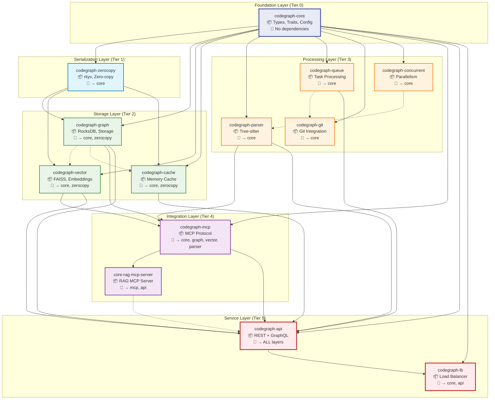
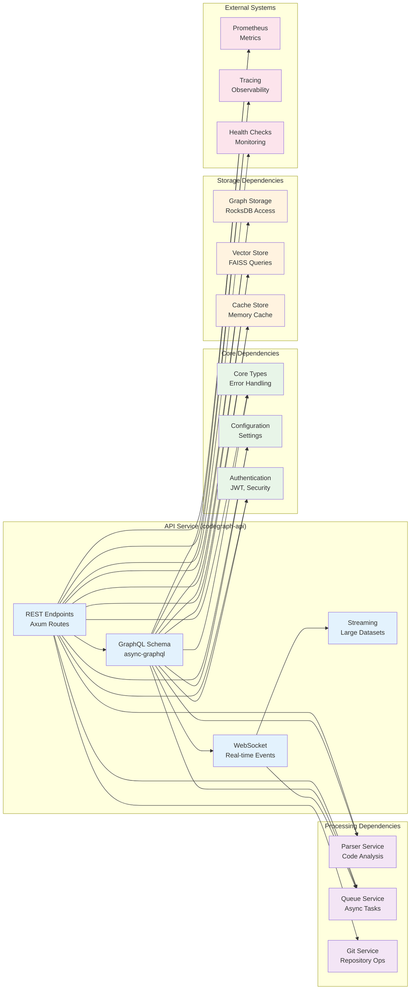
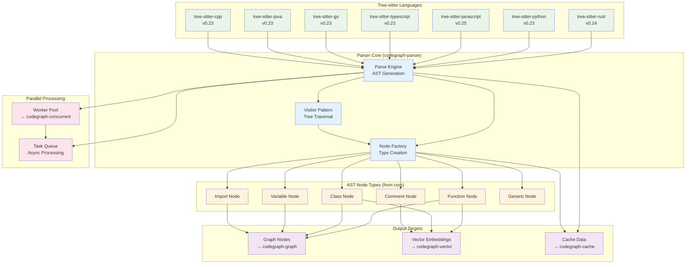
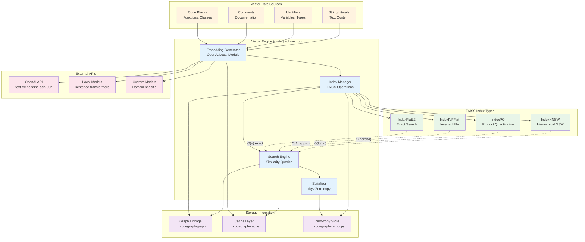

# CodeGraph Component Dependencies

This document provides detailed dependency analysis and component interaction diagrams for the CodeGraph system.

## Crate Dependency Graph (Detailed)



## API Layer Dependencies



## Parser Dependencies & Language Support



## Vector Search Dependencies



## MCP Integration Architecture

```mermaid
graph TB
    subgraph "MCP Server (codegraph-mcp)"
        MCPCore[MCP Core<br/>Protocol Handler]
        Tools[Tool Registry<br/>Available Operations]
        Resources[Resource Manager<br/>Code Access]
        Prompts[Prompt Templates<br/>AI Interactions]
    end
    
    subgraph "RAG MCP Server (core-rag-mcp-server)"
        RAGCore[RAG Core<br/>Retrieval Logic]
        VectorRAG[Vector Retrieval<br/>Semantic Search]
        GraphRAG[Graph Retrieval<br/>Structural Search]
        HybridRAG[Hybrid Retrieval<br/>Combined Approach]
    end
    
    subgraph "MCP Protocol Stack"
        Transport[Transport Layer<br/>STDIO/HTTP]
        Serialization[Message Serialization<br/>JSON-RPC]
        Authentication[Authentication<br/>Capability-based]
        Streaming[Streaming Support<br/>Large Responses]
    end
    
    subgraph "CodeGraph Integration"
        GraphAccess[Graph Access<br/>→ codegraph-graph]
        VectorAccess[Vector Access<br/>→ codegraph-vector]
        ParserAccess[Parser Access<br/>→ codegraph-parser]
        APIAccess[API Access<br/>→ codegraph-api]
    end
    
    subgraph "Client Integration"
        Claude[Claude Desktop<br/>AI Assistant]
        VSCode[VS Code Extension<br/>IDE Integration]
        CLI[CLI Tools<br/>Command Line]
        WebApps[Web Applications<br/>Browser-based]
    end
    
    %% MCP Server internal
    MCPCore --> Tools
    MCPCore --> Resources
    MCPCore --> Prompts
    
    %% RAG Server components
    RAGCore --> VectorRAG
    RAGCore --> GraphRAG
    RAGCore --> HybridRAG
    MCPCore --> RAGCore
    
    %% Protocol stack
    MCPCore --> Transport
    MCPCore --> Serialization
    MCPCore --> Authentication
    MCPCore --> Streaming
    
    %% CodeGraph integration
    Tools --> GraphAccess
    Tools --> VectorAccess
    Tools --> ParserAccess
    Resources --> GraphAccess
    Resources --> VectorAccess
    VectorRAG --> VectorAccess
    GraphRAG --> GraphAccess
    HybridRAG --> VectorAccess
    HybridRAG --> GraphAccess
    
    %% API integration
    MCPCore --> APIAccess
    RAGCore --> APIAccess
    
    %% Client connections
    Transport --> Claude
    Transport --> VSCode
    Transport --> CLI
    Transport --> WebApps
    
    %% Data flow annotations
    VectorRAG -.->|"Semantic similarity"| VectorAccess
    GraphRAG -.->|"Structural relationships"| GraphAccess
    HybridRAG -.->|"Combined ranking"| VectorAccess
    HybridRAG -.->|"Graph context"| GraphAccess
    
    %% Styling
    classDef mcp fill:#e3f2fd
    classDef rag fill:#e8f5e8
    classDef protocol fill:#fff3e0
    classDef integration fill:#f3e5f5
    classDef client fill:#fce4ec
    
    class MCPCore,Tools,Resources,Prompts mcp
    class RAGCore,VectorRAG,GraphRAG,HybridRAG rag
    class Transport,Serialization,Authentication,Streaming protocol
    class GraphAccess,VectorAccess,ParserAccess,APIAccess integration
    class Claude,VSCode,CLI,WebApps client
```



## Dependency Complexity Matrix

```ascii
╔═══════════════════════════════════════════════════════════════════════════════════════════════════════════════════════╗
║                                    CodeGraph Dependency Complexity Analysis                                          ║
╠═══════════════════════════════════════════════════════════════════════════════════════════════════════════════════════╣
║                                                                                                                       ║
║  Complexity Levels:                                    Dependency Types:                                             ║
║  🟢 Simple (0-2 deps)     🟡 Moderate (3-5 deps)       ● Required (runtime)                                         ║
║  🟠 Complex (6-8 deps)    🔴 High (9+ deps)            ○ Optional (feature-gated)                                    ║
║                                                         ◐ Weak (no strong coupling)                                  ║
║                                                                                                                       ║
║  ┌─────────────────────────────────────────────────────────────────────────────────────────────────────────────┐   ║
║  │                                        Crate Complexity Map                                                   │   ║
║  └─────────────────────────────────────────────────────────────────────────────────────────────────────────────┘   ║
║                                                                                                                       ║
║           🟢 core                        🟡 parser ────────○ concurrent                                              ║
║              │                              │                                                                        ║
║              ↓                              ↓                                                                        ║
║           🟢 zerocopy                    🟡 queue ─────────◐ git                                                      ║
║              │                              │                                                                        ║
║              ↓                              ↓                                                                        ║
║     ┌────────┴────────┐                     │                                                                        ║
║     ↓                 ↓                     ↓                                                                        ║
║  🟡 graph          🟡 vector            🟠 mcp ─────────● graph, vector, parser                                      ║
║     │                 │                     │                                                                        ║
║     ↓                 ↓                     ↓                                                                        ║
║  🟡 cache ────────○ graph               🔴 api ─────────● ALL previous layers                                        ║
║                                             │                                                                        ║
║                                             ↓                                                                        ║
║                                         🟡 lb ──────────● api                                                        ║
║                                                                                                                       ║
║  ┌─────────────────────────────────────────────────────────────────────────────────────────────────────────────┐   ║
║  │                                      Complexity Metrics                                                        │   ║
║  ├─────────────────────────────────────────────────────────────────────────────────────────────────────────────┤   ║
║  │  Crate               │ Direct Deps │ Transitive │ Complexity │ Risk Level │ Refactoring Priority              │   ║
║  ├─────────────────────────────────────────────────────────────────────────────────────────────────────────────┤   ║
║  │  codegraph-core      │      0      │      0     │    🟢      │    Low     │ Stable (foundation)               │   ║
║  │  codegraph-zerocopy  │      1      │      0     │    🟢      │    Low     │ Low (serialization)               │   ║
║  │  codegraph-graph     │      2      │      0     │    🟡      │   Medium   │ Medium (storage evolution)        │   ║
║  │  codegraph-vector    │      2      │      0     │    🟡      │   Medium   │ Medium (ML integration)           │   ║
║  │  codegraph-cache     │      3      │      1     │    🟡      │   Medium   │ Low (isolated optimization)       │   ║
║  │  codegraph-parser    │      1      │      1     │    🟡      │   Medium   │ High (language support)           │   ║
║  │  codegraph-queue     │      1      │      1     │    🟡      │   Medium   │ Medium (async architecture)       │   ║
║  │  codegraph-git       │      1      │      0     │    🟢      │    Low     │ Low (stable integration)          │   ║
║  │  codegraph-concurrent│      1      │      0     │    🟢      │    Low     │ Low (performance utility)         │   ║
║  │  codegraph-mcp       │      4      │      6     │    🟠      │    High    │ High (protocol evolution)         │   ║
║  │  core-rag-mcp-server │      2      │      8     │    🟠      │    High    │ High (RAG architecture)           │   ║
║  │  codegraph-api       │      7      │     12     │    🔴      │  Very High │ Very High (API stability)         │   ║
║  │  codegraph-lb        │      2      │     14     │    🟡      │    High    │ Medium (infrastructure)           │   ║
║  └─────────────────────────────────────────────────────────────────────────────────────────────────────────────┘   ║
║                                                                                                                       ║
║  Critical Dependency Paths (for failure analysis):                                                                   ║
║  1. core → ALL (foundation failure affects everything)                                                               ║
║  2. api → graph|vector|cache|parser (service failure affects core functionality)                                     ║
║  3. mcp → graph|vector|parser (protocol failure affects integration)                                                 ║
║  4. graph → vector (storage failure affects search)                                                                  ║
║                                                                                                                       ║
╚═══════════════════════════════════════════════════════════════════════════════════════════════════════════════════════╝
```

---

*Generated by CodeGraph Documentation Specialist - Component Dependency Analysis*