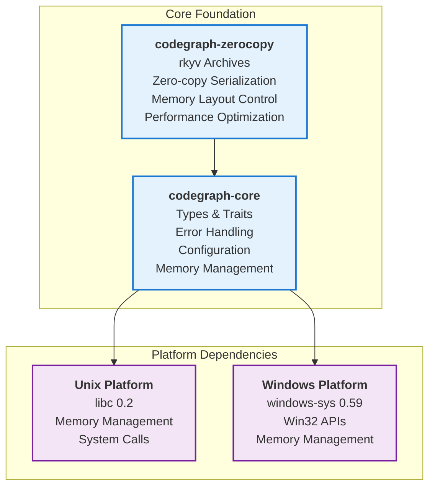
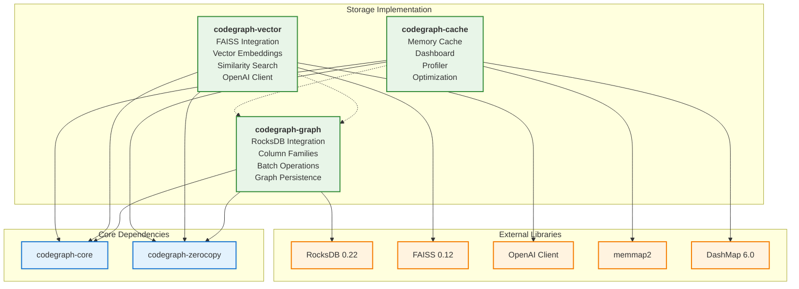
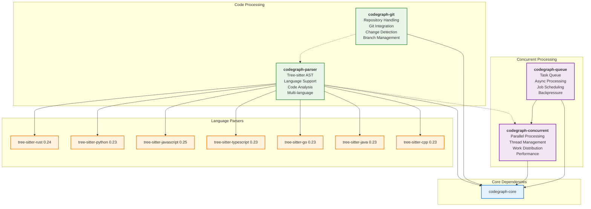
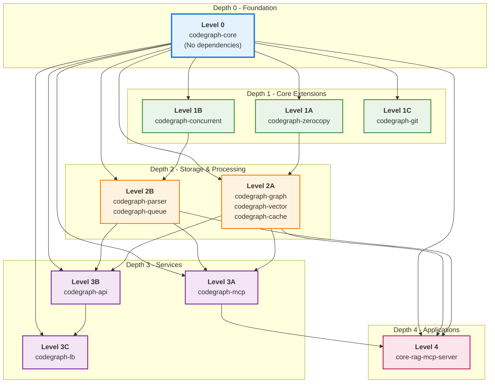
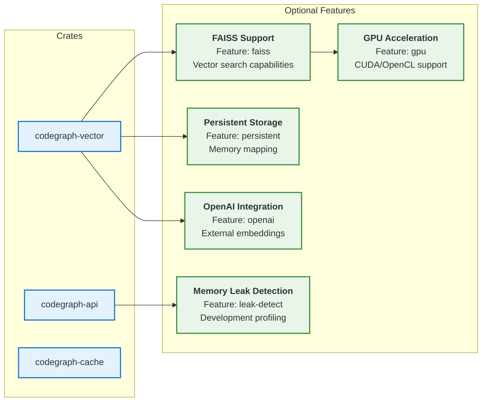
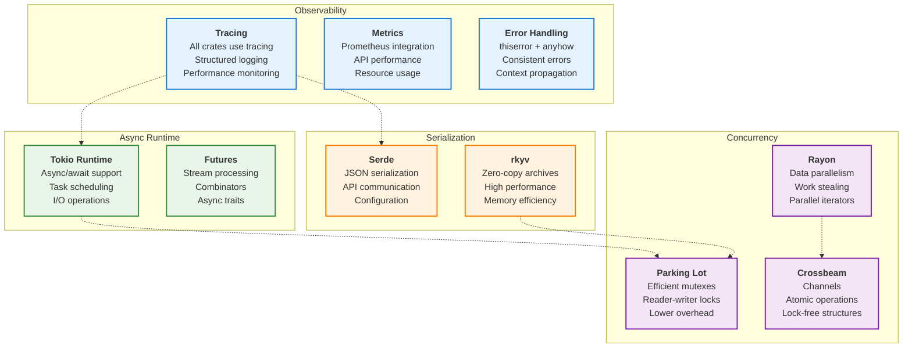

# CodeGraph Component Dependencies

## Detailed Crate Dependency Analysis

### Foundation Layer Dependencies

### Storage Layer Dependencies

### Processing Layer Dependencies

### API Layer Dependencies

```mermaid
graph TB
    subgraph "API Services"
        api["`**codegraph-api**
        Axum Framework
        REST + GraphQL
        WebSocket Support
        Authentication`"]
        
        mcp["`**codegraph-mcp**
        MCP Protocol
        Server Implementation
        Client Integration
        Transport Layer`"]
        
        lb["`**codegraph-lb**
        Load Balancer
        Health Checks
        Traffic Distribution
        Failover`"]
    end
    
    subgraph "RAG Server"
        rag_server["`**core-rag-mcp-server**
        RAG Implementation
        MCP Integration
        Document Processing
        Query Engine`"]
    end
    
    subgraph "All Lower Layers"
        core[codegraph-core]
        graph_db[codegraph-graph]
        vector[codegraph-vector]
        cache[codegraph-cache]
        parser[codegraph-parser]
        queue[codegraph-queue]
        git[codegraph-git]
    end
    
    subgraph "Web Framework Stack"
        axum[Axum 0.7]
        tower[Tower 0.4]
        hyper[Hyper 1.0]
        graphql[async-graphql 7.0]
        websocket[tokio-tungstenite]
    end
    
    %% Core dependencies
    api --> core
    mcp --> core
    lb --> core
    rag_server --> core
    
    %% Service layer dependencies
    api --> graph_db
    api --> vector
    api --> cache
    api --> parser
    api --> queue
    
    mcp --> graph_db
    mcp --> vector
    mcp --> parser
    
    lb --> api
    
    rag_server --> mcp
    rag_server --> parser
    rag_server --> vector
    
    %% Framework dependencies
    api --> axum
    api --> tower
    api --> hyper
    api --> graphql
    api --> websocket
    
    mcp --> axum
    
    classDef api_service fill:#fff3e0,stroke:#f57c00,stroke-width:2px
    classDef rag fill:#fce4ec,stroke:#c2185b,stroke-width:2px
    classDef lower fill:#e8f5e8,stroke:#388e3c,stroke-width:2px
    classDef framework fill:#e3f2fd,stroke:#1976d2,stroke-width:2px
    
    class api,mcp,lb api_service
    class rag_server rag
    class core,graph_db,vector,cache,parser,queue,git lower
    class axum,tower,hyper,graphql,websocket framework
```

## Dependency Depth Analysis

## Feature Dependency Matrix

## Cross-Cutting Concerns

---

*Generated by CodeGraph Documentation Specialist - Component Dependencies Analysis*