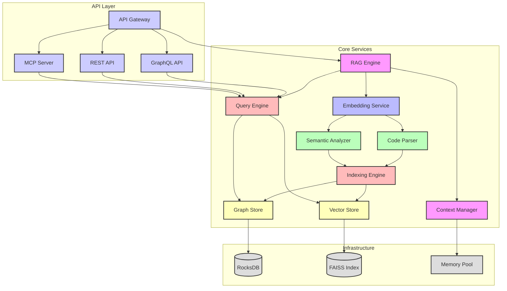

# CodeGraph Component Dependencies

```mermaid
graph TD
    subgraph "Core Services"
        RAG[RAG Engine]
        EMB[Embedding Service]
        PAR[Code Parser]
        ANA[Semantic Analyzer]
        IND[Indexing Engine]
        QUE[Query Engine]
        GS[Graph Store]
        VS[Vector Store]
        CTX[Context Manager]
    end

    subgraph "API Layer"
        API[API Gateway]
        GQL[GraphQL API]
        REST[REST API]
        MCP[MCP Server]
    end

    subgraph "Infrastructure"
        RDB[(RocksDB)]
        FAISS[(FAISS Index)]
        MEM[Memory Pool]
    end

    API --> RAG
    API --> GQL
    API --> REST
    API --> MCP

    RAG --> EMB
    RAG --> CTX
    RAG --> QUE

    EMB --> PAR
    EMB --> ANA

    PAR --> IND
    ANA --> IND

    IND --> GS
    IND --> VS

    QUE --> GS
    QUE --> VS

    GS --> RDB
    VS --> FAISS
    CTX --> MEM

    GQL --> QUE
    REST --> QUE
    MCP --> QUE

    style RAG fill:#f9f,stroke:#333,stroke-width:2px
    style EMB fill:#bbf,stroke:#333,stroke-width:2px
    style PAR fill:#bfb,stroke:#333,stroke-width:2px
    style ANA fill:#bfb,stroke:#333,stroke-width:2px
    style IND fill:#fbb,stroke:#333,stroke-width:2px
    style QUE fill:#fbb,stroke:#333,stroke-width:2px
    style GS fill:#ffb,stroke:#333,stroke-width:2px
    style VS fill:#ffb,stroke:#333,stroke-width:2px
    style CTX fill:#f9f,stroke:#333,stroke-width:2px
    style API fill:#ccf,stroke:#333,stroke-width:2px
    style GQL fill:#ccf,stroke:#333,stroke-width:2px
    style REST fill:#ccf,stroke:#333,stroke-width:2px
    style MCP fill:#ccf,stroke:#333,stroke-width:2px
    style RDB fill:#ddd,stroke:#333,stroke-width:2px
    style FAISS fill:#ddd,stroke:#333,stroke-width:2px
    style MEM fill:#ddd,stroke:#333,stroke-width:2px
```
