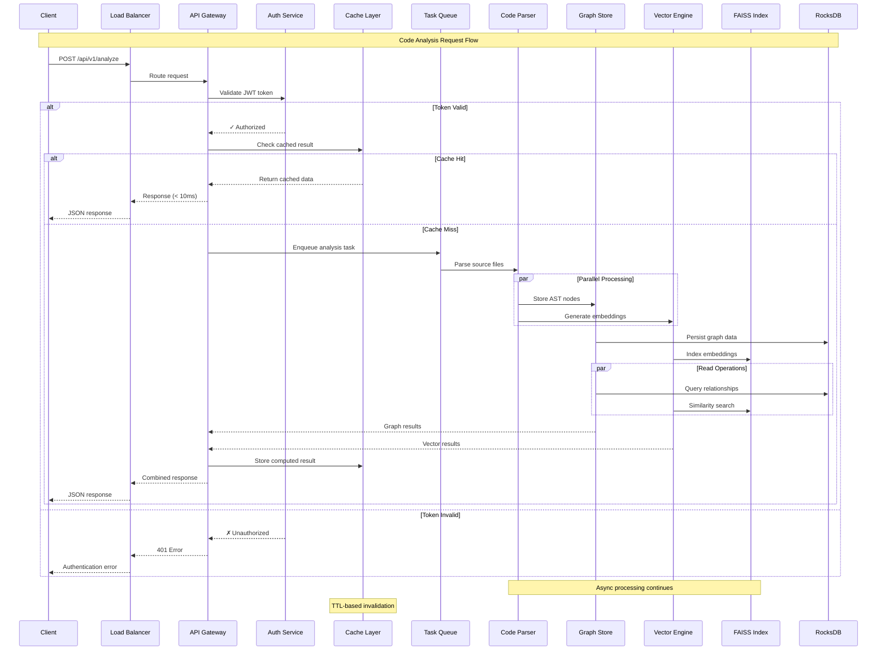
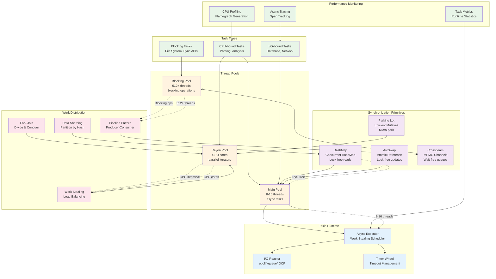

# CodeGraph Data Flow & Performance Architecture

This document details the data flow patterns, performance optimization strategies, and runtime behavior of the CodeGraph system.

## Request Processing Data Flow



## Code Parsing Pipeline

```mermaid
flowchart TD
    subgraph "Input Sources"
        Git[Git Repository]
        Files[File System]
        Archive[Archive Files]
        Stream[Streaming Input]
    end
    
    subgraph "Pre-processing"
        Filter[File Filter<br/>Language Detection]
        Validate[Validation<br/>Size & Format Check]
        Queue_Input[Input Queue<br/>Rate Limiting]
    end
    
    subgraph "Parsing Engine (Tree-sitter)"
        TS_Rust[Rust Parser]
        TS_Python[Python Parser]
        TS_JS[JavaScript Parser]
        TS_TS[TypeScript Parser]
        TS_Go[Go Parser]
        TS_Java[Java Parser]
        TS_CPP[C++ Parser]
    end
    
    subgraph "AST Processing"
        Visitor[AST Visitor<br/>Pattern Extraction]
        Normalize[Normalization<br/>Language Agnostic]
        Extract[Entity Extraction<br/>Functions, Classes, etc.]
    end
    
    subgraph "Parallel Output Streams"
        GraphOut[Graph Nodes<br/>→ RocksDB]
        VectorOut[Embeddings<br/>→ FAISS]
        CacheOut[Hot Data<br/>→ Memory Cache]
        IndexOut[Search Index<br/>→ Full-text]
    end
    
    %% Input flow
    Git --> Filter
    Files --> Filter
    Archive --> Filter
    Stream --> Filter
    
    %% Pre-processing
    Filter --> Validate
    Validate --> Queue_Input
    
    %% Language routing
    Queue_Input --> TS_Rust
    Queue_Input --> TS_Python
    Queue_Input --> TS_JS
    Queue_Input --> TS_TS
    Queue_Input --> TS_Go
    Queue_Input --> TS_Java
    Queue_Input --> TS_CPP
    
    %% AST processing
    TS_Rust --> Visitor
    TS_Python --> Visitor
    TS_JS --> Visitor
    TS_TS --> Visitor
    TS_Go --> Visitor
    TS_Java --> Visitor
    TS_CPP --> Visitor
    
    Visitor --> Normalize
    Normalize --> Extract
    
    %% Parallel outputs
    Extract --> GraphOut
    Extract --> VectorOut
    Extract --> CacheOut
    Extract --> IndexOut
    
    %% Performance annotations
    Filter -.->|"~1ms/file"| Validate
    Validate -.->|"~500μs"| Queue_Input
    Queue_Input -.->|"~50k files/min"| TS_Rust
    Visitor -.->|"~10ms/1k LOC"| Normalize
    Extract -.->|"~4 streams"| GraphOut
    
    %% Styling
    classDef input fill:#e3f2fd
    classDef preprocess fill:#e8f5e8
    classDef parser fill:#fff3e0
    classDef ast fill:#f3e5f5
    classDef output fill:#fce4ec
    
    class Git,Files,Archive,Stream input
    class Filter,Validate,Queue_Input preprocess
    class TS_Rust,TS_Python,TS_JS,TS_TS,TS_Go,TS_Java,TS_CPP parser
    class Visitor,Normalize,Extract ast
    class GraphOut,VectorOut,CacheOut,IndexOut output
```



## Vector Search Performance Flow

```mermaid
graph TB
    subgraph "Query Processing"
        QueryIn[Search Query<br/>Text/Code]
        Embedding[Query Embedding<br/>OpenAI/Local Model]
        Normalize[Vector Normalization<br/>L2 Norm]
    end
    
    subgraph "Index Selection (FAISS)"
        IndexFlat[IndexFlatL2<br/>Exact Search<br/>O(n)]
        IndexIVF[IndexIVF<br/>Inverted File<br/>O(nprobe)]
        IndexPQ[IndexPQ<br/>Product Quantization<br/>O(1) approx]
        IndexHNSW[IndexHNSW<br/>Graph-based<br/>O(log n)]
    end
    
    subgraph "Search Strategy"
        Strategy{Search Strategy}
        Exact[Exact Search<br/>100% Recall]
        Fast[Fast Search<br/>~95% Recall]
        Approximate[Approximate<br/>~85% Recall]
    end
    
    subgraph "Post-processing"
        Rerank[Re-ranking<br/>Graph Context]
        Filter[Result Filtering<br/>Relevance Score]
        Format[Response Formatting<br/>JSON/GraphQL]
    end
    
    subgraph "Performance Metrics"
        Latency[Latency<br/>< 50ms p99]
        Throughput[Throughput<br/>1000+ QPS]
        Memory[Memory Usage<br/>< 500MB/1M vectors]
        Accuracy[Accuracy<br/>85-100% recall]
    end
    
    %% Query flow
    QueryIn --> Embedding
    Embedding --> Normalize
    
    %% Index routing
    Normalize --> Strategy
    Strategy -->|High Accuracy| Exact
    Strategy -->|Balanced| Fast  
    Strategy -->|High Speed| Approximate
    
    %% Index selection
    Exact --> IndexFlat
    Fast --> IndexIVF
    Fast --> IndexHNSW
    Approximate --> IndexPQ
    
    %% Search execution
    IndexFlat --> Rerank
    IndexIVF --> Rerank
    IndexPQ --> Rerank
    IndexHNSW --> Rerank
    
    %% Post-processing
    Rerank --> Filter
    Filter --> Format
    
    %% Performance connections
    IndexFlat -.-> Latency
    IndexIVF -.-> Throughput
    IndexPQ -.-> Memory
    IndexHNSW -.-> Accuracy
    
    %% Performance annotations
    IndexFlat -.->|"~100ms/1M"| Rerank
    IndexIVF -.->|"~10ms/1M"| Rerank
    IndexPQ -.->|"~1ms/1M"| Rerank
    IndexHNSW -.->|"~5ms/1M"| Rerank
    
    %% Styling
    classDef query fill:#e3f2fd
    classDef index fill:#e8f5e8
    classDef strategy fill:#fff3e0
    classDef post fill:#f3e5f5
    classDef metrics fill:#fce4ec
    
    class QueryIn,Embedding,Normalize query
    class IndexFlat,IndexIVF,IndexPQ,IndexHNSW index
    class Strategy,Exact,Fast,Approximate strategy
    class Rerank,Filter,Format post
    class Latency,Throughput,Memory,Accuracy metrics
```

## Memory Management & Optimization

```mermaid
graph TB
    subgraph "Memory Hierarchy"
        CPU[CPU Cache<br/>L1/L2/L3]
        RAM[System RAM<br/>Working Set]
        SSD[NVMe SSD<br/>Persistent Data]
        HDD[Network Storage<br/>Cold Data]
    end
    
    subgraph "Rust Memory Model"
        Stack[Stack Memory<br/>Local Variables<br/>Function Calls]
        Heap[Heap Memory<br/>Dynamic Allocation<br/>Vec, HashMap]
        Static[Static Memory<br/>Global Constants<br/>Binary Data]
    end
    
    subgraph "Zero-Copy Optimizations"
        RKYV[rkyv Archives<br/>Zero Deserialization]
        MemMap[Memory Mapping<br/>mmap() Files]
        Bytes[Bytes Crate<br/>Reference Counting]
        Arc[Arc<T><br/>Shared Ownership]
    end
    
    subgraph "Cache Layers"
        L1_Code[L1: Parsed AST<br/>Hot Code Objects]
        L2_Vector[L2: Vector Cache<br/>Embedding Results] 
        L3_Graph[L3: Graph Cache<br/>Query Results]
        L4_Disk[L4: Persistent<br/>RocksDB + FAISS]
    end
    
    subgraph "Memory Pools"
        ParsePool[Parser Pool<br/>AST Node Reuse]
        BufferPool[Buffer Pool<br/>I/O Buffer Reuse]
        ObjectPool[Object Pool<br/>Heavy Object Reuse]
    end
    
    subgraph "Garbage Collection"
        RefCount[Reference Counting<br/>Automatic Cleanup]
        RAII[RAII Pattern<br/>Deterministic Cleanup]
        WeakRef[Weak References<br/>Cycle Prevention]
    end
    
    %% Memory hierarchy flow
    CPU --> RAM
    RAM --> SSD
    SSD --> HDD
    
    %% Rust memory model
    Stack -.->|"Fast allocation"| CPU
    Heap -.->|"Heap allocation"| RAM
    Static -.->|"Read-only"| RAM
    
    %% Zero-copy optimizations
    RKYV --> RAM
    MemMap --> SSD
    Bytes --> Heap
    Arc --> Heap
    
    %% Cache hierarchy
    L1_Code --> CPU
    L2_Vector --> RAM
    L3_Graph --> SSD
    L4_Disk --> HDD
    
    %% Memory pools
    ParsePool --> Heap
    BufferPool --> Heap
    ObjectPool --> Heap
    
    %% Garbage collection
    RefCount --> Heap
    RAII --> Stack
    WeakRef --> Heap
    
    %% Performance annotations
    CPU -.->|"~1ns access"| L1_Code
    RAM -.->|"~100ns access"| L2_Vector
    SSD -.->|"~100μs access"| L3_Graph
    HDD -.->|"~10ms access"| L4_Disk
    
    %% Optimization flows
    RKYV -.->|"Zero copy"| L1_Code
    MemMap -.->|"Virtual memory"| L3_Graph
    ParsePool -.->|"Object reuse"| L1_Code
    
    %% Styling
    classDef hierarchy fill:#e3f2fd
    classDef rust fill:#e8f5e8
    classDef zerocopy fill:#fff3e0
    classDef cache fill:#f3e5f5
    classDef pool fill:#fce4ec
    classDef gc fill:#e8f5e8
    
    class CPU,RAM,SSD,HDD hierarchy
    class Stack,Heap,Static rust
    class RKYV,MemMap,Bytes,Arc zerocopy
    class L1_Code,L2_Vector,L3_Graph,L4_Disk cache
    class ParsePool,BufferPool,ObjectPool pool
    class RefCount,RAII,WeakRef gc
```

## Concurrency & Parallelism Model



## Real-time Performance Monitoring

```mermaid
graph TB
    subgraph "Application Metrics"
        QPS[Queries Per Second<br/>Request Rate]
        Latency[Response Latency<br/>p50, p95, p99]
        ErrorRate[Error Rate<br/>4xx, 5xx responses]
        Throughput[Data Throughput<br/>MB/s processed]
    end
    
    subgraph "System Metrics"
        CPU[CPU Usage<br/>Per-core utilization]
        Memory[Memory Usage<br/>RSS, heap, cache]
        Disk[Disk I/O<br/>Read/write IOPS]
        Network[Network I/O<br/>Bandwidth usage]
    end
    
    subgraph "Database Metrics"
        RocksStats[RocksDB Stats<br/>Read/write amplification]
        CacheHit[Cache Hit Rate<br/>L1, L2, L3 layers]
        CompactionLag[Compaction Lag<br/>Background tasks]
        BloomFilter[Bloom Filter<br/>False positive rate]
    end
    
    subgraph "Vector Engine Metrics"
        IndexSize[Index Size<br/>Memory footprint]
        SearchTime[Search Time<br/>Query latency]
        RecallRate[Recall Rate<br/>Search accuracy]
        UpdateRate[Update Rate<br/>Index rebuilds]
    end
    
    subgraph "Custom Metrics"
        ParseTime[Parse Time<br/>Per file/project]
        QueueDepth[Queue Depth<br/>Pending tasks]
        ConcurrentUsers[Concurrent Users<br/>Active connections]
        ResourceUsage[Resource Usage<br/>Per-tenant metrics]
    end
    
    subgraph "Alerting Rules"
        HighLatency[High Latency<br/>> 100ms p95]
        HighErrorRate[High Error Rate<br/>> 1% errors]
        HighMemory[High Memory<br/>> 80% usage]
        DiskFull[Disk Full<br/>> 90% usage]
    end
    
    subgraph "Monitoring Stack"
        Prometheus[Prometheus<br/>Metrics Collection]
        Grafana[Grafana<br/>Visualization]
        AlertManager[AlertManager<br/>Notification routing]
        Jaeger[Jaeger<br/>Distributed tracing]
    end
    
    %% Metric collection
    QPS --> Prometheus
    Latency --> Prometheus
    ErrorRate --> Prometheus
    Throughput --> Prometheus
    
    CPU --> Prometheus
    Memory --> Prometheus
    Disk --> Prometheus
    Network --> Prometheus
    
    RocksStats --> Prometheus
    CacheHit --> Prometheus
    CompactionLag --> Prometheus
    BloomFilter --> Prometheus
    
    IndexSize --> Prometheus
    SearchTime --> Prometheus
    RecallRate --> Prometheus
    UpdateRate --> Prometheus
    
    ParseTime --> Prometheus
    QueueDepth --> Prometheus
    ConcurrentUsers --> Prometheus
    ResourceUsage --> Prometheus
    
    %% Alerting
    Prometheus --> HighLatency
    Prometheus --> HighErrorRate
    Prometheus --> HighMemory
    Prometheus --> DiskFull
    
    %% Monitoring stack
    Prometheus --> Grafana
    Prometheus --> AlertManager
    HighLatency --> AlertManager
    HighErrorRate --> AlertManager
    HighMemory --> AlertManager
    DiskFull --> AlertManager
    
    %% Distributed tracing
    QPS --> Jaeger
    Latency --> Jaeger
    
    %% Performance thresholds
    QPS -.->|"Target: 1000+ QPS"| Prometheus
    Latency -.->|"Target: <50ms p99"| Prometheus
    CacheHit -.->|"Target: >95%"| Prometheus
    SearchTime -.->|"Target: <10ms"| Prometheus
    
    %% Styling
    classDef app fill:#e3f2fd
    classDef system fill:#e8f5e8
    classDef database fill:#fff3e0
    classDef vector fill:#f3e5f5
    classDef custom fill:#fce4ec
    classDef alert fill:#ffebee
    classDef monitor fill:#e8f5e8
    
    class QPS,Latency,ErrorRate,Throughput app
    class CPU,Memory,Disk,Network system
    class RocksStats,CacheHit,CompactionLag,BloomFilter database
    class IndexSize,SearchTime,RecallRate,UpdateRate vector
    class ParseTime,QueueDepth,ConcurrentUsers,ResourceUsage custom
    class HighLatency,HighErrorRate,HighMemory,DiskFull alert
    class Prometheus,Grafana,AlertManager,Jaeger monitor
```



## Deployment Performance Profile

```ascii
╔══════════════════════════════════════════════════════════════════════════════════════════════════════════════╗
║                                     CodeGraph Performance Profiles                                          ║
╠══════════════════════════════════════════════════════════════════════════════════════════════════════════════╣
║                                                                                                              ║
║  ┌─────────────────────────────────────────────────────────────────────────────────────────────────────┐   ║
║  │                                    Deployment Configurations                                          │   ║
║  └─────────────────────────────────────────────────────────────────────────────────────────────────────┘   ║
║                                                                                                              ║
║  🔹 DEVELOPMENT (Local)                  🔹 STAGING (Single Node)                  🔹 PRODUCTION (Cluster)   ║
║                                                                                                              ║
║    CPU: 4-8 cores                         CPU: 8-16 cores                         CPU: 32+ cores/node     ║
║    RAM: 8-16 GB                           RAM: 32-64 GB                           RAM: 128+ GB/node       ║
║    Storage: 100 GB SSD                    Storage: 500 GB NVMe                    Storage: 2+ TB NVMe     ║
║    Network: Local                         Network: 1 Gbps                        Network: 10+ Gbps       ║
║                                                                                                              ║
║    Performance Targets:                   Performance Targets:                    Performance Targets:     ║
║    • QPS: 10-50                          • QPS: 100-500                         • QPS: 1000-10000        ║
║    • Latency: < 100ms                    • Latency: < 75ms                      • Latency: < 50ms        ║
║    • Projects: 1-5                       • Projects: 10-50                      • Projects: 100-1000     ║
║    • Users: 1-3                          • Users: 5-25                          • Users: 100-10000       ║
║                                                                                                              ║
║  ┌─────────────────────────────────────────────────────────────────────────────────────────────────────┐   ║
║  │                                     Performance Optimization Matrix                                   │   ║
║  ├─────────────────────────────────────────────────────────────────────────────────────────────────────┤   ║
║  │  Component            │ Development  │ Staging      │ Production   │ Optimization Strategy              │   ║
║  ├─────────────────────────────────────────────────────────────────────────────────────────────────────┤   ║
║  │  API Server           │ 1 instance   │ 2 instances  │ 3-10 instances│ Auto-scaling, load balancing    │   ║
║  │  Parser Workers       │ 2 threads    │ 8 threads    │ 32+ threads  │ Multi-threading, work stealing   │   ║
║  │  RocksDB              │ Default      │ Tuned        │ Optimized    │ Column families, bloom filters   │   ║
║  │  FAISS Index          │ Flat         │ IVF          │ HNSW/PQ      │ Index type selection            │   ║
║  │  Memory Cache         │ 512 MB       │ 4 GB         │ 32+ GB       │ Cache layers, TTL policies      │   ║
║  │  Network I/O          │ HTTP/1.1     │ HTTP/2       │ HTTP/2+gRPC  │ Protocol optimization           │   ║
║  │  Observability        │ Basic logs   │ Metrics      │ Full tracing │ Prometheus, Grafana, Jaeger     │   ║
║  └─────────────────────────────────────────────────────────────────────────────────────────────────────┘   ║
║                                                                                                              ║
║  ┌─────────────────────────────────────────────────────────────────────────────────────────────────────┐   ║
║  │                                      Scaling Strategies                                              │   ║
║  ├─────────────────────────────────────────────────────────────────────────────────────────────────────┤   ║
║  │  Horizontal Scaling:                                                                                 │   ║
║  │  • API Layer: Load balancer + multiple instances                                                     │   ║
║  │  • Processing: Distributed task queue across nodes                                                   │   ║
║  │  • Storage: Sharded RocksDB instances                                                                │   ║
║  │  • Vector Search: Distributed FAISS indices                                                          │   ║
║  │                                                                                                       │   ║
║  │  Vertical Scaling:                                                                                   │   ║
║  │  • CPU: More cores for parsing and vector operations                                                 │   ║
║  │  • Memory: Larger caches and in-memory indices                                                       │   ║
║  │  • Storage: Faster NVMe for better I/O performance                                                   │   ║
║  │  • Network: Higher bandwidth for distributed operations                                              │   ║
║  │                                                                                                       │   ║
║  │  Auto-scaling Triggers:                                                                              │   ║
║  │  • CPU utilization > 70% for 5 minutes                                                              │   ║
║  │  • Queue depth > 1000 pending tasks                                                                  │   ║
║  │  • Response latency > 100ms p95 for 2 minutes                                                        │   ║
║  │  • Memory usage > 80% for 5 minutes                                                                  │   ║
║  └─────────────────────────────────────────────────────────────────────────────────────────────────────┘   ║
║                                                                                                              ║
║  ┌─────────────────────────────────────────────────────────────────────────────────────────────────────┐   ║
║  │                                     Bottleneck Analysis                                              │   ║
║  ├─────────────────────────────────────────────────────────────────────────────────────────────────────┤   ║
║  │  Common Bottlenecks:                               │ Mitigation Strategies:                         │   ║
║  │                                                    │                                                │   ║
║  │  1. Parser CPU Usage (Tree-sitter intensive)      │ • Multi-threading with rayon                  │   ║
║  │     • Large codebases overwhelm single thread     │ • File-level parallelism                      │   ║
║  │     • Complex language grammars slow parsing      │ • Incremental parsing                         │   ║
║  │                                                    │ • Parser result caching                       │   ║
║  │  2. Vector Search Latency (FAISS queries)         │ • Index optimization (HNSW/PQ)                │   ║
║  │     • Large embedding spaces (>1M vectors)        │ • Query batching                              │   ║
║  │     • High-dimensional vectors (768/1536 dims)    │ • Approximate search                          │   ║
║  │                                                    │ • Multi-level caching                         │   ║
║  │  3. Database I/O (RocksDB operations)             │ • SST file optimization                       │   ║
║  │     • Write amplification during bulk inserts     │ • Bloom filter tuning                         │   ║
║  │     • Compaction lag during heavy writes          │ • Background compaction threads               │   ║
║  │                                                    │ • Write buffer optimization                    │   ║
║  │  4. Memory Pressure (Large projects)              │ • Memory mapping for large files              │   ║
║  │     • AST nodes consume significant memory        │ • Lazy loading strategies                     │   ║
║  │     • Vector embeddings cache bloat               │ • Memory pool management                       │   ║
║  │                                                    │ • Garbage collection tuning                   │   ║
║  └─────────────────────────────────────────────────────────────────────────────────────────────────────┘   ║
╚══════════════════════════════════════════════════════════════════════════════════════════════════════════════╝
```

---

*Generated by CodeGraph Documentation Specialist - Data Flow & Performance Analysis*