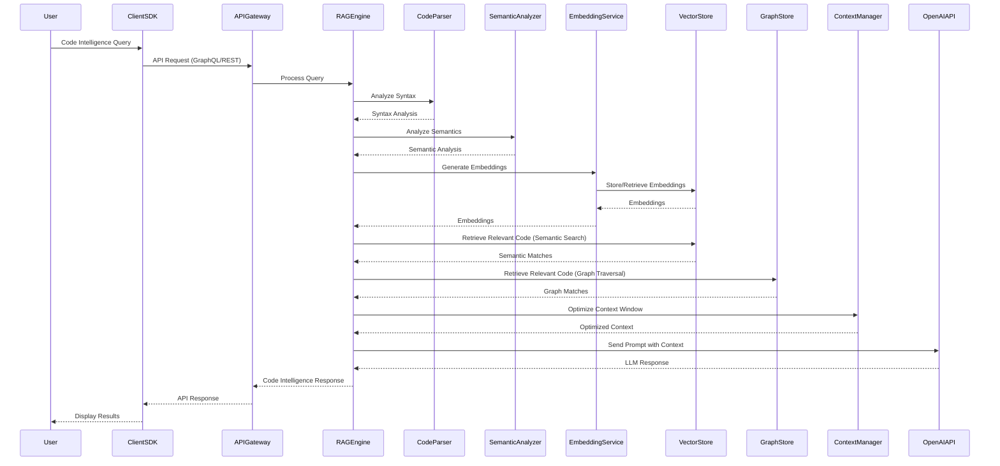

# CodeGraph Data Flow Diagram (Query Processing)

```mermaid
sequenceDiagram
    participant User
    participant ClientSDK
    participant APIGateway
    participant RAGEngine
    participant CodeParser
    participant SemanticAnalyzer
    participant EmbeddingService
    participant VectorStore
    participant GraphStore
    participant ContextManager
    participant OpenAIAPI

    User->>ClientSDK: Code Intelligence Query
    ClientSDK->>APIGateway: API Request (GraphQL/REST)
    APIGateway->>RAGEngine: Process Query

    RAGEngine->>CodeParser: Analyze Syntax
    CodeParser-->>RAGEngine: Syntax Analysis
    RAGEngine->>SemanticAnalyzer: Analyze Semantics
    SemanticAnalyzer-->>RAGEngine: Semantic Analysis

    RAGEngine->>EmbeddingService: Generate Embeddings
    EmbeddingService->>VectorStore: Store/Retrieve Embeddings
    VectorStore-->>EmbeddingService: Embeddings
    EmbeddingService-->>RAGEngine: Embeddings

    RAGEngine->>VectorStore: Retrieve Relevant Code (Semantic Search)
    VectorStore-->>RAGEngine: Semantic Matches
    RAGEngine->>GraphStore: Retrieve Relevant Code (Graph Traversal)
    GraphStore-->>RAGEngine: Graph Matches

    RAGEngine->>ContextManager: Optimize Context Window
    ContextManager-->>RAGEngine: Optimized Context

    RAGEngine->>OpenAIAPI: Send Prompt with Context
    OpenAIAPI-->>RAGEngine: LLM Response

    RAGEngine-->>APIGateway: Code Intelligence Response
    APIGateway-->>ClientSDK: API Response
    ClientSDK-->>User: Display Results
```
