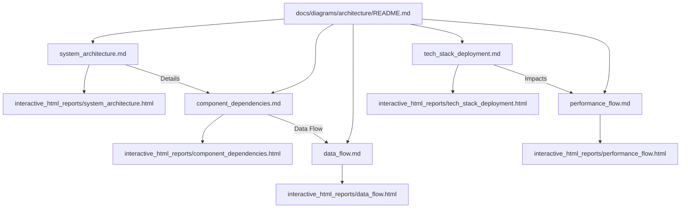

# Architecture Documentation Taxonomy

## Overview

This document outlines the information architecture and taxonomy for the CodeGraph architecture diagrams, ensuring a clear and navigable structure for both developers and stakeholders.

## Documentation Structure

```
docs/diagrams/architecture/
├── README.md                       # Overview and navigation for all diagrams
├── system_architecture.md          # High-level system overview
├── component_dependencies.md       # Detailed component interactions
├── data_flow.md                    # Data flow through the system
├── tech_stack_deployment.md        # Technology stack and deployment architecture
├── performance_flow.md             # Performance optimization layers
└── interactive_html_reports/       # Directory for interactive HTML outputs
    ├── system_architecture.html
    ├── component_dependencies.html
    ├── data_flow.html
    ├── tech_stack_deployment.html
    └── performance_flow.html
```

## Navigation Flow

- **Primary Navigation**: Users will typically start from `docs/diagrams/architecture/README.md` which will serve as an index.
- **Cross-references**: Diagrams will link to each other where relevant (e.g., system architecture linking to component dependencies).
- **Search Optimization**: Keywords will be used in markdown files to ensure discoverability.
- **Progressive Disclosure**: High-level diagrams will be presented first, with options to drill down into more detailed views (e.g., via interactive HTML).

## Documentation Map (Conceptual)


