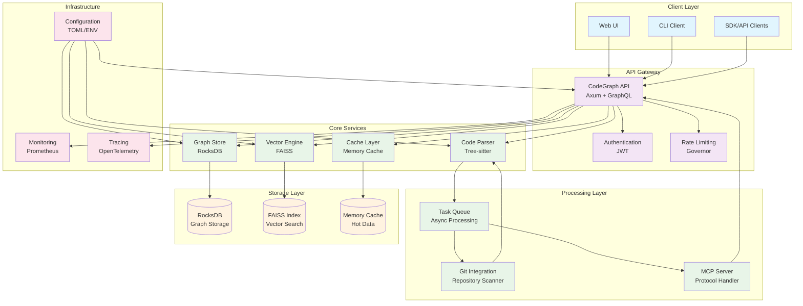
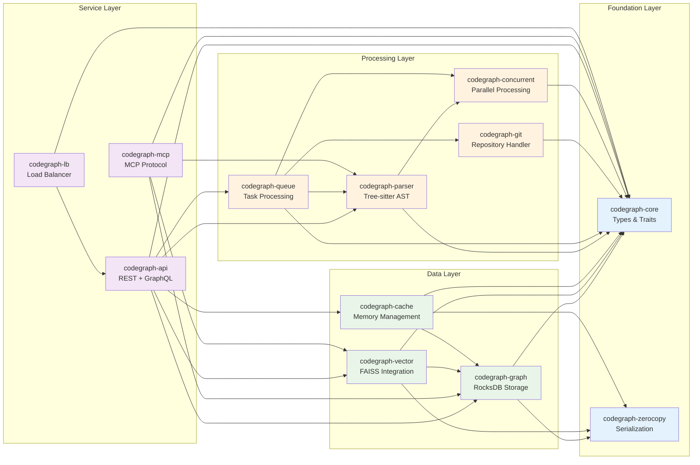
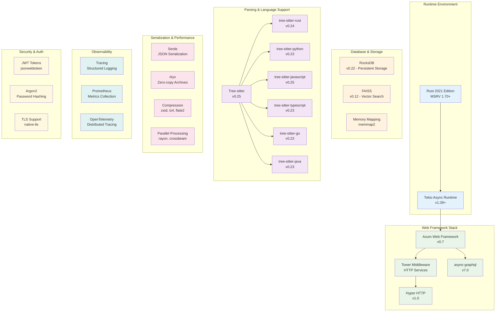
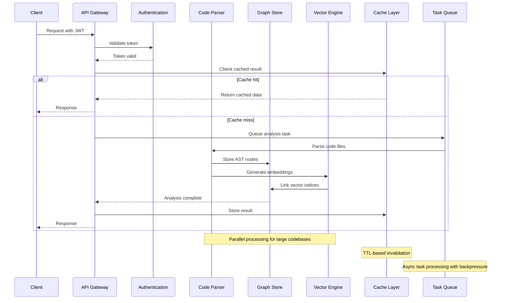
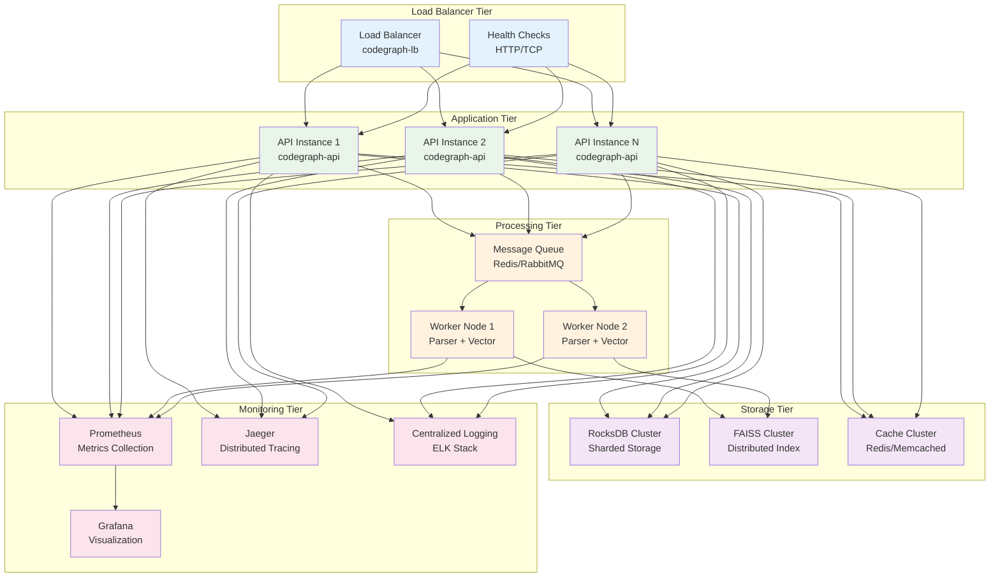

# CodeGraph System Architecture Overview

This document provides comprehensive architecture diagrams for the CodeGraph system, showing the relationships between its components, data flow, and technology stack.

## High-Level System Architecture



## Component Dependency Graph



## Technology Stack Visualization



## Data Flow Architecture



## Performance Optimization Layers

```mermaid
graph TD
    subgraph "Request Level Optimizations"
        Compress[Response Compression<br/>Brotli, Gzip, Deflate]
        Stream[Streaming Responses<br/>Large Dataset Handling]
        Batch[Request Batching<br/>Multiple Operations]
    end
    
    subgraph "Application Level Optimizations"
        MemPool[Memory Pooling<br/>Object Reuse]
        ZeroCopy[Zero-Copy Serialization<br/>rkyv Archives]
        Parallel[Parallel Processing<br/>rayon, crossbeam]
        Cache[Multi-Level Caching<br/>Hot Data Management]
    end
    
    subgraph "Database Optimizations"
        RocksOpt[RocksDB Tuning<br/>Column Families, Bloom Filters]
        FAISSIdx[FAISS Index Optimization<br/>IVF, PQ Compression]
        MemMap[Memory Mapping<br/>Large File Handling]
        Bulk[Bulk Operations<br/>Batch Writes]
    end
    
    subgraph "System Level Optimizations"
        Async[Async I/O<br/>Tokio Runtime]
        LockFree[Lock-Free Data Structures<br/>DashMap, Arc-Swap]
        NUMA[NUMA Awareness<br/>Thread Affinity]
        Profiling[Continuous Profiling<br/>Memory Leak Detection]
    end
    
    %% Performance flow
    Compress --> Stream
    Stream --> Batch
    Batch --> MemPool
    
    MemPool --> ZeroCopy
    ZeroCopy --> Parallel
    Parallel --> Cache
    
    Cache --> RocksOpt
    RocksOpt --> FAISSIdx
    FAISSIdx --> MemMap
    MemMap --> Bulk
    
    Bulk --> Async
    Async --> LockFree
    LockFree --> NUMA
    NUMA --> Profiling
    
    %% Styling
    classDef request fill:#e3f2fd
    classDef app fill:#e8f5e8
    classDef db fill:#fff3e0
    classDef system fill:#f3e5f5
    
    class Compress,Stream,Batch request
    class MemPool,ZeroCopy,Parallel,Cache app
    class RocksOpt,FAISSIdx,MemMap,Bulk db
    class Async,LockFree,NUMA,Profiling system
```



## Deployment Architecture



## Crate Interaction Matrix

```ascii
╔═══════════════════════════════════════════════════════════════════════════════════════════════════════════════╗
║                                    CodeGraph Crate Dependency Matrix                                         ║
╠═══════════════════════════════════════════════════════════════════════════════════════════════════════════════╣
║ Crate              │ core │ zero │ graph│ vect │ cache│ parse│ queue│ git  │ conc │ api  │ mcp  │ lb   │ Description ║
╠════════════════════┼══════┼══════┼══════┼══════┼══════┼══════┼══════┼══════┼══════┼══════┼══════┼══════┼═══════════════╣
║ codegraph-core     │  ●   │  -   │  -   │  -   │  -   │  -   │  -   │  -   │  -   │  -   │  -   │  -   │ Foundation    ║
║ codegraph-zerocopy │  ●   │  ●   │  -   │  -   │  -   │  -   │  -   │  -   │  -   │  -   │  -   │  -   │ Serialization ║
║ codegraph-graph    │  ●   │  ●   │  ●   │  -   │  -   │  -   │  -   │  -   │  -   │  -   │  -   │  -   │ RocksDB Store ║
║ codegraph-vector   │  ●   │  ●   │  ○   │  ●   │  -   │  -   │  -   │  -   │  -   │  -   │  -   │  -   │ FAISS Search  ║
║ codegraph-cache    │  ●   │  ●   │  ○   │  -   │  ●   │  -   │  -   │  -   │  -   │  -   │  -   │  -   │ Memory Cache  ║
║ codegraph-parser   │  ●   │  -   │  -   │  -   │  -   │  ●   │  -   │  -   │  ○   │  -   │  -   │  -   │ Tree-sitter   ║
║ codegraph-queue    │  ●   │  -   │  -   │  -   │  -   │  -   │  ●   │  -   │  ○   │  -   │  -   │  -   │ Task Queue    ║
║ codegraph-git      │  ●   │  -   │  -   │  -   │  -   │  ○   │  -   │  ●   │  -   │  -   │  -   │  -   │ Git Handler   ║
║ codegraph-concurrent│ ●   │  -   │  -   │  -   │  -   │  -   │  -   │  -   │  ●   │  -   │  -   │  -   │ Parallelism   ║
║ codegraph-api      │  ●   │  -   │  ●   │  ●   │  ●   │  ●   │  ●   │  -   │  -   │  ●   │  -   │  -   │ REST+GraphQL  ║
║ codegraph-mcp      │  ●   │  -   │  ●   │  ●   │  -   │  ●   │  -   │  -   │  -   │  -   │  ●   │  -   │ MCP Protocol  ║
║ codegraph-lb       │  ●   │  -   │  -   │  -   │  -   │  -   │  -   │  -   │  -   │  ●   │  -   │  ●   │ Load Balancer ║
╚════════════════════┴══════┴══════┴══════┴══════┴══════┴══════┴══════┴══════┴══════┴══════┴══════┴══════┴═══════════════╝

Legend:
● Direct dependency (required)
○ Optional dependency (feature-gated or weak)
- No dependency

Critical Paths:
1. API → Core → Graph → RocksDB (Data persistence)
2. API → Vector → FAISS (Similarity search)
3. Parser → Core → Concurrent (Code analysis)
4. MCP → API → All services (Protocol integration)
```

## Memory Layout and Optimization

```ascii
╔══════════════════════════════════════════════════════════════════════════════════════════════════════════════╗
║                                     CodeGraph Memory Architecture                                           ║
╠══════════════════════════════════════════════════════════════════════════════════════════════════════════════╣
║                                                                                                              ║
║  ┌─────────────────────────────────────────────────────────────────────────────────────────────────────┐   ║
║  │                                    Process Memory Space                                              │   ║
║  └─────────────────────────────────────────────────────────────────────────────────────────────────────┘   ║
║                                                                                                              ║
║  ┌───────────────┐  ┌─────────────────┐  ┌──────────────────┐  ┌─────────────────────────────────────┐     ║
║  │  Stack        │  │  Heap           │  │  Memory Mapped   │  │  Zero-Copy Archives                 │     ║
║  │               │  │                 │  │  Files           │  │                                     │     ║
║  │  - Tokio      │  │  - AST Nodes    │  │                  │  │  - rkyv Serialized                 │     ║
║  │    Tasks      │  │  - Hash Maps    │  │  - Large RocksDB │  │    Data Structures                 │     ║
║  │  - Function   │  │  - Vector Data  │  │    Files         │  │  - Immutable Archives              │     ║
║  │    Calls      │  │  - Cache Entries│  │  - FAISS Indices │  │  - Direct Memory Access            │     ║
║  │  - Local Vars │  │  - Buffers      │  │  - Log Files     │  │  - No Serialization Cost           │     ║
║  └───────────────┘  └─────────────────┘  └──────────────────┘  └─────────────────────────────────────┘     ║
║        ↕                    ↕                      ↕                             ↕                         ║
║    8-16 MB             Dynamic Growth           File-backed                  Controlled Layout             ║
║                        (GC via Rust)           Virtual Memory                  (rkyv format)              ║
║                                                                                                              ║
║  ┌─────────────────────────────────────────────────────────────────────────────────────────────────────┐   ║
║  │                              Optimization Strategies                                                 │   ║
║  ├─────────────────────────────────────────────────────────────────────────────────────────────────────┤   ║
║  │  1. Arena Allocation    │ Use bumpalo for temporary allocations during parsing                      │   ║
║  │  2. Object Pooling      │ Reuse expensive objects (parsers, buffers)                               │   ║
║  │  3. Lock-Free Structs   │ DashMap, ArcSwap for concurrent access without locks                     │   ║
║  │  4. Memory Mapping      │ Direct file access for large datasets                                    │   ║
║  │  5. Zero-Copy Serde     │ rkyv for serialization without intermediate allocations                  │   ║
║  │  6. Compression         │ LZ4/Zstd for reducing memory footprint                                   │   ║
║  │  7. Lazy Loading        │ Load AST nodes on-demand from storage                                    │   ║
║  │  8. Memory Profiling    │ memscope-rs for leak detection in development                            │   ║
║  └─────────────────────────────────────────────────────────────────────────────────────────────────────┘   ║
╚══════════════════════════════════════════════════════════════════════════════════════════════════════════════╝
```

---

*Generated by CodeGraph Documentation Specialist - Architecture Visualization*