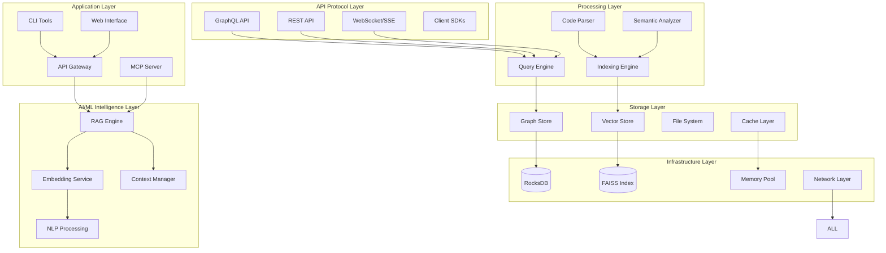

# CodeGraph System Architecture Overview

```mermaid
graph TB
    subgraph "Application Layer"
        CLI[CLI Tools]
        Web[Web Interface]
        API[API Gateway]
        MCP[MCP Server]
    end
    
    subgraph "AI/ML Intelligence Layer"
        RAG[RAG Engine]
        EMB[Embedding Service]
        NLP[NLP Processing]
        CTX[Context Manager]
    end
    
    subgraph "API Protocol Layer"
        GQL[GraphQL API]
        REST[REST API]
        WSS[WebSocket/SSE]
        SDK[Client SDKs]
    end
    
    subgraph "Processing Layer"
        PAR[Code Parser]
        ANA[Semantic Analyzer]
        IND[Indexing Engine]
        QUE[Query Engine]
    end
    
    subgraph "Storage Layer"
        GS[Graph Store]
        VS[Vector Store]
        FS[File System]
        CACHE[Cache Layer]
    end
    
    subgraph "Infrastructure Layer"
        RDB[(RocksDB)]
        FAISS[(FAISS Index)]
        MEM[Memory Pool]
        NET[Network Layer]
    end
    
    CLI --> API
    Web --> API
    API --> RAG
    MCP --> RAG
    
    RAG --> EMB
    RAG --> CTX
    EMB --> NLP
    
    GQL --> QUE
    REST --> QUE
    WSS --> QUE
    
    PAR --> IND
    ANA --> IND
    IND --> VS
    QUE --> GS
    
    GS --> RDB
    VS --> FAISS
    CACHE --> MEM
    
    NET --> ALL
```
