# CodeGraph Architecture Documentation

## Table of Contents

1. [System Overview](#system-overview)
2. [High-Level Architecture](#high-level-architecture)
3. [Component Architecture](#component-architecture)
4. [Data Flow Architecture](#data-flow-architecture)
5. [Storage Architecture](#storage-architecture)
6. [API Architecture](#api-architecture)
7. [Security Architecture](#security-architecture)
8. [Deployment Architecture](#deployment-architecture)
9. [Performance Architecture](#performance-architecture)
10. [Scalability Considerations](#scalability-considerations)

## System Overview

CodeGraph is a sophisticated code analysis and embedding system designed for high-performance graph-based code understanding. The system transforms source code into intelligent, searchable knowledge graphs that enable advanced code analysis, similarity search, and relationship discovery.

### Core Capabilities

- **Multi-language Code Parsing**: Support for Rust, Python, JavaScript, TypeScript, Go, Java, and C++
- **Graph-based Analysis**: Rich code relationships and dependency tracking
- **Vector Embeddings**: Semantic code search using FAISS vector similarity
- **Version Management**: Git-like versioning with transaction support
- **Real-time Processing**: Streaming APIs for large-scale operations
- **High Performance**: Optimized for concurrent operations with Rust's safety guarantees

### Design Principles

1. **Performance First**: Zero-cost abstractions and memory-efficient operations
2. **Concurrency Safe**: Thread-safe operations using Rust's ownership model
3. **Horizontally Scalable**: Stateless API design with distributed storage support
4. **Fault Tolerant**: Comprehensive error handling and recovery mechanisms
5. **Developer Friendly**: Clear APIs and extensive monitoring capabilities

## High-Level Architecture

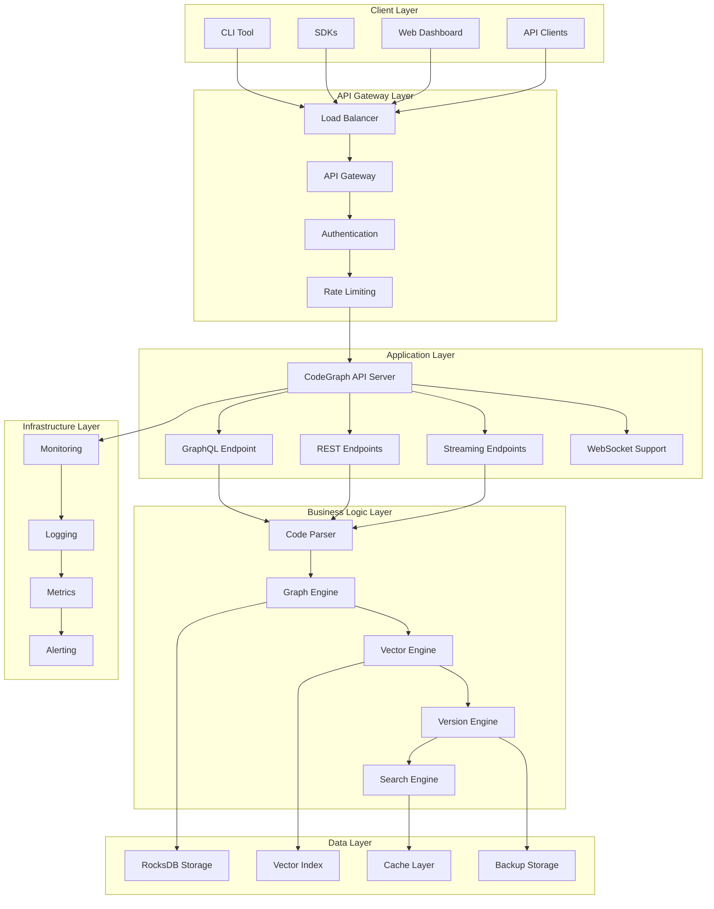

### Architecture Layers

#### 1. Client Layer
- **CLI Tool**: Command-line interface for direct operations
- **SDKs**: Language-specific client libraries (Rust, Python, JavaScript)
- **Web Dashboard**: Browser-based management interface
- **API Clients**: Third-party integrations and custom applications

#### 2. API Gateway Layer
- **Load Balancer**: Distributes incoming requests across instances
- **API Gateway**: Central entry point with routing and protocol handling
- **Authentication**: JWT and API key validation
- **Rate Limiting**: Request throttling and abuse prevention

#### 3. Application Layer
- **CodeGraph API Server**: Core Axum-based HTTP server
- **GraphQL Endpoint**: Flexible query interface with subscriptions
- **REST Endpoints**: RESTful API for standard operations
- **Streaming Endpoints**: High-throughput data streaming
- **WebSocket Support**: Real-time bidirectional communication

#### 4. Business Logic Layer
- **Code Parser**: Tree-sitter based multi-language parsing
- **Graph Engine**: Relationship management and graph operations
- **Vector Engine**: Embedding generation and similarity search
- **Version Engine**: Git-like versioning and transaction management
- **Search Engine**: Full-text and semantic search capabilities

#### 5. Data Layer
- **RocksDB Storage**: Primary persistent storage for graph data
- **Vector Index**: FAISS-based vector similarity index
- **Cache Layer**: In-memory caching for performance optimization
- **Backup Storage**: Automated backup and recovery systems

#### 6. Infrastructure Layer
- **Monitoring**: Health checks and system monitoring
- **Logging**: Structured logging with tracing
- **Metrics**: Prometheus-compatible metrics collection
- **Alerting**: Automated alert generation and notification

## Component Architecture

### Workspace Structure

```
crates/
├── codegraph-core/        # Core types and shared functionality
├── codegraph-graph/       # Graph data structures and RocksDB storage
├── codegraph-parser/      # Tree-sitter based code parsing
├── codegraph-vector/      # Vector embeddings and FAISS search
├── codegraph-cache/       # Caching and performance optimization
├── codegraph-api/         # REST API server using Axum
├── codegraph-mcp/         # Model Context Protocol support
├── codegraph-queue/       # Asynchronous task processing
├── codegraph-git/         # Git integration and version control
├── codegraph-concurrent/  # Concurrency primitives
├── codegraph-zerocopy/    # Zero-copy serialization
└── codegraph-lb/          # Load balancing components
```

### Component Dependencies

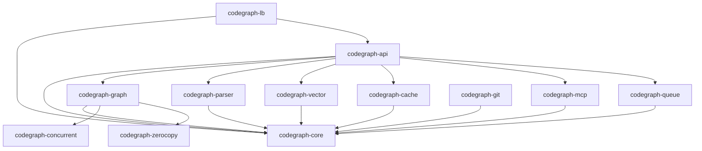

### Core Component Details

#### codegraph-core
**Purpose**: Shared types, traits, and foundational functionality

**Key Components**:
- `NodeId`, `EdgeId`: Type-safe identifiers
- `Error`: Unified error handling
- `Result<T>`: Standard result type
- `Config`: Configuration management
- `Metrics`: Performance tracking

**Traits**:
```rust
pub trait NodeStorage {
    fn get_node(&self, id: NodeId) -> Result<Option<Node>>;
    fn insert_node(&mut self, node: Node) -> Result<NodeId>;
    fn update_node(&mut self, id: NodeId, node: Node) -> Result<()>;
    fn delete_node(&mut self, id: NodeId) -> Result<()>;
}

pub trait VectorStore {
    fn search(&self, vector: &[f32], k: usize) -> Result<Vec<SimilarityResult>>;
    fn insert(&mut self, id: NodeId, vector: Vec<f32>) -> Result<()>;
    fn delete(&mut self, id: NodeId) -> Result<()>;
}
```

#### codegraph-graph
**Purpose**: Graph data structures and RocksDB storage

**Key Components**:
- `GraphStorage`: Main graph storage implementation
- `Node`: Code element representation
- `Edge`: Relationship representation
- `GraphQuery`: Query interface

**Storage Architecture**:
```rust
pub struct GraphStorage {
    db: Arc<RocksDB>,
    node_cache: Arc<DashMap<NodeId, Node>>,
    edge_cache: Arc<DashMap<EdgeId, Edge>>,
    config: StorageConfig,
}

// Column families for data organization
const NODE_CF: &str = "nodes";
const EDGE_CF: &str = "edges";
const INDEX_CF: &str = "indexes";
const METADATA_CF: &str = "metadata";
```

#### codegraph-vector
**Purpose**: Vector embeddings and FAISS search

**Key Components**:
- `VectorIndex`: FAISS index wrapper
- `EmbeddingGenerator`: Text-to-vector conversion
- `SimilaritySearch`: Search interface
- `IndexBuilder`: Index construction and optimization

**Vector Architecture**:
```rust
pub struct VectorIndex {
    index: faiss::Index,
    dimension: usize,
    metric: MetricType,
    config: IndexConfig,
}

pub enum IndexType {
    Flat,           // Exact search
    IVF(u32),      // Inverted file index
    HNSW {         // Hierarchical NSW
        m: u32,
        ef_construction: u32,
    },
}
```

## Data Flow Architecture

### Request Processing Flow

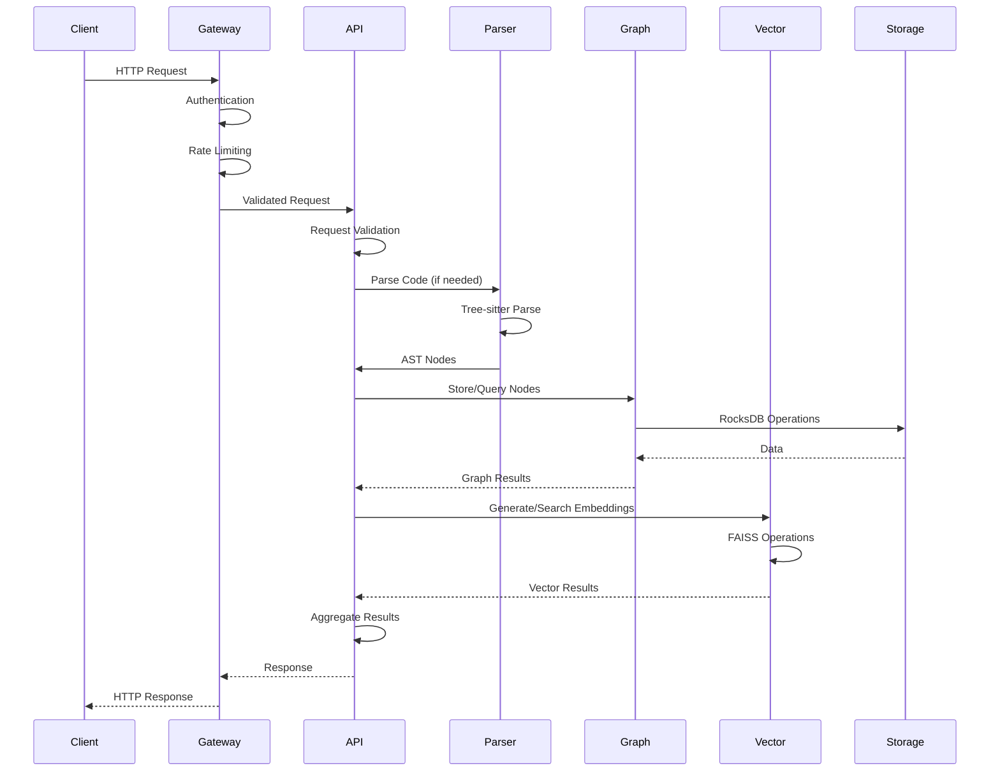

### Code Parsing Flow

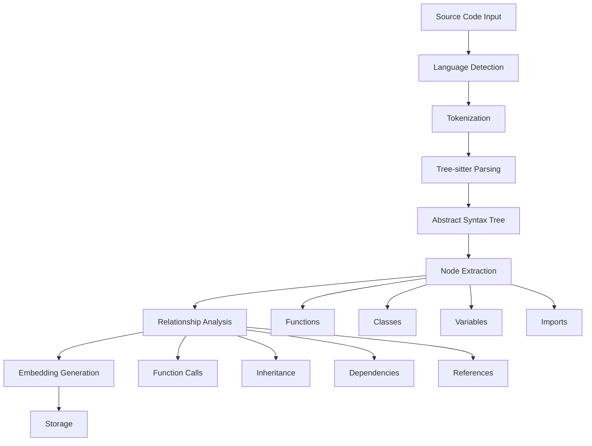

### Vector Search Flow

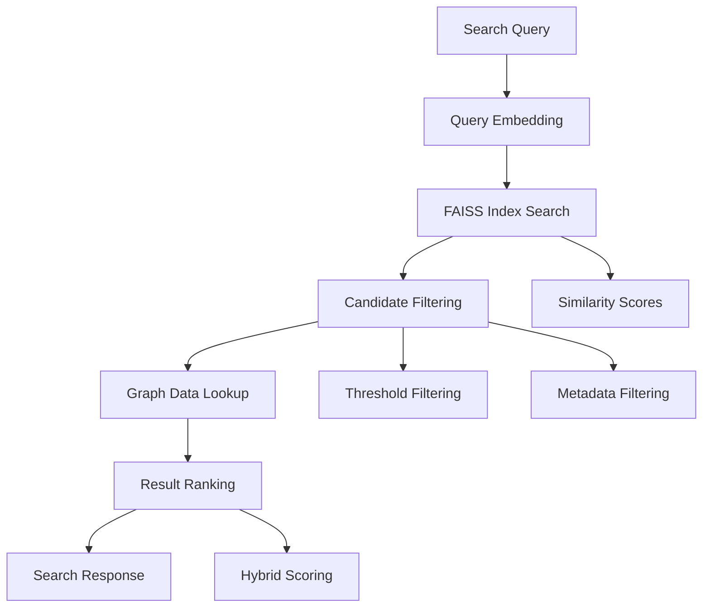

## Storage Architecture

### RocksDB Organization

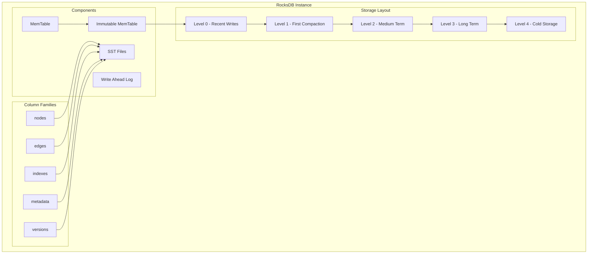

### Data Partitioning Strategy

**Horizontal Partitioning**:
```
nodes/
├── {shard_id}/
│   ├── functions/
│   ├── classes/
│   ├── variables/
│   └── modules/
```

**Key Encoding Scheme**:
```rust
// Node keys: {shard_id}:{node_type}:{node_id}
// Edge keys: {shard_id}:edge:{source_id}:{target_id}
// Index keys: {shard_id}:idx:{index_type}:{key}

pub fn encode_node_key(shard_id: u32, node_type: NodeType, node_id: NodeId) -> Vec<u8> {
    let mut key = Vec::new();
    key.extend_from_slice(&shard_id.to_be_bytes());
    key.push(b':');
    key.extend_from_slice(node_type.as_bytes());
    key.push(b':');
    key.extend_from_slice(node_id.as_bytes());
    key
}
```

### Cache Architecture

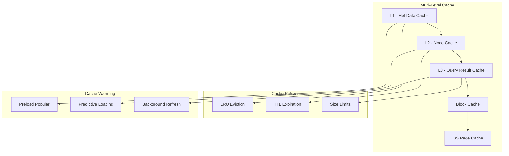

### Backup and Recovery Architecture

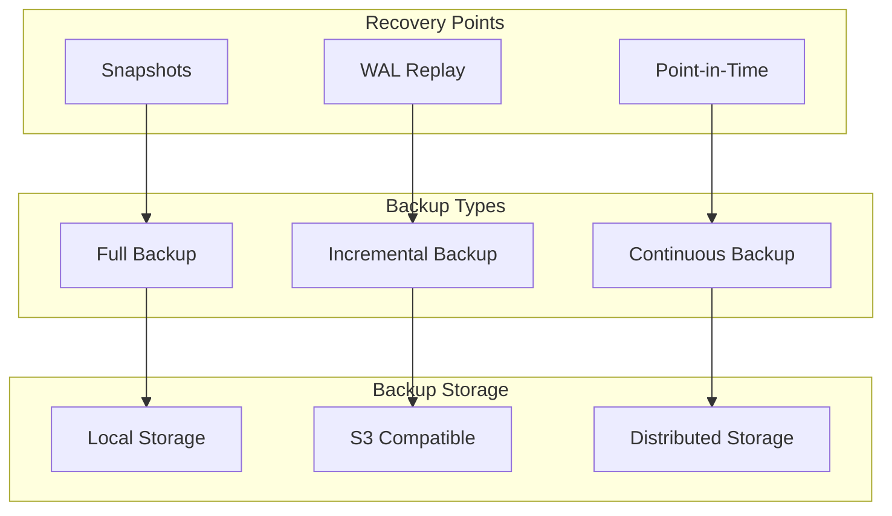

## API Architecture

### REST API Design

```mermaid
graph TD
    subgraph "REST Endpoints"
        HEALTH[/health]
        NODES[/nodes]
        SEARCH[/search]
        PARSE[/parse]
        VECTOR[/vector]
        STREAM[/stream]
        VERSION[/versions]
    end

    subgraph "HTTP Methods"
        GET[GET - Retrieve]
        POST[POST - Create]
        PUT[PUT - Update]
        DELETE[DELETE - Remove]
        PATCH[PATCH - Partial Update]
    end

    subgraph "Content Types"
        JSON[application/json]
        NDJSON[application/x-ndjson]
        SSE[text/event-stream]
        BINARY[application/octet-stream]
    end

    NODES --> GET
    NODES --> POST
    NODES --> PUT
    NODES --> DELETE

    SEARCH --> GET
    PARSE --> POST
    VECTOR --> POST
    STREAM --> GET

    GET --> JSON
    POST --> JSON
    STREAM --> NDJSON
    STREAM --> SSE
```

### GraphQL Schema Architecture

```graphql
# Core Types
type Node {
  id: ID!
  nodeType: NodeType!
  name: String!
  filePath: String!
  lineNumber: Int!
  metadata: JSON
  relationships: [Relationship!]!
  embeddings: [Float!]
}

type Relationship {
  id: ID!
  type: RelationshipType!
  source: Node!
  target: Node!
  metadata: JSON
}

# Query Interface
type Query {
  # Node operations
  node(id: ID!): Node
  nodes(filter: NodeFilter, pagination: Pagination): NodeConnection!
  
  # Search operations
  search(query: String!, options: SearchOptions): SearchResult!
  similarNodes(nodeId: ID!, threshold: Float): [SimilarityMatch!]!
  
  # Graph traversal
  dependencies(nodeId: ID!, depth: Int): [Node!]!
  dependents(nodeId: ID!, depth: Int): [Node!]!
}

# Mutation Interface
type Mutation {
  # Node management
  createNode(input: CreateNodeInput!): Node!
  updateNode(id: ID!, input: UpdateNodeInput!): Node!
  deleteNode(id: ID!): Boolean!
  
  # Parsing operations
  parseFile(input: ParseFileInput!): ParseResult!
  parseProject(input: ParseProjectInput!): ParseResult!
  
  # Index management
  rebuildIndex(type: IndexType!): IndexRebuildResult!
}

# Real-time updates
type Subscription {
  nodeCreated: Node!
  nodeUpdated: NodeUpdateEvent!
  nodeDeleted: NodeDeleteEvent!
  parseProgress(taskId: ID!): ParseProgressEvent!
}
```

### WebSocket Architecture

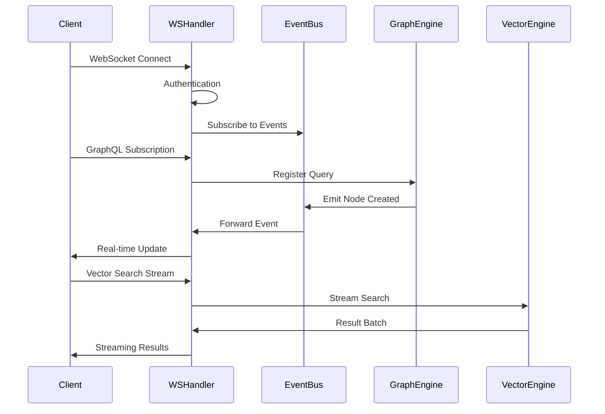

## Security Architecture

### Authentication and Authorization

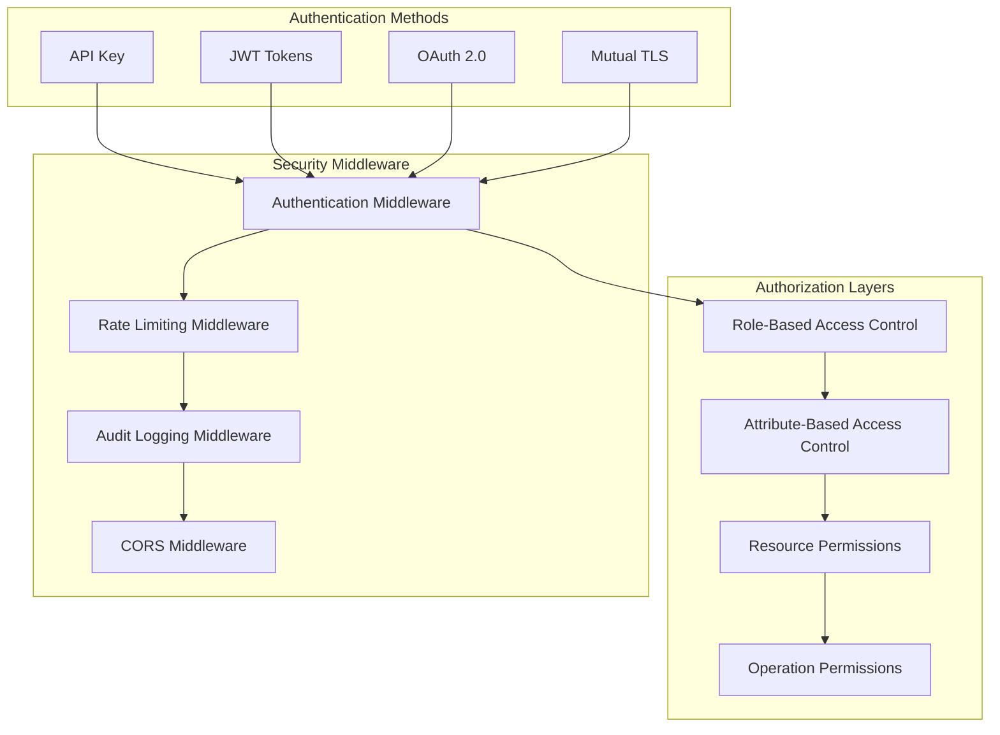

### Data Protection

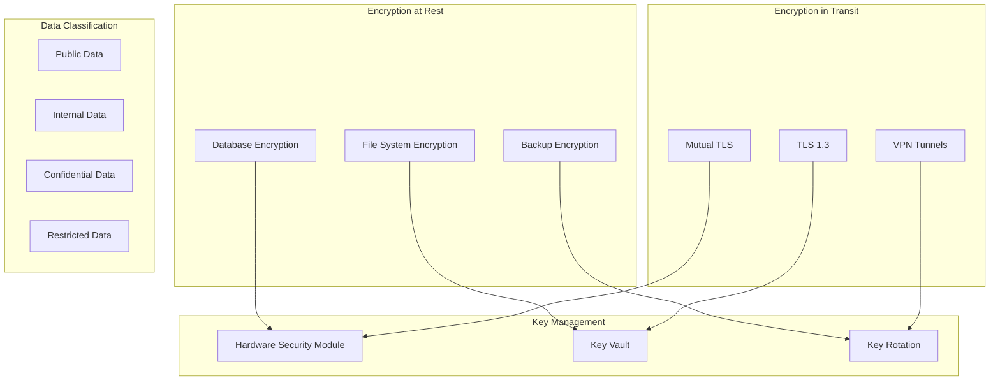

### Network Security

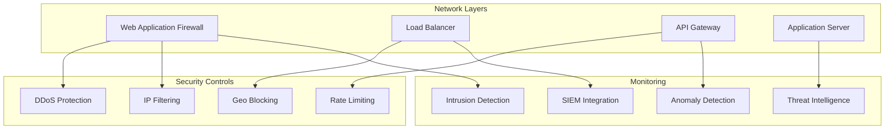

## Deployment Architecture

### Container Architecture

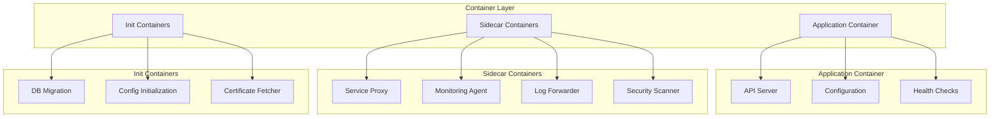

### Kubernetes Deployment

```yaml
# Deployment configuration
apiVersion: apps/v1
kind: Deployment
metadata:
  name: codegraph-api
spec:
  replicas: 3
  selector:
    matchLabels:
      app: codegraph-api
  template:
    metadata:
      labels:
        app: codegraph-api
    spec:
      containers:
      - name: api-server
        image: codegraph/api:latest
        ports:
        - containerPort: 8080
        - containerPort: 9090
        env:
        - name: RUST_LOG
          value: "info"
        resources:
          requests:
            memory: "2Gi"
            cpu: "1000m"
          limits:
            memory: "4Gi"
            cpu: "2000m"
        livenessProbe:
          httpGet:
            path: /health/live
            port: 8080
          initialDelaySeconds: 30
          periodSeconds: 10
        readinessProbe:
          httpGet:
            path: /health/ready
            port: 8080
          initialDelaySeconds: 5
          periodSeconds: 5
        volumeMounts:
        - name: data-volume
          mountPath: /opt/codegraph/data
        - name: config-volume
          mountPath: /opt/codegraph/config
      volumes:
      - name: data-volume
        persistentVolumeClaim:
          claimName: codegraph-data
      - name: config-volume
        configMap:
          name: codegraph-config
```

### High Availability Setup

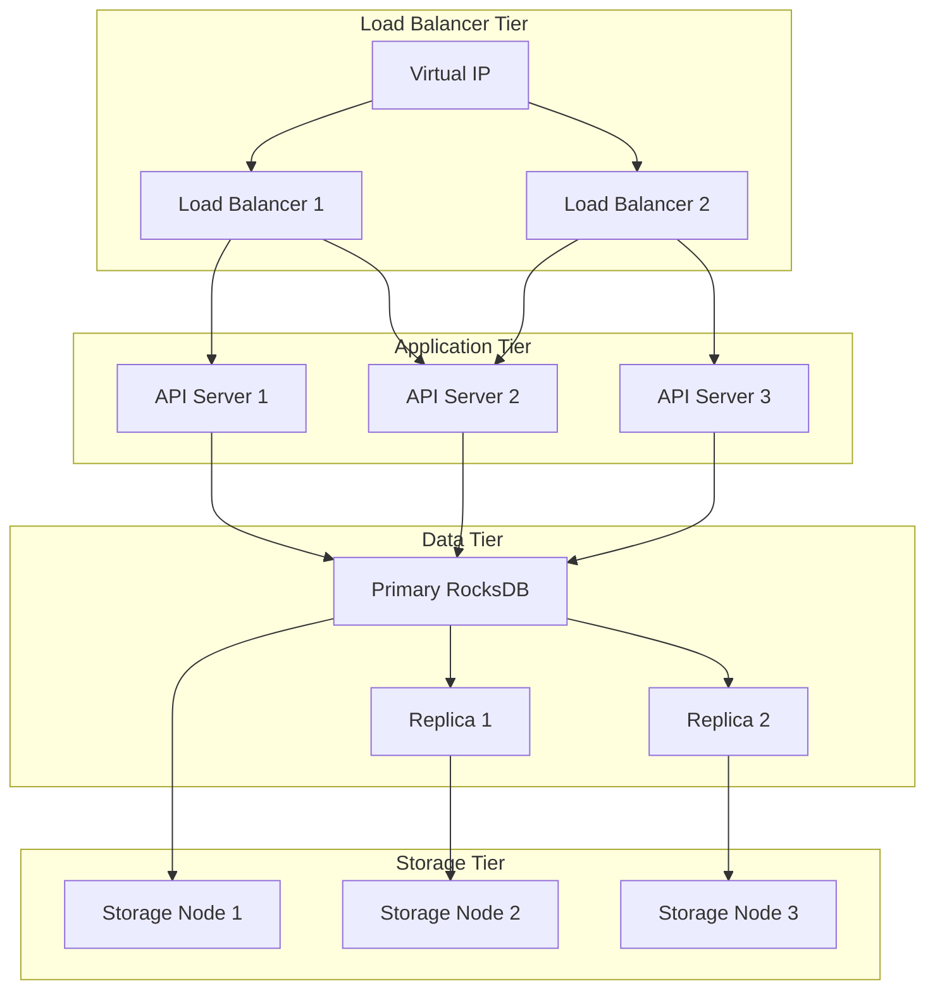

## Performance Architecture

### Performance Optimization Strategies

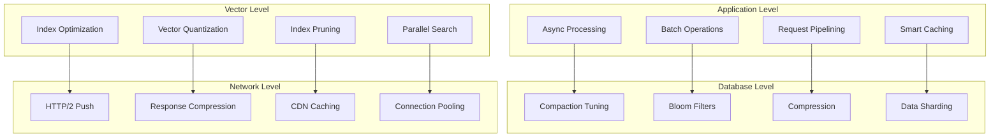

### Performance Monitoring

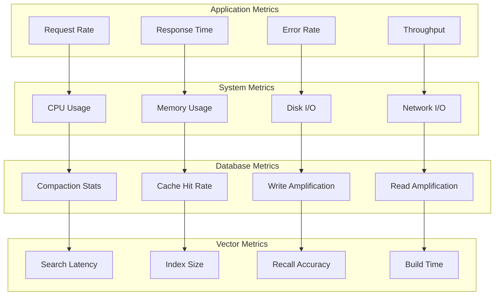

## Scalability Considerations

### Horizontal Scaling Strategy

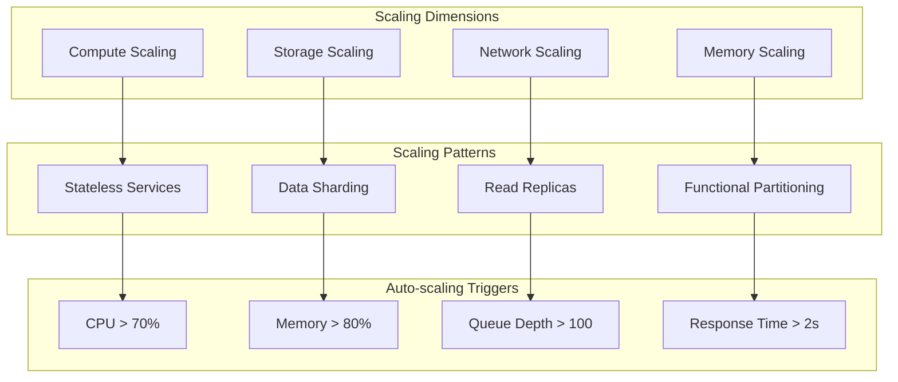

### Data Partitioning Strategy

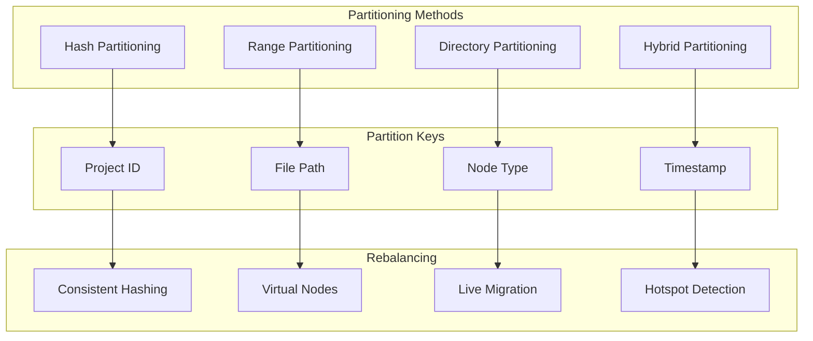

### Capacity Planning

**Growth Projections**:
- **Data Growth**: 50% annually
- **Query Growth**: 100% annually
- **User Growth**: 200% annually

**Resource Requirements**:
```
Current Baseline (1M nodes):
- Storage: 100GB RocksDB + 50GB Vector Index
- Memory: 16GB (8GB cache + 8GB application)
- CPU: 8 cores (4 for API + 4 for background tasks)
- Network: 1Gbps

Projected 12 months (10M nodes):
- Storage: 1TB RocksDB + 500GB Vector Index
- Memory: 64GB (32GB cache + 32GB application)
- CPU: 32 cores (16 for API + 16 for background tasks)
- Network: 10Gbps
```

**Scaling Checkpoints**:
- **1M nodes**: Single instance sufficient
- **10M nodes**: Require read replicas and caching
- **100M nodes**: Require sharding and distributed architecture
- **1B nodes**: Require specialized distributed vector databases

This architecture documentation provides a comprehensive foundation for understanding, deploying, and maintaining the CodeGraph system in production environments. For operational procedures, refer to the [Operations Runbook](OPERATIONS_RUNBOOK.md) and [Troubleshooting Guide](TROUBLESHOOTING_GUIDE.md).