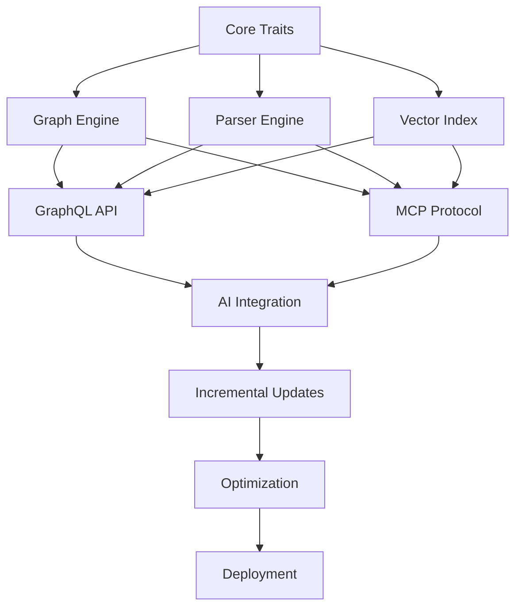

# CodeGraph Feature Inventory
## Comprehensive Feature Breakdown for Swarm Implementation

---
pdf-engine: lualatex
mainfont: "DejaVu Serif"
monofont: "DejaVu Sans Mono"
header-includes: |
  \usepackage{fontspec}
  \directlua{
    luaotfload.add_fallback("emojifallback", {"NotoColorEmoji:mode=harf;"})
  }
  \setmainfont[
    RawFeature={fallback=emojifallback}
  ]{DejaVu Serif}
---

### Document Version: 1.0
### Date: September 2025
### Status: Planning

---

## Executive Summary

This document provides a comprehensive inventory of all features, components, and capabilities required for the CodeGraph high-performance code intelligence system. Each feature is categorized by complexity, dependencies, and parallelization potential for optimal swarm orchestration.

### System Overview
- **Target Performance**: Sub-50ms query latency, <1s incremental updates
- **Deployment Model**: Single binary under 50MB
- **Core Technologies**: Rust, RocksDB, FAISS, tree-sitter, Tokio
- **Architecture**: Zero-copy, lock-free, async-first, memory-mapped I/O

---

## Feature Classification System

### Complexity Levels
- **🟢 Low (L)**: Simple implementation, minimal dependencies
- **🟡 Medium (M)**: Moderate complexity, some dependencies
- **🔴 High (H)**: Complex implementation, multiple dependencies
- **🟣 Critical (C)**: High complexity + performance critical

### Parallelization Potential
- **🔄 Parallel**: Can be developed independently
- **🔗 Sequential**: Requires other components first
- **🤝 Collaborative**: Benefits from team collaboration

---

## Phase 0: Project Foundation & Setup

### 0.1 Workspace Structure & Configuration
| Feature | Complexity | Parallel | Description | Estimated Hours |
|---------|------------|----------|-------------|-----------------|
| Cargo workspace setup | 🟢 L | 🔄 | Multi-crate workspace configuration | 4 |
| CI/CD pipeline | 🟡 M | 🔄 | GitHub Actions for testing and builds | 8 |
| Development tooling | 🟢 L | 🔄 | Rustfmt, Clippy, pre-commit hooks | 4 |
| Build optimization | 🟡 M | 🔄 | Release profile tuning, binary size optimization | 6 |
| Documentation structure | 🟢 L | 🔄 | README, CHANGELOG, API docs framework | 4 |

### 0.2 Core Traits & Abstractions
| Feature | Complexity | Parallel | Description | Estimated Hours |
|---------|------------|----------|-------------|-----------------|
| GraphStore trait | 🟡 M | 🔄 | Core graph operations interface | 8 |
| VectorIndex trait | 🟡 M | 🔄 | Vector search operations interface | 6 |
| CodeAnalyzer trait | 🟡 M | 🔄 | Code parsing and analysis interface | 8 |
| EmbeddingProvider trait | 🟡 M | 🔄 | Embedding generation interface | 6 |
| Error handling types | 🟢 L | 🔄 | Custom error types with context | 4 |

### 0.3 Data Models
| Feature | Complexity | Parallel | Description | Estimated Hours |
|---------|------------|----------|-------------|-----------------|
| Node/Edge structures | 🟡 M | 🔄 | Core graph data structures | 8 |
| Entity types (AST nodes) | 🟡 M | 🔄 | Language-agnostic code entities | 10 |
| Embedding metadata | 🟢 L | 🔄 | Vector storage metadata | 4 |
| Serialization formats | 🟡 M | 🔄 | Zero-copy serialization with rkyv | 8 |
| Configuration structures | 🟢 L | 🔄 | Application configuration models | 4 |

---

## Phase 1: Core Infrastructure (3 Parallel Tracks)

### Track A: Graph Engine (1.1 - 1.4)

#### 1.1 RocksDB Integration
| Feature | Complexity | Parallel | Description | Estimated Hours |
|---------|------------|----------|-------------|-----------------|
| Database initialization | 🟡 M | 🔄 | RocksDB setup with column families | 8 |
| Transaction support | 🔴 H | 🔗 | ACID transactions for graph operations | 16 |
| Batch operations | 🟡 M | 🔗 | Efficient bulk read/write operations | 12 |
| Backup/restore | 🟡 M | 🔗 | Database backup and point-in-time recovery | 10 |
| Compaction tuning | 🟡 M | 🔗 | LSM-tree optimization for workload | 8 |

#### 1.2 Graph Operations
| Feature | Complexity | Parallel | Description | Estimated Hours |
|---------|------------|----------|-------------|-----------------|
| Node CRUD operations | 🟡 M | 🔗 | Create, read, update, delete nodes | 12 |
| Edge CRUD operations | 🟡 M | 🔗 | Create, read, update, delete edges | 12 |
| Graph traversal | 🔴 H | 🔗 | BFS/DFS traversal with filters | 20 |
| Subgraph extraction | 🔴 H | 🔗 | Efficient subgraph queries | 16 |
| Path finding | 🔴 H | 🔗 | Shortest path algorithms | 16 |

#### 1.3 Indexing & Search
| Feature | Complexity | Parallel | Description | Estimated Hours |
|---------|------------|----------|-------------|-----------------|
| Secondary indices | 🟡 M | 🔗 | Property-based indexing | 12 |
| Full-text search | 🔴 H | 🔗 | Text search within nodes | 16 |
| Composite queries | 🔴 H | 🔗 | Multi-criteria search | 20 |
| Query optimization | 🟣 C | 🔗 | Query plan optimization | 24 |
| Caching layer | 🟡 M | 🔗 | Result caching with invalidation | 12 |

#### 1.4 Versioning & Snapshots
| Feature | Complexity | Parallel | Description | Estimated Hours |
|---------|------------|----------|-------------|-----------------|
| Version tracking | 🔴 H | 🔗 | Node/edge versioning | 20 |
| Snapshot creation | 🔴 H | 🔗 | Point-in-time snapshots | 16 |
| Diff computation | 🔴 H | 🔗 | Change detection between versions | 18 |
| Rollback operations | 🟡 M | 🔗 | Restore to previous versions | 12 |
| Cleanup strategies | 🟡 M | 🔗 | Old version garbage collection | 8 |

### Track B: Parser Engine (1.5 - 1.8)

#### 1.5 Tree-sitter Integration
| Feature | Complexity | Parallel | Description | Estimated Hours |
|---------|------------|----------|-------------|-----------------|
| Parser initialization | 🟡 M | 🔄 | Tree-sitter setup for languages | 8 |
| Language detection | 🟢 L | 🔄 | File extension to language mapping | 4 |
| AST parsing | 🟡 M | 🔗 | Parse files to syntax trees | 10 |
| Error handling | 🟡 M | 🔗 | Graceful parsing error recovery | 8 |
| Memory optimization | 🔴 H | 🔗 | Efficient AST memory usage | 16 |

#### 1.6 Entity Extraction
| Feature | Complexity | Parallel | Description | Estimated Hours |
|---------|------------|----------|-------------|-----------------|
| Python extractor | 🟡 M | 🤝 | Classes, functions, variables, imports | 16 |
| JavaScript extractor | 🟡 M | 🤝 | Functions, classes, modules, exports | 16 |
| TypeScript extractor | 🟡 M | 🤝 | Types, interfaces, decorators | 18 |
| Rust extractor | 🔴 H | 🤝 | Structs, traits, impls, macros | 20 |
| Generic extractor | 🔴 H | 🔗 | Language-agnostic entity patterns | 24 |

#### 1.7 Dependency Analysis
| Feature | Complexity | Parallel | Description | Estimated Hours |
|---------|------------|----------|-------------|-----------------|
| Import resolution | 🔴 H | 🔗 | Resolve import statements to files | 20 |
| Call graph building | 🔴 H | 🔗 | Function/method call relationships | 24 |
| Type inference | 🟣 C | 🔗 | Basic type inference for variables | 32 |
| Data flow analysis | 🟣 C | 🔗 | Variable usage and dependencies | 28 |
| Circular dependency detection | 🟡 M | 🔗 | Detect and report cycles | 12 |

#### 1.8 Incremental Parsing
| Feature | Complexity | Parallel | Description | Estimated Hours |
|---------|------------|----------|-------------|-----------------|
| Change detection | 🟡 M | 🔗 | File modification tracking | 10 |
| Delta parsing | 🔴 H | 🔗 | Parse only changed portions | 20 |
| Graph updates | 🔴 H | 🔗 | Incrementally update graph structure | 18 |
| Invalidation cascade | 🔴 H | 🔗 | Update dependent nodes efficiently | 16 |
| Conflict resolution | 🟡 M | 🔗 | Handle concurrent modifications | 12 |

### Track C: Vector Index Engine (1.9 - 1.12)

#### 1.9 FAISS Integration
| Feature | Complexity | Parallel | Description | Estimated Hours |
|---------|------------|----------|-------------|-----------------|
| Index initialization | 🟡 M | 🔄 | FAISS index setup and configuration | 10 |
| Index types | 🔴 H | 🔄 | IVF, HNSW, Flat index implementations | 20 |
| GPU support | 🔴 H | 🔄 | GPU-accelerated indexing (optional) | 24 |
| Memory mapping | 🟡 M | 🔗 | Memory-mapped index files | 12 |
| Index persistence | 🟡 M | 🔗 | Save/load index to/from disk | 8 |

#### 1.10 Vector Operations
| Feature | Complexity | Parallel | Description | Estimated Hours |
|---------|------------|----------|-------------|-----------------|
| Vector addition | 🟢 L | 🔗 | Add vectors to index | 6 |
| Batch operations | 🟡 M | 🔗 | Bulk vector operations | 10 |
| KNN search | 🟡 M | 🔗 | K-nearest neighbor search | 12 |
| Range queries | 🟡 M | 🔗 | Distance-based range searches | 10 |
| Vector updates | 🟡 M | 🔗 | Update existing vectors | 8 |

#### 1.11 Search Optimization
| Feature | Complexity | Parallel | Description | Estimated Hours |
|---------|------------|----------|-------------|-----------------|
| Query optimization | 🔴 H | 🔗 | Optimize search parameters | 16 |
| Result ranking | 🟡 M | 🔗 | Score-based result ordering | 10 |
| Search caching | 🟡 M | 🔗 | Cache frequent queries | 12 |
| Parallel search | 🔴 H | 🔗 | Multi-threaded search execution | 18 |
| SIMD optimization | 🟣 C | 🔗 | SIMD vector operations | 24 |

#### 1.12 Index Management
| Feature | Complexity | Parallel | Description | Estimated Hours |
|---------|------------|----------|-------------|-----------------|
| Index rebuilding | 🟡 M | 🔗 | Full index reconstruction | 12 |
| Incremental updates | 🔴 H | 🔗 | Add/remove vectors without rebuild | 16 |
| Index compaction | 🟡 M | 🔗 | Optimize index structure | 10 |
| Health monitoring | 🟢 L | 🔗 | Index health and performance metrics | 6 |
| Backup/restore | 🟡 M | 🔗 | Index backup and recovery | 8 |

---

## Phase 2: AI Integration (2.1 - 2.4)

### 2.1 Embedding Generation
| Feature | Complexity | Parallel | Description | Estimated Hours |
|---------|------------|----------|-------------|-----------------|
| Local embeddings (Candle) | 🔴 H | 🔄 | BERT-like models with Candle | 24 |
| OpenAI API integration | 🟡 M | 🔄 | External embedding service | 12 |
| Batch processing | 🟡 M | 🔗 | Efficient batch embedding generation | 10 |
| Model management | 🟡 M | 🔗 | Model loading and caching | 12 |
| Fallback strategies | 🟡 M | 🔗 | Handle model failures gracefully | 8 |

### 2.2 Text Processing
| Feature | Complexity | Parallel | Description | Estimated Hours |
|---------|------------|----------|-------------|-----------------|
| Code tokenization | 🟡 M | 🤝 | Language-aware tokenization | 12 |
| Text chunking | 🟡 M | 🤝 | Semantic text segmentation | 10 |
| Context extraction | 🔴 H | 🔗 | Relevant context for embeddings | 16 |
| Deduplication | 🟡 M | 🔗 | Remove duplicate text segments | 8 |
| Normalization | 🟢 L | 🔗 | Text preprocessing and cleanup | 6 |

### 2.3 RAG Implementation
| Feature | Complexity | Parallel | Description | Estimated Hours |
|---------|------------|----------|-------------|-----------------|
| Query processing | 🟡 M | 🔗 | Natural language query analysis | 12 |
| Context retrieval | 🔴 H | 🔗 | Relevant context fetching | 16 |
| Result ranking | 🟡 M | 🔗 | Relevance-based ranking | 10 |
| Response generation | 🔴 H | 🔗 | Generate responses from context | 18 |
| Answer validation | 🟡 M | 🔗 | Validate response quality | 8 |

### 2.4 ML Pipeline
| Feature | Complexity | Parallel | Description | Estimated Hours |
|---------|------------|----------|-------------|-----------------|
| Feature extraction | 🔴 H | 🔗 | Extract features from code | 20 |
| Model training | 🟣 C | 🔗 | Train domain-specific models | 40 |
| Inference pipeline | 🔴 H | 🔗 | Real-time model inference | 16 |
| Model evaluation | 🟡 M | 🔗 | Performance metrics and validation | 12 |
| A/B testing | 🟡 M | 🔗 | Compare model versions | 10 |

---

## Phase 3: API Layer (2 Parallel Tracks)

### Track D: GraphQL API (3.1 - 3.4)

#### 3.1 Schema Definition
| Feature | Complexity | Parallel | Description | Estimated Hours |
|---------|------------|----------|-------------|-----------------|
| Query types | 🟡 M | 🔄 | Define GraphQL query schema | 12 |
| Mutation types | 🟡 M | 🔄 | Define GraphQL mutation schema | 10 |
| Subscription types | 🟡 M | 🔄 | Define GraphQL subscription schema | 12 |
| Custom scalars | 🟢 L | 🔄 | UUID, DateTime, JSON scalars | 4 |
| Input validation | 🟡 M | 🔗 | Request validation and sanitization | 8 |

#### 3.2 Resolvers Implementation
| Feature | Complexity | Parallel | Description | Estimated Hours |
|---------|------------|----------|-------------|-----------------|
| Query resolvers | 🔴 H | 🔗 | Implement query logic | 24 |
| Mutation resolvers | 🔴 H | 🔗 | Implement mutation logic | 20 |
| Subscription resolvers | 🔴 H | 🔗 | Real-time subscription handling | 16 |
| DataLoader integration | 🟡 M | 🔗 | Batch and cache database queries | 12 |
| Error handling | 🟡 M | 🔗 | GraphQL error formatting | 8 |

#### 3.3 Real-time Features
| Feature | Complexity | Parallel | Description | Estimated Hours |
|---------|------------|----------|-------------|-----------------|
| WebSocket support | 🟡 M | 🔗 | WebSocket connection handling | 10 |
| Subscription management | 🔴 H | 🔗 | Manage active subscriptions | 16 |
| Event broadcasting | 🟡 M | 🔗 | Broadcast updates to subscribers | 12 |
| Connection lifecycle | 🟡 M | 🔗 | Handle connection drops and reconnects | 10 |
| Rate limiting | 🟡 M | 🔗 | Prevent subscription abuse | 8 |

#### 3.4 Performance Optimization
| Feature | Complexity | Parallel | Description | Estimated Hours |
|---------|------------|----------|-------------|-----------------|
| Query complexity analysis | 🔴 H | 🔗 | Analyze and limit complex queries | 16 |
| Response caching | 🟡 M | 🔗 | Cache frequent queries | 12 |
| Connection pooling | 🟡 M | 🔗 | Database connection management | 10 |
| Pagination | 🟡 M | 🔗 | Efficient result pagination | 8 |
| Compression | 🟢 L | 🔗 | Response compression | 4 |

### Track E: MCP Protocol (3.5 - 3.8)

#### 3.5 Protocol Implementation
| Feature | Complexity | Parallel | Description | Estimated Hours |
|---------|------------|----------|-------------|-----------------|
| Message parsing | 🟡 M | 🔄 | MCP message serialization/deserialization | 10 |
| Protocol validation | 🟡 M | 🔄 | Validate MCP protocol compliance | 8 |
| Connection handling | 🟡 M | 🔗 | WebSocket connection management | 12 |
| Heartbeat mechanism | 🟢 L | 🔗 | Keep-alive and connection monitoring | 6 |
| Protocol versioning | 🟡 M | 🔗 | Handle multiple protocol versions | 8 |

#### 3.6 Agent Communication
| Feature | Complexity | Parallel | Description | Estimated Hours |
|---------|------------|----------|-------------|-----------------|
| Request/response handling | 🟡 M | 🔗 | Handle agent requests and responses | 12 |
| Publish/subscribe | 🔴 H | 🔗 | Event-driven communication | 16 |
| Message routing | 🟡 M | 🔗 | Route messages to appropriate handlers | 10 |
| Session management | 🟡 M | 🔗 | Manage agent sessions | 10 |
| Authentication | 🟡 M | 🔗 | Agent authentication and authorization | 12 |

#### 3.7 Multi-Agent Coordination
| Feature | Complexity | Parallel | Description | Estimated Hours |
|---------|------------|----------|-------------|-----------------|
| Agent registry | 🟡 M | 🔗 | Track active agents and capabilities | 12 |
| Task distribution | 🔴 H | 🔗 | Distribute tasks among agents | 18 |
| Result aggregation | 🔴 H | 🔗 | Combine results from multiple agents | 16 |
| Conflict resolution | 🔴 H | 🔗 | Handle conflicting agent actions | 20 |
| Coordination protocols | 🟣 C | 🔗 | Advanced coordination strategies | 24 |

#### 3.8 SDK Development
| Feature | Complexity | Parallel | Description | Estimated Hours |
|---------|------------|----------|-------------|-----------------|
| Rust SDK | 🟡 M | 🤝 | Native Rust client library | 16 |
| Python SDK | 🟡 M | 🤝 | Python client library | 16 |
| JavaScript SDK | 🟡 M | 🤝 | JavaScript/TypeScript client library | 16 |
| Examples and docs | 🟢 L | 🤝 | Usage examples and documentation | 12 |
| Testing utilities | 🟡 M | 🔗 | SDK testing and validation tools | 10 |

---

## Phase 4: Incremental Updates (4.1 - 4.3)

### 4.1 File System Monitoring
| Feature | Complexity | Parallel | Description | Estimated Hours |
|---------|------------|----------|-------------|-----------------|
| File watcher | 🟡 M | 🔄 | Monitor file system changes | 12 |
| Event filtering | 🟡 M | 🔗 | Filter relevant file changes | 8 |
| Batch processing | 🟡 M | 🔗 | Batch multiple changes efficiently | 10 |
| Recursive watching | 🟡 M | 🔗 | Monitor directory trees | 8 |
| Ignore patterns | 🟢 L | 🔗 | Skip irrelevant files and directories | 6 |

### 4.2 Git Integration
| Feature | Complexity | Parallel | Description | Estimated Hours |
|---------|------------|----------|-------------|-----------------|
| Git repository detection | 🟢 L | 🔄 | Detect Git repositories | 4 |
| Commit hook integration | 🟡 M | 🔄 | Pre/post-commit hooks | 10 |
| Branch tracking | 🟡 M | 🔗 | Track changes across branches | 12 |
| Merge conflict handling | 🔴 H | 🔗 | Handle merge conflicts gracefully | 16 |
| History analysis | 🔴 H | 🔗 | Analyze commit history for insights | 18 |

### 4.3 Update Pipeline
| Feature | Complexity | Parallel | Description | Estimated Hours |
|---------|------------|----------|-------------|-----------------|
| Change queue | 🟡 M | 🔗 | Queue file changes for processing | 10 |
| Priority scheduling | 🟡 M | 🔗 | Prioritize critical changes | 8 |
| Parallel processing | 🔴 H | 🔗 | Process changes in parallel | 16 |
| Progress tracking | 🟡 M | 🔗 | Track update progress | 8 |
| Rollback mechanism | 🟡 M | 🔗 | Rollback failed updates | 12 |

---

## Phase 5: Optimization & Performance (5.1 - 5.4)

### 5.1 Memory Optimization
| Feature | Complexity | Parallel | Description | Estimated Hours |
|---------|------------|----------|-------------|-----------------|
| Arena allocators | 🔴 H | 🔄 | Custom memory allocation strategies | 20 |
| Zero-copy operations | 🟣 C | 🔄 | Eliminate unnecessary copying | 24 |
| Memory pools | 🔴 H | 🔄 | Reusable memory pools | 16 |
| Leak detection | 🟡 M | 🔄 | Memory leak detection and prevention | 10 |
| Profiling tools | 🟡 M | 🔄 | Memory usage profiling | 8 |

### 5.2 CPU Optimization
| Feature | Complexity | Parallel | Description | Estimated Hours |
|---------|------------|----------|-------------|-----------------|
| SIMD operations | 🟣 C | 🔄 | Use SIMD for vector operations | 24 |
| Lock-free data structures | 🟣 C | 🔄 | Eliminate locking overhead | 28 |
| CPU cache optimization | 🔴 H | 🔄 | Optimize for CPU cache efficiency | 20 |
| Branch prediction | 🔴 H | 🔄 | Optimize conditional logic | 16 |
| Hot path optimization | 🔴 H | 🔗 | Optimize frequently executed code | 18 |

### 5.3 I/O Optimization
| Feature | Complexity | Parallel | Description | Estimated Hours |
|---------|------------|----------|-------------|-----------------|
| Async I/O | 🔴 H | 🔄 | Fully asynchronous I/O operations | 20 |
| Memory-mapped files | 🔴 H | 🔄 | Use mmap for large files | 16 |
| I/O batching | 🟡 M | 🔗 | Batch I/O operations | 12 |
| Read-ahead strategies | 🟡 M | 🔗 | Predictive data loading | 10 |
| Write coalescing | 🟡 M | 🔗 | Combine multiple writes | 8 |

### 5.4 Network Optimization
| Feature | Complexity | Parallel | Description | Estimated Hours |
|---------|------------|----------|-------------|-----------------|
| Connection pooling | 🟡 M | 🔄 | Reuse network connections | 10 |
| Response streaming | 🟡 M | 🔄 | Stream large responses | 12 |
| Compression | 🟡 M | 🔄 | Compress network traffic | 8 |
| HTTP/2 support | 🟡 M | 🔄 | Use HTTP/2 features | 12 |
| Load balancing | 🔴 H | 🔄 | Distribute load across instances | 16 |

---

## Phase 6: Deployment & Packaging (6.1 - 6.3)

### 6.1 Binary Optimization
| Feature | Complexity | Parallel | Description | Estimated Hours |
|---------|------------|----------|-------------|-----------------|
| Link-time optimization | 🟡 M | 🔄 | LTO for smaller binaries | 8 |
| Dead code elimination | 🟡 M | 🔄 | Remove unused code | 6 |
| Asset embedding | 🟢 L | 🔄 | Embed resources in binary | 4 |
| Strip symbols | 🟢 L | 🔄 | Remove debug symbols | 2 |
| Compression | 🟡 M | 🔄 | Compress final binary | 6 |

### 6.2 Configuration Management
| Feature | Complexity | Parallel | Description | Estimated Hours |
|---------|------------|----------|-------------|-----------------|
| Config file parsing | 🟡 M | 🔄 | TOML/JSON/YAML configuration | 8 |
| Environment variables | 🟢 L | 🔄 | Environment-based configuration | 4 |
| Command-line arguments | 🟢 L | 🔄 | CLI argument parsing | 6 |
| Config validation | 🟡 M | 🔄 | Validate configuration values | 8 |
| Dynamic reloading | 🟡 M | 🔄 | Reload configuration without restart | 10 |

### 6.3 Deployment Tooling
| Feature | Complexity | Parallel | Description | Estimated Hours |
|---------|------------|----------|-------------|-----------------|
| Docker images | 🟡 M | 🔄 | Containerization support | 8 |
| Kubernetes manifests | 🟡 M | 🔄 | K8s deployment configurations | 10 |
| Service discovery | 🟡 M | 🔄 | Automatic service discovery | 12 |
| Health checks | 🟢 L | 🔄 | Health check endpoints | 6 |
| Graceful shutdown | 🟡 M | 🔄 | Clean shutdown procedures | 8 |

---

## Cross-Cutting Concerns

### Observability
| Feature | Complexity | Parallel | Description | Estimated Hours |
|---------|------------|----------|-------------|-----------------|
| Structured logging | 🟡 M | 🔄 | JSON-structured logs with tracing | 10 |
| Metrics collection | 🟡 M | 🔄 | Prometheus metrics | 12 |
| Distributed tracing | 🔴 H | 🔄 | OpenTelemetry integration | 16 |
| Performance profiling | 🟡 M | 🔄 | CPU/memory profiling | 10 |
| Error tracking | 🟡 M | 🔄 | Error aggregation and alerting | 8 |

### Security
| Feature | Complexity | Parallel | Description | Estimated Hours |
|---------|------------|----------|-------------|-----------------|
| Authentication | 🟡 M | 🔄 | JWT-based authentication | 12 |
| Authorization | 🟡 M | 🔄 | Role-based access control | 10 |
| Rate limiting | 🟡 M | 🔄 | Prevent abuse and DoS | 8 |
| Input validation | 🟡 M | 🔄 | Sanitize all inputs | 10 |
| TLS support | 🟡 M | 🔄 | HTTPS/WSS encryption | 8 |

### Testing
| Feature | Complexity | Parallel | Description | Estimated Hours |
|---------|------------|----------|-------------|-----------------|
| Unit tests | 🟡 M | 🤝 | Comprehensive unit test suite | 40 |
| Integration tests | 🔴 H | 🔗 | End-to-end integration tests | 30 |
| Performance tests | 🔴 H | 🔗 | Benchmark and load tests | 20 |
| Property-based tests | 🟡 M | 🤝 | Proptest-based testing | 16 |
| Fuzzing tests | 🟡 M | 🤝 | Fuzz testing critical components | 12 |

---

## Feature Dependency Matrix

### Critical Path Dependencies

### Parallel Development Tracks
1. **Foundation Track**: Core traits, data models, workspace setup
2. **Infrastructure Track A**: Graph engine, RocksDB integration
3. **Infrastructure Track B**: Parser engine, tree-sitter integration
4. **Infrastructure Track C**: Vector index, FAISS integration
5. **API Track D**: GraphQL API, real-time features
6. **API Track E**: MCP protocol, multi-agent coordination
7. **AI Track**: Embedding generation, RAG implementation
8. **Sync Track**: Incremental updates, file monitoring
9. **Performance Track**: Optimization, profiling
10. **DevOps Track**: CI/CD, deployment, monitoring

---

## Complexity & Effort Summary

### By Phase
| Phase | Total Features | Total Hours | Critical Features | Parallel Potential |
|-------|----------------|-------------|-------------------|--------------------|
| Phase 0 | 19 | 114 | 5 | High (95%) |
| Phase 1 | 66 | 1,056 | 18 | Medium (60%) |
| Phase 2 | 20 | 298 | 5 | Medium (65%) |
| Phase 3 | 32 | 442 | 8 | High (75%) |
| Phase 4 | 15 | 168 | 3 | Medium (50%) |
| Phase 5 | 20 | 298 | 8 | High (80%) |
| Phase 6 | 15 | 106 | 2 | High (90%) |
| **Total** | **187** | **2,482** | **49** | **Medium (70%)** |

### By Complexity
| Complexity | Feature Count | Total Hours | Percentage |
|------------|---------------|-------------|------------|
| 🟢 Low | 45 | 234 | 24% |
| 🟡 Medium | 89 | 1,134 | 48% |
| 🔴 High | 42 | 868 | 22% |
| 🟣 Critical | 11 | 246 | 6% |

### By Parallelization
| Type | Feature Count | Total Hours | Team Capacity |
|------|---------------|-------------|---------------|
| 🔄 Parallel | 98 | 1,342 | 6-8 developers |
| 🤝 Collaborative | 35 | 448 | 4-6 developers |
| 🔗 Sequential | 54 | 692 | 2-3 developers |

---

## Risk Assessment

### High-Risk Features (🔴/🟣 Complexity)
1. **Query Optimization (🟣)**: Complex algorithms, performance critical
2. **Lock-free Concurrency (🟣)**: Memory safety, race conditions
3. **SIMD Operations (🟣)**: Platform-specific, assembly-level optimization
4. **Type Inference (🟣)**: Language semantics, complex algorithms
5. **Multi-Agent Coordination (🟣)**: Distributed systems complexity

### Dependencies & Bottlenecks
1. **Core Traits**: Blocks all other development
2. **Graph Engine**: Required for API and AI integration
3. **Parser Engine**: Required for content analysis
4. **Vector Index**: Required for AI features

### Mitigation Strategies
1. **Early Prototyping**: Build proof-of-concepts for high-risk features
2. **Fallback Options**: Implement simpler alternatives for complex features
3. **Incremental Development**: Break complex features into smaller parts
4. **Expert Consultation**: Engage specialists for critical components
5. **Extensive Testing**: Focus testing efforts on high-risk areas

---

## Success Metrics

### Performance Targets
- Query latency: <50ms (p99)
- Update propagation: <1s
- Memory usage: <500MB (100k LOC)
- Binary size: <50MB
- Startup time: <100ms

### Quality Targets
- Test coverage: >90%
- Documentation coverage: >95%
- Zero memory leaks
- Zero security vulnerabilities
- <1% error rate

### Development Targets
- Feature completion: 95%
- Schedule adherence: ±10%
- Team satisfaction: >4.0/5.0
- Code review coverage: 100%
- Continuous integration: <5min

---

This comprehensive feature inventory provides the foundation for detailed swarm orchestration planning, ensuring all aspects of the CodeGraph system are accounted for and properly sequenced for optimal parallel development.